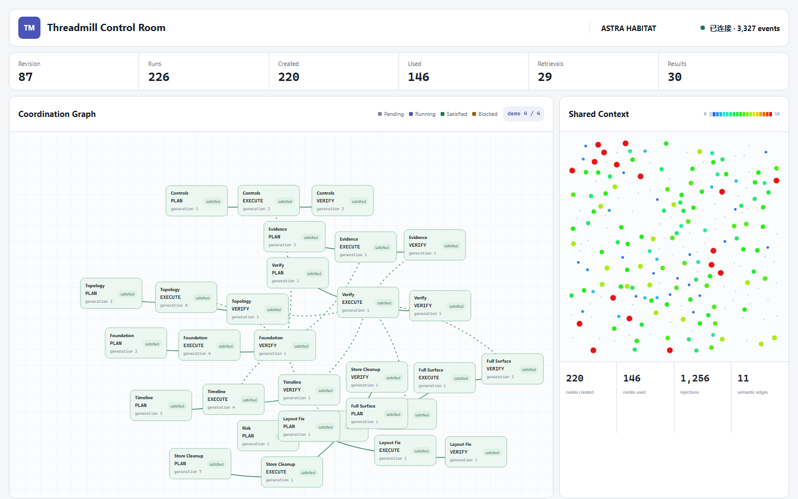

[English](README.md) | [中文](README.zh.md)

# Threadmill

**A control plane that turns multi-agent work into an auditable, recoverable delivery chain.**

requirement → plan → execute → verify → merge → done

> [!NOTE]
> This README describes the runnable implementation in this repository. The local console and verification commands below run directly from the checkout.

## Coordination replay

[Play the 1:47 MP4](docs/assets/threadmill-coordination-demo.mp4). The replay is backed by the recorded timeline through revision 87; the four ending frames labeled `demo` are presentation-only completion states.

## The idea

Multi-agent development is easy to start and hard to govern. A session can disappear, a verifier can inspect the wrong workspace, a stop request can lose its checkpoint, and a successful result can still have no safe path into main.

Threadmill changes the unit of work from a chat session to a durable **Task**. A Task owns its contract, dependency graph, phase lifecycle, context boundary, evidence, and delivery policy. Agents are temporary compute resources that operate inside those boundaries.

The outcome is a control plane for the moments that usually disappear into chat:

- a human intent becomes a durable Requirement and Task Contract;
- plan → execute → verify is represented as an explicit, recoverable lifecycle;
- context is scoped to the current Invocation instead of leaking through a long-lived session;
- code reaches main only after verification, latest-main validation, and the Merge Queue.

## What Threadmill owns

| Boundary | Threadmill's authority |
| --- | --- |
| Work identity | A durable Task, not an Agent session |
| Coordination | One persistent Coordination Graph; Task Manager is its only external writer |
| Execution | Invocation envelopes with role, phase, workspace, context, capabilities, lease, and evidence |
| Context | Subscription-aware Context Slices and reviewable Context Deltas |
| Recovery | Checkpoints, explicit non_resumable outcomes, and new generations for retries |
| Delivery | Verify → latest-main targeted verify → Merge Queue → main |
| Browser | A filtered projection plus four bounded writes: requirement, capacity, human decision, and Manager message |

The AgentTeams codebase remains an execution host behind an adapter. Threadmill owns the project semantics, authorization boundaries, graph revisions, evidence, and merge policy.

## Architecture at a glance

Two durable graphs hold business meaning. Runtime, Workspace, and the provider adapter are execution boundaries around them.

~~~mermaid
flowchart TB
  human["Human operator"]
  ui["React operator console"]

  subgraph surface["Policy-filtered surface"]
    http["HTTP / JSON commands"]
    projection["Permission-filtered UI projection"]
    sse["Cursor SSE snapshot + resume"]
  end

  subgraph core["Threadmill control plane"]
    manager["Task Manager sole Coordination Graph writer"]
    coordination[("Coordination Graph tasks · dependencies · phases")]
    runtime["GraphRuntime + Agent Runtime invocation · lease · evidence"]
    context["Context Service"]
    contextGraph[("Context Graph subscriptions · slices · deltas")]
    workspace["Workspace + Merge Queue latest-main gate"]
  end

  subgraph substrate["Durable and external substrate"]
    database[("PostgreSQL state · events · outbox")]
    artifacts[("MinIO / S3 large artifacts")]
    provider["AgentTeams / QwenPaw execution host"]
  end

  human --> ui
  ui -->|"bounded commands"| http
  sse -->|"live projection"| ui
  http --> manager
  manager -->|"DecisionRef + revision"| coordination
  coordination -->|"PhaseCommand"| runtime
  runtime -->|"scoped Invocation"| provider
  runtime --> context
  context -->|"curation"| contextGraph
  contextGraph -->|"Context Delta"| runtime
  runtime --> workspace
  coordination --> database
  contextGraph --> database
  workspace --> database
  workspace --> artifacts
  database --> projection
  projection --> sse

  classDef actor fill:#10213e,color:#fff,stroke:#8ba4ff,stroke-width:2px;
  classDef surfaceNode fill:#e8efff,color:#10213e,stroke:#6f8ee8,stroke-width:1.5px;
  classDef authority fill:#d9f3ee,color:#102c2a,stroke:#139b8a,stroke-width:2px;
  classDef boundary fill:#fff3d8,color:#3b2a05,stroke:#d19a27,stroke-width:1.5px;
  classDef storage fill:#eee9ff,color:#241447,stroke:#8d75d6,stroke-width:1.5px;
  class human,ui actor;
  class http,projection,sse surfaceNode;
  class manager,coordination,runtime,context,contextGraph authority;
  class workspace,provider boundary;
  class database,artifacts storage;
~~~

### The two graphs

- **Coordination Graph** answers “what may run next, and what blocks it?” It stores durable Tasks, phase endpoints, dependencies, blockers, revisions, and result references. GraphRuntime consumes it; it is not a public browser or Agent API.
- **Context Graph** answers “what durable knowledge may this Invocation see?” Valid subscriptions are materialized into a permission-filtered Context Slice. New information arrives as Deltas; Task memory candidates remain separate until review.

The phase-control seam is intentionally narrow:

~~~go
type PhaseController interface {
    Apply(ctx context.Context, command PhaseCommand) error
}
~~~

The call acknowledges command acceptance. Started, stopped, failed, and output events return asynchronously through the Event Log rather than mutating the graph behind the caller's back.

## From requirement to merge

The delivery path is a policy gate, not a convention. A failed verification produces evidence and a Manager decision; it never silently recycles an old result.

~~~mermaid
flowchart LR
  requirement["Requirement"] --> contract["Task Contract"]
  contract --> plan["plan"]
  plan --> execute["execute"]
  execute --> verify["verify"]
  verify --> decision{"Contract satisfied?"}
  decision -->|"No: proposal"| manager["Manager decision new graph revision"]
  manager --> execute
  decision -->|"Yes"| policy{"DeliveryPolicy"}
  policy -->|"code_merge"| latest["Latest-main targeted verify"]
  latest --> queue["Merge Queue"]
  queue --> done["done"]
  policy -->|"other delivery"| done
  hold["hold / resume"] --> evidence["Stop evidence"]
  evidence --> generation["New generation + Invocation"]
  generation --> execute

  classDef input fill:#10213e,color:#fff,stroke:#8ba4ff,stroke-width:2px;
  classDef phase fill:#d9f3ee,color:#102c2a,stroke:#139b8a,stroke-width:2px;
  classDef decision fill:#fff3d8,color:#3b2a05,stroke:#d19a27,stroke-width:1.5px;
  classDef delivery fill:#eee9ff,color:#241447,stroke:#8d75d6,stroke-width:1.5px;
  class requirement,contract input;
  class plan,execute,verify,generation phase;
  class decision,manager,policy,hold,evidence decision;
  class latest,queue,done delivery;
~~~

## What the operator sees

The browser is a projection and command surface, not a second orchestration engine. It can show capacity, graph state, Manager decisions, endpoint inspection, Context Slices, and a reconnectable event stream without receiving Agent tokens, private transcripts, raw tool output, or graph CRUD authority.

~~~mermaid
sequenceDiagram
  participant O as Operator
  participant UI as Console
  participant API as HTTP API
  participant TM as Task Manager
  participant LOG as Event Log

  O->>UI: Submit bounded intent
  UI->>API: Idempotent JSON command + revision
  API->>TM: Persist input and evaluate policy
  TM-->>API: DecisionRef + new revision
  API-->>UI: Accepted command
  LOG-->>UI: Cursor SSE projection
  UI->>API: Reconnect with Last-Event-ID
  API-->>UI: Resume or fresh snapshot
~~~

## Repository map

Design contracts and their implementation live in the same tree.

| Area | Purpose |
| --- | --- |
| [docs/architecture.md](docs/architecture.md) | System boundaries and dependency direction |
| [docs/coordination-graph.md](docs/coordination-graph.md) | Durable work identity and graph semantics |
| [docs/workspace-merge.md](docs/workspace-merge.md) | Workspace binding and Merge Queue policy |
| [docs/CONTEXT.md](docs/CONTEXT.md) | Context and memory model |
| [cmd/threadmilld](cmd/threadmilld) | CLI: serve, migrate, check, bootstrap-operator |
| [internal/coordination](internal/coordination) | Coordination Graph, revisions, leases, and runtime |
| [internal/contextgraph](internal/contextgraph) | Subscriptions, slices, deltas, and memory review |
| [internal/taskmanager](internal/taskmanager) | Requirement intake and decision persistence |
| [internal/workspace](internal/workspace) | Workspace Binding and repository operations |
| [internal/mergequeue](internal/mergequeue) | Latest-main verification and main-write gate |
| [internal/uiprojection](internal/uiprojection) | Permission-filtered snapshots and UI events |
| [web](web) | React + TypeScript + Vite operator console |
| [api/openapi](api/openapi) | Browser-facing contract |
| [third_party/agentteams](third_party/agentteams) | Archived provider code; change only when the task explicitly targets the adapter substrate |

## Quick start

~~~powershell
git clone https://github.com/KDZZZZZZ/threadmill-AgentTeams.git
cd threadmill-AgentTeams

npm --prefix web ci
npm --prefix web run build
go run ./cmd/threadmilld serve --fake --http-addr 127.0.0.1:8080 --web-dist web/dist
~~~

Open <http://127.0.0.1:8080/?project_id=demo-project> to inspect the live coordination graph, capacity controls, Manager rail, endpoint inspector, and event stream.

Useful local checks:

~~~powershell
go test -count=1 ./...
go vet ./...
npm --prefix web run typecheck
npm --prefix web run test
npm --prefix web run build
~~~

GitHub Actions are intentionally disabled for this repository. The commands above are the local verification path.

## Status

| Capability | Evidence | Status |
| --- | --- | --- |
| Durable work model | Requirements, Contracts, Tasks, Attempts, Invocations, and phase endpoints are implemented and covered by tests | Implemented |
| Coordination and Context Graphs | Ownership, revisions, subscriptions, slices, and deltas are implemented as separate durable models | Implemented |
| Local operator console | Fake host, OpenAPI, SSE, filtered projection, and React acceptance path | Implemented |
| Production runtime | PostgreSQL, MinIO/S3, real provider credentials, cross-process recovery, and deployment still require environment-backed validation | Not claimed complete |

## Further reading

- [Unified design](docs/threadmill-unified-design.md)
- [Coordination Graph](docs/coordination-graph.md)
- [Context Graph](docs/context-graph.md)
- [GUI and SSE](docs/gui.md)
- [Traceability](docs/traceability.md)
- [Architecture rationale](docs/design-rationale.md)

## Contributing

Keep changes small and reviewable. When domain semantics change, update the design contract, public schema, implementation, and evidence together. Treat third_party/agentteams/ as archived base code unless a task explicitly targets it.

The root project does not currently declare a license file. The license under third_party/agentteams/ applies to that archived component only.
