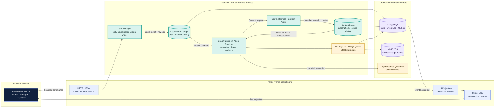
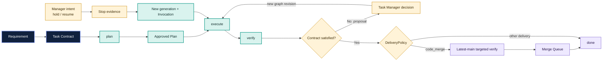

[English](README.md) | [中文](README.zh.md)

<div align="center">

# Threadmill

**A control plane that turns multi-agent work into an auditable, recoverable delivery chain.**

[](https://github.com/KDZZZZZZ/threadmill-AgentTeams/actions/workflows/ci.yml)
[](go.mod)
[](web/package.json)
[](#scope-and-status)

`requirement → plan → execute → verify → merge → done`

</div>

> [!WARNING]
> Threadmill is an alpha implementation. The supported local acceptance path is `threadmilld serve --fake`; production PostgreSQL/MinIO wiring, real AgentTeams credential smoke, cross-process crash recovery, and deployment packaging are not claimed as locally verified.

## Why Threadmill?

An Agent can finish a task and still leave the project worse off. The approved plan may be trapped in one session, the verifier may inspect a different workspace, a stop request may have no durable checkpoint, and a successful-looking result may have no safe path into `main`.

Threadmill starts from a different unit of work. The durable object is the **Task**, not the model session. Each Task owns a fixed `plan → execute → verify` chain, a round-scoped Workspace Binding, explicit evidence, and a graph revision. Agents are temporary compute resources operating inside those boundaries.

The practical result is a control surface for the moments that normally disappear into chat: a Manager intent becomes a `ManagerInputRef`, a decision becomes a `DecisionRef`, a recovery creates a new generation and Invocation, and a code delivery reaches `main` only through the Merge Queue.

## What it is

Threadmill is a Go modular monolith (`threadmilld`) with a React + TypeScript + Vite operator console. It coordinates multi-agent project work through:

- a **Coordination Graph** that records runnable work, dependencies, blockers, phase contracts, and result references;
- a **Context Graph** that stores durable knowledge, subscriptions, Context Slices, Deltas, and task-scoped memory candidates;
- an **Agent Runtime** that binds each Invocation to a role, phase, workspace, context, capability set, lease, budget, and evidence trail;
- a **Workspace and Merge Queue** path that protects the target branch with latest-main verification and a single merge authority.

The browser is a projection and command surface. It does not receive Agent tokens, private transcripts, raw tool output, or graph CRUD authority.

## The control model

The important difference is not “more agents at once”. It is where state and authority live.

| Concern | Session-first / manual coordination | Threadmill |
| --- | --- | --- |
| Work identity | A chat, worker, or model session | A durable Task with a Contract and round |
| Orchestration | Messages and mutable plans | One Coordination Graph, written only by Task Manager |
| Phase lifecycle | Ad hoc start/stop/retry | Fixed `plan / execute / verify` endpoints with generation and lease |
| Context | Whatever the current session happens to remember | Invocation-scoped subscriptions materialized into a Context Slice |
| Recovery | Reopen a session and guess what survived | Persisted evidence, checkpoint or `non_resumable`, then a new Invocation |
| Delivery | A human decides when a result is “good enough” | Verify → latest-main targeted verify → Merge Queue → `main` |
| Browser power | Direct graph edits or runtime controls are tempting | Four bounded writes: Requirement, capacity, human decision, Manager message |

## Architecture

The system is intentionally small at the deployment boundary and strict at the authority boundaries. Two graphs persist business meaning; Runtime, Workspace, and the AgentTeams adapter are execution boundaries around them.



### The two graphs, in plain terms

- **Coordination Graph** answers “what may run next, and what blocks it?” Task Manager is its only external writer. `GraphRuntime` reads it and emits the internal `PhaseController.Apply` command; it is not a public Agent or browser API.
- **Context Graph** answers “what durable knowledge may this Invocation see?” The Runtime takes the union of valid subscriptions for the current `ConsumerInvocationID`, materializes a permission-filtered Context Slice, and delivers Deltas only to active subscribers. `TaskMemoryBuffer` candidates remain separate until review.

The narrow phase-control seam is deliberate:

```go
type PhaseController interface {
    Apply(ctx context.Context, command PhaseCommand) error
}
```

The call acknowledges reliable command acceptance. Started, stopped, failed, and output events return asynchronously through the Event Log; they do not write the graph by themselves.

### From requirement to merge

This is the path a code-delivery Task must earn. A failed verify creates evidence and a Manager decision; it does not silently recycle an old result.



## Operator console

The console is designed to make authority visible without turning the browser into another state machine.


The current UI includes:

- **Capacity strip** — `desired`, `healthy`, `active`, and `waiting` counts; revision-safe `+ / -` commands change throughput without changing graph semantics.
- **Coordination Graph** — grouped Task endpoints with an accessible list view. Selection changes inspection context only; it never writes layout or graph state.
- **Task Manager rail** — natural-language Requirement and Manager messages carry the selected `EndpointRef` and observed graph revision. The server persists the input and returns structured decision evidence.
- **Endpoint Inspector** — separates active subscriptions, the materialized Context Slice, and candidates created by the selected Invocation. A candidate is not presented as an accepted Context Graph node.
- **Realtime recovery** — the browser reads a snapshot and cursor, opens SSE, and reconnects with `Last-Event-ID`; an expired cursor forces a fresh snapshot instead of applying stale state.

The browser-facing contract is documented in [OpenAPI](api/openapi/threadmill-v1.yaml) and implemented under [`internal/transport/httpapi`](internal/transport/httpapi) and [`internal/uiprojection`](internal/uiprojection).

## Design decisions that shape the code

| Choice | Why it matters |
| --- | --- |
| One `threadmilld` process with strict internal packages | Graph CAS, leases, outbox rows, and UI projections can share transaction boundaries before any service split. |
| PostgreSQL + outbox | Revisions, idempotency, audit events, cursors, and recovery records stay durable and replayable without Kafka or Redis in the MVP. |
| MinIO/S3 for large objects | Diffs, transcripts, screenshots, and logs are referenced by `ArtifactRef`; they do not inflate Event Log rows. |
| HTTP/JSON commands + cursor SSE | User actions are explicit and idempotent; server state remains authoritative after reconnects. |
| AgentTeams behind an adapter | QwenPaw, taskflow, heartbeat, and file transport provide execution capacity. Threadmill still owns graph semantics, context permissions, leases, evidence, and merge policy. |

## Repository map

```
cmd/threadmilld/              CLI: serve, migrate, check, bootstrap-operator
internal/coordination/        Coordination Graph, revisions, leases, GraphRuntime
internal/runtime/              Invocation envelopes and phase runtime
internal/contextgraph/         Context Graph, subscriptions, slices, memory buffer
internal/taskmanager/          Task Manager decision and persistence seam
internal/workspace/             Workspace Binding, git backend, agent tools
internal/mergequeue/            latest-main verification and main-write gate
internal/transport/             HTTP/OpenAPI, MCP, and static Web UI adapters
internal/uiprojection/          Permission-filtered snapshots and UI events
internal/adapters/agentteams/   Provider boundary for AgentTeams/QwenPaw/taskflow
web/                            React + TypeScript + Vite operator console
api/openapi/                    Public user and UI contract
migrations/                     PostgreSQL schema migrations
docs/                           Architecture, module contracts, ADRs, and traceability
third_party/agentteams/         Archived base code; read-only for root-project work
```

## Quick start

**Prerequisites:** Go `1.23.3` (from `go.mod`), Node.js `20.19+` or `22.12+`, npm, and a browser. Docker is only needed for the PostgreSQL/MinIO dependency stack.

```powershell
# 1. Install and build the operator console
npm --prefix web ci
npm --prefix web run build

# 2. Start the canonical local acceptance host
go run ./cmd/threadmilld serve --fake --http-addr 127.0.0.1:8080 --web-dist web/dist
```

Open <http://127.0.0.1:8080/?project_id=demo-project>.

You should see a live coordination graph, capacity controls, a Task Manager rail, an endpoint inspector, and an event stream. For the scripted acceptance path, read [`docs/demo.md`](docs/demo.md).

### Verify the repository

```powershell
go test -count=1 ./...
go vet ./...
npm --prefix web run format:check
npm --prefix web run typecheck
npm --prefix web run test
npm --prefix web run e2e
npm run design:check
```

The root CI workflow currently runs Go formatting, vet, unit tests, and race tests. The Web checks are available locally and the browser E2E suite starts the same `threadmilld serve --fake` entry point.

### Production-shaped wiring

The production path expects PostgreSQL, MinIO/S3, an AgentTeams controller, QwenPaw/taskflow execution hosts, and the corresponding `THREADMILL_*` environment variables. Start with [`internal/platform/config`](internal/platform/config), [`deploy/compose/threadmill-deps.yml`](deploy/compose/threadmill-deps.yml), and the [AgentTeams adapter design](docs/threadmill-agentteams-adapter-design.md). `threadmilld serve` fails closed when required runtime dependencies are missing.

## Scope and status

| Area | Current evidence |
| --- | --- |
| Local GUI | `serve --fake` uses the formal domain objects, OpenAPI, SSE, UI projection, and React console; Playwright covers capacity, Manager hold/resume, inspector isolation, and SSE reconnect. |
| Core contracts | Go unit/contract tests cover graph authority, capability visibility, revision/idempotency, context scope, evidence, and projection boundaries. |
| Production storage and runtime | Implemented seams and integration tests exist, but local fake-host acceptance does not prove real PostgreSQL/MinIO/AgentTeams credentials or deployment health. |
| Crash recovery and deployment | Design and persistence boundaries are present; the repository does not claim the full cross-process recovery and deployment acceptance gate is complete. |

This distinction is intentional. A fake host can prove UI and contract behavior; it cannot prove a live external provider.

## Documentation

- [Unified design](docs/threadmill-unified-design.md) — domain model, lifecycle, Workspace, Context, and delivery semantics.
- [Architecture](docs/architecture.md) — the five-node mental model and dependency direction.
- [Coordination Graph](docs/coordination-graph.md) — sole writer, `DecisionRef`, revision CAS, leases, and `PhaseController`.
- [Context Graph](docs/context-graph.md) — subscriptions, slices, Deltas, task memory, and review.
- [Workspace and Merge Queue](docs/workspace-merge.md) — one round, one workspace, write sets, latest-main verification, and merge.
- [GUI and SSE](docs/gui.md) — operator behavior, access boundaries, and reconnect semantics.
- [Traceability](docs/traceability.md) — design object → code model → automated evidence.
- [ADRs](docs/adr/README.md) — modular monolith, persistence, capability auth, AgentTeams provider, and UI projection decisions.

## Contributing

Small, reviewable changes are easiest to land. When a change alters domain semantics, update the relevant design contract, OpenAPI schema, implementation, and tests together. Keep `third_party/agentteams/` treated as archived base code unless a task explicitly targets it, and run the smallest matching checks before opening a PR.

The root project does not currently declare a license file. The license under `third_party/agentteams/` applies to that archived component, not automatically to Threadmill.
