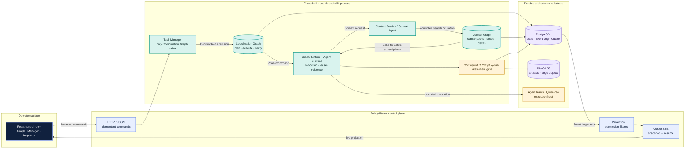
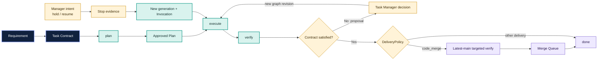
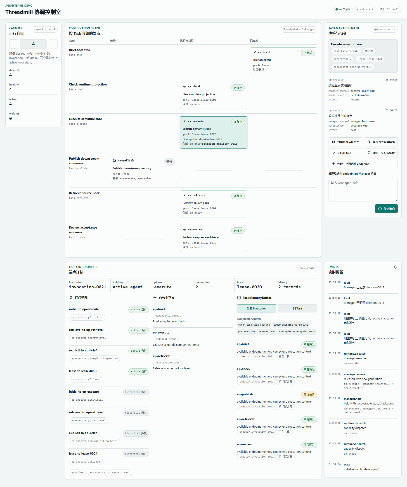

[English](README.md) | [中文](README.zh.md)
<!-- Synced with README.md as of 2026-08-11 -->

<div align="center">

# Threadmill

**把多 Agent 工作变成一条可审计、可恢复的交付链。**

[](https://github.com/KDZZZZZZ/threadmill-AgentTeams/actions/workflows/ci.yml)
[](go.mod)
[](web/package.json)
[](#scope-and-status)

`requirement → plan → execute → verify → merge → done`

</div>

> [!WARNING]
> Threadmill 目前是 alpha 实现。本地可验收路径是 `threadmilld serve --fake`；生产 PostgreSQL/MinIO wiring、真实 AgentTeams 凭据 smoke、跨进程崩溃恢复和部署打包，仓库都没有宣称已通过本地验收。

## 为什么需要 Threadmill？

Agent 做完一次任务，项目仍可能没有得到一个安全的结果：批准过的计划留在旧会话里，verifier 看到的工作区和 executor 不一致，暂停请求没有 checkpoint，而一个看起来成功的输出也没有进入 `main` 的可靠路径。

Threadmill 把“工作”从模型会话里拿出来。持久身份是 **Task**，不是某个 Agent session。每个 Task 固定拥有 `plan → execute → verify` 三个阶段、一个按轮次划分的 Workspace Binding、明确的证据和 graph revision。Agent 只是运行在这些边界里的临时计算资源。

这样，原本会消失在聊天记录里的控制动作都有了落点：Manager 意图会变成 `ManagerInputRef`，裁决会变成 `DecisionRef`，恢复会创建新的 generation 和 Invocation，代码交付则必须经过 Merge Queue 才能触碰 `main`。

## 它是什么

Threadmill 是一个 Go 模块化单体（`threadmilld`）和一个 React + TypeScript + Vite 操作台。它把多 Agent 项目的几类核心事实分开管理：

- **Coordination Graph**：记录哪些工作可以运行、依赖和 blocker 是什么、阶段契约是什么、结果引用在哪里；
- **Context Graph**：保存可复用知识、订阅关系、Context Slice、Delta，以及 Task 级的记忆候选；
- **Agent Runtime**：把一次 Invocation 绑定到角色、阶段、Workspace、上下文、capability、lease、预算和证据链；
- **Workspace + Merge Queue**：用最新 main 的 targeted verify 和单一合并权威保护目标分支。

浏览器只是投影和命令入口。它拿不到 Agent token、私有 transcript、原始工具输出，也没有图 CRUD 权限。

## 控制模型

关键差别不是“同时开多少 Agent”，而是状态和权限究竟落在哪里。

| 问题 | 以会话为中心的手工协作 | Threadmill |
| --- | --- | --- |
| 工作身份 | 一个聊天、Worker 或模型会话 | 带 Contract 和 round 的持久 Task |
| 编排 | 消息和会变的计划 | 只有 Task Manager 能写的 Coordination Graph |
| 阶段生命周期 | 临时 start/stop/retry | 固定的 `plan / execute / verify` Endpoint，带 generation 和 lease |
| 上下文 | 当前会话碰巧记得什么就用什么 | 按 Invocation 订阅并集物化 Context Slice |
| 恢复 | 重新打开会话，再猜哪些东西还在 | 保存 evidence、checkpoint 或 `non_resumable`，然后创建新 Invocation |
| 交付 | 人凭感觉判断“差不多了” | verify → latest-main targeted verify → Merge Queue → `main` |
| 浏览器权限 | 容易滑向直接改图或控制 Runtime | 只开放 Requirement、capacity、human decision、Manager message 四类写入 |

## 架构

部署边界保持克制，权威边界保持严格。两张图保存业务语义；Runtime、Workspace 和 AgentTeams adapter 是围绕它们工作的执行边界。



### 两张图各自管什么

- **Coordination Graph** 回答“下一步能运行什么，谁在阻塞它”。Task Manager 是唯一外部写入者。`GraphRuntime` 读取它，发出内部的 `PhaseController.Apply` 命令；它不是公开的 Agent 工具，也不是浏览器 API。
- **Context Graph** 回答“这次 Invocation 能看到哪些持久知识”。Runtime 以当前 `ConsumerInvocationID` 合并有效订阅，生成经过权限过滤的 Context Slice；Delta 只发给仍在订阅的 Invocation。`TaskMemoryBuffer` 候选要等审核后才会进入知识图。

阶段控制只留下一条窄接口：

```go
type PhaseController interface {
    Apply(ctx context.Context, command PhaseCommand) error
}
```

这个调用只确认命令已被可靠接收。started、stopped、failed 和 output 事件会异步进入 Event Log；它们不会自行改写图。

### 从需求走到合并

代码交付型 Task 必须走完下面这条路。verify 失败会留下 evidence 并等待 Manager 决策，旧结果不会被悄悄复用。



## 操作台

操作台的目标是把权威状态摆在眼前，同时不让浏览器变成另一套状态机。



当前界面包含：

- **Capacity 条**：显示 `desired`、`healthy`、`active`、`waiting`；带 revision 的 `+ / -` 只改变吞吐，不改变图语义。
- **Coordination Graph**：按 Task 分组展示 Endpoint，同时提供可访问的列表视图。点选只改变检查上下文，不写布局，也不写图。
- **Task Manager 侧栏**：Requirement 和 Manager 消息可以带选中的 `EndpointRef` 与所见 graph revision；服务端会保存输入并返回结构化裁决证据。
- **Endpoint Inspector**：把有效订阅、实际物化的 Context Slice、当前 Invocation 创建的候选分开显示。候选在接受前不会被伪装成 Context Graph 节点。
- **实时恢复**：浏览器先读 snapshot 和 cursor，再打开 SSE；重连时带上 `Last-Event-ID`。cursor 过期就重新拉 snapshot，不拿旧状态硬套。

浏览器契约见 [OpenAPI](api/openapi/threadmill-v1.yaml)，实现位于 [`internal/transport/httpapi`](internal/transport/httpapi) 和 [`internal/uiprojection`](internal/uiprojection)。

## 代码里落地的设计选择

| 选择 | 解决的问题 |
| --- | --- |
| 一个 `threadmilld` 进程，内部包边界清晰 | Graph CAS、lease、outbox 和 UI projection 可以先共享事务边界，未来再按包拆服务。 |
| PostgreSQL + outbox | revision、幂等键、审计事件、cursor 和恢复记录都能持久化、重放；MVP 不需要 Kafka 或 Redis。 |
| MinIO/S3 保存大对象 | diff、transcript、截图和日志用 `ArtifactRef` 引用，不把大正文塞进 Event Log。 |
| HTTP/JSON 命令 + cursor SSE | 用户动作清楚且可幂等；断线重连后仍以服务端状态为准。 |
| AgentTeams 放在 adapter 后面 | QwenPaw、taskflow、heartbeat 和文件运输提供执行能力；图语义、上下文权限、lease、证据和合并策略仍归 Threadmill。 |

## 仓库地图

```
cmd/threadmilld/              CLI: serve, migrate, check, bootstrap-operator
internal/coordination/        Coordination Graph, revisions, leases, GraphRuntime
internal/runtime/              Invocation envelopes and phase runtime
internal/contextgraph/         Context Graph, subscriptions, slices, memory buffer
internal/taskmanager/          Task Manager decision and persistence seam
internal/workspace/             Workspace Binding, git backend, agent tools
internal/mergequeue/            latest-main verification and main-write gate
internal/transport/             HTTP/OpenAPI, MCP, and static Web UI adapters
internal/uiprojection/          Permission-filtered snapshots and UI events
internal/adapters/agentteams/   Provider boundary for AgentTeams/QwenPaw/taskflow
web/                            React + TypeScript + Vite operator console
api/openapi/                    Public user and UI contract
migrations/                     PostgreSQL schema migrations
docs/                           Architecture, module contracts, ADRs, and traceability
third_party/agentteams/         Archived base code; read-only for root-project work
```

## 本地启动

**前置条件：** Go `1.23.3`（来自 `go.mod`）、Node.js `20.19+` 或 `22.12+`、npm 和浏览器。只有启动 PostgreSQL/MinIO 依赖栈时才需要 Docker。

```powershell
# 1. Install and build the operator console
npm --prefix web ci
npm --prefix web run build

# 2. Start the canonical local acceptance host
go run ./cmd/threadmilld serve --fake --http-addr 127.0.0.1:8080 --web-dist web/dist
```

打开 <http://127.0.0.1:8080/?project_id=demo-project>。

你应该能看到实时 Coordination Graph、容量控制、Task Manager 侧栏、Endpoint Inspector 和事件流。想按脚本走一遍验收，直接看 docs/demo.md。

### 验证仓库

```powershell
go test -count=1 ./...
go vet ./...
npm --prefix web run format:check
npm --prefix web run typecheck
npm --prefix web run test
npm --prefix web run e2e
npm run design:check
```

根目录 CI 当前执行 Go 格式检查、vet、单元测试和 race tests。Web 检查可以本地运行，浏览器 E2E 也会启动同一个 `threadmilld serve --fake` 入口。

### 生产形态配置

生产路径需要 PostgreSQL、MinIO/S3、AgentTeams controller、QwenPaw/taskflow 执行宿主，以及对应的 `THREADMILL_*` 环境变量。建议从 [`internal/platform/config`](internal/platform/config)、[`deploy/compose/threadmill-deps.yml`](deploy/compose/threadmill-deps.yml) 和 [AgentTeams adapter 设计](docs/threadmill-agentteams-adapter-design.md) 开始。缺少必需运行时依赖时，`threadmilld serve` 会 fail closed。

## 当前范围与状态

| 区域 | 现在有什么证据 |
| --- | --- |
| 本地 GUI | `serve --fake` 使用正式领域对象、OpenAPI、SSE、UI projection 和 React 控制台；Playwright 覆盖容量、Manager hold/resume、Inspector 隔离和 SSE 重连。 |
| 核心契约 | Go unit/contract tests 覆盖图权限、capability 可见性、revision/幂等、上下文作用域、evidence 和 projection 边界。 |
| 生产存储与 Runtime | 代码和集成测试已有对应 seam，但本地 fake-host 不能证明真实 PostgreSQL/MinIO/AgentTeams 凭据或部署健康。 |
| 崩溃恢复与部署 | 设计和持久化边界已经写下，但仓库没有宣称跨进程恢复和部署验收门槛已经完成。 |

这个区分是刻意保留的：fake host 能证明 UI 和契约行为，不能代替真实外部 Provider。

## 文档导航

- [统一设计](docs/threadmill-unified-design.md) —— 领域模型、生命周期、Workspace、Context 和交付语义。
- [总体架构](docs/architecture.md) —— 五节点心智模型和依赖方向。
- [Coordination Graph](docs/coordination-graph.md) —— 唯一写入者、`DecisionRef`、revision CAS、lease 和 `PhaseController`。
- [Context Graph](docs/context-graph.md) —— 订阅、切片、Delta、Task memory 和审核。
- [Workspace 与 Merge Queue](docs/workspace-merge.md) —— 一轮一个工作区、write set、latest-main verify 和合并。
- [GUI 与 SSE](docs/gui.md) —— 操作者行为、访问边界和断线恢复。
- [设计—代码—测试追踪](docs/traceability.md) —— 设计对象、代码模型和自动证据的对应关系。
- [ADR 目录](docs/adr/README.md) —— 模块化单体、持久化、capability auth、AgentTeams provider 和 UI projection 的决策记录。

## 贡献

小而清楚的改动最容易审查。凡是改动领域语义，都应同步更新对应设计契约、OpenAPI、实现和测试。除非任务明确要求，请把 `third_party/agentteams/` 当作归档基座处理；提交 PR 前先跑与改动匹配的最小检查。

根项目目前没有声明 license 文件。`third_party/agentteams` 下的 license 只适用于那个归档组件，不会自动延伸到 Threadmill。
