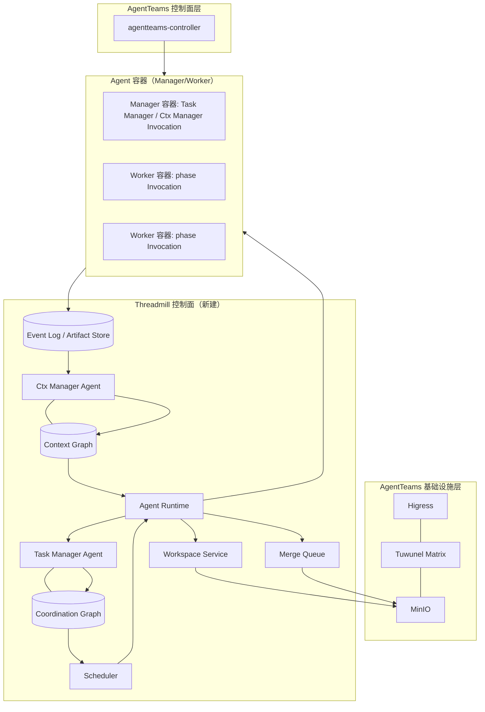

# Threadmill 总体架构

版本：v1.0（按统一设计重写）
状态：Draft
定位：系统总览。本文只描述产品判断、模块职责与依赖方向、部署形态与数据流、AgentTeams 四层基座的复用边界和实现顺序；不重复各模块的详细接口。

> **语义以 [threadmill-unified-design.md](./threadmill-unified-design.md) 为准**。术语定义见 [CONTEXT.md](./CONTEXT.md)；本文与模块草案冲突时，统一设计优先。

---

## 1. 一句话架构

Threadmill 在 AgentTeams 归档基座上实现一个多 Agent 控制面：它只保留**两张持久图**——`Coordination Graph`（Task 之间未履行的因果义务，以 Phase Endpoint 为粒度）与 `Context Graph`（从运行证据提炼的知识关系）——并用**一个执行边界**（Agent Runtime + Workspace）承载所有 Agent Invocation。

```text
Agent 是临时计算资源；
Task 不属于 Agent Session；
Task 直接拥有 Workspace Binding（按轮次切换）；
Phase Endpoint 是 Task Manager 的编排端点；
Context Graph 是所有 Agent 的外部记忆通信面；
系统把 Requirement 变成可验收 Task，把验收结果机械合并进 main。
```

核心工作链：

```text
Requirement -> Task Contract -> Task -> 轮次(Round) -> Agent Invocation
```

- `Requirement`：原始目标、动机、约束与验收意图，保存来源，不直接调度。
- `Task Contract`：稳定定义交付什么、为什么、允许边界与怎样算完成；不含实现步骤。
- `Task`：由 Task Contract 约束的持久工作身份，寿命长于任何 Invocation。
- `轮次（Round）`：对同一 Task 的一次有界尝试，由该轮次的 Workspace Binding 标识；不存在 Attempt 实体。
- `Agent Invocation`：在指定角色、阶段、工作区、上下文、权限和预算下的一次有界调用。

系统对象与 AgentTeams 基座的关系见 [第 6 节复用矩阵](#6-agentteams-四层基座与复用矩阵)。

---

## 2. 两张持久图与一个执行边界

| 对象 | 生命周期 | 负责的问题 | 唯一写入口 |
| --- | --- | --- | --- |
| Coordination Graph | 持久 | 哪个 Phase Endpoint 可以运行、被什么阻塞、阶段交付是否满足 | Task Manager Agent |
| Context Graph | 持久 | 哪些记忆可见、如何关联、如何检索、哪些订阅需要推送 | Ctx Manager Agent |
| Agent Runtime / Workspace | 一次 Invocation / 一个轮次 | 如何在权限、工作区和预算内执行并记录证据 | Runtime / Workspace service |

边界规则：

- **Coordination Graph 可热修改**，但只有 Task Manager 能写。运行中的 Agent 如需拆分、补前置、调整串并或失败重排，只能提交结构化 `OrchestrationProposal`；由 Task Manager 审批后热修改图。
- Coordination Graph 不保存 Agent 的运行过程上下文，只保存阶段依赖、完成信号、交付物/报告要求及其结果引用。
- **Context Graph 是所有 Agent 的通信面**：Agent 可探索可见图、请求检索、订阅子图并接收自动增量 `Context Delta`，但不能直接写图。
- **Ctx Manager 只做两件事**：响应检索请求、准入 `MemoryCandidate`。它不主动巡图、不主动提示、不执行订阅或推送；订阅来自切片自动订阅或 Agent 主动订阅，推送由自动化订阅执行器完成。
- Runtime 只负责启动、权限、Workspace、事件记录、输出契约校验与受控请求转交；不拥有业务编排或知识判断。
- Workspace 不是图节点，也不承担跨 Agent 通信。
- **不存在 Execution Graph**：phase 内的执行步骤与过程上下文是 Runtime 的内部现场，不建立持久执行图。只有阶段结束的 `PhaseOutput` 和 Agent 主动提交的 `OrchestrationProposal` 进入 Task Manager 视野。
- **不存在 Agent mailbox**：Agent 之间没有消息队列式直接通信；外部记忆只来自切片、探索、检索、订阅与自动 Delta。

---

## 3. 模块职责与依赖方向

每个模块只拥有一个核心决定，依赖方向从编排请求流向受控服务，不形成反向调用环：

| 模块 | 唯一职责/决定 | 可以读取 | 不可以做 |
| --- | --- | --- | --- |
| Task Manager Agent | 默认编排 Coordination Graph；规定每个 endpoint 的 DeliverySpec/ReportSpec；审批 OrchestrationProposal 并热修改图；接受 PhaseOutput | Requirement、所有 completed PhaseOutput/report/evidence、自己的 Context Slice/Delta 与可见 Context Graph | 旁观 phase 运行过程、选实现方案、写 Context Graph、操作 Workspace |
| Scheduler | 从可运行 endpoint 中选择下一次 Invocation | Coordination Graph、预算、容量、能力 | 创建/修改 task、edge、blocker；解释编排建议；选择记忆 |
| Ctx Manager Agent | 响应检索请求并准入 MemoryCandidate；维护 Context Graph | Event Log、Artifact Store、权限策略 | 主动巡图或提示、决定普通探索/切片、执行订阅或推送、改 Coordination Graph、批准阶段交付 |
| Agent Runtime | 启动/取消 Invocation，施加 phase 权限，记录事件并校验输出形状 | Scheduler 的 run request、Context Slice、Workspace Binding | 判断业务完成、暴露未提交过程上下文、写任一图的业务状态 |
| Workspace Service | 为 Task 轮次创建/复用/封存执行现场，观察 write set | Runtime policy、轮次 revision | 调度 Agent、判断验收、写 main |
| Verifier / Merge Queue | Verifier 判断候选是否满足契约；Merge Queue 在 latest main 上机械检查并合入 | Task Contract、Approved Plan、Workspace、evidence | Verifier 修改实现；Merge Queue 修冲突或直接改 Coordination/Context Graph |
| Phase Agent | 完成当前 phase；提交 PhaseOutput 或 OrchestrationProposal；使用可见 Context Graph | Task Contract、endpoint 契约、自己的 Context Slice/Delta、子图列表与描述 | 直接改图、直接通信、改 main、宣布 done |

依赖约束（设计不变量）：

1. 所有 Agent——包括 Task Manager、Ctx Manager、planner、executor、verifier——都经 Agent Runtime 运行，并经同一 Context 读接口获取外部记忆。
2. Task Manager 与 phase agent 都不能写 Context Graph；Ctx Manager 不依赖 Scheduler。
3. Runtime 不依赖图的具体存储；Workspace 不依赖 Context Graph。
4. Coordination Graph 只有 Task Manager 能写；Context Graph 只有 Ctx Manager 能写。
5. 跨模块数据只使用：Task Contract、PhaseOutput、OrchestrationProposal、ArtifactRef、ContextSlice 与受控 service request。
6. main 只有 Merge Queue 能写；Agent 与 Runtime 都不能合并 main。

---

## 4. 部署形态：AgentTeams 四层基座

AgentTeams（`third_party/agentteams`）提供四层可部署基座；Threadmill 的控制面作为新服务插入其中，不重写这四层：

```text
┌────────────────────────────────────────────────────────────────┐
│ 4. Worker 运行时层（Invocation 容量池）                          │
│    agentteams-worker / qwenpaw / copaw / hermes / openhuman     │
│    qwenpaw/src/qwenpaw_worker/（worker.py / api.py / sync.py）  │
│    plugins/teamharness、plugins/workerflow（MCP 工具面）        │
├────────────────────────────────────────────────────────────────┤
│ 3. Manager 层（Task Manager / Ctx Manager 的宿主）               │
│    agentteams-manager（openclaw）或 agentteams-manager-qwenpaw  │
│    manager/agent/（AGENTS.md / HEARTBEAT.md / skills/）         │
├────────────────────────────────────────────────────────────────┤
│ 2. 控制面层（资源生命周期）                                       │
│    agentteams-controller：CRD（Worker/Manager/Team/Human）、     │
│    REST API、agt CLI、reconciler（internal/controller、         │
│    internal/backend/sandbox.go）                                 │
├────────────────────────────────────────────────────────────────┤
│ 1. 基础设施层                                                     │
│    Higress AI 网关 / Tuwunel Matrix / MinIO 对象存储 / Element   │
│    Web（helm/agentteams、install/agentteams-install.sh）         │
└────────────────────────────────────────────────────────────────┘
```

Threadmill 插入位置：

- **基础设施层与控制面层原样部署**（本地栈 `install/agentteams-install.sh`，或 K8s `helm/agentteams`）。Higress 承载 LLM 与 MCP 路由，Tuwunel 承载人工可见性与最终报告，MinIO 承载 Workspace/Artifact/Event 的物理存储。
- **Threadmill 控制面服务（新建 Go 服务）与 agentteams-controller 并存**：Coordination Graph、Scheduler、Event Log / Artifact Store 注册表、Context Graph、Workspace Service、Merge Queue。它们使用 MinIO 作为物理底座，通过 agentteams-controller 管理 Invocation 容器。
- **Manager 容器承载 Task Manager Agent 与 Ctx Manager Agent**：它们是经 Runtime 启动的普通 Agent Invocation，prompt 由 Threadmill 提供（基于 `manager/agent/team-leader-agent/` 适配，见 6.2），不再承担 AgentTeams 的持久 Leader 编排语义。
- **Worker 容器池是 Worker Capacity**：每个 phase Invocation 在容器内以独立工作目录/Workspace 运行，容器本身不拥有持久任务身份。



---

## 5. 数据流

### 5.1 需求与编排流

```text
Human UI（Element Web）提交 Requirement
  -> Task Manager Agent（经 Runtime 启动）
  -> 规整为 Task Contract；创建 Task、Phase/Decision Endpoint、edge、blocker，并创建轮次（Round）
  -> 为每个 phase 写入 DeliverySpec 与 ReportSpec
  -> Coordination Graph（唯一写入口：Task Manager）
  -> Scheduler 读取图，选择 runnable Phase Endpoint，请求 Runtime
```

运行中的 phase agent 发现编排不再合适（拆分、缺前置、串并调整、失败重排）时：

```text
Phase Agent 提交 OrchestrationProposal（自由文本意图 + 理由 + evidence 引用）
  -> Runtime 只记录并转交
  -> Task Manager 结合图与可见证据裁决：接受 -> 热修改 Coordination Graph；
     拒绝 -> 返回结构化理由
  -> Scheduler 在图更新后重算 runnable endpoint
```

### 5.2 执行流（一个轮次）

```text
Scheduler 激活 T.plan
  -> Runtime 创建 Invocation，从 Workspace Service 取得/创建该轮次的 Workspace Binding
     （git worktree + branch 或等价形式）
  -> Context service 生成初始 Context Slice 并自动订阅所含子图
  -> planner Invocation：只读代码，产出 Submitted Plan、Declared Write Set、验证计划
  -> plan 经 policy/reviewer/human 审批 -> 冻结 Approved Plan

Scheduler 激活 T.execute
  -> Runtime 复用同一 Workspace Binding，切换写 lease
  -> executor Invocation：批准范围内写实现，产出 diff/产物、Observed Write Set、新发现
  -> Runtime 观察真实 write set，事件与 artifact 落 Event Log / Artifact Store

Scheduler 激活 T.verify
  -> Runtime 继续复用同一 Workspace Binding，切换只读 lease
  -> verifier Invocation：独立检查契约与候选，产出 Verify Result 与证据
  -> Verify passed + 交付条件满足 -> done（图结论）；
     失败 -> verifier 提交 OrchestrationProposal（retry）
      -> Task Manager 失效旧输出，重开 execute->verify 端点，新建轮次 Workspace
```

任何阶段只能有一个有效写 lease；同一轮次内需要并行时只能并行只读准备，或由 Task Manager 拆为独立 Task。

### 5.3 上下文流

```text
Invocation 创建前：Context service 按 role/purpose/权限生成 Context Slice
  -> 切片包含节点正文、可见子图列表与描述、Frontier、Omitted、Conflicts
  -> 自动订阅切片所含子图

运行中：
  Agent 列表/探索（普通读，不需 Ctx Manager 逐次批准）
  -> Agent 请求 Retrieve（才调用 Ctx Manager，多路召回 + path explanation）
  -> Agent 从可见子图列表主动 Subscribe（Context service 校验并持久化）

记忆积累：
  Agent 标注 MemoryCandidate（Statement/Kind/WhyReusable/Scope/ProposedEdges/SourceRefs）
  -> Runtime 自动记录到 Event Log
  -> Ctx Manager 校验证据、权限、价值 -> 准入（create/revise/supersede/dispute/reject）
  -> 原子提交节点/边/子图 revision
  -> 自动化订阅执行器匹配受影响子图 -> Runtime 推送 Context Delta 给订阅 Invocation
```

Ctx Manager 不主动巡图、不主动提示；订阅之外的旁路推送不存在。

### 5.4 验证与合并流

```text
Verify passed（轮次 Workspace 上）
  -> MergeCandidate（进入 Merge Queue 的资格，不等于 done）
  -> latest main 上机械应用检查（临时 merge-check workspace）
  -> targeted verify on latest main + candidate
  -> 串行 merge（main 唯一写入口）
  -> merge event + commit/diff/test evidence 落 Event Log / Artifact Store
  -> 合并产生的新事实经 Ctx Manager 准入进入 Context Graph
  -> 订阅相关子图的 active Agent 收到 Context Delta
  -> Task Manager 计算 done
```

冲突或复验失败产生 evidence；Task Manager 将受影响阶段编排回 plan/execute/verify 或 waiting_human。Merge Queue 不修冲突、不重写 Coordination Graph、不直接写 Context Graph。

---

## 6. AgentTeams 四层基座与复用矩阵

AgentTeams 是**归档基座**：只复用已证实能力，不继承其以 Matrix 房间与持久 Worker 身份为中心的编排模型。所有复用均按“直接复用 / 适配封装 / Threadmill 新建 / 不应复用”四档判定。路径均相对仓库根。

### 6.1 直接复用（原样使用，不改语义）

| Threadmill 需求 | AgentTeams 落点 |
| --- | --- |
| MCP 工具面：phase agent 的受控工具集 | `third_party/agentteams/plugins/teamharness/mcp/server.py`（纯 stdlib JSON-RPC stdio MCP 服务器）、`third_party/agentteams/plugins/workerflow/mcp/server.py`；`third_party/agentteams/qwenpaw/src/qwenpaw_worker/api.py` 的 MCP client 注册与 ACL 策略（`reconcile_acl`/`put_mcp_policy`） |
| Worker 进程托管：分阶段启动、子进程 API 就绪门控、优雅停机 | `third_party/agentteams/qwenpaw/src/qwenpaw_worker/worker.py`（`start()` 阶段序列、`_run_qwenpaw` 就绪等待、`stop()`） |
| 期望状态 → 运行时应用管道 | `third_party/agentteams/qwenpaw/src/qwenpaw_worker/update.py`（`RuntimeUpdater`/`MemberRuntimeConfig`）；`third_party/agentteams/agentteams-controller/internal/agentconfig/coordination.go`（CoordinationContext 注入 agent prompt） |
| runnable endpoint 计算内核（算法级适配） | `third_party/agentteams/plugins/teamharness/mcp/server.py` 的 `_ready_nodes`/`_ready_loop_nodes`（status 满足且 `depends_on` 全部 completed 才 ready） | **算法级适配，不是直接复用**：复用 ready 判定算法与其测试案例，不复用其状态存储、节点模型与 Leader 写图语义；Coordination Graph 本体仍是 Threadmill 新建（6.3） |
| 技能分发与渲染管线 | `third_party/agentteams/plugins/teamharness/plugin.yaml` + `adapters/qwenpaw/plugin.py`（插件注册/安装）、`qwenpaw/src/qwenpaw_worker/update.py` 的 `_copy_skills_to_workspace`、`third_party/agentteams/shared/lib/render-skills.sh`（envsubst 白名单渲染） |
| Invocation 与任务/项目关联（证据链） | `third_party/agentteams/plugins/teamharness/adapters/qwenpaw/task_trace.py`（OTel span 打 `agentteams.task.id`/`project.id`，按 room_id 关联） |
| Invocation 容器生命周期 | `third_party/agentteams/agentteams-controller/internal/backend/sandbox.go`（hibernate/resume/delete）、`internal/controller/member_reconcile.go`（状态驱动 reconcile）、`internal/backend/agent_pod_template.go`（Pod 模板参数化） |
| Workspace/Artifact 物理同步底座 | `third_party/agentteams/shared/lib/worker-file-sync.sh`、`qwenpaw/src/qwenpaw_worker/sync.py`（`FileSync`：mc mirror_all + push_loop）、`third_party/agentteams/worker/scripts/worker-entrypoint.sh`（启动拉取/水印） |
| 人工可见性与最终报告通道 | Tuwunel Matrix + Element Web；`third_party/agentteams/plugins/teamharness/mcp/message_tool.py` 的 requester `replyRoute` 报告路径、`roomflow_tool.py` 的房间操作（仅人工界面与 requester 报告，见 6.4 边界） |
| “phase agent 不直接通信”的既有佐证 | `third_party/agentteams/plugins/teamharness/mcp/server.py` 中 `MESSAGE_TOOL_BLOCKED_ROLES`（worker 禁用 message 工具） |
| 存储/配置迁移框架 | `third_party/agentteams/migrate/skill/` + `tests/test-28-migration-e2e.sh`（copy-then-verify + marker 模式）——用于 Threadmill 自身存储 schema 迁移 |

### 6.2 适配封装（复用机制，包裹 Threadmill 语义）

| Threadmill 语义 | AgentTeams 基座 | 包裹的语义 |
| --- | --- | --- |
| Agent Invocation | `qwenpaw/src/qwenpaw_worker/worker.py` 的 Worker 生命周期 | 从“持久 Worker 身份”改为“一次性 Invocation”：每次 phase 以独立 agent 实例/工作目录启动，角色由 role/purpose/endpoint 决定；不建立持久花名册 |
| Phase 权限与工具面 | `qwenpaw/src/qwenpaw_worker/api.py` 的 agent/MCP/ACL 配置 | 按 **phase lease** 施加：plan 只读源码、execute 批准范围写、verify 只读实现；lease 本身是 Threadmill 新建语义 |
| Workspace Binding 物理层 | `sync.py` FileSync + `shared/tasks/{id}/workspace/` 目录约定（`docs/teamharness-project-task-runtime-design.md`） | 绑定 Task 轮次：git worktree + branch（新建）只做代码现场；FileSync 只做物理同步，修复 `docs/issue-1107-file-sync-io-amplification.md` 指出的 `.last-pull` 非远端游标问题（对象级增量 + 删除传播） |
| Coordination Graph 存储与操作 | `third_party/agentteams/copaw/src/copaw_worker/task.py`（FileSystemTaskStore：ProjectMeta/TaskMeta/TaskResult、`shared/projects\|tasks/{id}/meta.json`）+ `plugins/teamharness/mcp/server.py` 的 projectflow/taskflow | 增加 Phase/轮次维度与图 revision（对齐 `PhaseResultBinding` 与结果失效语义）；把“Leader 直接改状态”改为 **Task Manager 唯一写入口**；`delegate_task` 的 Matrix 通知路径降级为可选交付通知 |
| Task Manager Agent 行为 | `third_party/agentteams/manager/agent/team-leader-agent/AGENTS.md` + `skills/task-management/references/dag-tasks.md`、`skills/project-management/references/dag-execution.md` | 作为 Task Manager prompt 蓝本：删除 requester 报告中的“自行完成工作”部分、删除直接写状态的工具权限；补充 DeliverySpec/ReportSpec 与 OrchestrationProposal 审批职责 |
| Artifact 物理存储 | MinIO + filesync 路径约束 + `server.py` 的工件路径安全校验（拒绝 `..` 与越界）与敏感内容扫描 | Artifact Store 注册表（ContentHash/ArtifactType/ArtifactRef）是 Threadmill 新建；Matrix 发布仅作可选交付通知，不是存储 |
| Event 原始证据源 | Matrix 时间线、各运行时私有 `sessions/`、`task_trace.py` span、meta.json 变迁 | 由 Runtime 适配器归一化为 append-only Event Log（新建）；sessions/ 保持私有（`worker.py` 的 SESSION_FILE_PROMPT_POLICY 与“过程上下文留在 Invocation 内”一致） |
| 人工审批界面 | Element Web 房间 + `manager/agent/skills/human-management/` | human decision endpoint 的展示与批准入口；输入经 Task Manager 进入 Coordination Graph |

### 6.3 Threadmill 新建（AgentTeams 无对应，需自建）

| 组件 | 说明 | 可落地的物理底座 |
| --- | --- | --- |
| Coordination Graph 本体 | Phase Endpoint/edge/blocker/Decision、DeliverySpec/ReportSpec、图 revision、热修改、结果失效 | `shared/projects\|tasks/` 文件协议之上新建（`copaw/src/copaw_worker/task.py` 的存储协议适配） |
| OrchestrationProposal 协议 | 建议提交、来源校验、裁决、热修改闭环 | 新建 |
| Scheduler | runnable endpoint 选择 + 容量/预算/优先级 | 复用 `_ready_nodes` **算法**（6.2，仅 ready 判定）外包选择逻辑 |
| Workspace Binding（轮次） | WorkspaceRef（Binding ID + Generation）、git worktree + branch-per-round、PhaseLeases、Declared/Observed Write Set | AgentTeams 无 git worktree 基础设施（全仓无 worktree 实现，仅 prompt 级 git 代执行） |
| Write Set 观察 | 从 diff 提取实际写集合 | 新建 |
| PhaseOutput 结构化协议 | endpoint 输出载荷 + 形状校验 | 新建（取代 `TASK_COMPLETED`/`TASK_BLOCKED` 文本事件） |
| Verify gate 与 Merge Queue | latest main 机械检查、临时 merge-check workspace、targeted verify、串行合入、main 唯一写入口 | 新建（AgentTeams 无 merge 自动化，`tests/test-14-git-collab.sh` 只验分支内容） |
| Event Log + Artifact Store 注册表 | append-only 事件流、ContentHash/ArtifactType 索引、审计 | MinIO 之上新建（AgentTeams 无事件模型，全仓无 Event Log 实现） |
| Context Graph 全套 | Context Node/Edge/Subgraph、ContextSlice（含 Frontier/Omitted/Conflicts）、ContextSubscription、MemoryCandidate 准入、订阅执行器与 Context Delta、两级缓存 | 全部新建；`docs/k8s-native-agent-orch.md` 预留的 `shared/knowledge/` 前缀可作落点 |
| Ctx Manager Agent 角色 | 检索响应 + MemoryCandidate 准入的唯一写入口 | 新建（AgentTeams 无共享记忆服务） |
| Threadmill 控制面服务 | Coordination/Scheduler/Event/Context/Workspace/Merge 的 Go 服务壳 | 新建，与 agentteams-controller 并存 |

### 6.4 不应复用（语义冲突，必须新建或改写）

| AgentTeams 能力 | 为什么不应复用 | Threadmill 替代 |
| --- | --- | --- |
| Matrix 聊天解析作控制面协议（`TASK_COMPLETED`/`TASK_BLOCKED` 文本、`git-request:`/`git-result:` prompt 级 git 代执行） | 无结构、无 revision、无审计；执行与验收混在聊天文本里 | 结构化 PhaseOutput / OrchestrationProposal；git 操作由 Workspace Service 与 Merge Queue 机械化执行 |
| Agent mailbox / 房间消息编排（message 工具、mention/房间/ping-pong 防护、`chat_with_agent` 类内部协调） | 与“无 mailbox、无订阅外旁路推送”冲突 | Context Graph 列表/探索/检索/订阅 + 自动 Context Delta |
| TeamHarness Leader 双写模型（Leader 直接写 meta.json/plan.md/result.md、`accept_task_result` 自行验收） | 与“Task Manager 唯一写入口 + 独立 verify”冲突 | Task Manager 唯一写 Coordination Graph；verify 独立判断 |
| TaskMeta/ProjectMeta 状态词表（`assigned`/`in_progress`/`submitted`、`SUCCESS`/`REVISION_NEEDED`…） | 无 Phase/轮次维度、无 revision、无失效语义 | plan → execute → verify + Phase Endpoint + PhaseResultBinding |
| 每 Agent 私有记忆（OpenClaw `MEMORY.md`/`memory/`、CoPaw remelight、Hermes `memory_enabled`） | 是单 Agent 私有会话记忆，无准入、无共享、无子图 | Context Graph 是唯一共享外部记忆；私有记忆不继承 |
| WorkerFlow 临时 agent 模型充当 Task Manager | workerflow 是 Worker 内分治的执行模型，非编排权威 | 仅作 Invocation 内执行的参考，不承担编排 |
| MinIO 全 workspace mirror 作代码合并机制 | last-writer-wins、无合并语义（`docs/issue-1107-file-sync-io-amplification.md`） | git worktree + branch + Merge Queue 机械合入 |
| AgentTeams 项目规则（其 AGENTS.md/SOUL.md/HEARTBEAT.md 与 Team 契约） | 归档基座约束，不适用于根项目 | Threadmill 自己的 Agent 提示与技能 |

---

## 7. 实现顺序

每个阶段以“可运行、可验证”为出口，不等待后置阶段：

```text
P0 基座验证
   启动 agentteams 本地栈（install/agentteams-install.sh 或 Helm）；
   单 qwenpaw worker 容器内完成一次受控 Invocation；验证 FileSync 与
   teamharness MCP 工具面（health/filesync/projectflow/taskflow）。

P1 Runtime 基座
   将 qwenpaw_worker.Worker 适配为 Invocation 生命周期（6.2）；
   通过 api.py 施加 role/purpose 工具面与 ACL；事件归一化落 MinIO；
   引入 workerflow 作 Invocation 内执行参考。

P2 Workspace
   git worktree + branch-per-round；WorkspaceBinding 实体（含 Generation）与 phase lease；
   write set 观察；FileSync 对象级增量适配（修复游标语义）。

P3 Coordination Graph 与 Task Manager
   在 FileSystemTaskStore 之上建 Coordination Graph（Phase Endpoint、edge、
   DeliverySpec/ReportSpec、revision、失效）；Task Manager prompt 由
   team-leader-agent 适配；OrchestrationProposal 提交与热修改闭环。

P4 Scheduler / Verify / Merge Queue
   Scheduler（复用 _ready_nodes 判定算法（6.2）+ 容量/预算）；
   PhaseOutput 校验；Verify gate；Merge Queue（main 唯一写入口）。

P5 Context Graph
   Context Node/Edge/Subgraph 存储与 revision；ContextSlice 选择与两级缓存；
   MemoryCandidate 准入；订阅执行器与 Context Delta 推送；Ctx Manager 角色。

P6 Event Log / Artifact Store 注册表与人工界面
   append-only 事件流与审计；ContentHash 注册表；
   Element Web 人工决定入口（human decision endpoint）。
```

依赖原则：P1 之前不依赖 P3 的图语义（可先用最小 Coordination Graph 文件协议）；P5 的 MemoryCandidate 在 P1 的 Event 归一化就绪后即可并行开发。

---

## 8. 架构不变量（总览级）

1. 所有 Agent Invocation 都经 Agent Runtime，包括 Task Manager、Ctx Manager、planner、executor、verifier。
2. Coordination Graph 只有 Task Manager 能写；Context Graph 只有 Ctx Manager 能写；main 只有 Merge Queue 能写。
3. Task 未通过 verify 不得进入 Merge Queue；verify passed 不等于 done。
4. 同一个 Task 的同一轮次（round）内，plan、execute、verify 共享同一份 Workspace Binding；任何阶段只有一个有效写 lease。
5. Agent 不拥有长期记忆；外部记忆只来自 Context Slice、图探索、检索、订阅与自动 Context Delta。
6. Agent 启动不加载全量 Context Graph；切片是绑定 Invocation 的只读快照。
7. execute 不直接修改 main；verify 不自我批准 execute 结果。
8. 通过提交 OrchestrationProposal 扩展 Coordination Graph 是复杂任务的合法交付，不是失败。
9. blocked 是投影，权威 blocker 指向具体 Phase Endpoint。
10. Runtime 不判断 Task 是否完成、不解释编排建议、不写任一图、不替 Ctx Manager 检索或接受记忆、不合并 main。
11. 订阅只有两种来源：切片自动订阅与 Agent 主动订阅；推送由自动化订阅执行器执行。
12. 跨模块数据只使用 Task Contract、PhaseOutput、OrchestrationProposal、ArtifactRef、ContextSlice 与受控 service request。
13. AgentTeams 是归档基座：只复用已证实能力（6.1/6.2），编排与记忆语义全部落在 Threadmill 控制面。

---

## 9. 详细设计文档

- [统一设计（语义权威）](./threadmill-unified-design.md)
- [Task Manager Agent 详细设计](./task-manager-agent.md)
- [Coordination Graph 详细设计](./task-graph.md)
- [Agent Runtime 详细设计](./agent-runtime.md)
- [Context Graph 详细设计](./ctxlib.md)
- [Workspace 与 Merge Queue 详细设计](./workspace-merge.md)
- [Scheduler 与 Budget 详细设计](./scheduler-budget.md)
- [Event Log 与 Artifact Store 详细设计](./event-artifact-store.md)
- [设计理由](./design-rationale.md)
- [领域语言](./CONTEXT.md)
