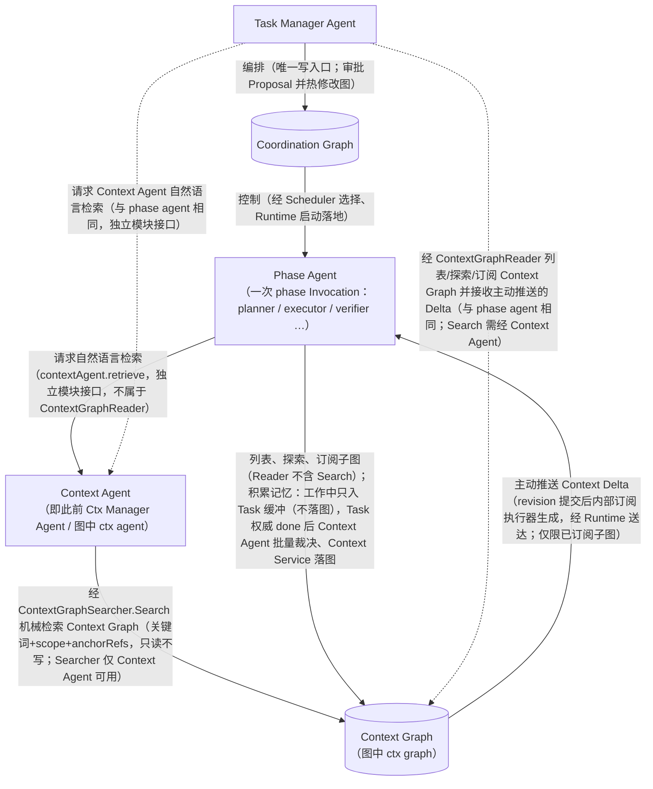
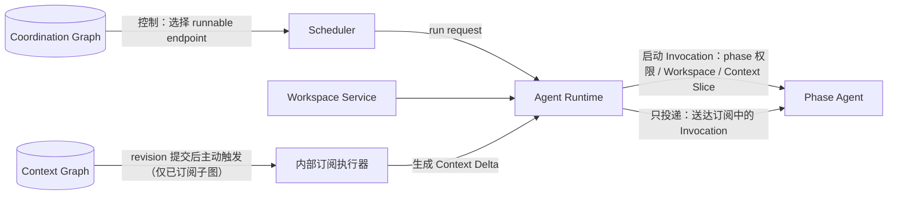

# Threadmill 总体架构

版本：v2.0（以五节点运行闭环为主线重写）
状态：Draft
定位：系统总览。本文以五节点架构图为叙事中心，说明五个核心节点、两条主链路（协调链与上下文闭环）、关键边界与间接执行语义；Runtime、Workspace、Scheduler、Verify、Merge Queue 等执行支撑降为支撑层，服务于主图。本文只描述职责、依赖方向与数据流，不重复各模块详细接口。

> **语义以 [threadmill-unified-design.md](./threadmill-unified-design.md) 为准**。术语定义见 [CONTEXT.md](./CONTEXT.md)；本文与模块草案冲突时，统一设计优先。

---

## 1. 定位与核心图

### 1.1 一句话架构

Threadmill 是一个多 Agent 控制面：**五个核心节点**承担全部编排与记忆语义——**Phase Agent** 完成工作，**Task Manager Agent** 编排，**Coordination Graph** 记录编排，**Context Agent**（即此前 Ctx Manager Agent / 图中 ctx agent）管理外部记忆，**Context Graph**（图中 ctx graph）保存知识。系统只保留这两张持久图；Agent 是临时计算资源，Task 不属于任何 Agent Session。

```text
Agent 是临时计算资源；
Task 不属于 Agent Session；
Coordination Graph 是编排的事实来源（谁可运行、被什么阻塞）；
Context Graph 是所有 Agent 的外部记忆通信面；
系统把 Requirement 变成可验收 Task，把验收结果机械合并进 main。
```

### 1.2 五节点核心图

下图与五节点架构图一致：五个节点与箭头方向逐一对应。标签中的说明文字用于澄清间接执行（详见 [第 4 节](#4-边界与间接语义)）；虚线边表示图中标注的"与 phase agent 相同"的共享 Context 操作面。



节点身份对照与边注释：

- **Context Agent** 即此前 Ctx Manager Agent / 图中 ctx agent，**Context Graph**（图中 ctx graph）为正式名；"phase agent" 泛指任何一次 phase Invocation 内的 Agent（planner、executor、verifier 等）。
- **每个 Task 固定三阶段**：`plan -> execute -> verify`；`prepared / done` 是派生门控状态，人工或外部决定是 blocker/decision 条件，不增加第四阶段。
- **一个 Task 两块记忆区**：`ContextSliceRef` 指向已落图、可探索/订阅的上下文；`TaskMemoryBufferRef` 指向该 Task 三阶段共享的 append-only 候选缓冲快照。候选仅同 Task 可见，不参与图检索、revision 或推送。
- **“积累记忆”是受控写入**：Phase Agent 经 `CandidateSubmitter`（context-graph.md §6.3）追加缓冲，经 `TaskMemoryBufferReader`（§6.2）读取；Task done 后 `TaskMemoryFinalizer`（§6.4）冻结终审。task 子图只经 `TaskContextWriter`（§6.5）投影。
- **控制与推送分离**：Scheduler/Runtime 执行 Coordination Graph；ContextDelta 只由成功的图事务触发，缓冲追加不推送。

### 1.3 核心工作链

```text
Requirement -> Task Contract -> Task -> 轮次(Round) -> Agent Invocation
```

- `Requirement`：原始目标、动机、约束与验收意图，保存来源，不直接调度。
- `Task Contract`：稳定定义交付什么、为什么、允许边界与怎样算完成；不含实现步骤。
- `Task`：由 Task Contract 约束的持久工作身份，寿命长于任何 Invocation。
- `轮次（Round）`：对同一 Task 的一次有界尝试，由该轮次的 Workspace Binding 标识。
- `Agent Invocation`：在指定角色、阶段、工作区、上下文、权限和预算下的一次有界调用。

---

## 2. 五节点职责

| 节点 | 职责 | 边界 |
| --- | --- | --- |
| Phase Agent | 完成 plan/execute/verify 当前阶段；读取 `ContextSliceRef` 与同 Task 的 `TaskMemoryBufferRef`；可刷新缓冲并提交 MemoryCandidate / PhaseOutput / OrchestrationProposal | 不直接写图、不跨 Task 读缓冲、不宣布 done |
| Context Agent | 响应自然语言检索；Task done 后批量裁决冻结的 general 候选 | 不写图、不审查 task 投影、不执行推送 |
| Context Graph / Task Memory Buffer | Graph 保存已落图知识并提供探索/订阅；每 Task 缓冲保存三阶段共享的未终审工作记忆 | 缓冲不是 Graph，不参与 Graph revision、Search 或订阅 |
| Task Manager Agent | 编排固定三阶段，维护契约/边/blocker；投影 task 节点；done 后触发候选终审 | 不创建第四阶段；不跨 Task 暴露候选 |
| Coordination Graph | 记录依赖、阻塞、阶段契约和结果引用 | 只有 Task Manager 能写；Scheduler 只读 |

---

## 3. 两条主链路

### 3.1 协调链：决定"做什么"

```text
Requirement
  -> Task Manager Agent 规整为 Task Contract
  -> 创建 Task 固定的 plan / execute / verify endpoint，写 edge / blocker、DeliverySpec / ReportSpec
  -> Coordination Graph（唯一写入口：Task Manager）
  -> Scheduler 选择 runnable Phase Endpoint
  -> Runtime 创建 Invocation：装配 Workspace Binding、ContextSliceRef 与该 Task 的 TaskMemoryBufferRef
  -> Phase Agent 完成阶段
  -> 阶段结束提交 PhaseOutput；运行中发现编排不再合适则提交 OrchestrationProposal
  -> Task Manager 结合图与证据裁决：接受则热修改图（拆分/补前置/重排/失效旧输出），拒绝则返回结构化理由
  -> Scheduler 在图更新后重算 runnable endpoint（循环直至 done）
```

done 的判定：`verify passed` 只获得进入 Merge Queue 的资格；对 `code_merge` 型 Task，`done = verify passed && latest-main targeted verify passed && merge succeeded && 依赖/人工决定条件满足`，由 DeliveryPolicy 决定。

### 3.2 上下文闭环：决定"知道什么"

```text
Phase Agent 同时读取两块记忆：已落图 Context Slice 与当前 Task 候选缓冲
  -> Graph 不足时经 Context Agent 检索；缓冲经 TaskMemoryBufferReader 直接读取
  -> plan/execute/verify 任一阶段标注 MemoryCandidate，追加到同一 Task 缓冲，后续阶段立即可见
  -> 缓冲追加不写图、不改变 revision、不触发 ContextDelta
  -> Task Manager 持久化权威 done 后冻结缓冲
  -> Context Agent 批量裁决 general 候选，Context Service 原子落图
  -> 只有落图事务触发订阅 Delta
  -> 图变得更丰富，后续 Context Slice/Search 质量提高
```

Context Agent 只出现在两个语义边界：响应自然语言检索请求（独立模块接口，不属于 `ContextGraphReader`）、裁决 Task 权威 `done` 后冻结批次中 general 候选的语义/归属（落图由 Context Service 执行）；不主动巡图、不提示、不执行推送、不轮询拉取。

### 3.3 两条链的交汇

两条链在 **Phase Agent** 处交汇：一次 Invocation 由协调链"控制"启动（做什么、何时、以什么权限），携带上下文闭环产出的 Context Slice 与订阅（知道什么），并在执行中通过 `PhaseOutput` / `OrchestrationProposal` 反馈回协调链、通过 MemoryCandidate 反馈回上下文闭环。

- 协调链产生的结果（merge 后的新事实、验收结论）经 Task 权威 `done` 后的批量候选审查或 `TaskContextWriter` 投影进入 Context Graph；
- 上下文闭环推来的 Delta 若证明当前编排或计划失效，收到 Delta 的 Agent 提交 `OrchestrationProposal`，由 Task Manager 裁决并热修改 Coordination Graph——Delta 本身不写图。

---

## 4. 边界与间接语义

1. **Agent 不直接写任一图。** 图中的"积累记忆"（phase agent → ctx graph）是间接语义：Agent 只提交 MemoryCandidate 到 Task-scoped 缓冲（不落图、不推送），Task 权威 `done` 后经 `TaskMemoryFinalizer` 冻结、Context Agent 对冻结批次批量裁决、Context Service 原子落图；运行中的 phase agent 需要调整编排时只能提交 `OrchestrationProposal`（自由文本意图 + 理由 + evidence 引用，不是图命令），由 Task Manager 裁决后热修改 Coordination Graph。
2. **"主动推送"由 Context Graph 触发其内部订阅执行器执行。** Context Graph 提交节点/边/子图 revision 并递增受影响 subgraph revision 后，主动触发内部订阅执行器按子图、事件类型、权限与新鲜度匹配已存在订阅，合并更新生成增量、可合并、可重放的 Context Delta；Runtime 只负责把它送达活动 Invocation。订阅只有两种来源：切片/Search 结果自动订阅与 Agent 主动订阅（Search 的自动订阅绑定发起检索的原始请求方 Invocation，而非 Context Agent 自己）；不存在订阅之外的旁路推送；推送不是 Context Agent 行为，也不是 Agent 轮询拉取。
3. **"控制"经 Scheduler/Runtime 落地。** Coordination Graph 是被读的编排状态，不主动执行；控制 = Scheduler 选择 runnable endpoint + Runtime 启动/约束/结束 Invocation。Scheduler 不创建/修改 task、edge、blocker。
4. **不存在 Agent mailbox。** Agent 之间没有消息队列式直接通信；外部记忆只来自 Context Slice、图探索、检索、订阅与自动 Delta。
5. **不存在持久 Agent 身份。** Agent 是临时计算资源：订阅绑定 Invocation 并随其过期，后续 Invocation 重新经切片自动订阅或主动订阅；Task、轮次与图的身份独立于任何 Agent。
6. **Context Agent 不主动。** 不巡图、不提示、不决定普通探索/切片、不执行订阅/推送；只响应自然语言检索（独立模块接口，不属于 `ContextGraphReader`）与 Task 权威 `done` 后冻结批次中 general 候选的批量语义/归属裁决。列表、探索、订阅由 Context Service 直接处理，不调用 Context Agent；`Search` 同样由 Context Service 直接处理，但经 `ContextGraphSearcher` 仅向 Context Agent 暴露，普通 Agent 的 `ContextGraphReader` 不含 Search；Task Manager 与 phase agent 使用同一 `ContextGraphReader`，同一权限与准入语义。
7. **Coordination Graph 只保存编排义务**（依赖、阻塞、完成信号、结果引用），不保存 Agent 运行过程上下文；运行过程是 Agent Runtime 的内部现场。

---

## 5. 执行支撑层

Runtime、Workspace、Scheduler、Verify、Merge Queue、Event Log / Artifact Store 不进入五节点核心，但它们是两条链得以运转的执行支撑：协调链经 Scheduler/Runtime 落地"控制"，上下文闭环经 Context Graph 的内部订阅执行器与 Runtime 落地"主动推送"。

### 5.1 支撑组件职责

| 组件 | 服务于 | 不做 |
| --- | --- | --- |
| Scheduler | 读取 Coordination Graph，选择 runnable Phase Endpoint 并请求 Runtime；按预算/容量/优先级调度 | 创建/修改 task、edge、blocker；解释编排建议 |
| Agent Runtime | 启动/取消 Invocation；施加 phase 权限与写 lease；装配 Workspace；初始 Context Slice 由 Context Service 装配（内部启动步骤）；记录事件；校验输出形状；转交受控请求与 Delta | 判断业务完成；解释编排建议；写任一图；替 Context Agent 检索或接受记忆；合并 main |
| Workspace Service | 为轮次创建/复用/封存执行现场（git worktree + branch-per-round 等）；观察 write set | 调度 Agent；判断验收；写 main |
| Verifier | 独立检查候选是否满足 Task Contract 与 Approved Plan（同一轮次 Workspace 上只读） | 修改实现；自我批准 |
| Merge Queue | main 唯一写入口：latest-main 机械应用检查、targeted verify、串行合入 | 修冲突；重写 Coordination Graph；直接写 Context Graph |
| Event Log / Artifact Store | 运行事件与图变更的审计记录；交付物/报告/证据的存放；Context Graph 是其可追溯投影 | — |

### 5.2 落地关系



支撑组件只沿图中两条边（控制、推送）落地执行，不增加新的核心业务边；支撑组件不属于五节点核心。

### 5.3 plan → execute → verify

每个 Task 固定三个工作阶段 `plan -> execute -> verify`，共享同一轮次 Workspace Binding 与同一 Task 候选缓冲；后阶段可读前阶段候选。`prepared/done` 和人工 decision 只是门控状态/条件，不增加阶段。

---

## 6. 部署与 AgentTeams 基座映射简表

AgentTeams（`third_party/agentteams`）是归档基座：只复用已证实能力，不继承其以 Matrix 房间与持久 Worker 身份为中心的编排模型。Threadmill 控制面（新建 Go 服务）插入四层基座，与 agentteams-controller 并存。详细文件级映射与取舍理由见 [设计理由](./design-rationale.md) 及各详细设计文档。

| 基座层 | 部署方式 | Threadmill 处置 |
| --- | --- | --- |
| 基础设施层（Higress / Tuwunel Matrix / MinIO / Element Web） | 原样部署（本地栈 `install/agentteams-install.sh` 或 K8s `helm/agentteams`） | Higress 承载 LLM 与 MCP 路由；MinIO 承载 Workspace/Artifact/Event 物理存储 |
| 控制面层（agentteams-controller） | 原样部署 | 与 Threadmill 控制面并存，管理 Invocation 容器 |
| Manager 层 | 原样部署 | 承载 Task Manager / Context Agent Invocation；Manager 容器不拥有持久任务身份 |
| Worker 运行时层 | 原样部署 | 承载 phase Invocation；Worker 容器只提供执行容量，不拥有持久任务身份 |

复用判定分四档：

### 6.1 直接复用（原样使用，不改语义）

| Threadmill 需求 | AgentTeams 落点 |
| --- | --- |
| MCP 工具面与 ACL（phase agent 的受控工具集） | teamharness / workerflow 的 MCP server；qwenpaw_worker api.py 的 MCP client 注册与 ACL 策略 |
| Worker 进程托管（分阶段启动、就绪门控、优雅停机） | qwenpaw_worker worker.py |
| 期望状态→运行时应用管道；技能分发与渲染 | update.py；render-skills.sh（envsubst 白名单渲染） |
| Invocation 与任务/项目关联（证据链） | task_trace.py（OTel span） |
| Invocation 容器生命周期 | agentteams-controller sandbox.go、member_reconcile.go |
| Workspace/Artifact 物理同步底座 | worker-file-sync.sh、qwenpaw sync.py |
| 人工可见性与最终报告通道 | Tuwunel Matrix + Element Web（仅人工界面与 requester 报告） |
| 存储/配置迁移框架 | migrate/skill + tests/test-28-migration-e2e.sh |

### 6.2 适配封装（复用机制，包裹 Threadmill 语义）

| Threadmill 语义 | 基座机制 | 包裹方式 |
| --- | --- | --- |
| Agent Invocation | Worker 生命周期 | 一次性 Invocation：每次 phase 独立启动，不建立持久花名册 |
| Phase 权限与工具面 | agent/MCP/ACL 配置 | 按 phase lease 施加：plan 只读、execute 写批准范围、verify 只读 |
| Workspace Binding | FileSync + `shared/tasks/{id}/workspace/` 目录约定 | git worktree + branch-per-round；FileSync 只做物理同步 |
| Coordination Graph 存储与 ready 判定 | FileSystemTaskStore 文件协议 + `_ready_nodes` 算法 | 增加 Phase/轮次维度与 revision；写入口改为 Task Manager 唯一 |
| Task Manager Agent 行为 | team-leader-agent AGENTS.md + dag 技能 | 作为 prompt 蓝本：删"自行完成工作"与直接写状态，补 DeliverySpec/ReportSpec 与 Proposal 审批 |
| Artifact 物理存储 / 人工审批界面 | MinIO / Element Web 房间 | Artifact Store 注册表新建；human decision 作为 blocker/decision 条件经 Task Manager 入图，不创建额外 Phase Endpoint |

### 6.3 Threadmill 新建（AgentTeams 无对应，需自建）

| 组件 | 说明 |
| --- | --- |
| Coordination Graph 本体 | Phase Endpoint/edge/blocker/Decision、DeliverySpec/ReportSpec、图 revision、热修改与结果失效 |
| Scheduler | runnable endpoint 选择 + 容量/预算/优先级（复用 `_ready_nodes` 判定算法，外包选择逻辑） |
| Workspace Binding 与 Write Set 观察 | 轮次标识、phase lease、Declared/Observed Write Set |
| PhaseOutput 结构化协议 | endpoint 输出载荷 + 形状校验 |
| Verify gate 与 Merge Queue | latest-main 机械检查、临时 merge-check workspace、targeted verify、串行合入 |
| Event Log + Artifact Store 注册表 | append-only 事件流、ContentHash 索引、审计 |
| Context Graph 全套 | Context Node/Edge/Subgraph、ContextSlice、ContextSubscription、Task-scoped 候选缓冲与 TaskMemoryFinalizer 批量审查、订阅执行器与 Context Delta |
| Context Agent 角色 | 自然语言检索响应（独立模块接口，不属于 `ContextGraphReader`；经 `ContextGraphSearcher.Search` 机械检索 Context Graph）+ Task 权威 `done` 后冻结批次 general 候选的批量语义/归属裁决（非写入口）；Context Service 落图 |

### 6.4 不应复用（语义冲突，必须新建或改写）

| AgentTeams 能力 | 冲突 | Threadmill 替代 |
| --- | --- | --- |
| Matrix 文本协议作控制面（`TASK_COMPLETED`/`TASK_BLOCKED`、git-request prompt 级 git 代执行） | 无结构、无 revision、执行与验收混在聊天文本 | 结构化 PhaseOutput / OrchestrationProposal；git 由 Workspace Service 与 Merge Queue 机械化执行 |
| Agent mailbox / 房间消息编排（message 工具、mention/房间/ping-pong 防护） | 与"无 mailbox、无订阅外旁路推送"冲突 | Context Graph 列表/探索/检索/订阅 + 自动 Context Delta |
| Leader 双写模型（Leader 直接写 meta/plan/result 并自行验收） | 与"Task Manager 唯一写入口 + 独立 verify"冲突 | Task Manager 唯一写 Coordination Graph；verify 独立判断 |
| TaskMeta/ProjectMeta 状态词表 | 无 Phase/轮次维度、无 revision、无失效语义 | plan → execute → verify + Phase Endpoint + PhaseResultBinding |
| 每 Agent 私有记忆（MEMORY.md / remelight / memory_enabled） | 单 Agent 私有会话记忆，无准入、无共享、无子图 | Context Graph 是唯一共享外部记忆 |
| MinIO 全 workspace mirror 作合并机制 | last-writer-wins、无合并语义 | git worktree + branch + Merge Queue 机械合入 |

---

## 7. 关键场景

### 7.1 新需求进入（协调链走完一轮）

```text
Human UI 提交 Requirement
  -> Task Manager 规整为 Task Contract，建 Task/Endpoint/edge/blocker，写 DeliverySpec/ReportSpec；创建轮次时由 Workspace Service 配套创建 Workspace Binding
  -> Scheduler 激活 plan -> Context Service 按启动 binding 装配初始 Context Slice 并自动订阅（内部启动步骤）-> planner 产出 Submitted Plan
  -> 审批冻结 Approved Plan -> execute -> verify
  -> verify passed -> MergeCandidate -> Merge Queue（latest-main 检查 + targeted verify + 串行合入）
  -> merge 成功 -> Task Manager 按 DeliveryPolicy 持久化 done -> Task Manager 投影 merge 新事实（TaskContextWriter），并调用 FinalizeTaskMemory 冻结候选缓冲；Context Agent 批量审查、Context Service 落图 -> 订阅中的 Agent 收到 Delta
```

### 7.2 记忆积累（上下文闭环走完一轮）

execute 中发现一个跨模块约定值得复用：Agent 标注 MemoryCandidate → 只进入该 Task 的候选缓冲 → Task Manager 按 DeliveryPolicy 持久化权威 done → 调用 TaskMemoryFinalizer 冻结为 `frozen-unreviewed` → Context Agent 批量裁决 general 候选，Context Service 原子落图并保存审查回执 → 标记 `reviewed`，递增 revision 并推送 Context Delta。审查或落图失败时重试同一冻结批次，不改变 Task 的 done；收到 Delta 的 Agent 若发现编排或计划失效，提交 OrchestrationProposal，由 Task Manager 裁决后热修改图。**phase agent 与 Task Manager 接收 Delta 的语义完全相同**；Delta 本身不写 Coordination Graph。

### 7.3 验证失败与重排（协调链上的反馈闭环）

verify 失败（契约不满足、计划过时、缺前置）→ verifier 提交 retry / split / dependency 等 OrchestrationProposal → Task Manager 结合图与可见证据裁决：失效旧输出、在图上重开 execute→verify 端点（或创建新 Task、补前置边）、从最新有效基线新建轮次 Workspace（旧现场封存为 evidence）→ Scheduler 重算。失败证据同时进入 Event Log，可在 Task 权威 `done` 后的批量审查中由 Context Agent 裁决、Context Service 落图为失败模式记忆。

---

## 8. 架构不变量（总览级）

1. 所有 Agent Invocation 都经 Agent Runtime。
2. Coordination Graph 只有 Task Manager 能写；Context Graph 的候选只入 Task 缓冲，Task 权威 `done` 后由 Context Agent 批量裁决、Context Service 落图（general），`task` 子图只接受 Task Manager 经 `TaskContextWriter` 受控投影；main 只有 Merge Queue 能写。
3. Phase Agent 不直接写任一图；Task 工作期候选只停留缓冲、不落图不推送；Task Manager 不能任意写 Context Graph 或绕过 general 裁决。
4. 不存在 Agent mailbox；外部记忆只来自 Context Slice、图探索、检索、订阅与自动 Context Delta。
5. 不存在持久 Agent 身份：Agent 是临时计算资源，订阅随 Invocation 过期。
6. Context Agent 不主动巡图、不提示、不执行订阅/推送；主动推送由 Context Graph 在 revision 提交后触发其内部订阅执行器执行（仅限已订阅子图），Runtime 只送达，Delta 增量、可合并、可重放。
7. Coordination Graph 不主动执行："控制"经 Scheduler 选择与 Runtime 启动落地；Scheduler 只读图。
8. 同一 Task 同一轮次内 plan、execute、verify 共享同一 Workspace Binding；任何阶段只有一个有效写 lease。
9. Task 未通过 verify 不得进入 Merge Queue；verify passed 不等于 done（done 由 DeliveryPolicy 决定）。
10. Task Manager 与 phase agent 使用同一 Context 读接口（`ContextGraphReader`，见 [context-graph.md](./context-graph.md) §6.1；只含列表/探索/订阅，不含 Search）；`Search` 经 `ContextGraphSearcher` 仅 Context Agent 可用；Context Agent 不依赖 Scheduler。
11. 跨模块数据只使用 Task Contract、PhaseOutput、OrchestrationProposal、ArtifactRef、ContextSlice 与受控 service request。
12. AgentTeams 是归档基座：只复用已证实能力，编排与记忆语义全部落在 Threadmill 控制面。

---

## 9. 详细设计文档

- [统一设计（语义权威）](./threadmill-unified-design.md)
- [Phase Agent 接口与数据结构契约](./phase-agent.md)
- [Coordination Graph 详细设计](./task-graph.md)
- [Agent Runtime 详细设计](./agent-runtime.md)
- [Context Graph 节点与子图设计](./context-graph.md)
- [Workspace 与 Merge Queue 详细设计](./workspace-merge.md)
- [Scheduler 与 Budget 详细设计](./scheduler-budget.md)
- [Event Log 与 Artifact Store 详细设计](./event-artifact-store.md)
- [设计理由](./design-rationale.md)
- [领域语言](./CONTEXT.md)
