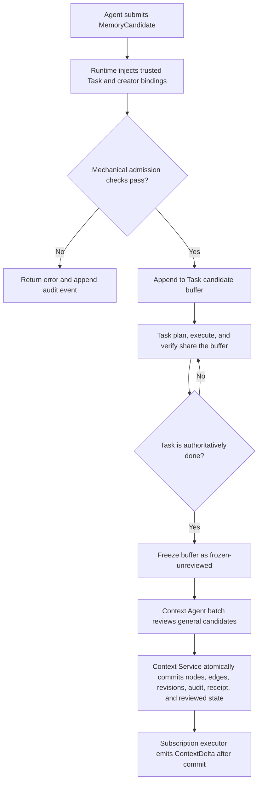

# Context Graph 节点创建与关系模型

版本：v0.1
状态：Draft
定位：定义 Context Graph 在 Agent 创建记忆节点时的写入契约与关键数据结构，重点说明“创建者连续记忆”和“订阅子图推导来源”两类关系。本文不展开检索、切片排序、缓存或 AgentTeams 存储适配。

> 语义以 [统一设计](./threadmill-unified-design.md) 为准，领域术语见 [CONTEXT.md](./CONTEXT.md)。本文同时承载 Context Graph 的核心结构、创建快照、自动连边规则、Task 定向投影与对外接口，并是 **Context Graph 对象字段、Task 扩展字段与对外接口的权威定义**：核心对象（§3）、Task 定向投影对象（§8.2、§8.3）与对外接口及请求/响应字段（§6）以本文为准，其他文档只引用、不得另立同名结构、第二套字段或重复接口定义——同名 Context 对象严格使用本文权威字段，逐字段一致，不存在"最小版/完整版"双层字段模型。持久层/审计元数据（版本、时间戳、置信度、权重、scope 等）属于独立记录，不是这些对象的字段。

---

## 1. 设计判断

每个记忆节点都由一次 Agent Invocation 提交的 `MemoryCandidate` 触发创建。创建时系统掌握两组上下文：

1. **创建者自己的近期记忆**：该 Agent 身份此前创建的、可能不属于任何 Context Subgraph 的节点；
2. **创建时订阅的子图**：该 Invocation 当前有效且有权限读取的 Context Subgraph。

因此新节点准入时默认建立两类关系：

```text
同一 Agent 最近创建的节点
  -> logical_adjacent
  -> 新节点

创建时订阅的 Context Subgraph
  -> derives_from_subgraph
  -> 新节点
```

两类关系语义不同：

- `logical_adjacent` 表示创建者记忆流中的强邻近关系，即最近创建的节点与新节点联系最紧密；它不等于因果证明或事实支持。
- `derives_from_subgraph` 表示新节点是在订阅该子图、可见其内容的上下文中产生，因此可以从该子图推出或受其启发；它不等于节点属于该子图。
- 节点可在创建时不属于任何子图。`SubgraphIDs` 为空是合法状态，不妨碍通过创建者关系被后续召回。
- 普通 Agent 提交的候选进入当前 Task 的 append-only 候选缓冲。该缓冲对同一 Task 的 `plan / execute / verify` 三阶段只读可见，但不属于 Context Graph：不可经 ListSubgraphs/Explore/Search/Subscribe 访问，不参与图 revision、子图订阅或 ContextDelta。Task 达到权威 `done` 后由 Task Manager 冻结缓冲，Context Agent 批量裁决 general 候选，Context Service 原子落图。候选只能建议 general 目标；task 子图写入只有 `TaskContextWriter` 一条路径。

## 2. 所有权与边界

| 状态或决定 | Owner | 说明 |
| --- | --- | --- |
| Candidate 内容 | 创建 Agent | 陈述、类型、证据与 general 归属建议（`MemoryCandidate` 四字段，§3.3） |
| 候选缓冲 | Context Service | 每个 Task 一份 append-only 缓冲；同一 Task 的 plan/execute/verify 经 `TaskMemoryBufferReader` 只读，跨 Task 不可见；记录不是 ContextNode，不进入图读接口或订阅 |
| 当前订阅快照 | Context Service | 从有效 Invocation 订阅中读取，不信任 Agent 自报 |
| 创建者近期节点索引 | Context Graph Store | 按稳定 Agent identity 查询最近创建的可见节点 |
| 候选入口机械校验（Hard Gate） | Context Service | 同步、无 LLM：字段结构合法；`Statement` 非空；`Kind` 只能是 directive/fact/hypothesis；`SourceRefs` 非空且调用者可读；不含密钥或越权内容；`SubgraphIDs` 只含调用者可写的 general 子图。失败返回 error、记录 `MemoryCandidateRejected`，不进入缓冲 |
| 缓冲冻结与审查触发 | Task Manager | 按 DeliveryPolicy 得出权威 `done` 后经 `TaskMemoryFinalizer.FinalizeTaskMemory` 冻结 Task 缓冲并触发审查；canceled/failed/reopened 不触发 |
| `general` 语义/归属裁决 | Context Agent | 只裁决冻结批次中 general 候选的 create/revise/supersede/dispute/reject；落图由 Context Service 执行 |
| Search 检索 | Context Service（Graph 操作面） | `ContextGraphSearcher.Search` 是按 `Keywords` / `Scope` / `AnchorRefs` 显式字段的机械确定性匹配，不调用 Context Agent、不用 LLM 语义判断；唯一调用方是 Context Agent（§6.1） |
| 列表 / 探索 / 订阅 | Context Service（Graph 操作面） | `ListSubgraphs` / `Explore` / `Subscribe` 由 Context Service 直接处理，不调用 Context Agent；普通 Agent 的 `ContextGraphReader` 不含 Search |
| Context Agent 自然语言检索 | 独立模块接口（本文不定义） | Phase Agent 如需自然语言检索，经独立工具 `contextAgent.retrieve(...)` 呈现，不属于 `ContextGraphReader`；Context Agent 内部把自然语言请求转换为 `Keywords` / `Scope` / `AnchorRefs` 后经 `ContextGraphSearcher.Search` 机械查图。其请求/响应字段不由本文定义 |
| 持久化 mutation | Context Service | 唯一执行节点/边/子图写入的落点；Context Agent、Task Manager 都不直接写图 |
| 自动边生成 | 写入事务 | 根据受信创建快照生成；与节点原子提交 |
| 主动推送 | Context Graph 内部订阅执行器 | 节点/边事务提交并递增受影响 subgraph revision 后，由 Context Graph 主动触发自身订阅执行器，匹配已存在订阅并生成 ContextDelta；Runtime 只负责送达活动 Invocation；不是 Context Agent 推送，也不是 Agent 拉取；主动仅限已订阅子图，订阅之外无旁路；候选缓冲不触发推送 |

这里的“Agent identity”是可跨 Invocation 稳定识别创建者的逻辑身份，不是 Session、worker 或模型进程。具体身份来源与生命周期由 Runtime/AgentTeams 集成研究决定。

## 3. 核心数据结构

本节六个对象（`ContextNode`、`NodeCreationContext`、`MemoryCandidate`、`CandidateBufferRecord`、`ContextEdge`、`ContextSubgraph`）的字段集是**对象字段权威**：同名对象的字段以本节为准，统一设计（§9.2、§12.1）及其他文档只能逐字段一致地引用，不得扩展或重定义本节字段，不存在"最小版/完整版"双层字段模型。持久层/审计元数据（版本、时间戳、置信度、权重、scope、有效期等）属于独立记录，不是这些对象的字段。Task 定向投影对象见 §8.2、§8.3。

### 3.1 节点

```go
// ContextNode 字段全集：与统一设计 §9.2 逐字段一致。
// 持久层/审计元数据（版本、时间戳、置信度、权重等）属于独立记录，不进入本结构。
type ContextNode struct {
    ID             string   `json:"id"`               // 节点 ID
    Kind           string   `json:"kind"`             // directive | fact | hypothesis，与子图归属无关
    Statement      string   `json:"statement"`        // 知识陈述
    Status         string   `json:"status"`           // accepted | disputed | superseded | outdated；候选裁决前只在 Event Log，不是 ContextNode
    SubgraphIDs    []string `json:"subgraph_ids"`     // 归属子图，可为空；候选经 done 后审查落图时一次写全
    SourceRefs     []string `json:"source_refs"`      // 证据引用
    CreatorAgentID string   `json:"creator_agent_id"` // 创建者；每个节点必须可追溯到创建者（见 §10 不变量 1）
}
```

本节字段集即 `ContextNode` 的权威字段全集：创建者、正式子图归属、证据和状态。持久层/审计元数据（版本、时间戳、置信度、重要性、敏感性、有效期、scope 等）属于独立记录，不进入 `ContextNode` 字段；`CreatorAgentID` 保证每个节点可追溯到创建者（§10 不变量 1）。

持久层对节点自身的版本标注（乐观并发/审计）是独立记录，与事务 revision 不冲突：前者由持久层在写入时作为独立记录附加，不进入 `ContextNode` 字段；事务中的 graph/subgraph revision 是提交后递增的计数器（§5），由提交事务产生。两者语义不同、各自维护，不存在双重计数或覆盖。

### 3.2 创建快照

```go
// Context Service 生成，Agent 不可修改。
type NodeCreationContext struct {
    CreatorAgentID         string   `json:"creator_agent_id"`          // 创建者
    PreviousNodeID         string   `json:"previous_node_id"`          // 最近节点，可为空
    SubscribedSubgraphIDs  []string `json:"subscribed_subgraph_ids"`   // 当时订阅的子图
}
```

快照只回答自动连边需要的两个问题：前一个节点是谁、当时订阅了哪些子图。快照在候选入缓冲时由 Context Service 捕获并存入缓冲记录（§3.3），审查落图时使用；Agent 不可修改。订阅来源、revision、权限与时间继续由现有 `ContextSubscription`（§6.1）和 Event Log 保存，不复制到新结构。

### 3.3 Candidate 提交与缓冲记录

```go
type MemoryCandidate struct {
    Statement   string   `json:"statement"`    // 知识陈述
    Kind        string   `json:"kind"`         // directive | fact | hypothesis，与目标子图无关
    SourceRefs  []string `json:"source_refs"`  // 证据引用
    SubgraphIDs []string `json:"subgraph_ids"` // 建议归属的 general 子图，可为空；不允许 task 子图
}

// 缓冲记录属于 Task 工作记忆，不是 ContextNode；仅经 TaskMemoryBufferReader 对同 Task 三阶段只读可见。
type CandidateBufferRecord struct {
    CandidateID     string              // 缓冲记录 ID，随 CandidateBufferedReceipt 返回
    TaskID          string              // Runtime 注入
    Candidate        MemoryCandidate     // Agent 提交
    CreationContext NodeCreationContext // 系统捕获（§3.2），Agent 不可修改
}
```

`MemoryCandidate` 四字段以本节为权威，统一设计 §12.1 与其逐字段一致，不再提供扩展字段补充；`ClientRef`、`WhyReusable`、`Scope`、`RelatedNodeIDs`、`ProposedEdges`、`ValidityScope`、`Confidence` 等扩展字段不进入核心契约，幂等键、复用评分、有效期及显式扩展边等在出现真实需求前不引入。

候选只能建议 general 目标：含 task 子图的候选在硬门槛被拒（§5、§9）；task 子图写入只有 `TaskContextWriter`（§6.5）一条路径。每个 Task 只有一份 append-only 缓冲，由该 Task 的 `plan / execute / verify` 三阶段共享；它不是 ContextNode，不参与 ListSubgraphs/Explore/Search/Subscribe、graph revision 或订阅推送。权威 `done` 后冻结并终审（§6.4）。

`Kind` 全局统一为 `directive` | `fact` | `hypothesis`，与子图归属无关；一个节点可同时属于多个子图，不发生类型冲突：

- `directive`：规范性陈述，定义必须/应当/期望做什么；包括用户 Requirement、稳定偏好，以及 Task Manager 已写入 Coordination Graph 的 Task Contract、DeliverySpec、ReportSpec 的上下文投影。硬约束、软偏好与任务契约通过字段或来源引用区分，不再用 Kind 区分。
- `fact`：已经成立、发生或经相应验收边界接受的描述性陈述；包括 completed/accepted PhaseOutput、交付物、报告、验证证据的投影。必须带权威来源引用。
- `hypothesis`：尚待证据验证的描述性推测；不得承载任务或用户要求。

不保存“正在做什么”或当前任务状态；它们由 Coordination Graph、Workspace 和 Runtime 持有。

### 3.4 边

```go
type ContextEdge struct {
    FromRef  string `json:"from_ref"`   // 如 node:n1、subgraph:s1
    ToNodeID string `json:"to_node_id"` // 目标节点
    Kind     string `json:"kind"`       // logical_adjacent | derives_from_subgraph
}
```

`FromRef` 用带类型前缀的引用覆盖 node→node 和 subgraph→node，避免为两种边再建多态端点与依据结构。边的创建原因可由节点创建事件和订阅记录重建，不在边上重复存储。

`ContextEdge` 的字段集以本节为权威，统一设计 §9.2 与其逐字段一致，不补 `ID`、`Weight`、`SourceRefs`、`CreatedBy`、`ValidAtRev` 等扩展字段；不得另立 `From` / `To` 等第二套命名。自动边 Kind（`logical_adjacent` | `derives_from_subgraph`）是全集 Kind（统一设计 §9.3）的子集。

### 3.5 子图

```go
type ContextSubgraph struct {
    ID       string `json:"id"`       // 子图 ID
    Name     string `json:"name"`     // 名称
    Summary  string `json:"summary"`  // 简介
    Revision int64  `json:"revision"` // 订阅与 Delta 版本
    Kind     string `json:"kind"`     // general | task
}
```

`Kind` 把子图分为两类：

- `general`：普通子图。所有 Agent 都可提交 `MemoryCandidate`（只建议 general 目标，经硬门槛进入 Task 缓冲）；Task 权威 `done` 后由 Context Agent 对冻结批次批量审查、Context Service 落图。
- `task`：Task 专用子图。只经 `TaskContextWriter`（§6.5）由 Task Manager 投影写入，不经过候选缓冲与 Context Agent 审查。

Task 专用写入仍经过 Runtime/Context Service 的身份、证据、敏感信息、去重、revision 和审计校验；它只跳过 Context Agent 审查。Task 专用子图中的节点仍用统一三类 Kind（`directive` | `fact` | `hypothesis`，见 §8.1），不保存 runnable/blocked 或临时计划；它是便于检索/订阅的投影，不替代 Coordination Graph、Requirement 原件、PhaseOutput 或 Artifact Store。Context Agent 的裁决权限只覆盖冻结批次中 general 候选的语义与归属，不审查 task 投影。

子图不保存 `NodeIDs` 或 `EdgeIDs`：正式归属由 `ContextNode.SubgraphIDs` 表达，推导关系按 `ContextEdge.FromRef = "subgraph:<id>"` 查询，避免双写。

`ContextSubgraph` 的字段集以本节为权威，统一设计 §9.2 与其逐字段一致，不补 `Scope`、`AnchorNodes` 等扩展字段；策展锚点等如需保留属于独立记录，不改变"正式归属以 `ContextNode.SubgraphIDs` 为准"的规则。

## 4. 创建时自动连边

### 4.1 最近创建节点：`logical_adjacent`

写入事务创建新节点 $N$ 时（无论来自候选审查落图还是 task 投影），按 `PreviousNodeID` 指向的同一 `CreatorAgentID` 最近节点 $P$，建立：

```text
P --logical_adjacent--> N
```

规则：

1. 只连最近一个节点，保持“小接口、强语义”。
2. $P$ 可以不属于任何子图；这正是创建者连续记忆链的主要用途。
3. 若 $P$ 已 superseded/outdated、不可见、超出权限或不存在，则跳过，不向更老节点回退。
4. 此边只表示创建时间邻近，不表示结论置信度或事实支持。

### 4.2 订阅子图：`derives_from_subgraph`

对创建快照中的每个有效订阅子图 $S$，建立：

```text
S --derives_from_subgraph--> N
```

含义：节点 $N$ 是 Agent 在订阅并可见 $S$ 的上下文中创建，允许后续查询“哪些记忆由该子图推出或启发”。

规则：

1. 只使用 Candidate 提交时仍有效且有权读取的 `SubscribedSubgraphIDs`。
2. 此边不自动把 $N$ 加入 $S$。`SubgraphIDs` 只由写入事务按 Context Agent 对冻结批次 general 候选的裁决写入（§5）。
3. 此边不等价于 `supports`：订阅表示可见上下文，不证明整个子图支持该陈述。
4. 同一 subgraph→node 关系幂等，不创建重复边。

## 5. 写入事务



准入是**缓冲 + 冻结 + 批量审查 + 原子提交**：

- 缓冲：`SubmitCandidate`（§6.3）先执行入口机械校验（字段、Kind、SourceRefs、权限、敏感信息、general-only 目标），通过后追加到该 Task 缓冲；同 Task 读取语义见 §6.2。
- 冻结：Task Manager 先持久化权威 `done`，再调用 `TaskMemoryFinalizer.FinalizeTaskMemory`（§6.4）。首次冻结为 `frozen-unreviewed`；失败重试同一批次且不改变 done；成功后状态为 `reviewed`。
- 审查：Context Agent 对冻结批次中 general 候选批量裁决 create/revise/supersede/dispute/reject；普通 Agent 的候选不涉及 task 归属。
- 落图：Context Service 按裁决在同一事务创建/修订节点、写 `SubgraphIDs` 与边、递增 graph/subgraph revision、保存逐候选审计事件与审查回执，并把批次标记为 `reviewed`；被拒候选不落图。
- 推送：上述事务成功后，Context Graph 才触发订阅执行器推送 `ContextDelta`。
- 决策与落图分离：Context Agent 的 create/revise/supersede/dispute/reject 是冻结批次 general 候选的语义裁决，持久化 mutation 一律由 Context Service 执行；Task Manager 也不直接访问图存储。

审查落图事务必须原子包含：

- ContextNode create/revision；
- 最近创建节点的 `logical_adjacent` 边（若存在）；
- 所有有效订阅子图的 `derives_from_subgraph` 边；
- 显式 subgraph 归属与其他经批准语义边；
- graph/subgraph revision 递增；
- 逐候选审计事件、`TaskMemoryReviewReceipt` 与批次 `reviewed` 状态。

Task 定向投影（§8.2）在同一事务原子规则上追加：

- Task 创建时由 Context Service 注册唯一 `TaskContextSubgraphBinding{TaskID, SubgraphID}`：`RegisterTaskSubgraph` 只以 `TaskID` 调用，SubgraphID 由 Context Service 确定并返回；Task Manager 不自行推导或选择其他 Task 的 task 子图；
- Task Manager 定向写入时，节点的 `TaskContextRecipient` 绑定（新增/变更/移除，含 `EndpointRefs` 集合）与节点、归属、边、revision、来源引用、审计事件原子提交；
- `ProjectionID`→`SourceRevision` 幂等/修订记录随事务写入：同键同 SourceRevision 幂等返回既有节点，较新 SourceRevision 修订该节点，较旧或不可比较的 revision 拒绝并审计。

任一必需部分失败则整体回滚，不允许"节点存在但接收者、绑定或幂等记录缺失"。`Recipient` 是**绑定元数据**：它不是 `ContextNode` 字段，也不是新的 ContextEdge Kind（自动边 Kind 仍是 §3.4 全集子集）；其物理存储方式（独立绑定表、节点附加表或元数据列）待定（§11）。

## 6. 对外 Interface（外部接口）

本节是 Context Graph 与 Task 工作记忆的对外接口定义权威：六个外部 seam 覆盖 Phase Agent、Task Manager 与架构文档要求的全部 Context 调用；请求/响应最小字段以本节为权威，其他文档只引用，不重复定义同名接口或第二套字段。

每个 seam 调用都带 Runtime 附加的可信调用上下文。`TaskMemoryBufferReader` 从调用上下文取得 TaskID，不接受调用方指定其他 Task；其余身份、权限、预算与 revision 规则同样由 Runtime 注入。

| Seam | 调用方 | 方向 | 方法 |
| --- | --- | --- | --- |
| `ContextGraphReader`（§6.1） | 所有 Agent | 图读 | `ListSubgraphs` / `Explore` / `Subscribe` |
| `ContextGraphSearcher`（§6.1） | 仅 Context Agent | 图读（机械检索） | `Search` → `ContextSearchResult` |
| `TaskMemoryBufferReader`（§6.2） | 同一 Task 的 plan/execute/verify | 工作记忆读 | `ListTaskCandidates` → `TaskMemoryBufferView` |
| `CandidateSubmitter`（§6.3） | 所有 Phase Agent | 工作记忆写 | `SubmitCandidate` → `CandidateBufferedReceipt` |
| `TaskMemoryFinalizer`（§6.4） | 仅 Task Manager | 审查触发 | `FinalizeTaskMemory` → `TaskMemoryReviewReceipt` |
| `TaskContextWriter`（§6.5） | Task Manager | 图写（task 投影） | `RegisterTaskSubgraph` / `ProjectTaskContext` |

seam 路由：`ListSubgraphs` / `Explore` / `Subscribe` 由 Context Service（Graph 操作面）直接处理，不调用 Context Agent；`Search` 同样由 Context Service（Graph 操作面）直接处理、按 `Keywords` / `Scope` / `AnchorRefs` 显式字段机械确定性匹配（§6.1），但经 `ContextGraphSearcher` 只向 Context Agent 暴露，普通 Agent 的 `ContextGraphReader` 不含 Search。Context Agent 的自然语言检索属独立模块接口（如独立工具 `contextAgent.retrieve(...)`），不属于 `ContextGraphReader`，其请求/响应字段不在本文定义。

### 6.1 读 seams：ContextGraphReader 与 ContextGraphSearcher

`ContextGraphReader` 是所有 Agent（Phase Agent、Task Manager 等）共用的读/订阅 seam，只含 `ListSubgraphs` / `Explore` / `Subscribe`，不含 Search。`ContextGraphSearcher` 是 Context Agent 访问 Graph 的底层机械检索 seam，只含 `Search`，唯一调用方是 Context Agent；普通 Agent 的读 surface 看不到 Search。两者都由 Context Service（Graph 操作面）直接处理，不调用 Context Agent；Search 只按显式字段机械匹配，不接受自然语言意图。列表/探索不足时，普通 Agent 只能经独立模块接口 `contextAgent.retrieve(...)` 请求 Context Agent，由 Context Agent 内部把自然语言请求转换为 `Keywords` / `Scope` / `AnchorRefs` 后调用 `ContextGraphSearcher.Search`。

#### 6.1.1 ContextGraphReader：列表 / 探索 / 订阅（所有 Agent）

```go
type ContextGraphReader interface {
    ListSubgraphs(ctx context.Context, req ListSubgraphsRequest) ([]ContextSubgraph, error)
    Explore(ctx context.Context, req ExploreRequest) (ContextSliceDelta, error)
    Subscribe(ctx context.Context, req SubscribeRequest) (ContextSubscription, error)
}
```

- 这是统一设计 §11 与 task-manager-agent §7 的同一读 surface；方法与请求/响应最小字段在本节定义，其他文档不再重复接口或字段定义。调用者：所有 Agent 使用同一读接口（Task Manager 与 Phase Agent 无差异），只含列表、探索与订阅，不含 Search。调用身份、role/purpose、权限、预算与 graph revision 由 Runtime 调用上下文附加。
- 列表、探索与订阅都是权限约束的读/订阅操作，由 Context Service（Graph 操作面）直接处理，不需要 Context Agent 参与。
- 订阅结果 `ContextSubscription` 的字段集以本节为权威；订阅绑定当前 Invocation，随其结束过期，无显式退订接口（§6.6）。
- **主动推送**：节点/边事务提交并递增受影响 subgraph revision 后，Context Graph 主动触发其内部订阅执行器，匹配已存在订阅的子图、事件类型、权限与新鲜度，按 subgraph revision 合并生成 `ContextDelta`；Runtime 只负责把它送达活动 Invocation（`runtime.onContextDelta`，统一设计 §14.2；结构以 phase-agent §5.1 为权威）。`ContextDelta` 是**输出事件**，不是本 seam 的方法；推送不是 Context Agent 行为，也不是 `ContextGraphReader` / `ContextGraphSearcher` 方法，不需要 Agent 轮询拉取；主动仅限已订阅子图，订阅之外无旁路推送。

```go
type ListSubgraphsRequest struct {
    Filter string `json:"filter"` // 可见子图过滤；空 = 全部可见子图
}

// ListSubgraphs 返回可见子图本身（ContextSubgraph，§3.5），不引入投影类型；
// 权限过滤作用于返回集合（隐藏子图不出现），不做字段裁剪。

// ExploreRequest 仅含 AnchorRef 与 Depth；token 预算只存在于 Runtime 调用上下文（§6 开头），不进 request。
type ExploreRequest struct {
    AnchorRef string `json:"anchor_ref"` // 当前切片、frontier 或子图引用；空 = 从当前切片展开
    Depth     int    `json:"depth"`      // 展开深度；默认一跳
}

// ContextSliceDelta 是探索/Search 的增量响应；Frontier 条目复用 §3.4 的引用格式（node:、subgraph:）。
type ContextSliceDelta struct {
    Nodes         []ContextNode `json:"nodes"`          // 展开返回的节点
    Frontier      []string      `json:"frontier"`       // 可继续探索的方向引用
    GraphRevision int64         `json:"graph_revision"` // 响应对应的 graph revision
}

type SubscribeRequest struct {
    SubgraphIDs []string `json:"subgraph_ids"` // 从可见子图列表中选择的子图
    EventKinds  []string `json:"event_kinds"`  // 订阅的事件类型；空 = 全部
}

// 最小持久字段。role、purpose 与来源由 Invocation / Event Log 可重建，不在订阅中复制；
// 生命周期由 ConsumerInvocationID 所指 Invocation 决定，不另存 ExpiresAt。
type ContextSubscription struct {
    ID                   string   `json:"id"`                     // 订阅稳定标识，供审计和 Delta 投递关联
    ConsumerInvocationID string   `json:"consumer_invocation_id"` // 唯一消费者；决定路由与生命周期
    SubgraphIDs          []string `json:"subgraph_ids"`           // 已通过权限过滤的订阅子图集合
    EventKinds           []string `json:"event_kinds"`            // 事件过滤；空表示全部可见变更
    PermissionSnapshot   string   `json:"permission_snapshot"`    // 创建时权限快照；推送时重验，禁止权限扩张
}
```

字段取舍：

- 保留 `ID`：Event Log、Delta 投递与消费需要稳定关联键。
- 保留 `ConsumerInvocationID`：订阅只送达一个活动 Invocation，且随该 Invocation 结束删除。
- 保留 `SubgraphIDs` / `EventKinds`：它们分别定义匹配范围和事件过滤条件。
- 保留 `PermissionSnapshot`：避免订阅创建后因权限变化泄露内容；推送时同时校验快照与当前权限的交集。
- 删除 `Role` / `Purpose`：可从 `ConsumerInvocationID` 对应的 Runtime 记录重建，匹配和投递不使用。
- 删除 `Source`：`initial_slice / search / explicit` 只用于审计，由 `ContextSubscriptionCreated` 事件记录。
- 删除 `ExpiresAt`：订阅严格与 Invocation 同寿命，Runtime 的结束事件是唯一失效依据；不再维护第二个时钟。

#### 6.1.2 ContextGraphSearcher：机械检索 seam（仅 Context Agent）

```go
type ContextGraphSearcher interface {
    Search(ctx context.Context, req SearchRequest) (ContextSearchResult, error)
}
```

- **唯一调用方是 Context Agent**：Phase Agent、Task Manager 等普通 Agent 的 `ContextGraphReader` 不含 Search，不能直接调用；列表/探索不足时只能经独立工具 `contextAgent.retrieve(...)` 请求 Context Agent。Context Agent 在响应自然语言检索请求时，内部把自然语言请求转换为 `Keywords` / `Scope` / `AnchorRefs`，再经 `ContextGraphSearcher.Search` 机械查图；它是 Context Agent 访问 Graph 的底层机械检索 seam，不是普通 Agent 工具。
- `Search` 是**机械确定性匹配**：只按 `Keywords` / `Scope` / `AnchorRefs` 显式字段匹配可见图（不接受 Intent、ReasoningAnchor 或自然语言意图，不用 LLM 语义判断，不调用 Context Agent），由 Context Service（Graph 操作面）直接处理，返回命中切片与 `MatchedKeywords`。
- **自动订阅绑定原始请求方**：Search 命中子图后建立的自动订阅（`SubscriptionIDs`）绑定发起检索的原始请求方 Invocation（即经 `contextAgent.retrieve(...)` 提出检索请求的那个 Agent 的 Invocation），而不是 Context Agent 自己的 Invocation。可信 consumer binding 由 Runtime 在 Context Agent 调用 `Search` 时附加（调用上下文），不放入 `SearchRequest`，也不接受调用方自报。Search 失败不创建订阅。

```go
// SearchRequest 只含显式字段 Keywords / Scope / AnchorRefs；不接受 Intent、ReasoningAnchor 或自然语言意图。
// Search 是 Context Service（Graph 操作面）的机械确定性匹配：不调用 Context Agent、不用 LLM 语义判断。
// consumer binding 由 Runtime 调用上下文附加，不进 request。
type SearchRequest struct {
    Keywords   []string `json:"keywords"`    // 关键词匹配；空 = 不按关键词过滤
    Scope      []string `json:"scope"`       // 限定范围（子图、模块、symbol 等）；空 = 全部可见范围
    AnchorRefs []string `json:"anchor_refs"` // 锚点引用（node:、subgraph:）；空 = 不从锚点出发
}

type ContextSearchResult struct {
    Slice           ContextSliceDelta `json:"slice"`            // 匹配结果切片
    MatchedKeywords []string          `json:"matched_keywords"` // 实际命中的关键词
    SubscriptionIDs []string          `json:"subscription_ids"` // 结果所含子图自动建立的订阅（绑定原始请求方 Invocation，§6.1.2）
}
```

错误/拒绝语义：权限隐藏内容只返回数量与可见部分，不泄露摘要、路径或存在性（§9）；调用方基于响应中的 `GraphRevision` 与自身切片修订对齐，过期后应基于新 revision 重新切片（统一设计 §10）。

### 6.2 TaskMemoryBufferReader：Task 内工作记忆读 seam

```go
type TaskMemoryBufferReader interface {
    ListTaskCandidates(ctx context.Context) (TaskMemoryBufferView, error)
}

type TaskMemoryCandidateView struct {
    CandidateID string          `json:"candidate_id"`
    Candidate   MemoryCandidate `json:"candidate"`
}

type TaskMemoryBufferView struct {
    Candidates []TaskMemoryCandidateView `json:"candidates"`
}
```

- TaskID 只取自 Runtime 调用上下文；调用方不能指定或读取其他 Task。
- 同一 Task 的 `plan / execute / verify` 读取同一 append-only 缓冲。后阶段可见前阶段候选；同一阶段可在提交后重新读取。
- 返回值只含通过硬门槛的候选内容与 `CandidateID`，不暴露 `CreationContext`、审计状态或其他 Invocation 身份。
- 这是工作记忆读取，不是 Graph 读取：不调用 Context Agent，不改变 graph revision，不建立订阅，不生成 ContextDelta，也不把候选伪装成 ContextNode。

### 6.3 CandidateSubmitter：候选写 seam

```go
type CandidateSubmitter interface {
    SubmitCandidate(ctx context.Context, candidate MemoryCandidate) (CandidateBufferedReceipt, error)
}

type CandidateBufferedReceipt struct {
    CandidateID string `json:"candidate_id"` // 缓冲记录 ID，随该 Task 的缓冲记录保存
}
```

- 调用者：所有 Agent（普通 Agent 只提交候选）。Phase Agent 的 MCP 工具 `agent.submitMemoryCandidate` 只是本 seam 的 adapter；候选结构与字段权威在 §3.3，接口层不另立字段。
- Runtime 在 seam 前附加受信 TaskID/InvocationID/CreatorAgentID，形成候选缓冲记录（§3.3）；Agent 不能自报或修改（§10 不变量 2）。
- **只缓冲，不裁决**：`SubmitCandidate` 只执行入口机械校验并追加缓冲。校验不调用 LLM，也不判断候选是否“值得长期记住”；失败返回 error 并记 `MemoryCandidateRejected`，成功返回 `CandidateID`。价值判断留到 Task done 后的 Context Agent 终审。
- **幂等**：重复候选不重复入缓冲（§9）；落图在 §5 事务中原子执行。

### 6.4 TaskMemoryFinalizer：候选审查触发 seam（仅 Task Manager）

```go
type TaskMemoryFinalizer interface {
    FinalizeTaskMemory(ctx context.Context, taskID string) (TaskMemoryReviewReceipt, error)
}

type TaskMemoryReviewReceipt struct {
    AuditRef string `json:"audit_ref"` // 本次批量审查的审计入口；逐候选结论从 Event Log 读取
}
```

- 调用者：仅 Task Manager；不向普通 Agent 暴露，普通 Agent 无法触发审查。
- 触发时机：Task Manager 先按 DeliveryPolicy 持久化权威 `done`，再显式调用；本 hook 的失败不改变 Task 的 `done`。canceled/failed/reopened 不触发审查。
- 冻结与重试：首次调用原子冻结缓冲为 `frozen-unreviewed` 并禁止追加；审查或落图失败时返回 error，重试继续处理同一冻结批次，不重新收集候选。
- 完成与幂等：Context Agent 批量裁决 general 候选，Context Service 按 §5 原子落图、保存逐候选审计事件和 `TaskMemoryReviewReceipt`，再将批次标为 `reviewed`。之后同一 TaskID 的调用返回同一回执，不重复审查或落图；Event Log 记 `CandidateBufferFrozen`、`CandidateReviewAccepted` / `CandidateReviewRejected`。

### 6.5 TaskContextWriter：受控写 seam

```go
type TaskContextWriter interface {
    RegisterTaskSubgraph(ctx context.Context, taskID string) (TaskContextSubgraphBinding, error)
    ProjectTaskContext(ctx context.Context, projection TaskContextProjection) (ContextNodeRef, error)
}
```

- 调用者：Runtime 授权的 Task Manager，经 Runtime 受控写路径；不向普通 Agent 暴露。`TaskContextSubgraphBinding` / `TaskContextProjection` / `ContextNodeRef` 的字段权威在 §8.2，本节只定义 seam。
- `RegisterTaskSubgraph` 是 **Task 创建后的显式组合调用**：Task Manager 创建 Task 后、首次投影前以 `TaskID` 显式调用，Context Service 校验 `TaskID` 已存在于 Coordination Graph、确定 `SubgraphID` 并返回注册的唯一 `TaskContextSubgraphBinding{TaskID, SubgraphID}`（§8.2、§10 不变量 13）。调用方只传 `TaskID`，不传入也不自行推导 SubgraphID；同 TaskID 重复注册幂等返回同一绑定。显式注册避免隐藏注册：不存在"写 Coordination Graph 时隐式建子图"的副作用。
- `ProjectTaskContext` 负责定向投影：按 `ProjectionID` + `SourceRevision` 幂等/修订（同键同 SourceRevision 返回既有节点，较新修订该节点，较旧或不可比较拒绝并审计，§10 不变量 17）；`Recipients` 规则与原子提交见 §8.2、§5。

### 6.6 不提供的接口

明确不提供以下接口与机制：

- **管理型 CRUD**：不提供 `GetNode` / `CreateNode` / `UpdateNode` / `DeleteNode` / `ListNodes`、子图管理 CRUD、`Unsubscribe`、`Push`、`QueryRawGraph`、SearchJob、mailbox / Notification 等接口。
- **无公开启动装配 seam**：初始 Context Slice 由 Context Service 在 Runtime 启动 endpoint 时作为内部启动步骤装配（§8.3），不提供 `StartContextAssembler` / `AssembleInitialSlice` 等公开接口或 request 类型。
- **Search 不可见于普通 Agent**：`Search` 不属于 `ContextGraphReader`，Phase Agent、Task Manager 等普通 Agent 的读 surface 只含 `ListSubgraphs` / `Explore` / `Subscribe`；`ContextGraphSearcher` 仅向 Context Agent 暴露，普通 Agent 不能直接查图，列表/探索不足时只能经独立工具 `contextAgent.retrieve(...)` 请求 Context Agent（§6.1.2）。
- 节点与边只能经两条写路径产生：`general` 候选在 Task 权威 `done` 后终审落图，`task` 投影经 Task Manager 授权路径写入。`TaskMemoryBufferReader` 只读取当前 Task 的工作记忆，不创建节点或边，也不把候选接入 ListSubgraphs/Explore/Search/Subscribe。
- 无订阅外旁路推送：`ContextDelta` 只能由已存在的订阅触发（§6.1）；订阅随 Invocation 结束过期，无显式退订接口。
- **分页、排序 DSL、缓存控制**：不设计分页游标、排序表达式或缓存控制字段；响应按 token 预算与可见性裁剪，`Frontier` 表达继续探索方向。
- **物理存储**：节点、边、Recipient bindings、候选缓冲记录、订阅与审计的物理存储方式不在本节设计（§11 待定项）。
- 每次读调用不创建持久 SearchJob：`Explore` / `Search` 是即时受控响应，与 Invocation 绑定（统一设计 §11）。

## 7. 查询、Task 工作记忆与订阅影响

- **Task 工作记忆**：`TaskMemoryBufferReader` 返回当前 Task 缓冲的 append-only 快照；不走图查询，不建立订阅。每次 Phase Invocation 启动时，Context Service 把当前快照引用写入 `StartPhaseInput.TaskMemoryBufferRef`；运行中追加候选后可再次读取。
- **按创建者召回**：创建者链只召回已落图节点；缓冲候选不参与。
- **按子图推导召回**：Explore/Search 只召回已落图节点；缓冲候选不参与。
- **主动推送**：缓冲追加不改变 graph revision，也不产生 ContextDelta；只有审查落图或 task 投影提交后才触发子图订阅推送。
- **孤立节点治理**：没有 `SubgraphIDs` 且没有订阅来源的已落图节点仍可通过创建者链和 Search 找到。

## 8. Task 启动信息与 Manager 决定的归属

Phase Agent 启动时的任务要求不从 Context Graph 拼装，也不由 Task Manager 临时发送自由文本。权威来源是 Task Manager 已写入 Coordination Graph 的结构化契约：

```text
Task Manager
  -> Coordination Graph：Task Contract + DeliverySpec + ReportSpec + 入边
  -> Scheduler 选择 runnable endpoint
  -> Runtime 投影为 StartPhaseInput
  -> Phase Agent
```

`StartPhaseInput` 中：

- `ContractRef` 指向 Task Contract、DeliverySpec 和 ReportSpec，回答“做什么、为什么、怎样算完成”；
- `PhaseInputSet` 投影入边，回答“谁要交付什么、哪些已到达、哪些仍需等待”；
- `ContextSliceRef` 只补充相关的 `directive` | `fact` | `hypothesis` 上下文投影（含 Context Service 按 TaskID + EndpointRef 确定性装配的定向 task 节点，见 §8.2、§8.3），不定义任务要求。

因此，所有入边相连的 Agent 都通过同一套 `ContractRef + PhaseInputSet` 得到任务，而不是通过 Context Graph 猜测 Manager 的编排意图。定向 task 节点由 **Context Service** 装配：Context Service 基于 Recipient bindings 的确定性匹配（§8.3）把节点并入 `ContextSliceRef`，Phase Agent 不感知 Recipient bindings，也不执行二次匹配；Phase Agent 的 `StartPhaseInput` interface 不变。

Task Manager 的决定按语义分流：

| 决定或已生效内容 | 权威存放位置 |
| --- | --- |
| 创建 Task、连边、阻塞、串并、阶段要求、是否完成 | Coordination Graph |
| Task Manager 已写入 Coordination Graph 的 Task Contract 与 endpoint DeliverySpec/ReportSpec | `task` 子图 `directive`（投影，引用 `ContractRef`） |
| 已被相应验收边界接受/验证的 PhaseOutput、交付物、报告与证据 | `task` 子图 `fact`（投影，权威载荷仍在 Artifact Store/PhaseOutput） |
| 用户或 agent 提交的原始目标、约束与验收意图（含 provenance） | `task` 子图 `directive`（投影，引用 Requirement 原件）；稳定风格取舍属于 `directive` 的软约束 |
| 其他可复用事实、偏好或假设 | 入 Task 缓冲，Task 权威 `done` 后经 Context Agent 批量裁决、Context Service 落图（仅 general 目标）；task 投影只经 `TaskContextWriter` |
| 当前正在做什么、临时状态、runnable/blocked | 不进入 Context Graph |

Manager 不应把每次编排决定复制进 Context Graph。只有已经写入权威来源（Coordination Graph、Requirement 原件、Artifact Store/PhaseOutput）的内容才允许投影进 `task` 子图；`task` 子图是便于检索与订阅的投影，不替代这些权威业务对象。三类 Kind 的精确映射见 §8.1。

### 8.1 节点 Kind 与投影映射

所有 ContextNode 全局统一使用三类 Kind，与 Subgraph.Kind（`general` | `task`）正交；一个节点可同时属于多个子图，不发生类型冲突。task 子图只接受 Task Manager 写入，但其中的节点同样使用统一三类 Kind：

| Kind | 定义 | 权威来源 | 投影边界 |
| --- | --- | --- | --- |
| `directive` | 规范性陈述，定义必须/应当/期望做什么；包括用户 Requirement、稳定偏好，以及 Task Manager 已写入 Coordination Graph 的 Task Contract 与 endpoint DeliverySpec/ReportSpec 的上下文投影 | Coordination Graph / Requirement 原件 | 节点必须引用来源（如 `ContractRef` 或 Requirement 引用），不复制易变的 runnable/blocked 状态；硬约束、软偏好与任务契约通过字段或来源引用区分 |
| `fact` | 已经成立、发生或经相应验收边界接受/验证的描述性陈述；包括 completed/accepted PhaseOutput、交付物、报告和证据的上下文投影 | Artifact Store / PhaseOutput | 权威载荷仍存原处，节点只投影结论与引用，必须带权威来源引用 |
| `hypothesis` | 尚待证据验证的描述性推测 | 无（待验证） | 不得承载任务或用户要求；待验证后按证据升级为 `fact` 或 `directive` |

约束：

- Kind 与子图正交：`directive` | `fact` | `hypothesis` 可出现在 general 与 task 子图；同一节点可同时属于多个子图，不发生类型冲突。
- 稳定偏好是 `directive` 的软约束（通过来源/字段与硬约束、任务契约区分），不是独立 Kind。
- `task` 子图是便于检索/订阅的投影，不替代 Coordination Graph、Requirement 原件、PhaseOutput 或 Artifact Store。

### 8.2 Task 定向投影权威对象

Task 定向投影的字段集以本节为**权威**；其他文档只引用本节结构，不得重复定义。`PhaseEndpointRef` 唯一定义在 [task-graph.md §3.1](./task-graph.md)（至少含 `TaskID`、`EndpointID`），本文只引用。

```go
// 每个 Task 创建时由 Context Service 注册的唯一绑定；Task Manager 不自行推导或选择其他 Task 的 task 子图。
type TaskContextSubgraphBinding struct {
    TaskID     string `json:"task_id"`      // 稳定 Task 身份，必须引用 Coordination Graph 中已存在的 Task
    SubgraphID string `json:"subgraph_id"`  // 该 Task 专属的 task 子图
}

// 稳定编排接收者；投递元数据，不是 Node Kind，也不是新图节点。
type TaskContextRecipient struct {
    TaskID       string             `json:"task_id"`        // 必填
    EndpointRefs []PhaseEndpointRef `json:"endpoint_refs"`  // 可空：空表示该 Task 的全部当前及后续 endpoint
}

// ContextNodeRef 是 ContextNode.ID 的稳定别名，供写入接口返回创建的节点。
type ContextNodeRef = string

type TaskContextProjection struct {
    ProjectionID  string                 `json:"projection_id"`   // 稳定幂等键；同键较新 SourceRevision 修订既有节点
    SourceRevision string                `json:"source_revision"` // 权威来源 revision，用于过期与顺序校验
    Statement     string                 `json:"statement"`
    Kind          string                 `json:"kind"` // directive | fact | hypothesis
    SourceRefs    []string               `json:"source_refs"`
    SubgraphIDs   []string               `json:"subgraph_ids"` // 必须与 Recipients 的 TaskID 绑定一致
    Recipients    []TaskContextRecipient `json:"recipients"`   // 必填，至少一个
}
```

`Recipients` 规则：

1. 至少包含一个接收者；`task` 子图不接受没有接收者的 Task Manager 投影。
2. `TaskID` 必填，必须引用 Coordination Graph 中已存在的 Task，且等于已注册 `TaskContextSubgraphBinding`（由 `RegisterTaskSubgraph` 返回）的 TaskID；Task Manager 不自行推导或选择其他 Task 的 task 子图。
3. `EndpointRefs` 为空表示写给该 Task 的全部当前及后续 endpoint；非空表示只写给列出的 endpoint。
4. 每个 EndpointRef 必须属于同一 binding 的 TaskID；不存在、跨 Task 或已永久删除的 endpoint 使整个写入失败。
5. `SubgraphIDs` 中每个 `task` 子图必须等于至少一个 Recipient.TaskID 的已注册绑定；反之，每个 Recipient.TaskID 的绑定必须出现在 `SubgraphIDs`。不一致则整体拒绝，避免跨 Task 可见性泄漏。
6. 接收者不能使用 Agent ID、role、模型、worker、session 或 Invocation ID。
7. 多接收者表示同一节点可被多个 Task/endpoint 自动装配；Context Service 负责去重。
8. 接收者变更与节点创建/修订、子图 revision、来源引用和审计事件原子提交（§5）。

`ProjectionID` 由 Task Manager 在首次投影时生成并在同一语义投影的后续 revision 中复用。Context Service 以 `ProjectionID` 为幂等/修订键：相同 ID 与相同 SourceRevision 返回既有节点；较新的 SourceRevision 修订该节点；较旧或不可比较的 revision 拒绝并审计。禁止按 Statement 文本猜测重复项。

`Recipient` 是**绑定元数据**：它不进入 `ContextNode` 字段集，也不是新的 ContextEdge Kind（自动边 Kind 仍是 §3.4 全集子集）。物理存储方式（独立绑定表、节点附加表或元数据列）待定（§11）。

### 8.3 定向装配与确定性匹配

定向 task 节点与 Task 候选缓冲由 **Context Service** 在启动时分别装配：前者进入 `ContextSliceRef`，后者生成 `TaskMemoryBufferRef`。Runtime 只提供已有 start binding（`InvocationID / TaskID / EndpointRef`）；Context Service 按 TaskID 读取当前缓冲，不接受 Agent 自报 TaskID。两者都是内部启动步骤，不新增公开 assembler seam，也不能覆盖 `ContractRef / Inputs`。

确定性 match：对待启动 endpoint `E`：

```text
match(node, E) =
  node 属于可见 task 子图
  AND node.status 可用于初始切片
  AND 存在 recipient：
      recipient.TaskID == E.TaskID
      AND (
        recipient.EndpointRefs 为空
        OR E.EndpointRef 属于 recipient.EndpointRefs
      )
```

装配顺序：

1. 从 Runtime start binding 取得 `InvocationID / TaskID / EndpointRef`。
2. 精确匹配 `task` 子图 Recipient bindings，合并 general 上下文，校验权限与来源 revision。
3. 保存 Context Slice 并为其中子图建立 Invocation 订阅，返回 `ContextSliceRef`。
4. 读取同一 Task 的 append-only 候选缓冲，保存只读 `TaskMemoryBufferView` 快照；缓冲为空也返回有效空快照引用。
5. Runtime 将 `ContextSliceRef` 与 `TaskMemoryBufferRef` 写入 `StartPhaseInput`，再启动 `plan / execute / verify` 中的当前阶段。

`InvocationID` 不参与 Task 缓冲归属；TaskID 是唯一隔离键。`TaskMemoryBufferRef` 不参与 Recipient 匹配、graph revision 或订阅。
`InvocationID` 不参与接收者匹配；匹配键只有稳定的 `TaskID + EndpointRef`。自动匹配失败不能退化成“让 Agent 自己搜索 task 子图”：这会把 Context Service 的确定性责任泄漏到 Phase Agent，并使恢复、替换和重试得到不同输入。

装配失败不启动 Invocation；Runtime 可安全重试同一 start request（§9）。

---

## 9. 冲突、失效与安全

| 情况 | 处理 |
| --- | --- |
| 候选含 `task` 子图目标 | 硬门槛拒绝，返回 error，只留审计；task 写入只有 `TaskContextWriter` 一条路径 |
| 对未权威 done、`frozen-unreviewed` 或 `reviewed` 的 Task 调用 `FinalizeTaskMemory` | 未 done 返回 error 并审计；`frozen-unreviewed` 从同一批次重试；`reviewed` 幂等返回已保存的 `TaskMemoryReviewReceipt` |
| 缓冲冻结后追加候选 | 拒绝并审计；冻结后该 Task 不再接受候选 |
| Task Manager 绕过 general 审查写 general 子图 | 拒绝，只留审计；Task Manager 的图写入只有 `TaskContextWriter`（task 投影）与 `TaskMemoryFinalizer`（审查触发） |
| 最近节点不可见或已过时 | 跳过自动 `logical_adjacent`，不回退遍历整个历史 |
| 订阅在提交前过期 | 不生成 `derives_from_subgraph`；审计记录丢弃原因 |
| 子图在准入期间升版 | 在事务前重验 revision |
| Agent 身份无法稳定解析 | 不创建自动创建者链 |
| Candidate 重复或被拒绝 | 不重复入缓冲；审查拒绝的候选不落图，只留审计 |
| Recipient 引用不存在、跨 Task 或已永久删除的 endpoint | 拒绝 Task Manager 写入，只留审计 |
| `SubgraphIDs` 与 Recipient.TaskID 的绑定不一致 | 整体拒绝，不写部分归属，避免跨 Task 可见性泄漏 |
| ProjectionID 相同但 SourceRevision 较旧或不可比较 | 拒绝并审计；不按 Statement 文本猜测重复项 |
| 匹配节点来源 revision 已过期 | 不装配该节点，记录 stale projection；权威输入仍由 ContractRef/Inputs 提供 |
| 同一节点命中多个 recipient 或属于多个子图 | 按 Node ID 去重，只出现一次 |
| 节点无权对当前 Invocation 可见 | 不装配，不泄露节点或子图存在性 |

权限不允许从边反向泄露隐藏子图：调用者无权读取来源子图时，只能看到节点的可见内容，不返回 Subgraph ID、订阅 ID 或推导路径摘要。

## 10. 最小不变量

1. 每个 ContextNode 都能追溯到 `CreatorAgentID` 和 `SourceRefs`；Invocation 审计由 Event Log 保存，不复制到 `NodeCreationContext`。
2. Agent 不能自报或修改创建上下文（TaskID/InvocationID/CreatorAgentID 由 Runtime 注入）；缓冲记录入 buffer 后不可修改。
3. 新节点最多自动连接一个同创建者最近节点。
4. 创建时每个有效订阅子图产生一条幂等 `derives_from_subgraph` 边。
5. 每个 Task 只有一份 append-only 候选缓冲，由其 plan/execute/verify 三阶段共享并经 `TaskMemoryBufferReader` 只读；跨 Task 不可见。候选不写 Context Graph、不改变 graph revision、不触发订阅推送，且不是 ContextNode。
6. 候选只能建议 general 目标；task 子图写入只有 `TaskContextWriter` 一条路径。
7. Task Manager 必须先按 DeliveryPolicy 持久化权威 `done`，再调用 `FinalizeTaskMemory`；该 hook 失败不改变 `done`。canceled/failed/reopened 不触发。
8. `FinalizeTaskMemory` 首次调用原子冻结为 `frozen-unreviewed`；失败重试同一批次，成功后保存回执并标记 `reviewed`；同一 TaskID 不重复审查或落图。
9. Context Agent 只裁决冻结批次中 general 候选的 create/revise/supersede/dispute/reject；持久化 mutation 只由 Context Service 执行；Task Manager 不直接访问图存储。
10. 自动边、节点、Recipient bindings、归属、graph/subgraph revision 递增、逐候选审计事件、审查回执与 `reviewed` 状态在同一事务原子提交；事务成功后才推送已订阅子图。
11. 普通读操作不能创建节点或语义边。
12. 节点 Kind 与子图正交：general 与 task 子图中的节点都使用 `directive` | `fact` | `hypothesis`，同一节点可属于多个子图，不发生类型冲突。
13. Task 创建时由 Context Service 注册唯一 `TaskContextSubgraphBinding{TaskID, SubgraphID}`；`RegisterTaskSubgraph` 只以 `TaskID` 调用，SubgraphID 由 Context Service 确定并返回，Task Manager 不自行推导或选择其他 Task 的 task 子图。
14. `task` 子图中的每个 Task Manager 投影至少包含一个 Recipient；Recipient 只引用稳定 TaskID/EndpointRef，不引用 Agent、worker、session 或 Invocation。
15. `Recipient` 是绑定元数据：不是 `ContextNode` 字段，也不是新的 ContextEdge Kind。
16. Context Service 只用 TaskID + EndpointRef 确定性匹配定向节点，不依赖 Agent 行为或 embedding；匹配结果装配进既有 `StartPhaseInput.ContextSliceRef`，Phase Agent interface 不变。
17. `ProjectionID` 是幂等/修订键：同键同 SourceRevision 幂等返回，较新 SourceRevision 修订，较旧或不可比较拒绝并审计。
18. `Search` 只经 `ContextGraphSearcher` 暴露给 Context Agent；Phase Agent、Task Manager 等普通 Agent 的 `ContextGraphReader` 不含 Search，列表/探索不足时只能经独立工具 `contextAgent.retrieve(...)` 请求 Context Agent。
19. Search 自动订阅绑定原始请求方 Invocation（由 Runtime 在 Context Agent 调用 `Search` 时附加 consumer binding），不绑定 Context Agent 自己的 Invocation。

## 11. 待定项

- 稳定 `CreatorAgentID` 如何映射 AgentTeams worker、临时 agent、role 与跨 Invocation 身份；
- “最近创建节点”的时间窗口、是否按 project/scope 分区，以及多并发创建时的确定性排序；
- `derives_from_subgraph` 是否提升来源子图 revision、是否默认触发订阅 Delta；
- 一个 Invocation 订阅大量子图时的边数量上限与裁剪策略；
- revise/supersede 既有节点时是否追加新的创建上下文边，还是只更新依据；
- 被拒绝候选的审计事件保留期限与清理策略；候选只存在于缓冲，审查落图前不进入 Context Graph。
- `ContextEndpoint` 的物理存储方式（多态端点、两张边表或统一 ID namespace）；
- `TaskContextRecipient` / `TaskContextProjection` / `TaskContextSubgraphBinding` 的物理存储方式（独立绑定表、节点附加表或元数据列）；`Recipient` 不进入 `ContextNode` 字段。

这些实现选择不改变核心语义：节点由 Agent 候选触发，创建者近期记忆表达最强邻近，创建时有效订阅表达可推导来源，子图归属始终独立判断。
