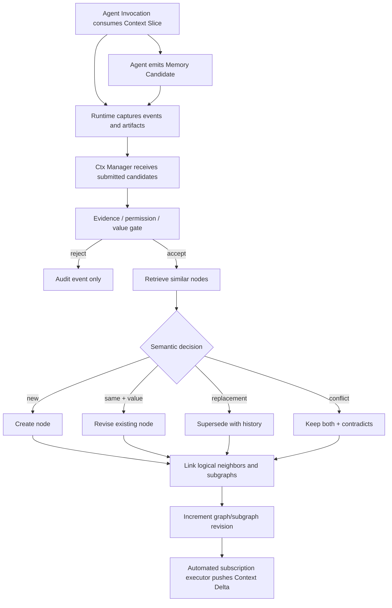

# Context Graph 详细设计

版本：v1.0
状态：Draft
定位：本文描述 Threadmill 的 Context Graph（上下文图）。**语义以 docs/threadmill-unified-design.md 为准**；本文只展开实现细节与 third_party/agentteams 的复用边界。本文取代旧 v0.2 的 ctxlib 设计：不再有 ContextBlock / Context Pack 小内核模型，对外操作不再是 pack / query，而是 ListSubgraphs / Explore / Retrieve / Subscribe 四类读操作与 MemoryCandidate 提交。

---

## 1. 定位与边界

Context Graph 解决的不是"保存更多聊天"，而是：

- 新 Agent 如何获得与当前 Task/phase 相关的知识切片（Context Slice）；
- 新发现如何与已有知识建立逻辑邻接；
- Agent 如何逐步探索（Explore），而非一次注入全库；
- 如何控制记忆准入、近重复、过时、冲突和垃圾；
- 如何在切片和候选准入时整理图，提高后续子图选择的缓存命中率；
- Agent 订阅的 Context Subgraph 更新后，如何安全推送 Context Delta。

三条硬边界（同统一设计 §9.1）：

1. Context Graph 是 **Event Log / Artifact Store 的可追溯投影**，普通 Agent 不能直接创建、修改或删除 Context Node；
2. **Ctx Manager Agent 是唯一写入口**，只通过两个工作点写图：响应检索请求、准入 Memory Candidate；
3. **Ctx Manager 不主动巡图、不主动提示、不执行推送**。列表/探索/检索/订阅是受权限约束的普通读操作；订阅产生 Context Delta 由自动化订阅执行器推送，不建立 Agent mailbox。

Context Graph 不保存未完成工作（那是 Coordination Graph 的事），不保存 Invocation 的过程上下文（那是 Runtime / Workspace 的事）。

---

## 2. 核心对象

### 2.1 ContextNode / ContextEdge / ContextSubgraph

```go
type ContextNode struct {
	ID             string         `json:"id"`
	Kind           string         `json:"kind"` // fact | decision | constraint | failure | pattern | preference | hypothesis
	Statement      string         `json:"statement"`
	Status         string         `json:"status"` // candidate | accepted | disputed | superseded | outdated
	Scope          []string       `json:"scope"`
	SubgraphIDs    []string       `json:"subgraph_ids"`
	SourceRefs     []string       `json:"source_refs"`
	Revision       int64          `json:"revision"`
	ValidFrom      string         `json:"valid_from,omitempty"`
	ValidUntil     string         `json:"valid_until,omitempty"`
	Confidence     float64        `json:"confidence"`
	Importance     float64        `json:"importance"`
	Sensitivity    string         `json:"sensitivity"`
	CreatedAt      time.Time      `json:"created_at"`
	UpdatedAt      time.Time      `json:"updated_at"`
}

type ContextEdge struct {
	ID          string   `json:"id"`
	From        string   `json:"from"`
	To          string   `json:"to"`
	Kind        string   `json:"kind"`
	Weight      float64  `json:"weight"`
	SourceRefs  []string `json:"source_refs"`
	CreatedBy   string   `json:"created_by"` // rule | model | human
	ValidAtRev  string   `json:"valid_at_rev,omitempty"`
}

type ContextSubgraph struct {
	ID          string   `json:"id"`
	Name        string   `json:"name"`
	Summary     string   `json:"summary"`
	Scope       []string `json:"scope"`
	AnchorNodes []string `json:"anchor_nodes"`
	Revision    int64    `json:"revision"`
}
```

Context Subgraph 是**可重叠的逻辑视图，不复制节点**：一个节点可以同时属于 API、模块、架构决定、某 Task 系列等多个子图。节点/边的 revision 变化必须原子地提升所属子图的 revision（见 §7.2）。

### 2.2 边类型

MVP 至少支持（同统一设计 §9.3）：

| Edge Kind | 含义 |
| --- | --- |
| `logical_adjacent` | 两个记忆点在当前推理链上逻辑相邻，后者是前者自然的下一步上下文 |
| `supports` | source evidence/结论支持 target |
| `contradicts` | 两节点不能同时作为当前事实使用 |
| `supersedes` | 新 revision 替代旧节点，但保留历史 |
| `derived_from` | 节点由另一节点或证据推导 |
| `belongs_to_subgraph` | 节点归属某逻辑子图 |
| `depends_on_fact` | 一个结论成立需要另一个事实 |
| `example_of` | 具体案例说明抽象规则 |

边必须有来源和置信度。**Embedding 相似只用于召回候选，不能单独建立 `supports`、`contradicts`、`supersedes` 或高权重 `logical_adjacent` 等语义边。**

---

## 3. Context Slice：Agent Invocation 的初始上下文

每个 Agent Invocation 创建前，Context service 按调用者的 role、purpose 和权限生成初始切片。phase agent、Task Manager、verifier 等使用同一机制；Ctx Manager 不参与逐次切片选择（§10、§11）。

```go
type ContextSliceRequest struct {
	TaskID          string   `json:"task_id,omitempty"`
	TaskContractRef string   `json:"task_contract_ref,omitempty"`
	AttemptID       string   `json:"attempt_id,omitempty"`
	Phase           string   `json:"phase,omitempty"`
	Role            string   `json:"role"`
	Purpose         string   `json:"purpose"`
	InputRevision   string   `json:"input_revision"`
	WorkspaceID     string   `json:"workspace_id,omitempty"`
	PermissionScope []string `json:"permission_scope"`
	SeedSubgraphs   []string `json:"seed_subgraphs,omitempty"`
	TokenBudget     int      `json:"token_budget"`
}

type ContextSlice struct {
	ID              string              `json:"id"`
	Binding         ContextSliceRequest `json:"binding"`
	SubgraphSummary []SubgraphSummary   `json:"subgraph_summary"`
	Nodes           []ContextNode       `json:"nodes"`
	Frontier        []ContextFrontier   `json:"frontier"`
	Omitted         []string            `json:"omitted"`
	Conflicts       []ContextConflict   `json:"conflicts"`
	GraphRevision   int64               `json:"graph_revision"`
}
```

选择顺序（同统一设计 §10）：

1. 在任何相关性计算前应用权限和敏感性过滤；
2. 以调用目的、Task Contract、phase、Workspace revision、owner/module/symbol 和已有 subgraph 为 seed；
3. 召回 seed 节点及一跳强语义邻居；
4. 按 role/purpose 重排：编排偏契约、依赖和历史报告，plan 偏约束/决策/失败模式，execute 偏接口/实现事实，verify 偏契约/风险/历史缺陷；
5. 显式保留矛盾候选；
6. 在预算内注入节点正文、可见子图列表与描述；
7. 把未注入但可能有用的邻接方向放入 `Frontier`，供渐进探索；
8. **对切片实际包含的子图自动建立与 Invocation 同寿命的订阅**。

切片不是复制出来的新知识库，而是绑定一次 Invocation 的只读快照。Graph revision、input revision 或权限变化后必须重新选择。初始切片及其自动订阅属于 Context service 的受控响应，不代表 Ctx Manager 主动观察或提示 Agent。

---

## 4. 所有 Agent 的读侧操作

所有 Agent——包括 Task Manager、planner、executor 和 verifier——使用相同的 Context 接口（同统一设计 §11）：

```go
type ContextService interface {
	ListSubgraphs(ctx context.Context, req ListSubgraphsRequest) ([]SubgraphSummary, error)
	Explore(ctx context.Context, req ExploreRequest) (ContextSliceDelta, error)
	Retrieve(ctx context.Context, req RetrieveRequest) (ContextRetrieveResult, error)
	Subscribe(ctx context.Context, req SubscribeRequest) (ContextSubscription, error)
}
```

四项操作共享 Invocation、role/purpose、权限快照、Graph revision 和预算绑定，**不为调用创建持久 SearchJob**。请求、结果、所消费节点和订阅关系由 Runtime / Context Graph 记录。

- **ListSubgraphs**：只返回调用者可见的 ID、名称、描述、scope 和 revision。权限隐藏内容只返回数量，不泄露摘要。
- **Explore**：沿当前 Slice 的 node/frontier 或已选子图展开，默认一跳并受 token/depth 限制。列表和探索是受权限约束的普通读操作，不需要 Ctx Manager 逐次推理或批准。
- **Retrieve**：Agent 在现有列表和探索不足时提交 intent、scope 和当前推理锚点。此时才调用 Ctx Manager，以结构化 scope、关键词和 embedding 多路召回并返回带 path explanation 的记忆子图切片。**检索结果所含子图自动订阅；检索失败不创建订阅。**
- **Subscribe**：Agent 可从可见子图列表中主动选择子图订阅。Context service 按权限、有效期和当前 Invocation 绑定校验后持久化订阅关系；无需 Ctx Manager 对每次订阅做语义决策。

读取、探索、检索和订阅行为本身**不能创建知识节点或强语义边**。只有显式 `MemoryCandidate` 经 Ctx Manager 准入后才能更新 Context Graph。

---

## 5. MemoryCandidate：唯一的写入口协议

### 5.1 Agent 标注协议

Agent 在 plan、execute、verify 工作中可以标注值得持久化的记忆，但它提交的是**候选**，不是最终节点。Runtime 自动记录 candidate 到 Event Log；Ctx Manager 是唯一有权执行 `create / revise / supersede / dispute / reject` 的角色（统一设计 §12.1）。

```go
type MemoryCandidate struct {
	ClientRef       string   `json:"client_ref"`
	Statement       string   `json:"statement"`
	Kind            string   `json:"kind"`
	WhyReusable     string   `json:"why_reusable"`
	Scope           []string `json:"scope"`
	SubgraphIDs     []string `json:"subgraph_ids"`
	RelatedNodeIDs  []string `json:"related_node_ids,omitempty"`
	ProposedEdges   []string `json:"proposed_edges,omitempty"`
	SourceRefs      []string `json:"source_refs"`
	ValidityScope   string   `json:"validity_scope"`
	Confidence      float64  `json:"confidence"`
}
```

### 5.2 准入规则

候选至少满足下列一项才值得持久化（统一设计 §12.2）：

1. 会改变后续 Task 的计划、实现或验证选择；
2. 是跨 Session 难以从代码直接恢复的架构/产品决定及理由；
3. 是已验证的接口、约束、所有权或运行事实；
4. 是可复现、可能再次出现且包含有效规避方法的失败模式；
5. 是用户明确、稳定且与项目有关的偏好；
6. 能连接两个已有子图，形成可解释的新推理路径；
7. 纠正、限制或替代已有节点。

以下内容默认拒绝：

- 临时进度、寒暄、单次命令输出和可从当前代码廉价恢复的细节；
- 没有 SourceRefs 的主张；
- 只有"可能有用"但没有复用场景的摘要；
- 与已有节点近重复却不增加新证据、适用范围或 revision 的表述；
- 未区分事实与假设的推测；
- 密钥、凭据和超出权限范围的信息；
- 已由 Task Contract、代码或生成契约权威表达且不会因压缩丢失的全文复制。

### 5.3 评分与决定

Ctx Manager 使用可解释评分，不让 embedding 单独决定（统一设计 §12.3）：

```text
value = reuse_probability
      + decision_impact
      + evidence_strength
      + novelty_or_revision_value
      + graph_connectivity_gain
      - recovery_cost_inverse
      - duplication
      - volatility
      - sensitivity_risk
```

硬门槛优先于分数：缺证据、越权、秘密信息、不可区分事实/猜测直接拒绝。低价值 candidate 保留审计事件，但不进入 Context Graph。

---

## 6. 子图订阅与自动更新推送

### 6.1 订阅的两个来源

订阅只有两种来源（统一设计 §14.1）：

1. **自动订阅**：Context service 生成初始或检索切片时，自动订阅切片包含的子图（source = `initial_slice` | `retrieval`）；
2. **主动订阅**：Agent 从权限内的子图列表和描述中主动选择（source = `explicit`）。

```go
type ContextSubscription struct {
	ID                   string    `json:"id"`
	ConsumerInvocationID string    `json:"consumer_invocation_id"`
	Role                 string    `json:"role"`
	Purpose              string    `json:"purpose"`
	SubgraphIDs          []string  `json:"subgraph_ids"`
	Source               string    `json:"source"` // initial_slice | retrieval | explicit
	EventKinds           []string  `json:"event_kinds"`
	PermissionSnapshot   string    `json:"permission_snapshot"`
	ExpiresAt            time.Time `json:"expires_at"`
}
```

`ContextSubscription` 是订阅语义所需的唯一运行关系，**不引入 Notification、SearchJob 或 Delivery**。Agent 退出或 Invocation 结束后订阅过期；后续 Invocation 重新由切片自动订阅或由 Agent 主动选择，避免形成永久 Agent 身份。

### 6.2 自动推送流程

```text
Context Graph commits a node/edge/subgraph revision
  -> automated subscription executor matches subgraph, event kind, permission and freshness
  -> executor coalesces updates by subgraph revision
  -> Runtime emits Context Delta to each subscribed Agent Invocation
  -> Runtime records whether the Agent consumed it
```

推送是**基础设施自动执行**，不调用 Ctx Manager 做逐条判断。它必须由已存在的订阅触发，并且增量、可合并、可重放；系统不提供订阅之外的旁路推送。

### 6.3 推送与协调边的边界

- 已订阅子图发生匹配更新：自动 Context Delta push，Task Manager 与 phase agent 语义相同。
- target phase 必须等待 source 结果：Coordination Edge，只引用 source endpoint 的 `PhaseOutput`。
- Delta 证明当前编排或计划失效：收到 Delta 的 Agent 提交 `OrchestrationProposal`，由 Task Manager 裁决并热修改 Coordination Graph。
- Agent 没有一次性问答、mailbox 或订阅外推送通道；外部记忆只来自切片、图探索、检索、订阅和自动 Delta。

---

## 7. 图整理与缓存命中

Context Graph **不运行独立的周期性"整理 Agent"**。图整理只发生在系统已经必须读取或写入相关子图的两个时点：Context service 生成初始/检索切片时（读侧整理），Ctx Manager 准入 Memory Candidate 时（写侧整理）。两者复用已有候选集，避免额外全图扫描，并提高后续 Context Slice 的缓存命中率。**图整理的产物仍然是已有 Context Node / Edge / Subgraph revision 和缓存索引，不新增 GraphCleanupJob 或整理结果实体。**

### 7.1 生成 Context Slice 时：读侧整理

1. 规范化 scope、实体键和子图归属，合并等价查询 seed；
2. 排除 superseded/outdated 节点，同时保留影响当前任务的 conflict；
3. 根据实际共同召回和共同消费记录，调整已有弱 `logical_adjacent` 边的权重，但不自动创建强语义边；
4. 生成稳定的 `SliceCacheKey`，缓存已排序的 Node ID、Edge ID、子图概要和 frontier；
5. 将相同 role/purpose、可选 Task Contract、scope、权限和相关子图 revision 的后续请求命中同一切片缓存。

```text
SliceCacheKey = hash(
  role,
  purpose,
  task_contract_ref_if_any,
  normalized_scope,
  permission_snapshot,
  selected_subgraph_revisions,
  selector_policy_version
)
```

缓存不复制 Context Node 正文；只缓存选择结果和概要引用。节点或所选子图 revision 改变时，相关 key 自然失效，不需要全局清缓存。Workspace revision 只有在会改变检索 scope 或事实有效性时才进入 key，避免无关代码改动降低命中率。

### 7.2 Memory Candidate 准入时：写侧整理

1. 比较主张、适用范围、来源、revision 和时态；
2. 同一主张且无新价值时 `reject_duplicate`；
3. 同一主张但增加证据或精确范围时修订现有节点；
4. 新事实替代旧事实时保留 `supersedes` 历史；冲突时保留双方并建立 `contradicts`；
5. 基于候选显式 `RelatedNodeIDs`、本次 Slice 实际消费节点和同一 Invocation 的因果连续性，建立有解释的 `logical_adjacent`；
6. 原子增加受影响 node/subgraph revision，并只失效引用这些 revision 的 Slice Cache；
7. 事务提交后由自动化订阅执行器匹配受影响子图并推送 Context Delta。

### 7.3 缓存层次与观测

MVP 只保留两级缓存：

- `CandidateCache`：按 normalized scope、权限和相关 subgraph revision 缓存粗召回 Node ID；
- `SliceCache`：按 `SliceCacheKey` 缓存排序、裁剪后的子图选择结果。

两级缓存都以 revision 作为一致性边界。只记录命中、未命中、失效原因和实际消费节点；**不得根据缓存统计自动把相关性边提升为事实边**。核心指标：candidate cache hit rate、slice cache hit rate、因无关 Workspace revision 导致的误失效率、重复候选拒绝率和订阅 Delta 的有效消费率。

---

## 8. 写入事务

写入事务必须原子地产生：节点 revision、边变更、子图 revision、来源引用和审计事件（Event Log 事件）。任一部分失败不得出现"节点已更新但订阅看不到 revision"之类半状态（统一设计 §15）。



---

## 9. 实现映射：third_party/agentteams

AgentTeams（third_party/agentteams）**不存在 Context Graph、切片、检索、订阅或 MemoryCandidate 服务**（全仓检索零命中），也没有任何共享记忆服务；`shared/knowledge/` 只是 MinIO 布局中预留的空前缀（third_party/agentteams/docs/k8s-native-agent-orch.md §3.6）。因此本节按四档划分：直接复用、适配封装、Threadmill 新建、不应复用。

### 9.1 直接复用

| 能力 | 复用方式 | 依据路径 |
| --- | --- | --- |
| MinIO 文件同步协议 | 作为 Context Graph 持久化的物理底座：写者推送 + 增量 mirror + 5 分钟回退拉取，本地目录非实时同步的语义（写后必须显式 push / 读前必须显式 pull） | third_party/agentteams/shared/lib/worker-file-sync.sh；third_party/agentteams/qwenpaw/src/qwenpaw_worker/sync.py（FileSync，mc alias + agents/ 与 shared/ 前缀）；third_party/agentteams/worker/scripts/worker-entrypoint.sh（boot pull / 5s push / 5min fallback） |
| 路径约束与敏感内容扫描 | 图落盘与候选证据准入时复用：工作区相对路径解析、拒绝 `..` 与越界、发布前敏感名/敏感内容扫描 | third_party/agentteams/plugins/teamharness/mcp/server.py（`_resolve_workspace_artifact_path`、`SENSITIVE_ARTIFACT_NAME_RE`、`_artifact_text_has_sensitive_content`） |
| 运行时 hooks 与工具面 | 作为 MemoryCandidate 提交与订阅 Delta 递送的挂载点：PRE_DISPATCH / FINALLY 运行时 hook、MCP 工具注册机制 | third_party/agentteams/plugins/teamharness/adapters/qwenpaw/plugin.py（register_runtime_hook）；third_party/agentteams/qwenpaw/src/qwenpaw_worker/api.py（MCP client 注册与 ACL 策略） |
| OTel 任务关联 span | 作为候选证据的时序/因果关联：把 room_id 关联到 task/project 的 span 处理器逻辑可复用于"候选证据来自哪次 Invocation" | third_party/agentteams/plugins/teamharness/adapters/qwenpaw/task_trace.py |
| 技能分发管线 | 切片中"子图列表与描述"的物理载体可复用 skills 分发机制（按角色分发、AgentSpec 包、workspace/skills/ 安装） | third_party/agentteams/qwenpaw/src/qwenpaw_worker/update.py；third_party/agentteams/plugins/teamharness/plugin.yaml |

### 9.2 适配封装

| AgentTeams 现状 | 适配方式 |
| --- | --- |
| 每 agent 私有记忆（OpenClaw 式 AGENTS.md / MEMORY.md / memory/、CoPaw remelight 后端、Hermes memory） | 只作为 **MemoryCandidate 的候选素材来源**：私有记忆随 MinIO 同步到 `agents/<name>/` 前缀，但进入共享图必须走 §5 的候选提交与准入，绝不直接当共享知识 | 依据：third_party/agentteams/docs/declarative-resource-management.md；third_party/agentteams/copaw/src/matrix/config.py；third_party/agentteams/hermes/src/hermes_worker/bridge.py |
| Matrix 房间时间线 + 各运行时 sessions/ | 只作为**原始证据源**（SourceRefs 的落点），由 Runtime 归一化进 Event Log；证据索引与引用语义由 Threadmill 新建 | 依据：third_party/agentteams/scripts/export-debug-log.py（transcript 分布证明）；third_party/agentteams/qwenpaw/src/qwenpaw_worker/worker.py |
| heartbeat.json 快照与 taskflow/projectflow meta.json 状态迁移 | 作为候选证据的机器可读来源（状态变迁可佐证"事实已验证/已过时"），但需 Threadmill 侧做 revision 与时效判断 | 依据：third_party/agentteams/qwenpaw/src/qwenpaw_worker/heartbeat.py；third_party/agentteams/copaw/src/copaw_worker/task.py |

### 9.3 Threadmill 新建（AgentTeams 无对应实现）

1. **Context Graph 存储**：ContextNode / ContextEdge / ContextSubgraph 的持久化与 revision 语义（含原子事务），物理上可落 `shared/knowledge/` 预留前缀——该前缀当前为空壳，图服务是全新实现；
2. **ContextService 四操作**：ListSubgraphs / Explore / Retrieve / Subscribe 及权限、预算、Graph revision 绑定；
3. **Ctx Manager 角色**：唯一写入口 + 检索响应 + MemoryCandidate 准入（评分、硬门槛、dispute/supersede 决策）；AgentTeams 无此角色；
4. **MemoryCandidate 协议与提交管线**：Runtime 记录候选 → Event Log → Ctx Manager 准入；
5. **自动化订阅执行器**：按 subgraph revision 合并、匹配 event kind/权限/新鲜度、产生 Context Delta；无 mailbox；
6. **两级缓存**（CandidateCache / SliceCache）与 SliceCacheKey、失效传播；
7. **切片选择器**：role/purpose 重排、budget 裁剪、Frontier 与 Conflicts 保留。

### 9.4 不应复用

- **Matrix 消息/房间作为知识节点或知识推送通道**：message 工具只是发送（且 worker/remote-member 角色被禁用），Matrix 是协作与人工可见性通道；Context Graph 的知识节点只能来自 Event/Artifact 证据投影与 MemoryCandidate 准入（依据：third_party/agentteams/plugins/teamharness/mcp/server.py `MESSAGE_TOOL_BLOCKED_ROLES`；统一设计 §14.3 禁止订阅外推送通道）。
- **每 agent 私有 memory 直接当共享 Context Graph**：私有记忆是单 agent 现场，未经准入不得进入共享图（§5、§9.2）。
- **用聊天消息解析（mention/TASK_COMPLETED 文本）做记忆信号**：上下文积累只走结构化 MemoryCandidate 与 Event/Artifact 投影。

---

## 10. 不变量

1. Context Graph 只从 Event Log / Artifact Store 投影 + MemoryCandidate 准入构建；普通 Agent 不能直接创建、修改或删除 Context Node。
2. 只有经 Agent Runtime 授权的 Ctx Manager Agent 能写图，且只在响应检索与准入候选两个边界工作；Ctx Manager 不主动巡图、不主动提示、不执行推送。
3. 每个 Context Node / Edge 必须有 SourceRefs，可追溯到来源事件 / artifact。
4. 读取、探索、检索和订阅行为本身不能创建知识节点或强语义边。
5. Embedding 相似只用于召回候选，不能单独建立 `supports` / `contradicts` / `supersedes` / 高权重 `logical_adjacent`。
6. superseded/outdated 节点默认不进切片（除非显式查历史）；矛盾候选必须显式保留。
7. 订阅只有两个来源（切片自动订阅、Agent 主动订阅），且绑定 Invocation 与有效期；推送只由已存在订阅触发，增量、可合并、可重放；无 mailbox。
8. 每次切片选择/检索绑定 Invocation、role/purpose、权限、Graph revision 与预算；绑定变化后必须重新选择。
9. 写入事务原子提交节点/边/子图 revision 与审计事件；不得出现半状态。
10. 图整理只发生在读侧（切片生成）与写侧（候选准入），不运行周期整理 Agent；不新增整理实体。
11. 被预算省略的相关节点与矛盾节点必须显式返回（Omitted / Conflicts / Frontier），不能在摘要时静默消失。
