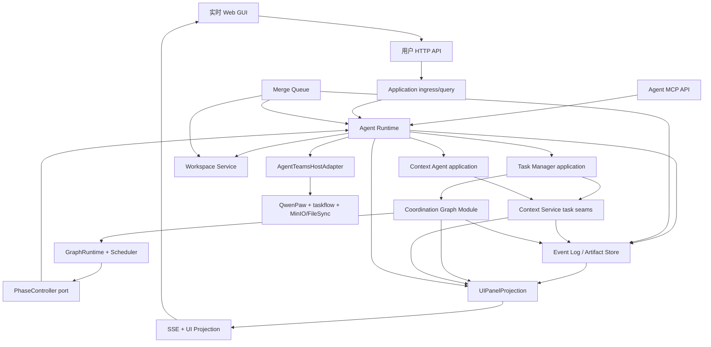

# Threadmill 全仓库实现计划

> **当前交付状态（2026-08-11）：** 已用正式核心对象和端口完成可运行的 `threadmilld serve --fake` GUI 验收链：实时并发、Manager 唯一写图、可恢复 hold/stop/resume、权限过滤的 Coordination Graph 与按 Invocation 展示的订阅/Context Slice/TaskMemoryBuffer。fake-host 只替换 PostgreSQL、MinIO 和真实 AgentTeams，不再维护独立 `/api/*` demo 模型；真实外部基座、生产持久化和崩溃恢复仍是后续交付，不能由本地验收结果冒充完成。

> **For Claude:** REQUIRED SUB-SKILL: Use superpowers:executing-plans to implement this plan task-by-task.

**目标：** 从当前“完整设计、无根项目实现代码”的仓库状态，交付可运行、可恢复、可审计且具有实时可视化控制台的 Threadmill MVP，并用真实 AgentTeams QwenPaw + taskflow 完成一次 `requirement -> plan -> execute -> verify -> merge -> done` 验收链。

**架构：** 根项目实现为一个 Go 模块化单体 `threadmilld`，并在同一部署单元同源托管构建后的 Web GUI。领域边界按文档拆包，PostgreSQL 保存事务状态、命令日志、Event Log 与 Outbox，MinIO 保存 Artifact 和 Workspace 大对象；AgentTeams 仅作为可替换执行宿主。GUI 通过 HTTP 提交容量和 Manager 消息，通过 SSE 消费权限过滤后的 UI Projection；`GraphRuntime` 是 Coordination Graph 包内对象，Task Manager 仍是协调图唯一写入者，Agent Runtime 通过内部 `PhaseController` 承载 start/stop/resume。

**技术栈：** Go（首版以仓库当前可用的 `go1.23.3` 为基线）、PostgreSQL、S3/MinIO、HTTP/JSON、SSE、MCP、React、TypeScript、Vite、图可视化组件、Playwright、Docker Compose、GitHub Actions；生产执行宿主固定为 AgentTeams QwenPaw + TeamHarness taskflow。

**原始计划基线：** `oops-dev@bed2af9`；后续实现仍按本文模块边界和可验收目标矩阵推进，当前代码进度以 `docs/traceability.md` 为准。

---

## 1. 交付结果与范围

### 1.1 最终可验收结果

实现完成后，仓库必须同时满足：

1. `threadmilld` 可初始化数据库、启动控制面、暴露用户入口和 Agent MCP 工具面。
2. Requirement 只能先触发 Task Manager Invocation；任何用户、普通 Agent、Runtime 或 Adapter 都不能直接写 Coordination Graph。
3. Coordination Graph 能原子替换未执行子图，`GraphRuntime` 能并发安全地计算 runnable、签发唯一 lease，并幂等执行 start/stop/resume。
4. plan、execute、verify 在同一 Task 轮次共享 Workspace Binding，但使用不同 Invocation、权限、订阅和 phase lease。
5. Context Service 能完成权限优先的切片、探索、检索、订阅并集、取消、Delta 重放、Task 定向投影和 done 后候选终审。
6. Runtime 能按 `Role tools ∩ Skill tools ∩ Available tools` 注入工具，记录 prompt/skill hash，拒绝越权、过期 binding、越界路径和未信任结果。
7. code task 只有在 latest-main targeted verify 和 Merge Queue 合入成功后才能 done；非代码交付按 DeliveryPolicy 完成。
8. GraphRuntime、Agent Runtime、Adapter 或 Worker 在任意关键点重启，不丢未完成义务，不产生第二个有效 Invocation，也不把旧结果误接纳。
9. Web GUI 可实时增加/减少 Agent 并发目标，持续显示 desired/healthy/active/waiting 数量，并保证并发变化只影响吞吐、不改变图语义。
10. GUI 可实时展示 Coordination Graph；用户选中节点后可通过 Manager 对话提出 hold、resume、重排、增加前置等意图，图变化只能由对应 Task Manager DecisionRef 提交。
11. 点击 Phase Endpoint 节点可查看当前或最近 Agent Invocation 的有效订阅子图列表、实际注入的项目 Context Slice，以及该 Invocation 创建并进入 TaskMemoryBuffer 的候选记录。
12. 本地 fake-host E2E、浏览器 E2E、真实 AgentTeams 集成 smoke、静态检查和安全回归全部通过。

### 1.2 MVP 内范围

- 两张持久图：Coordination Graph、Context Graph。
- Task Manager、Context Agent、planner、executor、verifier 五类角色。
- 固定 `plan -> execute -> verify`，以及 Task 派生门控状态。
- GraphRuntime、Scheduler/Budget、Agent Runtime、Workspace、Merge Queue、Event Log、Artifact Store。
- AgentTeams QwenPaw Manager/Worker、taskflow、Higress MCP 路由和 MinIO/FileSync 的 Adapter。
- `git_worktree` Workspace；其他 `clone | container | remote` 保留类型和明确的 `unsupported_workspace_kind` 错误。
- PostgreSQL 全文/结构化搜索；MVP 不引入向量数据库。
- 用户 Requirement、容量调整、人工决定、Task 状态和事件游标的 HTTP API。
- Agent 使用的 MCP 接口；内部 GraphRuntime 和 AgentTeams Adapter 不暴露为 Agent 工具。
- 实时 Web GUI：Agent 并发控制、Coordination Graph、Manager 对话、Phase 节点 Context 检查器。
- 权限过滤的 UI Projection 和可从事件 cursor 恢复的 SSE 增量流。

### 1.3 明确不做

- 不修改 `third_party/agentteams/` 的领域模型、协议或发布流程。
- 不把 AgentTeams projectflow、WorkerFlow DAG、Matrix、TaskMeta 或 ProjectMeta 当作 Threadmill 状态。
- 不启用 WorkerFlow、OpenClaw、Hermes 或多 Runtime；它们不是 MVP 降级路径。
- 不创建 Task Graph 文档、Execution Graph、Attempt、Split、Failure、Rework 或持久 phase 内步骤对象。
- 不提供 Coordination Graph 对象级 CRUD、JSON Patch 或 GraphRuntime 公共管理 API。
- 不把会话 transcript、progress 文件、原始路径或未提交 Workspace 内容作为跨 Phase 输入。
- 不做《统一设计》标为暂不实现的读侧 Context 整理、多级切片缓存和 embedding 自动语义连边。
- 不做 Coordination Graph 的拖拽直写、浏览器 GraphRuntime 控制接口或绕过 Manager 的 stop/resume 按钮。
- 不在 GUI 展示模型私有推理、session transcript、原始工具输出、其他项目数据或未授权 Context；节点检查器只展示结构化、可授权的运行投影。

## 2. 文档权威顺序与冲突处理

实施前以以下顺序解释设计：

1. [threadmill-unified-design.md](../threadmill-unified-design.md)：领域对象、不变量和端到端语义最高优先。
2. 各权威 Module 文档：对象字段、接口签名、权限和状态机以对应 Module 为准。
3. [threadmill-agentteams-adapter-design.md](../threadmill-agentteams-adapter-design.md)：MVP 宿主选择和 Adapter 边界的最新结论；它覆盖 `agent-runtime.md`、`phase-agent.md` 中仍保留的 WorkerFlow/多形态候选描述。
4. [agent-prompts.md](../agent-prompts.md) 与 `docs/agent-skills/*/SKILL.md`：角色提示词、Skill 依赖、工具交集和输出行为。
5. `third_party/agentteams/`：只证明基座现有能力，不定义 Threadmill 领域语义。

覆盖关系：

| 文档 | 主要实现提交 |
| --- | --- |
| `architecture.md`、`CONTEXT.md`、`design-rationale.md` | F01、F02、IT05、OP03 |
| `threadmill-unified-design.md` | 全部提交，重点 CG、CX、RT、DL、IT |
| `coordination-graph.md` | CG01-CG04、RT01、IT02-IT04 |
| `task-manager-agent.md` | AG01、AG03、IT01、IT05 |
| `phase-agent.md` | RT01-RT03、AG03、IT01-IT04 |
| `context-graph.md`、`context-agent.md` | CX01-CX04、AG02、IT03、IT05 |
| `scheduler-budget.md` | CG04、AP01、IT01 |
| `workspace-merge.md` | WE02、WE03、DL01、DL02、IT05 |
| `event-artifact-store.md` | WE01、RA03、IT04、OP02 |
| `agent-runtime.md`、AgentTeams Adapter 设计 | RA01-RA03、RT01-RT03、OP02 |
| `agent-prompts.md`、15 个 Agent Skill | RA01、RA02、AG01-AG03、IT01 |
| 本次实时 GUI 最终验收补充 | F01、F04、CG04、AP01-AP03、UI01-UI03、IT07、OP01-OP03 |

## 3. 实施前冻结的架构决定

这些是当前计划为减少对象和基础设施作出的实现决定。F01 必须将其写成 ADR；如果评审改变其中任一项，只调整受影响后续提交，不绕过 ADR 直接编码。

| 决定 | MVP 选择 | 目的 |
| --- | --- | --- |
| 部署单元 | 单进程 `threadmilld`，内部模块化；后台 reconcile/outbox/merge worker 同进程运行 | 先避免微服务、服务间事务和重复部署对象；以后可按包边界拆分 |
| 事务存储 | 单 PostgreSQL 数据库；模块分表；关键 mutation 与审计 outbox 同事务 | 满足 revision CAS、唯一 lease、候选终审和可重放事件原子性 |
| 大对象 | MinIO/S3；PostgreSQL 只保存 SHA-256、类型、ACL、来源和对象键 | 符合 Artifact Store 设计，避免大 Payload 进入 Event Log |
| 消息分发 | PostgreSQL Outbox + 游标轮询/通知；不引入 Kafka、Redis 或第二套事件总线 | MVP 最小基础设施，同时保留重放能力 |
| 用户传输 | HTTP/JSON + OpenAPI | 提交 Requirement/决定/容量和读取状态，不直接暴露图写接口 |
| GUI 实时通道 | 浏览器动作走幂等 HTTP；服务端变化走带 cursor 的 SSE；断线后先补 snapshot 再续流 | 交互以服务端事件为权威，避免在 WebSocket 中发明第二套控制协议 |
| GUI 前端 | React + TypeScript + Vite + `@xyflow/react`；本地状态使用 React reducer；构建产物由 `threadmilld` 从只读静态目录同源托管 | 提供可测试的协调图与节点检查器，不引入第二套前端状态权威或独立 Web 服务 |
| GUI 读模型 | `UIPanelProjection` 从领域状态/Event Log 生成，不是第三张持久图 | UI 不直接 join 内部表，也不把展示状态变成业务权威 |
| Manager 对话 | 每条用户消息持久化为 ManagerInputRef 并启动有界 Task Manager Invocation；conversation ID 只分组展示 | 对话可以连续，但每次改图仍需最新 revision、DecisionRef 和 TaskManagerGraph |
| 浏览器身份 | 同源安全 HttpOnly session cookie/可信反向代理身份；SSE 沿用同一身份，不把 bearer token 放进 URL | 浏览器不接触 Agent Invocation token；snapshot、stream 和 inspector 使用同一项目 ACL |
| Agent 传输 | MCP；同一服务按 Invocation opaque token 裁剪可见工具 | 与 QwenPaw 注入机制一致，支持立即撤销和逐调用 capability |
| Agent 身份 | Threadmill `ActorPrincipalID` 是稳定审计主体；worker、session、Invocation 只作映射属性 | `CreatorAgentID` 不绑定可替换 AgentTeams 宿主，也不制造持久 Agent owner |
| Binding | `BindingRef` 指向不可变 `phase_bindings` 记录；Endpoint 不重复保存绑定字段 | 保持 revision、恢复和结果校验唯一来源 |
| phase lease | 一张权威 lease 表，由 GraphRuntime 的图 CAS 事务创建；Workspace 只投影/校验该 lease | 避免 Coordination 与 Workspace 各存一份可分叉 lease |
| Context 物理模型 | 节点、边、子图、membership、recipient、projection、task binding 分表 | `Recipient` 不塞入 ContextNode，也不伪装成 ContextEdge |
| Context 搜索 | PostgreSQL 全文 + scope/anchor 过滤；语义判断仍由 Context Agent | 不在 MVP 引入向量库或让普通 Agent 获得 Search |
| Context Delta | 成功图事务写 outbox；至少一次投递，按 event/subscription ID 幂等；投递前重验 active | 保证取消竞态、重放和订阅并集语义 |
| Workspace | MVP 只实现 `git_worktree`；每轮新 worktree/branch，失败轮次封存 | 满足默认代码任务和 Merge Queue；减少未验证隔离后端 |
| Provider | QwenPaw + taskflow；结果永远是 `UntrustedExecutionResult` | 遵守最新 Adapter 设计，不把 AgentTeams status 等同于业务通过 |

F01 还要冻结以下文档待决项的默认值：

- “最近创建节点”按 `project + scope + ActorPrincipalID` 分区，使用 `(created_at, node_id)` 确定性排序；窗口可配置，默认值写入 ADR，不写死在领域对象。
- `derives_from_subgraph` 是否提升来源子图 revision、是否产生 Delta，必须在 ADR 中给出唯一规则并用事务测试锁定。
- 一个 Invocation 的订阅数、自动边数、Delta 合并窗口、候选和审计保留期均进入配置与 BudgetPolicy，不新增领域对象。
- `InputWaitResult`、join token、截止时间、错误码、DeliverySpec、ReportSpec、WriteSet、ArtifactRef 的完整传输 schema 在 F01 版本化；后续代码只实现该版本。
- token/cost 指标可获得时硬计费；不可获得时不得伪造，仍严格执行墙钟、并发、Invocation、retry 和 verify level。

## 4. 模块和依赖方向



依赖规则：

- `coordination` 定义 `PhaseController` port；`runtime` 实现它。Coordination 不 import AgentTeams。
- Runtime 观察只进入 Event Log；GraphRuntime 从持久 observation/projection 恢复，不接收 Adapter 直写图。
- `taskmanager` 只能经 `TaskManagerGraph`、TaskContextWriter/Finalizer 和结构化输入工作。
- `contextgraph` 不 import AgentTeams、Workspace 或模型 SDK；Context Agent 是它的授权调用方，不是存储 owner。
- `contextgraph` 为 UI Projection 提供内部只读 `ContextInspectionReader`；它不注册 MCP 工具，且仍在服务端执行项目/Task/正文 ACL。
- `workspace` 不判断 Task done；`mergequeue` 不修冲突、不写图，只产生结构化结果事件。
- `agentteams` Adapter 不 import coordination/context 的 repository 包，只消费 Runtime 已固定的 Invocation envelope。
- `transport` 只包装 application seams；handler 中不得出现业务状态转换。
- `uiprojection` 只能读取授权 query/projection 和 Event Log，不能获得 `TaskManagerGraph`、PhaseController、Context Curator 或 Merge Queue 写接口。
- 浏览器只提交 capacity command、Requirement/HumanDecision 或 Manager message；协调图节点拖拽、快捷按钮和客户端状态都不能直接形成 graph mutation。

### 4.1 模块清单

| 模块 | 目标路径 | 持久对象/状态 | 公开边界 | 模块验收目标 |
| --- | --- | --- | --- | --- |
| Platform/Kernel | `internal/platform/`、`internal/kernel/` | schema version、outbox cursor、opaque token hash | clock、ID、transaction、object store、auth context | 可替换 fake；无业务状态机 |
| Coordination Graph | `internal/coordination/` | Task、Endpoint、Edge、Blocker、Result、Binding、Command、lease、revision | `TaskManagerGraph`、内部 wakeup、`PhaseController` port | 唯一写者、CAS、热替换、幂等命令、崩溃恢复 |
| Scheduler/Budget | `internal/scheduler/` | budget ledger/counters；不存第二份 runnable 状态 | 纯选择函数供 GraphRuntime 调用 | capacity 只改吞吐；verify/merge 优先；预算 fail closed |
| Context Service | `internal/contextgraph/` | node/edge/subgraph、subscription、projection、recipient、candidate buffer/review | Reader、Searcher、Curator、Reviewer、Task seams、内部 ContextInspectionReader | 权限优先、Task 隔离、订阅并集、原子终审、检查视图不旁路 ACL |
| Event/Artifact | `internal/evidence/` | append-only event、artifact registry、consumer cursor | append/read/register/open | hash 去重、ACL、事件重放、transcript 隔离 |
| Workspace | `internal/workspace/` | WorkspaceBinding、write set、sealed state、lease projection | create/materialize/validate/seal | 一轮一现场、单写者、路径与 symlink 围栏 |
| Merge Queue | `internal/mergequeue/` | MergeCandidate、状态、latest-main evidence | enqueue/reconcile/result query | latest-main 检查、串行 main 写入、失败不修代码 |
| Agent Runtime | `internal/runtime/` | Invocation、capability、checkpoint ref、provider execution mapping | `PhaseController` 实现、role invocation dispatcher | prompt/skill 装配、start/wait/stop/resume、输出校验 |
| Task Manager app | `internal/taskmanager/` | Requirement、DecisionRef、输入消费游标 | requirement/proposal/output/merge decision handlers | 所有图 mutation 都可追溯到持久 DecisionRef |
| Context Agent app | `internal/contextagent/` | retrieve/review Invocation 引用 | retrieve/curate/review handlers | Search 只在这里可见；不绕过 Context Service |
| AgentTeams Adapter | `internal/adapters/agentteams/` | `AgentTeamsExecutionRef`、observation cursor | Dispatch/Terminate/Collect/Observe | 幂等映射、未信任结果、真实 taskflow 映射 |
| Transport/API | `internal/transport/httpapi/`、`internal/transport/mcpapi/` | 无业务状态 | OpenAPI 与 MCP tools | 身份绑定、schema 校验、角色工具不可见性 |
| UI Projection | `internal/uiprojection/` | 可重建的 capacity/graph/invocation/context view 与 cursor | snapshot、endpoint inspector、SSE event mapper | 不成为业务权威；权限过滤；断线重放一致 |
| Web GUI | `web/`、`internal/transport/webui/` | 浏览器临时 selection/filter/stream cursor | Capacity、Graph、Manager Chat、Endpoint Inspector | 实时操作可见、无图直写、无跨 Task/项目泄露 |
| App wiring/ops | `internal/app/`、`cmd/threadmilld/`、`deploy/` | process config | serve/migrate/check | 可启动、健康检查、优雅关闭、恢复扫描 |

### 4.2 v1 外部接口边界

用户 HTTP API 固定为：

- `POST /v1/requirements`：登记 Requirement 并请求 Task Manager Invocation；
- `GET /v1/capacity`：读取 desired、healthy、active、waiting 和 capacity revision；
- `POST /v1/capacity-adjustments`：以 `request_id + expected_revision + desired_concurrency` 调整 Agent 并发目标，不指定 Task、不改图；
- `POST /v1/human-decisions`：记录外部决定并请求 Task Manager 裁决；
- `GET /v1/tasks/{task_id}`：读取 Task/endpoint/交付状态投影；
- `GET /v1/coordination/snapshot?revision={revision}`：读取权限内的协调图 UI 快照；
- `GET /v1/coordination/endpoints/{task_id}/{endpoint_id}/inspector?generation={generation}`：读取节点绑定的 Invocation、订阅并集、Context Slice 与 TaskMemoryBuffer 视图；
- `POST /v1/manager/messages`：提交自然语言消息、可选选中节点和客户端所见 graph revision，返回 ManagerInputRef/InvocationRef；
- `GET /v1/manager/conversations/{conversation_id}`：从结构化事件投影读取消息、Manager 回复、DecisionRef 与 mutation 结果；
- `GET /v1/events?after={cursor}`：读取调用者权限内的结构化事件；
- `GET /v1/events/stream?after={cursor}`：以 SSE 持续发送 capacity、graph revision、Invocation、subscription、Context Delta、memory buffer 和 Manager interaction 增量；
- `GET /healthz`、`GET /readyz`：进程与依赖健康。

`desired_concurrency` 表示项目级最大并行 Agent Invocation 数，不等于固定 Worker Pod 数。增加后 Scheduler 可立即 claim 更多 runnable endpoint，Adapter 按需准备宿主；减少后立即停止新的超额 dispatch，并让已在运行的 Invocation 自然排空。它默认不取消或停止具体 Phase，具体 hold/stop/release 必须经 Manager 对话和协调图决定。GUI 必须同时展示目标值与实际 healthy/active 状态，不能把目标值冒充已完成扩缩容。

节点检查器的三个上下文区域必须严格对应现有对象：

1. **订阅子图**：当前/最近 Invocation 的 `ContextSubscription[]`，显示来源（initial/retrieval/explicit）、状态、subgraph ID 和 revision；有效范围按订阅并集计算。
2. **持有的项目上下文**：该 Invocation 实际装配的 `ContextSlice`，显示 subgraph、node、frontier、conflict、omitted 和 graph revision；不是整个项目 Context Graph。
3. **创建的上下文缓冲区**：当前 Task 的 `TaskMemoryBufferView`，默认筛选 `CreatedByInvocationID` 为所选 Invocation，并允许切换到同 Task 共享视图；它不是已落图 ContextNode。

没有 active Invocation 时，检查器显示最近一次 Invocation 及其已封存快照，并明确标记“当前无 Agent 持有”；不得将历史 subscription 显示为 active。GUI operator 对候选正文的可见性单独鉴权，Task Manager 对话输入不会自动获得这些候选内容。

Agent MCP 工具全集来自现有 Skill，按角色/Skill/capability 取交集：

```text
coordination.snapshot
taskManager.submitDecision
coordination.replacePending
coordination.transition

context.listSubgraphs
context.explore
context.subscribe
context.unsubscribe
contextAgent.retrieve
context.getSubgraph
context.getNode
context.search
context.createNode
context.updateNode
context.deleteNode
context.createSubgraph
context.updateSubgraph
context.deleteSubgraph
context.submitReview
context.registerTaskSubgraph
context.projectTaskContext
context.finalizeTaskMemory

runtime.awaitInputs
agent.submitPhaseOutput
agent.proposeOrchestration
agent.submitRequirement
agent.listTaskMemoryCandidates
agent.submitMemoryCandidate
```

`runtime.startPhase/stopPhase/resumePhase/onContextDelta/onInputsChanged` 是 Runtime 回调；`PhaseController.Apply`、`GraphRuntime` wakeup 和 `AgentTeamsHostAdapter` 是进程内接口。它们都不能注册为 MCP 工具或用户 HTTP endpoint。

## 5. 目标仓库结构

```text
cmd/threadmilld/
  main.go
internal/
  app/
  kernel/
  platform/{config,postgres,objectstore,outbox,auth}/
  coordination/
  scheduler/
  contextgraph/
  evidence/
  workspace/
  mergequeue/
  runtime/{invocation,promptcatalog,policy,phase}/
  taskmanager/
  contextagent/
  uiprojection/
  adapters/agentteams/
  transport/{httpapi,mcpapi,webui}/
api/openapi/threadmill-v1.yaml
migrations/
runtime-assets/prompts/
web/
  package.json
  src/{api,app,features,components,state}/
  tests/
docs/adr/
docs/agent-skills/               # 现有 Skill 仍是 canonical source
deploy/compose/
deploy/helm/threadmill/
scripts/
test/{contract,integration,e2e,security}/
third_party/agentteams/          # 只读归档，不在实现 PR 中修改
```

运行镜像复制 `runtime-assets/prompts/` 与 `docs/agent-skills/`。Runtime 启动时校验 Skill 依赖 DAG、allowed-tools 和内容 hash；Invocation 记录实际载入 hash。不得把 Markdown 临时复制进数据库并形成第二套 canonical prompt。

## 6. 并行提交和合并规则

### 6.1 波次

| 波次 | 并行度 | 分支/PR | 进入条件 | 退出门槛 |
| --- | ---: | --- | --- | --- |
| W0 基础冻结 | 1 | `feature/threadmill-foundation` | 本计划合入 | ADR、Go scaffold、存储/身份基础全部合入 `dev` |
| W1 核心模块 | 4 | coordination / context / workspace-evidence / runtime-adapter | W0 合入且接口版本冻结 | 四个 PR 各自测试通过、无共享文件冲突，全部合入 `dev` |
| W2 应用集成 | 4 | phase-runtime / agent-apps / delivery / api-gui-ops | W1 全部合入 | 模块集成测试通过，fake host 可跑完整非 merge 流程，GUI 可消费 fake 实时流 |
| W3 系统验收 | 1-2 | `feature/threadmill-e2e`、`fix/threadmill-hardening` | W2 合入 | 七组领域/浏览器 E2E、故障恢复与安全测试通过 |
| W4 发布 | 2 | `feature/threadmill-deploy`、`docs/threadmill-operations` | W3 合入 | GUI production build、真实 AgentTeams smoke、部署检查、运维文档通过 |

每个波次从最新 `dev` 建分支，经独立 PR 合入；不得直接提交或本地合并到 `dev/main`。后续波次不以未合入的工作分支为长期共同基线，避免隐性堆叠依赖。

### 6.2 目录所有权

| 并行泳道 | 独占目录 | 不得直接修改 |
| --- | --- | --- |
| coordination | `internal/coordination/`、`internal/scheduler/`、`migrations/1xxx_*` | runtime、context、workspace |
| context | `internal/contextgraph/`、`migrations/2xxx_*` | coordination、runtime |
| workspace-evidence | `internal/evidence/`、`internal/workspace/`、`internal/mergequeue/`、`migrations/3xxx_*`、`4xxx_*` | runtime、transport |
| runtime-adapter | `internal/runtime/`、`internal/adapters/agentteams/`、`runtime-assets/`、`migrations/5xxx_*` | 各领域 repository |
| phase-runtime | W2 中独占 `internal/runtime/phase/` | W1 已冻结的 Adapter 和领域接口 |
| agent-apps | `internal/taskmanager/`、`internal/contextagent/` | transport、领域 repository |
| delivery | W2 中独占 `internal/mergequeue/integration/`、相关 integration tests | workspace 核心模型 |
| api-gui-ops | `internal/transport/`、`internal/uiprojection/`、`internal/app/`、`cmd/`、`api/`、`web/`、`deploy/` | 领域状态机、Agent MCP registry |

共享文件 `go.mod`、`go.sum`、CI、根配置和 ADR 只由当波次集成人维护。并行泳道需要依赖时先提交接口变更 proposal；不得在自己的 PR 中顺手改另一泳道目录。

迁移编号固定：

- `0xxx`：platform/auth/outbox；
- `1xxx`：coordination/scheduler；
- `2xxx`：context；
- `3xxx`：event/artifact；
- `4xxx`：workspace/merge；
- `5xxx`：runtime/provider mapping。

## 7. 逐提交执行计划

每个提交统一采用 TDD 小循环：先增加一个能证明目标的失败测试并确认失败原因正确；再写最小实现；运行目标包测试；最后运行 `go test ./...` 和 `go vet ./...`。下表中的“验收”是该提交允许合入的最低证据。

### W0：基础冻结（串行）

#### F01 — `docs: 固化 Threadmill 实现 ADR 与 v1 契约`

- 文件：`docs/adr/0001-modular-monolith.md`、`0002-postgres-outbox-minio.md`、`0003-mcp-capability-auth.md`、`0004-context-physical-model.md`、`0005-agentteams-mvp.md`、`0006-web-ui-projection-and-sse.md`、`api/openapi/threadmill-v1.yaml`。
- 步骤：
  1. 把第 3 节决定和所有待决字段写成 `Accepted` ADR。
  2. 定义 Requirement、capacity、human decision、Manager message、graph snapshot、endpoint inspector、event cursor/SSE 的 HTTP schema；不出现图 CRUD。
  3. 建立 `docs/adr/README.md` 决策索引和文档权威顺序。
- 验收：OpenAPI 可解析；ADR 无“待定/TODO”；GUI ADR 明确 HTTP command + SSE projection、无浏览器图写能力；Adapter ADR 明确 QwenPaw + taskflow、无 WorkerFlow、`third_party` 只读。

#### F02 — `chore: 初始化 threadmilld 与 CI`

- 文件：`go.mod`、`cmd/threadmilld/main.go`、`internal/app/app.go`、`internal/platform/config/config.go`、对应 `_test.go`、`.github/workflows/ci.yml`、`.gitignore`。
- 步骤：
  1. 写配置缺失和优雅关闭测试，先得到预期失败。
  2. 建立 module `github.com/KDZZZZZZ/threadmill-AgentTeams`、`serve | migrate | check` 子命令和依赖注入骨架。
  3. CI 运行 Go format check、`go vet`、unit test；Linux CI 另跑 race test，并预留独立 Web build/test job。
- 验收：`go test ./...`、`go vet ./...` 通过；`go run ./cmd/threadmilld check` 在缺失外部依赖时返回结构化非零诊断而非 panic。

#### F03 — `feat(platform): 增加事务、迁移、outbox 与对象存储端口`

- 文件：`internal/platform/postgres/`、`objectstore/`、`outbox/`、`migrations/0001_*`、`deploy/compose/threadmill-deps.yml`、`test/integration/platform_test.go`。
- 步骤：
  1. 先写 migration up/down、事务回滚、outbox claim/replay 和 object-store fake 的测试。
  2. 实现 PostgreSQL transaction runner、advisory/row claim、consumer cursor、S3-compatible interface。
  3. Compose 只启动 PostgreSQL 与 MinIO；镜像必须固定版本或 digest，不能使用浮动 `latest`。
- 验收：相同 outbox event 重放两次只产生一次 consumer side effect；事务失败不留下业务行或 outbox 行。

#### F04 — `feat(platform): 增加主体、operator session、opaque token、capability 与幂等键`

- 文件：`internal/kernel/{id,revision,errors}.go`、`internal/platform/auth/`、`migrations/0002_auth.*.sql`、`test/security/auth_test.go`。
- 步骤：
  1. 先覆盖 browser session 的 project ACL/CSRF、token hash、过期、撤销、角色与 Invocation 绑定、同 key 不同 payload 冲突。
  2. 实现同源 HttpOnly operator session 和随机 Agent opaque token；数据库只保存 hash、主体/Invocation、role、capability、expiry/revoked_at。
  3. 定义统一错误码：`forbidden`、`revision_conflict`、`idempotency_conflict`、`stale_binding`、`lease_conflict`。
- 验收：SSE 和普通 UI API 使用同一 project principal；状态改变请求通过 CSRF/Origin 检查；被撤销 token 立即无法调用；Phase token 无法伪装 Task Manager；调用方传入的 TaskID/InvocationID 不能覆盖 auth context。

### W1-A：Coordination Graph / Scheduler（并行泳道 A）

#### CG01 — `feat(coordination): 定义图模型、不可变 binding 与校验器`

- 文件：`internal/coordination/{model,binding,validate}.go`、对应测试、`migrations/1001_coordination_model.*.sql`。
- 测试先覆盖：固定三个 endpoint、禁止第四阶段、SpecRef/BindingRef 必填、图无环、edge/blocker 引用有效、已执行对象不可经 ReplacePending 改写。
- 验收：文档中的合法串行/并行/阻塞图通过；对象 CRUD、Execution Graph、Attempt 类型不存在。

#### CG02 — `feat(coordination): 实现 TaskManagerGraph 与 DecisionRef 门控`

- 文件：`internal/coordination/{store,task_manager_graph,snapshot}.go`、`migrations/1002_graph_revisions.*.sql`、测试。
- 测试先覆盖：`Snapshot(0)`、历史一致快照、BaseRevision CAS、scope 完整替换、RequestID 幂等、Transition 封闭集合、仅 Task Manager capability。
- 验收：100 个并发相同 RequestID 只有一个 revision；不同 payload 返回 conflict；普通 Runtime principal 得到 forbidden。

#### CG03 — `feat(coordination): 实现 GraphRuntime 命令、lease 与恢复`

- 文件：`internal/coordination/{runtime,command_store,recovery}.go`、`migrations/1003_phase_commands_leases.*.sql`、测试。
- 测试先覆盖：并发 reconcile 唯一 lease/command、相同 CommandID 重投、hold 产生 stop、stopped 后 release/新 generation、checkpoint 才可 resume、孤立 lease repair、终态 observation 不重发。
- 验收：100 个并发 reconcile 对同一 endpoint/generation 只产生一个 active lease 和一个有效命令；进程重建后可由 DB + Event Log 恢复。

#### CG04 — `feat(scheduler): 实现 runnable、可调并发、BudgetPolicy 与优先级`

- 文件：`internal/scheduler/{model,select,budget}.go`、测试、`migrations/1101_budget_ledger.*.sql`。
- 测试先覆盖：blocked/缺 spec 不可运行、verify/merge 优先、write-set 风险降并发、capability 匹配、desired concurrency revision/CAS、降低目标后排空但不取消运行中 Invocation、预算不足保护 verify。
- 验收：Scheduler 是纯读选择器；不存在直接 start、改图、建 Workspace 或启动 Context Agent 的方法。

### W1-B：Context Service（并行泳道 B）

#### CX01 — `feat(context): 实现节点、边、子图和创建事务`

- 文件：`internal/contextgraph/{model,store,creation}.go`、`migrations/2001_context_graph.*.sql`、测试。
- 测试先覆盖：三种 Node Kind、general/task 正交、membership 分表、最近节点确定性、订阅自动边、revision 与 audit/outbox 原子提交。
- 验收：任一 audit/recipient/edge 写失败整体回滚；普通读操作不产生节点或边。

#### CX02 — `feat(context): 实现 Reader、Searcher 与 general Curator`

- 文件：`internal/contextgraph/{reader,searcher,curator,permissions}.go`、测试。
- 测试先覆盖：权限在相关性前过滤、Explore frontier、Search 仅 Context Agent、Curator 只能改 general、revision CAS、task 节点/子图拒绝。
- 验收：Phase/Task Manager token 看不到 Search 工具且直接调用也被服务拒绝；搜索结果不含越权节点。

#### CX03 — `feat(context): 实现订阅并集、取消、切片与 Delta 重放`

- 文件：`internal/contextgraph/{subscription,slice,delta_dispatcher}.go`、`migrations/2002_context_subscriptions.*.sql`、测试。
- 测试先覆盖：Invocation 隔离、初始/检索/显式订阅并集、重叠取消、未知 ID 不泄露、取消与投递竞态、至少一次重放、结束自动过期。
- 验收：取消后下一次装配移除独占子图；被另一有效订阅覆盖的子图保留；投递前发现 canceled 必须丢弃；内部检查 seam 能按 Invocation 返回来源和 active 状态，但不能改变订阅。

#### CX04 — `feat(context): 实现 Task 投影、候选缓冲和 done 后终审`

- 文件：`internal/contextgraph/{task_binding,projection,memory_buffer,review}.go`、`migrations/2003_task_context_memory.*.sql`、测试。
- 测试先覆盖：一 Task 一 task subgraph、Recipient 稳定引用、ProjectionID revision 幂等、跨 Task 拒绝、append-only buffer、冻结批次、逐项原子审查、finalize 重试。
- 验收：候选追加不改 graph revision、不发 Delta；done 前不能审查；一次批次失败不产生半落图状态；内部检查 seam 可按 CreatedByInvocationID 过滤并按项目 ACL redaction，不向 Agent MCP 暴露。

### W1-C：Evidence / Workspace / Merge（并行泳道 C）

#### WE01 — `feat(evidence): 实现 Event Log 与 Artifact Registry`

- 文件：`internal/evidence/{eventlog,artifact,acl,projection}.go`、`migrations/3001_evidence.*.sql`、测试。
- 测试先覆盖：append-only、稳定 event key、cursor 重放、Payload 大小限制、SHA-256 去重、hash 校验、敏感路径/内容拒绝、transcript ACL。
- 验收：相同字节返回同 Artifact ID；Task Manager 无法读取 transcript；Event 不内嵌超限大对象。

#### WE02 — `feat(workspace): 实现 git worktree Binding、路径围栏与 write set`

- 文件：`internal/workspace/{model,git_backend,materialize,guard,writeset,seal}.go`、`migrations/4001_workspaces.*.sql`、测试。
- 测试使用临时 bare repo，先覆盖：每轮新 binding、三 Phase 复用、lease 投影、AllowedDirs、`..`/绝对路径/symlink escape、Declared/Observed 差异、seal 后拒写。
- 验收：plan 只能写 `plan/`、execute 只能写批准目录、verify 只能写 `evidence/`；Observed WriteSet 由实际 diff 产生。

#### WE03 — `feat(mergequeue): 实现 candidate 状态机与串行 main 写入`

- 文件：`internal/mergequeue/{model,store,reconciler,git_merge}.go`、`migrations/4002_merge_queue.*.sql`、测试。
- 测试先覆盖：queued -> merge_check -> targeted_verify -> merged、latest-main drift、冲突、权限失败、同目标仓库串行、失败不修改候选 Workspace。
- 验收：Merge Queue 没有修代码或写 Coordination Graph 的接口；一次失败必须带 evidence refs。

### W1-D：Prompt / Runtime 基础 / AgentTeams Adapter（并行泳道 D）

#### RA01 — `feat(runtime): 实现 Prompt 与 Skill catalog`

- 文件：`runtime-assets/prompts/{shared,task-manager,context-agent,planner,executor,verifier}.md`、`internal/runtime/promptcatalog/`、测试；同步更新 `docs/agent-prompts.md` 的 canonical 路径说明。
- 测试先覆盖：15 个 Skill 全部可加载、依赖无环、五类加载包正确、缺失可选区块写“未提供”、hash 稳定、未知 Skill/工具失败。
- 验收：Invocation 能记录 Shared/Role/Skill hash；生产镜像缺任一必需 asset 时启动失败。

#### RA02 — `feat(runtime): 实现 Invocation、工具交集与 MCP capability policy`

- 文件：`internal/runtime/{invocation,policy,envelope}.go`、`internal/transport/mcpapi/registry.go`、`migrations/5001_invocations.*.sql`、`test/contract/tool_visibility_test.go`。
- 测试先覆盖：五类角色的 EffectiveTools、Search 只给 Context Agent、TaskManagerGraph 只给 Task Manager、phase runtime tools 只给 phase、过期 token/lease 拒绝。
- 验收：测试逐一比较 Skill `allowed-tools` 与实际 MCP registry；任何额外工具都使测试失败。

#### RA03 — `feat(agentteams): 实现 HostAdapter、fake host 与 observation projector`

- 文件：`internal/adapters/agentteams/{client,adapter,taskflow,filesync,observations}.go`、`internal/adapters/agentteams/fake/`、`migrations/5002_agentteams_execution.*.sql`、测试。
- 测试先覆盖：稳定 task ID、重复 Dispatch、Terminate 三 mode、Collect 未信任、cursor 重放、healthy host capacity、掉线、重复 observation、无图/Context repository 依赖。
- 验收：相同 dispatch 命令只创建一个有效 AgentTeams task；`SUCCESS` 只形成 observation，不形成 satisfied/done。

### W2-A：Phase Agent Runtime（并行泳道 A）

#### RT01 — `feat(runtime): 实现 PhaseController start 与输入装配`

- 文件：`internal/runtime/phase/{controller,start,assembly}.go`、测试。
- 步骤：从 `PhaseCommand` 校验 generation/binding/lease，物化 Workspace，创建 Context Slice/TaskMemoryBuffer snapshot，签发 capability，装配 prompt，最后 Dispatch。
- 验收：顺序任一步失败都不留下可用 token 或第二个 execution；`Apply` 只确认可靠接收，started 仍由异步 observation 产生。

#### RT02 — `feat(runtime): 实现 awaitInputs、动态 Context 与结构化输出`

- 文件：`internal/runtime/phase/{wait,context_updates,output}.go`、`internal/transport/mcpapi/phase_tools.go`、测试。
- 测试先覆盖：已声明输入等待、release_wait 后重新承载、InputsChanged、Delta 重新装配、Artifact 注册、binding 补全、stale result、proposal/requirement/memory 路由。
- 验收：只有 ArtifactRef 能跨 Phase；调用方不能自报可信 binding；awaitInputs 不结束逻辑 Invocation，但旧 execution 不可继续写。

#### RT03 — `feat(runtime): 实现 recoverable stop、resume 与 runtime recovery`

- 文件：`internal/runtime/phase/{stop,resume,recovery}.go`、测试。
- 测试先覆盖：checkpoint 成功后 stop、超时 hard stop + non_resumable、旧 token/订阅/session/task 失效、新 Invocation/generation/lease/session resume、重复 command。
- 验收：没有 checkpoint 或 non_resumable 事实时 stop 不得完成；resume 不复活旧进程或旧 SubscriptionID。

### W2-B：Agent 应用（并行泳道 B）

#### AG01 — `feat(taskmanager): 实现 Requirement、Manager 消息、DecisionRef 与图工具`

- 文件：`internal/taskmanager/{service,decision_store,invocation,tools}.go`、`internal/transport/mcpapi/task_manager_tools.go`、测试。
- 测试先覆盖：Requirement/ManagerInputRef 规整输入、选中 EndpointRef 只作上下文、DecisionRef 先持久化后 mutation、replace pending scope、transition 白名单、revision conflict 重读、hold/stop/release 次序、结构化 Manager 回复事件。
- 验收：所有图 revision 都能关联 DecisionRef；Task Manager 不持有 Scheduler、Workspace、Merge Queue 或原始 Event Log 写能力。

#### AG02 — `feat(contextagent): 实现 retrieve、curation 与 candidate review`

- 文件：`internal/contextagent/{retrieve,curate,review,invocation}.go`、`internal/transport/mcpapi/context_agent_tools.go`、测试。
- 测试先覆盖：自然语言请求转换为 Keywords/Scope/AnchorRefs、Search consumer 绑定原请求方、general CRUD、完整批次审查、预算/权限。
- 验收：Context Agent 不能写 task 子图；检索自动订阅不绑定 Context Agent 自己的 Invocation。

#### AG03 — `feat(agents): 实现 Phase Agent MCP 工具包装`

- 文件：`internal/transport/mcpapi/{context_reader_tools,phase_tools,memory_tools}.go`、contract tests。
- 测试覆盖所有 15 个 Skill 的工具名、请求 schema、auth-bound 字段、取消订阅、submit output/proposal/requirement/candidate。
- 验收：工具清单与 `agent-prompts.md §5` 完全一致；不存在 agent 可调用的 start/stop/resume、delegate/cancel、graph CRUD 或 merge 工具。

### W2-C：Delivery 集成（并行泳道 C）

#### DL01 — `feat(delivery): 接入 latest-main targeted verify`

- 文件：`internal/mergequeue/integration/{verify_dispatch,results}.go`、integration tests。
- 测试先覆盖：临时 merge-check workspace、当前 main revision 绑定、Verifier 新 Invocation、失败 evidence、main 改变使旧 verify 失效。
- 验收：targeted verify 仍走 Agent Runtime；Merge Queue 不直接调用模型或绕过 phase 权限。

#### DL02 — `feat(delivery): 实现 DeliveryPolicy、done 与 memory finalize 链`

- 文件：`internal/taskmanager/{delivery,completion}.go`、`internal/mergequeue/integration/completion.go`、测试。
- 测试覆盖四种 DeliveryPolicy，重点锁定 `code_merge = verify passed + latest-main verify + merge + dependency/decision satisfied`。
- 验收：先持久化 done，再调用 FinalizeTaskMemory；finalize 失败不回滚 done，只重试同一冻结批次。

### W2-D：用户 API、实时 GUI、装配和运维骨架（并行泳道 D）

#### AP01 — `feat(api): 实现用户命令、Manager 对话与 GUI 查询接口`

- 文件：`internal/transport/httpapi/{requirements,capacity,decisions,tasks,coordination,manager,inspector}.go`、`internal/uiprojection/query.go`、OpenAPI contract tests。
- 测试先覆盖：schema、project/operator auth、capacity revision、ManagerInputRef、选中 EndpointRef、snapshot revision、inspector generation、非法直接图字段。
- 验收：HTTP handler 只调用 application/query seam；Manager message 只创建有界 Task Manager 输入，不能携带 PendingSubgraph、Transition 或任意 graph patch。

#### AP02 — `feat(ui-projection): 实现权限过滤的快照、节点检查器与 SSE`

- 文件：`internal/uiprojection/{model,builder,inspector,event_mapper,permissions}.go`、`internal/transport/httpapi/{events,sse}.go`、测试。
- 测试先覆盖：capacity/graph/invocation 聚合、订阅来源与 active 状态、ContextSlice/TaskMemoryBuffer 区分、creator filter、正文 ACL/redaction、cursor 补流、重复事件幂等、慢客户端断开。
- 验收：UI Projection 可由权威 store/Event Log 重建且没有 mutation 方法；SSE 断线后用 cursor 恢复为与全量 snapshot 相同的状态；Task Manager 对话 projection 不自动包含候选正文。

#### UI01 — `feat(web): 实现控制台框架、Agent 并发控制和协调图`

- 文件：`web/{package.json,package-lock.json,tsconfig.json,vite.config.ts,index.html}`、`web/src/app/`、`web/src/api/`、`web/src/features/capacity/`、`web/src/features/coordination/`、对应 Vitest/React Testing Library tests。
- 测试先覆盖：首次 snapshot、SSE reducer、断线重连、并发 `+/-` 的 expected revision、409 后刷新、desired/healthy/active/waiting 展示、Task 分组和 Phase Endpoint 状态。
- 实现 React + TypeScript 控制台；图组件使用锁定版本的成熟图可视化依赖，节点布局只影响显示；Graph state 必须来自服务端 snapshot/event，禁止 optimistic graph mutation。
- 验收：用户可连续增减并发目标，重复点击使用 request ID 幂等；图 revision、endpoint state、active/waiting 状态无需刷新实时变化。

#### UI02 — `feat(web): 实现 Manager 对话调整协调图`

- 文件：`web/src/features/manager/`、`web/src/features/coordination/selection.ts`、对应测试。
- 测试先覆盖：发送自然语言消息、附带选中 EndpointRef/所见 revision、pending/accepted/rejected/conflict 展示、Manager 回复、DecisionRef 与图 revision 跳转。
- 对话 transcript 只由结构化 manager interaction events 重建；不得读取 AgentTeams Matrix 文本或 Manager 私有 session。用户可说“hold 当前 execute”“恢复此节点”“给 verify 增加前置”等，但 UI 不解析成 graph command。
- 验收：Manager 拒绝或 revision conflict 时图保持不变并显示原因；接受时 UI 先显示 DecisionRef，再由 graph revision event 更新节点/边和执行状态。

#### UI03 — `feat(web): 实现 Phase 节点 Context 检查器`

- 文件：`web/src/features/endpoint-inspector/`、`web/src/components/{SubscriptionList,ContextSliceView,TaskMemoryBufferView}.tsx`、对应测试。
- 测试先覆盖：active/最近 Invocation、无 Agent 空状态、initial/retrieval/explicit 订阅、重叠订阅并集、Context Slice revision/frontier/conflict/omitted、created-by-invocation 候选筛选、同 Task shared 切换、redacted/forbidden 状态。
- 验收：点击任意 Phase Endpoint 打开检查器；三个区域分别显示订阅子图、实际持有项目上下文和创建的候选缓冲，不把历史订阅标 active，不把 candidate 显示成已落图节点，不泄露其他 Task/项目数据。

#### AP03 — `feat(app): 同源托管 Web 构建并完成后台服务 wiring`

- 文件：`internal/transport/webui/{handler,static_root}.go`、`internal/app/{wire,workers,health}.go`、`cmd/threadmilld/main.go`、`web/scripts/`、integration tests。
- 装配 GraphRuntime wakeup、outbox dispatcher、Context Delta、observation projector、UI Projection、SSE、Merge Queue 和 cleanup worker；production 容器把 `web/dist` 复制到只读静态目录并由 `threadmilld` 同源托管，开发模式由 Vite 代理 API。
- 验收：shutdown 停止新 claim、关闭 SSE、等待当前事务并保存 cursor；restart 后扫描未决 command/lease/Invocation/outbox，浏览器重连后恢复同一视图；未知前端路由安全回退到 SPA，API/MCP 路由不被吞掉。

### W3：系统集成与不变量验收

#### IT01 — `test(e2e): 完成 Requirement 到 PhaseOutput 的 happy path`

- 文件：`test/e2e/requirement_phase_flow_test.go`、fixture fake host。
- 场景：Requirement -> Task Manager -> 三 endpoint -> plan -> execute -> verify；验证五种 prompt、Skill、Workspace 复用和工具隔离。
- 验收：fake host 下无人工改库即可完成；每个状态都有 Event 和 DecisionRef/ArtifactRef。

#### IT02 — `test(e2e): 完成并行、输入 join、blocker 与热修改`

- 文件：`test/e2e/coordination_parallel_test.go`。
- 场景：两个 Task 并行、completion input 等待、人工 blocker、运行中 endpoint held -> stopped -> replace pending -> released。
- 验收：未声明输入不能偷渡；running endpoint 未 stop 前不能进入 ReplacePending scope；capacity 变化不改图语义。

#### IT03 — `test(e2e): 完成 Task/Phase/Subscription Context 隔离`

- 文件：`test/e2e/context_lifecycle_test.go`。
- 场景：不同 Task 订阅同 general subgraph、同 Task 三 Phase、自动/检索/显式订阅重叠、取消、Delta、TaskMemoryBuffer、done 后终审。
- 验收：上下文仅按当前 ConsumerInvocationID 的有效子图并集装配；跨 Task 候选读取为 forbidden。

#### IT04 — `test(e2e): 完成 stop/resume、重复投递与崩溃恢复`

- 文件：`test/e2e/recovery_test.go`。
- 在 dispatch 前后、ack 后、checkpoint 前后、result 收集前后、outbox 投递前后分别终止并重建服务 fixture。
- 验收：无义务丢失、无重复有效 execution、旧 token 无效、可恢复性事实准确、projection 重放一致。

#### IT05 — `test(e2e): 完成 verify/merge/done/context 闭环`

- 文件：`test/e2e/code_merge_flow_test.go`。
- 使用临时 bare repo 和两个竞争 candidate，验证 main drift、冲突、targeted verify、串行合入、done、候选冻结审查与 Context Delta。
- 验收：只有 Merge Queue 写 main；冲突 candidate 不被修补；后合入旧验证正确失效。

#### IT06 — `test(security): 锁定跨模块安全边界`

- 文件：`test/security/{confused_deputy,path_escape,stale_result,tool_leak,transcript_acl}_test.go`。
- 验收：越权工具不可见且服务端再拒绝；路径遍历/symlink、旧 lease、旧 binding、伪造 ArtifactRef、session/transcript 读取全部失败并有审计事件。

#### IT07 — `test(gui): 验收实时并发、Manager 调图和节点 Context 检查器`

- 文件：`web/tests/e2e/{capacity,manager-graph,endpoint-inspector,reconnect}.spec.ts`、`test/e2e/gui_fixture_test.go`。
- 场景：浏览器实时 `+/-` Agent 并发；观察 Scheduler 吞吐变化；选中运行中 execute 并通过 Manager 对话 hold/stop、修改 pending 子图、resume；点击 plan/execute/verify 节点查看各自 Invocation 的订阅、Context Slice 和候选缓冲；刷新/断网后 cursor 恢复。
- 验收：Playwright 不调用任何 graph mutation endpoint；每次图变化均能追到 ManagerInputRef、DecisionRef 和新 graph revision；不同 Task、Phase、subscription 的视图无串线；所有用户要求的 GUI 结果可从浏览器完成且不需人工改库。

### W4：部署、真实基座和交付

#### OP01 — `feat(deploy): 增加 Compose 与 Helm 部署`

- 文件：`deploy/compose/threadmill.yml`、`deploy/helm/threadmill/`、`Dockerfile`、`.dockerignore`、`scripts/{migrate,smoke,check-config}.{ps1,sh}`。
- 验收：多阶段构建固定 Node/npm 与 Go toolchain，先完成 `npm ci && npm test && npm run build` 再构建 `threadmilld`；`docker compose config --quiet`、`helm lint`、干净数据库 migrate up/down/up 通过；GUI 与 API 同源可达，配置和 Secret 分离，不提交凭据。

#### OP02 — `test(agentteams): 增加真实 QwenPaw + taskflow smoke`

- 文件：`test/integration/agentteams/`、`scripts/smoke-agentteams.{ps1,sh}`、CI 手动/受保护环境 job。
- 场景：从真实浏览器调整并发并观察 Worker/Invocation 数变化；通过 Manager 对话调整真实协调图；Manager 承载 Task Manager/Context Agent，Worker 承载 Phase；验证 MCP policy、ACL、Filesync、dispatch 幂等、cancel、heartbeat 掉线、result.md 转换、token 撤销和节点检查器数据。
- 验收：Adapter 设计 §11 十项和 GUI ACC-21 至 ACC-26 全部有自动证据；没有 AgentTeams 凭据时 job 明确 skipped，不能伪报 passed。

#### OP03 — `docs: 补齐运行、故障恢复与验收手册`

- 文件：`README.md`、`docs/operations.md`、`docs/api.md`、`docs/gui.md`、`docs/testing.md`、`docs/traceability.md`。
- 验收：新环境按 README 可启动 fake-host MVP 并打开 GUI；GUI 文档解释 desired/healthy/active/waiting、Manager 对话的间接控制语义和三个 Context 区域；traceability 将每条架构不变量映射到测试；所有已改变的 ADR/接口同步回权威文档。

## 8. 可验收目标矩阵

| ID | 目标 | 自动证据 |
| --- | --- | --- |
| ACC-01 | Task Manager 是 Coordination Graph 唯一写入者 | `tool_visibility_test` + CG02 auth tests |
| ACC-02 | ReplacePending 只替换未执行完整 scope，不提供 CRUD | CG01/CG02 tests + API schema scan |
| ACC-03 | 同 endpoint/generation 只有一个 lease/有效命令 | CG03 100-way concurrency test |
| ACC-04 | start/stop/resume 同一 PhaseCommand 模型且幂等 | CG03、RT03 tests |
| ACC-05 | stop 可恢复性有 checkpoint/non_resumable 证据 | RT03 + IT04 |
| ACC-06 | plan/execute/verify 同轮 Workspace、不同权限 | WE02 + IT01 |
| ACC-07 | 只有 ArtifactRef 跨 Phase，大对象不进 Event | WE01、RT02 security tests |
| ACC-08 | Search 只注入 Context Agent | CX02、RA02 contract test |
| ACC-09 | Context 按 Invocation 订阅并集装配且可取消 | CX03 + IT03 |
| ACC-10 | Task 候选跨 Phase 共享、跨 Task 隔离、done 后终审 | CX04 + IT03/IT05 |
| ACC-11 | Runtime 工具为三集合交集并记录 prompt/skill hash | RA01/RA02 + IT01 |
| ACC-12 | AgentTeams 结果永远未信任 | RA03、RT02 stale result tests |
| ACC-13 | waiting 释放物理宿主但保留逻辑 Invocation | RT02 + IT02 |
| ACC-14 | resume 新 Invocation/lease/session/task/subscription | RT03 + IT04 |
| ACC-15 | code task 必须 latest-main verify + merge 后 done | DL01/DL02 + IT05 |
| ACC-16 | Merge Queue 是 main 唯一写入口且不修冲突 | WE03 + IT05 |
| ACC-17 | Event/outbox 可重放且 projection 一致 | F03、WE01、IT04 |
| ACC-18 | Adapter/Runtime/GraphRuntime 重启不重复执行 | CG03、RA03、IT04 |
| ACC-19 | Phase/Task/Context Agent 工具互不越权 | RA02、AG03、IT06 |
| ACC-20 | `third_party/agentteams` 无实现修改 | CI `git diff --exit-code origin/dev -- third_party/agentteams` |
| ACC-21 | GUI 可实时增减 Agent 并发目标并显示 desired/healthy/active/waiting | UI01、IT07、OP02 |
| ACC-22 | Coordination Graph 节点、边、revision 和执行状态实时更新 | AP02、UI01、IT07 |
| ACC-23 | 用户只能经 Manager 对话调整图，每次变化都有 ManagerInputRef/DecisionRef | AP01、UI02、IT07 |
| ACC-24 | 点击 Phase 节点可见对应 Invocation 的有效订阅子图列表 | AP02、UI03、IT07 |
| ACC-25 | 节点检查器分别显示实际 Context Slice 与创建的 TaskMemoryBuffer 候选 | AP02、UI03、IT07 |
| ACC-26 | GUI 断线可恢复且不泄露其他 Task/项目、私有 transcript 或候选内容 | AP02、UI03、IT06、IT07 |

### 8.1 非功能门槛

- 一致性：所有 graph/context mutation 使用 expected revision 或稳定 idempotency key；没有 last-write-wins 业务写入。
- 恢复：在健康依赖下，服务重启后 30 秒内重新 claim 未决 outbox/command；不得创建重复有效 execution。
- 安全：Invocation token 默认短期、可立即撤销；敏感权限撤销失败时 fail closed 并终止宿主。
- 可观测：每个 HTTP request、MCP call、Invocation、PhaseCommand、AgentTeams task、Artifact、merge 都能用 trace/correlation ID 串联。
- GUI 实时性：在本地/CI fake-host 环境，服务接受 capacity 或 graph revision 后 2 秒内更新浏览器；真实集群扩缩容超过预期时必须显示 pending/degraded 原因，不能把 desired 冒充 healthy。
- GUI 可恢复性：SSE 使用稳定 cursor/Last-Event-ID；重复事件不重复节点或消息，游标过期时强制重新拉取权限过滤 snapshot。
- GUI 可访问性：容量按钮、图节点、Manager 对话和检查器均可键盘访问；颜色不是唯一状态编码；图同时提供可读列表视图。
- 性能基线：在 CI 固定 fixture 上记录 10,000 endpoint runnable projection、100,000 Context node permission-filtered query 和 1,000 event replay benchmark；W4 前冻结阈值，性能退化超过 20% 阻止合入。首个基线提交只记录数字，不伪造跨机器绝对 SLO。
- 数据保留：Invocation token/subscription 到期自动失效；Phase/Task/全局资源按 Adapter 文档生命周期回收；清理任务只删除已封存且超过策略的物理对象，不删除审计引用。

## 9. 标准验证命令

本地 PowerShell：

```powershell
go fmt ./...
go test ./...
go vet ./...
Push-Location web
npm ci
npm run format:check
npm run typecheck
npm test -- --run
npm run build
npm run e2e
Pop-Location
docker compose -f deploy/compose/threadmill-deps.yml config --quiet
docker compose -f deploy/compose/threadmill-deps.yml up -d --wait
$env:THREADMILL_INTEGRATION = '1'
go test -tags=integration ./test/integration/...
go test ./test/e2e/...
go test ./test/security/...
```

Linux CI：

```bash
go fmt ./...
git diff --exit-code -- '*.go'
go vet ./...
go test ./...
go test -race ./...
npm --prefix web ci
npm --prefix web run format:check
npm --prefix web run typecheck
npm --prefix web test -- --run
npm --prefix web run build
npm --prefix web run e2e
THREADMILL_INTEGRATION=1 go test -tags=integration ./test/integration/...
go test ./test/e2e/... ./test/security/...
docker compose -f deploy/compose/threadmill.yml config --quiet
helm lint deploy/helm/threadmill
git diff --exit-code origin/dev -- third_party/agentteams
```

预期：所有 Go 命令退出码为 0 并输出各包 `ok`；Web format/typecheck/unit/build/Playwright 全部通过；Compose/Helm 检查无错误；`third_party` diff 为空。真实 AgentTeams smoke 必须单独列出执行环境、Worker/Manager 版本、task ID、event cursor、浏览器录像/trace 和 Artifact/trace 引用。

## 10. PR 验收与停止条件

每个 PR 必须：

- 只包含所属泳道文件，说明依赖的已合入 commit SHA；
- 先有失败测试，PR 中记录从失败到通过的命令证据；
- 列出新增 migration、事件类型、错误码、MCP 工具和配置项；
- 说明用户要求、仓库事实、Agent 自主设计三者的区别；
- 通过目标包测试、`go test ./...`、`go vet ./...`，涉及并发时通过 race test；涉及 `web/` 或 UI API 时还必须通过 format、typecheck、unit、production build 和 Playwright；
- 不含密钥、缓存、构建产物或 `third_party` 修改；
- 获得至少一名独立审查者批准且解决全部意见后才合入 `dev`。

整个实施计划的停止条件不是“代码目录已建立”，而是 ACC-01 至 ACC-26 全部有新鲜自动证据；用户能在真实浏览器中实时增减 Agent 并发、观察并经 Manager 对话调整协调图、点击节点检查订阅/Context Slice/TaskMemoryBuffer；真实 AgentTeams smoke 通过，运维手册可从空环境复现，并且没有未说明的验证缺口。
