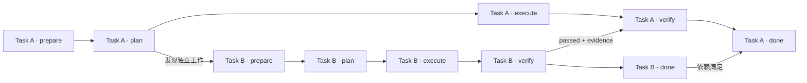

# Task Graph 设计

版本：v0.5
状态：Draft

Task Graph 保存尚未完成工作的因果关系。它不是 agent 通信图，也不保存一次运行中的每个工具调用。工具调用、prompt 组装和进程管理属于 Agent Runtime 的实现细节；Task Graph 只保留跨时间、跨 agent 仍然成立的工作义务。

设计基线见[设计基线](./design-rationale.md)，术语边界见[领域语言](./CONTEXT.md)。设计基线保留 Coordination Graph 与 Execution Graph 的分析区分；当前 MVP 将前者作为持久 Task Graph 的语义，将后者限制为 phase 内部的临时执行结构，不建立第二个持久图。

## 1. 设计定位

Task Graph 负责两件事：

1. 以固定 phase 表达 task 的责任边界和验收 gate。
2. 以具体 phase endpoint 表达跨 task 的依赖、阻塞、决策和验收关系。

Task Graph 不把每个执行步骤都提升成 task，也不把 agent session 当成工作身份。agent 可以退出、替换或重试，但 Task、Task Contract 和未完成的依赖关系不能随 session 消失。

## 2. 领域对象

### 2.1 Requirement、Task Contract、Task、Attempt 和 Invocation

这些对象不是同义词：

```text
Requirement
  保存人类或 agent 最初表达的目标、动机、约束和验收意图。
  它是 provenance，不是可直接调度的 task。

Task Contract
  固定要交付什么、为什么交付、允许的边界和怎样算完成。
  它不包含 planner 的实现步骤。

Task
  由一个 Task Contract 约束的持久工作身份。
  Task 不区分 root、child 或 subtask 类型，分解和依赖由 edge 表达。

Task Attempt
  对同一个 Task Contract 的一次有界尝试。
  验证失败、执行崩溃或输入 revision 过期，通常创建新的 attempt，而不是新的 task。

Agent Invocation
  在明确角色、输入、权限、预算和输出约束下对 agent 的一次使用。
  它是可替换的计算资源，不是持久项目身份。
```

### 2.2 Phase Endpoint

每个 task 使用同一套 phase：

```text
prepare -> plan -> execute -> verify -> done
```

phase endpoint 是 Task Graph 的编排锚点，不是 agent 进程状态：

| Endpoint | 满足条件 |
| --- | --- |
| `prepare` | Task Contract、输入基线、权限和必要上下文可用。 |
| `plan` | 影响面、依赖、权限需求和验证方法已经声明。 |
| `execute` | 候选交付及其观察证据已经产生。 |
| `verify` | 候选结果在明确 revision 上满足 Task Contract。 |
| `done` | 验收、依赖、合入或非代码交付条件全部成立。 |

endpoint 作为 source 时表示该阶段已完成并产生了信号和 evidence；作为 target 时，入边参与计算该阶段是否可以启动。`B.verify -> A.execute` 表示 B 的验证结果参与激活 A 的 execute，不表示 A 已经执行完成。

`done` 不启动 agent，它是图在验收、依赖和交付条件满足后得出的结论。

## 3. 核心规则

- `task` 是可编排的工作单元，不区分 root task / child task。
- Task Manager Agent 是 Task Graph 的唯一写入口；Scheduler、Runtime、worker agent 和 Merge Queue 只能读取，或提交带证据的 mutation request。
- 人类和 worker agent 只提交 requirement，不直接创建 task、edge 或 blocker。
- Task Manager 定义“做什么、为什么做、怎样算完成”；how 属于 plan 阶段。
- phase 内部的工具调用和 Agent 调用不自动成为 Task Graph 节点。
- `verify` 承担验收责任；merge 检查也属于 verify gate。
- `done` 只表示 task 已通过验收并满足相关编排条件。
- Worker capacity 只影响吞吐，不改变 Task Graph 的含义。

## 4. Edge 同时表达控制和数据

一条可执行的依赖边至少要说明 source endpoint、target endpoint、控制条件、需要传递的数据以及条件不满足时的处理方式：

```go
type TaskEdge struct {
	// From 是产生结果或信号的 phase endpoint。
	From PhaseEndpointRef `json:"from"`
	// To 是消费结果或等待信号的 phase endpoint。
	To PhaseEndpointRef `json:"to"`
	// Condition 决定 target endpoint 是否可以运行。
	Condition SignalCondition `json:"condition"`
	// Data 是 target 运行时必须消费的 evidence 或 message。
	Data []ArtifactOrMessageRef `json:"data,omitempty"`
	// OnFalse 描述条件为 false、结果失败或结果过期时的处理。
	OnFalse EdgeFailurePolicy `json:"on_false"`
}
```

不要只写笼统的 `A depends_on B`。应把 edge 连到最早真正需要结果的 endpoint：

```text
B.verify -> A.plan     A 的方案依赖 B 的已验证结论
B.verify -> A.execute  A 可以先规划，但实施必须等待 B
B.verify -> A.verify   A 可以先实施，但最终验收必须包含 B
```

edge 过早会无端损失并发，edge 过晚会让 agent 在无效前提上工作。每条 edge 都必须能回答：它阻止哪个 endpoint，什么结果解除阻止，哪些 evidence 或 message 沿边传递，以及失败或过期时怎么办。

## 5. Task 的默认生命周期

一次正常 attempt 的控制路径是：

```text
prepare -> plan -> execute -> verify
```

结果分为三类：

```text
verify passed 且交付条件满足 -> done
verify failed 但契约仍成立   -> 同一 task 的新 attempt
verify 发现独立前置工作      -> 新 task + 精确 endpoint edge
```

验证失败不是一条通往 done 的正常路径。旧 attempt 应保留失败证据，由 Task Manager 根据证据决定重新 plan、重新 execute、等待人类决定，或创建独立 task。

如果验证依赖的代码、graph 或外部输入 revision 发生变化，旧的 `verify passed` 必须失效。Scheduler 不得让 Merge Queue 静默复用绑定在旧 revision 上的验证结果。

## 6. Requirement 到图变更

所有新增需求都先通过 Agent Runtime 进入 Task Manager Agent，再由它更新 Task Graph：

```text
Human UI / planner / executor / verifier
  -> requirement + evidence refs
  -> Agent Runtime(role=task_manager, tool=graph_write)
  -> Task Manager 读取当前全局 Task Graph
  -> register / needs_fix / link_related / compile_graph / reject
  -> Task Graph（task / phase endpoint / decision endpoint / edge / blocker）
  -> Event Log 自动记录 mutation
  -> Scheduler 重新计算可运行 endpoint
```

agent-originated requirement 必须带稳定的 `client_ref`。相同 `client_ref` 重放时必须得到同一登记结果，避免网络重试或 Agent 重启造成重复 task。

Task Manager 可以增加全局关系，但不能改写 agent-originated requirement 的内容，也不能把自己的实现偏好写进 Task Contract。

## 7. Blocker、Decision 和 Stale Result

### Blocker

blocker 必须指向具体 endpoint，并说明解除条件。`task blocked` 只是 projection，不足以说明原因。

```text
A.execute blocked by B.verify
解除条件：B.verify = passed
需要数据：B 的 verification_summary 和 evidence refs
```

### Decision Endpoint

需要人工授权时，图中应出现 decision endpoint，而不是由 agent 推断批准：

```text
human.approved(plan_revision, scope) -> A.execute
```

### Stale Result

验证结果、context pack 和候选 diff 都必须绑定输入 revision。revision 变化后，Task Manager 根据影响范围让 task 重新 verify 或重新 plan，不能静默接受旧结论。

## 8. Task Boundary

默认把工作留在当前 phase 的内部执行步骤。只有满足下列至少一项时，才建立独立 task：

- 有独立、可测的完成条件；
- 可以独立失败或重试；
- 需要跨时间等待外部输入或人工决定；
- 需要不同权限、工作区或 owner；
- 结果会被其他 task 直接依赖；
- 生命周期超过当前 phase invocation。

文件读取、一次 tool call、局部摘要以及同一批准计划中的连续命令，通常不应单独建 task。Task 数量衡量的是独立责任，不是运行步骤数量。

## 9. Phase 内部执行结构

固定 endpoint 不限制 phase 内部的运行复杂度。一个 `plan` endpoint 可以包含：

```text
读取仓库约束(tool)
  -> 分析影响面(planner invocation)
  -> 校验计划结构(tool)
  -> 提交新 requirement(task-manager invocation)
```

这些步骤属于当前 phase 的临时执行结构，不自动成为持久 Task。只有内部工作需要独立验收、独立重试、跨时间等待、不同权限边界，或者结果要被其他 task 直接依赖时，Task Manager 才将它提升为新的 Task Contract，并把关系写回 Task Graph。

例如 `A.plan` 发现需要单独完成配置迁移时，可以登记 Task B，并只阻塞真正消费 B 结果的 endpoint：

```text
A.plan 产生 requirement B
Task Manager 创建 B.prepare -> B.plan -> B.execute -> B.verify
B.verify --passed + evidence--> A.execute
```

这次 phase 运行扩展了持久 Task Graph，但不因为“成功拆解”而让 A 完成。

## 10. 编排示意

下面的图只表达持久 Task Graph 中的 task、phase endpoint 和跨 task 依赖；不把 phase 内部的工具调用画成另一张图：



含义是：A 在 plan 阶段发现 B；B 通过验证后向 A 的 verify 提供结果；A 的 done 还需要满足 B 的完成条件。

## 11. 不变量

```text
1. Task 和 Task Graph 的寿命独立于 agent session。
2. Task Manager Agent 是 Task Graph 的唯一写入口。
3. Scheduler 只决定何时运行，不改变 Task Contract 或 edge 含义。
4. worker agent 只提交 requirement、结果和 evidence，不直接创建 task 或 edge。
5. 跨 task 关系尽量落到具体 Phase Endpoint。
6. 验证失败通常创建新 attempt，不创建新 task。
7. verify passed 必须绑定输入 revision 和 evidence；相关输入变化后信号失效。
8. done 只在验收和交付条件全部满足后成立。
9. 冲突、失败和人工决定必须保留可追溯证据。
10. 杀掉所有 agent 进程不能抹掉任何未完成义务。
```
