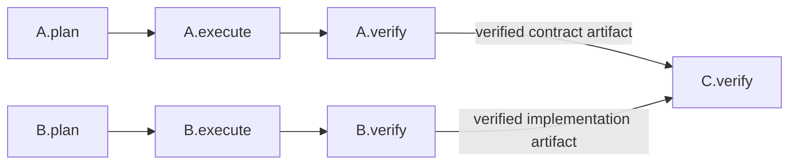
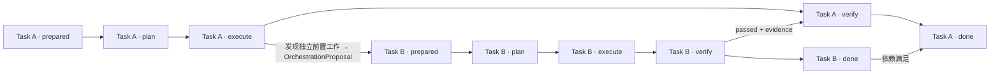

# Coordination Graph 与 Phase Endpoint 详细设计

版本：v0.6
状态：Draft

> **语义权威**：本文的编排语义以 [docs/threadmill-unified-design.md](./threadmill-unified-design.md) 为准；当本文与早期草案冲突时，以统一设计为准。本文第 9 节给出基于 `third_party/agentteams` 的实现映射，区分直接复用、适配封装、Threadmill 新建与不应复用四类。

---

## 1. 设计定位

Coordination Graph 保存 Task 之间尚未履行的因果义务，以 **Phase Endpoint** 为编排粒度。它不是 agent 通信图，也不是 Execution Graph：工具调用、prompt 组装、进程管理和 phase 内部的临时执行步骤属于 Agent Runtime 的执行现场，不进入 Coordination Graph。Threadmill 不建立 Execution Graph，phase 内执行结构不需要独立持久实体。

Coordination Graph 是可热修改的**当前编排**，不是不可变的工作流定义：

```text
Coordination Graph 保存什么：
  - Task、Task Attempt、Phase Endpoint、Decision Endpoint
  - endpoint 之间的依赖/阻塞边（控制 + 数据 + 失败策略）
  - 每个 phase 的 DeliverySpec 与 ReportSpec（endpoint 契约）
  - 阶段完成信号（PhaseOutput）及其交付物/报告/证据引用
  - 结果绑定的 input revision 与 Workspace revision

Coordination Graph 不保存什么：
  - phase 运行中的推理、工具输出、探索轨迹、未提交上下文
  - agent session、mailbox、消息
  - 任何"执行步骤图"
```

两条硬边界：

1. **只有 Task Manager Agent 能写 Coordination Graph。** Scheduler、Runtime、phase agent、Merge Queue 只能读取，或通过结构化编排建议（`OrchestrationProposal`）请求变更。
2. **图可以热修改。** 拆分、增加前置、调整串并关系、失败后重排都通过 Task Manager 对建议的审批后热修改完成；Event Log 只做审计，不限制修改。

## 2. 领域对象

```text
Requirement
  原始目标、动机、约束和验收意图；保存来源，不直接调度。

Task Contract
  稳定定义要交付什么、为什么、允许边界及怎样算完成；不包含实现步骤。

Task
  由 Task Contract 约束的持久工作身份；不区分 root/child，分解和依赖由边表达。

Task Attempt
  对同一 Task Contract 的一次有界尝试；拥有一份 Workspace Binding。

Phase Endpoint
  Task Attempt 中可被依赖、阻塞、激活和产出信号的命名端点。

Agent Invocation
  在明确角色、阶段、工作区、上下文、权限和预算下对 Agent 的一次有界调用。
```

每个 Task Attempt 只有三个工作阶段 `plan -> execute -> verify`，外加两个非工作端点：

- `prepared`：Task Contract、输入 revision、Workspace Binding、权限和初始上下文已装配；是运行前置条件，不启动 Agent。
- `done`：verify、依赖、人工决定和交付/合入条件全部成立后的图结论；不启动 Agent。

`done` 不是 phase agent 宣布的结果，而是 Task Manager 在图上的结论。

## 3. 图结构

### 3.1 节点：Phase Endpoint + 契约

每个可调度 phase 的 endpoint 必须同时规定 **DeliverySpec**（该阶段必须交付什么）和 **ReportSpec**（报告必须回答哪些问题）；未规定二者的 endpoint 不可调度。这是 Task Manager 编排每个 endpoint 时的强制动作。

| 阶段 | 默认交付物基线 | 默认报告基线 |
| --- | --- | --- |
| plan | Approved Plan、Declared Write Set、验证计划 | 方案、假设、依赖、权限、风险和所需 Context Subgraph |
| execute | diff/commit 或其他候选产物、Observed Write Set | 实际变更、偏差、新 Memory Candidate 和未解决问题 |
| verify | Verify Result、测试和检查证据 | 契约判断、证据、Workspace/Input revision、失败原因或通过理由 |

默认基线不替代具体 endpoint 的 `DeliverySpec`/`ReportSpec`。报告和交付物位于 Artifact Store；`PhaseOutput` 只是 endpoint 输出载荷，不新增 Delivery 实体。

### 3.2 边：控制 + 数据 + 失败策略

```go
type CoordinationEdge struct {
    ID        string                `json:"id"`
    From      PhaseEndpointRef      `json:"from"`
    To        PhaseEndpointRef      `json:"to"`
    Condition SignalCondition       `json:"condition"`
    Data      []ArtifactRef        `json:"data,omitempty"`
    OnFalse   EdgeFailurePolicy     `json:"on_false"`
    Freshness RevisionConstraint    `json:"freshness"`
}
```

每条边必须回答：

1. 哪个 source endpoint 产生信号；
2. 哪个 target endpoint 被阻止；
3. 什么条件解除阻止；
4. 哪些交付物、报告或证据 artifact 沿边传递；
5. source 失败、取消或过期时怎么办。

### 3.3 阶段结果与 revision

每个阶段结果至少绑定：

```go
type PhaseResultBinding struct {
    TaskID          string `json:"task_id"`
    TaskContractRef string `json:"task_contract_ref"`
    AttemptID       string `json:"attempt_id"`
    Phase           string `json:"phase"` // plan | execute | verify
    WorkspaceID     string `json:"workspace_id"`
    InputRevision   string `json:"input_revision"`
    WorkspaceHead   string `json:"workspace_head"`
    ContextSliceRef string `json:"context_slice_ref"`
}
```

Task Contract、依赖结果、代码基线、Workspace Head 或高影响上下文变化后，旧结果不能静默复用。Task Manager 按影响范围使 plan、execute 或 verify 失效；Scheduler 只执行该决定。

### 3.4 PhaseOutput

```go
type PhaseOutput struct {
    Endpoint             PhaseEndpointRef `json:"endpoint"`
    DeliveryRefs         []string         `json:"delivery_refs"`
    ReportRef            string           `json:"report_ref"`
    EvidenceRefs         []string         `json:"evidence_refs"`
    WorkspaceRevision    string           `json:"workspace_revision"`
    ContextGraphRevision int64            `json:"context_graph_revision"`
}
```

每个 phase 必须按 endpoint 的两项要求提交 `PhaseOutput`，否则不得进入 completed。Runtime 只校验输出形状和必填引用；Task Manager 能读取所有 completed endpoint 的报告、交付物和证据引用并据此继续编排，但不能读取未提交的运行过程上下文。阶段结果跨 Task 使用时，由 Coordination Edge 引用对应 endpoint 输出。

## 4. 串行、并行与阻塞

### 4.1 串行

```text
B.verify --passed + API evidence--> A.plan
```

表示 A 的方案依赖 B 已验证的 API。若 A 只在实施时需要 B，边应连到 `A.execute`；若只影响最终验收，则连到 `A.verify`。Manager 必须连接到最早真正消费结果的阶段，避免过早串行化。

### 4.2 并行

两个 endpoint 无控制边且 Workspace 不冲突时可并行：



并行资格由图语义、权限、预算和 Workspace 冲突共同决定。Worker Capacity 只影响同时运行多少 endpoint，不改变依赖含义。

### 4.3 阻塞与人工决定

"Task blocked"只是投影；权威 blocker 必须指向具体 endpoint：

```text
A.execute blocked by B.verify
condition: B.verify.status == passed
required data: schema_ref, verification_summary
on false: replan A

human.approved(plan_revision, risk_scope) -> A.execute
```

需要人工授权时，图中出现 decision endpoint（如 `human.approved(...)`），而不是由 agent 推断批准。

## 5. 失败、拆分、前置的统一协议：OrchestrationProposal

运行中的 phase agent 不直接向其他 Agent、Runtime mailbox 或 Coordination Graph 写消息。它可以像其他 Agent 一样探索、检索和订阅 Context Graph；也可以在发现当前编排不再合适时，主动向 Task Manager 提交编排建议。

Task Manager 不旁观 phase agent 的中间推理、工具输出、探索轨迹或未提交上下文。运行过程默认留在 Invocation 内；只有以下结构化边界输出可以进入 Task Manager：

1. 阶段结束时的 `PhaseOutput`；
2. 运行中主动提交的 `OrchestrationProposal`。

```go
type OrchestrationProposal struct {
    FromEndpoint         PhaseEndpointRef `json:"from_endpoint"`
    OrchestrationAdvice  string           `json:"orchestration_advice"` // split, dependency, serial/parallel, replan...
    DeliverySpecAdvice   string           `json:"delivery_spec_advice"`
    ReportSpecAdvice     string           `json:"report_spec_advice"`
    Rationale            string           `json:"rationale"`
    EvidenceRefs         []string         `json:"evidence_refs"`
}
```

**拆分机会、缺少前置、执行失败、验证失败和计划失效都使用同一种建议协议**，不按原因拆出 Split Request、Failure Request 或 Rework Task 等实体：

- 拆分机会 → `OrchestrationAdvice: split` + 对每个新 endpoint 的 DeliverySpec/ReportSpec 建议；
- 缺少前置 → `OrchestrationAdvice: dependency` + 建议的依赖方向与消费 endpoint；
- 串并调整 → `OrchestrationAdvice: serial/parallel` + 受影响 endpoint；
- 执行/验证失败 → `OrchestrationAdvice: replan`（或指明应开新 Attempt 而非新 Task）+ 失败证据引用；
- 计划失效（输入 revision 变化）→ `OrchestrationAdvice: replan` + 过期证据引用。

建议是**自由文本意图、理由和对未来 endpoint 契约的建议，不是图命令**。phase agent 不决定创建哪些 Task、如何连边或哪些 endpoint 失效。Runtime 只记录并转交（同一建议重复提交只转交一次），Task Manager 结合当前图和可见证据决定接受、改写或拒绝，并热修改 Coordination Graph。phase agent 可以在编排建议中提出新 endpoint 的要求，但正式契约只能由 Task Manager 写入图。

### 5.1 建议的运行时处理

Task Manager 收到建议后校验来源 endpoint、当前 graph revision、理由和 evidence，再决定是否热修改图：

- 接受拆分建议 → 创建必要 Task/endpoint、为每个新 phase 写交付物和报告要求并连接边；
- 接受失败或重排建议 → 调整尚待执行的计划和受影响 endpoint；
- 拒绝 → 只返回结构化理由。

Scheduler 不解释建议，只在图更新后重算 runnable endpoint。编排建议**不结束当前 phase**；Task Manager 的裁决必须明确当前 Invocation 是继续、阻塞还是取消；若允许继续，phase agent 最终仍须提交原 endpoint 的 `PhaseOutput`。

### 5.2 失败后的 Attempt 语义

```text
Task Contract
  -> Attempt N: plan -> execute -> verify
       -> passed + delivery conditions -> done
       -> failed, contract still valid -> Attempt N+1
       -> independent prerequisite found -> new Task + endpoint edge
       -> contract ambiguous/invalid -> blocked + decision endpoint
```

验证失败通常创建同一 Task 的新 Attempt，而不是新 Task。只有工作具有独立验收、独立失败/重试、不同权限或 Workspace、跨时间等待、被其他 Task 直接依赖等特征时，Task Manager 才创建新 Task。新 Attempt 默认从最新有效基线创建新的 Workspace；旧 Workspace 封存为 evidence。运行中的 Agent 若认为应局部修复、拆分任务或调整依赖，必须提交 `OrchestrationProposal`；Agent 和 Runtime 都不能自行跳转 phase。

## 6. revision 与结果失效

- 每个阶段结果绑定 `PhaseResultBinding`（input revision、Workspace Head、Context Slice）。
- verify passed 必须绑定输入 revision 和 evidence；相关输入变化后信号失效，Scheduler 不得让 Merge Queue 静默复用绑定在旧 revision 上的验证结果。
- Task Contract、依赖结果、代码基线、Workspace Head 或高影响上下文变化后，Task Manager 按影响范围使 plan、execute 或 verify 失效；Scheduler 只执行该决定。
- 热修改图的每次变更由 Event Log 审计；审计机制不限制 Coordination Graph 的运行时热修改。

## 7. 编排示意

下面的图只表达 Coordination Graph 中的 Task、Phase Endpoint 和跨 Task 依赖；不把 phase 内部的工具调用画成另一张图：



含义：A 在 execute 阶段发现独立前置工作，提交 `OrchestrationProposal`；Task Manager 审批后创建 Task B 并连边；B 通过验证后向 A 的 verify 提供结果；A 的 done 还需要满足 B 的完成条件。

## 8. 不变量

```text
1. Task 和 Coordination Graph 的寿命独立于 agent session。
2. Task Manager Agent 是 Coordination Graph 的唯一写入口；图可热修改。
3. Scheduler 只决定何时运行，不创建/修改 task、edge、blocker，不解释编排建议。
4. phase agent 只提交 PhaseOutput 与 OrchestrationProposal，不直接创建 task 或 edge。
5. 失败、拆分、前置、串并调整统一走 OrchestrationProposal，不新增其他建议协议或实体。
6. 跨 Task 关系尽量落到具体 Phase Endpoint。
7. 验证失败通常创建新 Attempt，不创建新 Task。
8. 每个 phase endpoint 必须有 DeliverySpec 与 ReportSpec，否则不可调度。
9. 每个阶段结果绑定 PhaseResultBinding；相关 revision 变化后信号失效。
10. done 只在验收和交付条件全部满足后成立。
11. 冲突、失败和人工决定必须保留可追溯证据。
12. 杀掉所有 agent 进程不能抹掉任何未完成义务。
```

## 9. AgentTeams 实现映射

AgentTeams 是归档基座，Threadmill 只复用其**已证实能力**：DAG/Loop 依赖计算、任务委派/确认/提交/检查状态机、结果接受与 requester report 路由、角色门控、共享文件同步。AgentTeams **没有** Event Log、Context Graph、git worktree、Merge Queue、Scheduler 或 DeliverySpec/ReportSpec 契约——这些由 Threadmill 新建，不宣称 AgentTeams 已有。

### 9.1 直接复用

| 能力 | AgentTeams 实现 | 说明 |
| --- | --- | --- |
| Project 生命周期 | `projectflow` 的 `create_project` / `pause_project` / `resume_project` / `complete_project` | `ProjectMeta`（`shared/projects/{project_id}/meta.json`）记录 status、plan_type、reply_route；状态机 `active / paused / completed / blocked`。 |
| DAG/Loop 图写入（热修改基元） | `projectflow(action=plan_dag\|plan_loop)` | **整体替换**当前 plan 并校验（重复 id、未知依赖、环），返回 ready nodes。`plan_dag` 的原子整体替换正是 Coordination Graph 热修改所需的基元。 |
| runnable 计算 | `projectflow(action=ready_nodes\|ready_loop_nodes)` | 只返回 pending 且全部依赖已 `completed`（被接受）的节点；project 非 active 时返回空。作为 Scheduler 的输入，不构成 Scheduler 本身。 |
| 结果接受（唯一推进入口） | `projectflow(action=accept_task_result)` | Leader 显式把已检查的 result 接受进 DAG/Loop plan（节点 → `completed`）。SUCCESS/SUCCESS_WITH_NOTES 不自动推进图。 |
| Loop 迭代 | `plan_loop` / `ready_loop_nodes` / `record_loop_iteration` | 迭代决策 `continue / replan / ask_user / stop_success / stop_blocked`，`stop_blocked` 对应 blocked + 人工决定。 |
| 任务委派/确认/提交/检查 | `taskflow` 的 `delegate_task` / `ack_task` / `submit_task` / `check_task` / `cancel_task` | `TaskMeta` 状态机 `prepared -> assigned -> in_progress -> submitted`；`delegate_task` 幂等（event_id 去重）并自动向 Team Room 发送 Worker 分配通知。 |
| 角色门控 | `third_party/agentteams/plugins/teamharness/mcp/server.py` 的 `_visible_tool_names` / `_role` 检查 | `delegate_task`/`check_task`/`cancel_task` 仅 leader；`ack_task`/`submit_task` 仅 worker/remote-member；`message` 对 worker 隐藏。直接复用为"只有 Task Manager（leader 面）持有写工具"的底层保障。 |
| 结果检查契约 | `taskflow(action=check_task)` + `TaskResult`（`result.md`：STATUS/SUMMARY/DELIVERABLES） | 读取并校验 result contract，返回 `effective`（SUCCESS / SUCCESS_WITH_NOTES），不改 DAG。 |
| 上下文恢复 | `projectflow(action=resolve_project)` | 从 projectId/taskId/parentTaskId/roomId/externalId 恢复 project context，供跨 session 恢复。 |
| 任务现场文件同步 | `filesync`（pull/push/stat/list，基于 mc mirror） | `shared/tasks/{task_id}/workspace/`、`deliverables/` 的同步；`taskflow` ack/submit 内部自带同步。 |

### 9.2 适配封装

| Threadmill 语义 | AgentTeams 载体 | 适配内容 |
| --- | --- | --- |
| Task Contract | `shared/tasks/{task_id}/spec.md` + plan.md 节点条目（task_id / title / depends_on） | Adapter 在 spec.md 头部写入 Task Contract 与 DeliverySpec/ReportSpec（AgentTeams 原生只有自由文本 spec）。 |
| Coordination Graph 投影 | `ProjectMeta` + `plan.md`（DAG/Loop 条目，marker `[ ] pending / [~] delegated / [x] completed / [!] blocked / [→] revision`）+ `TaskMeta` | AgentTeams 没有独立图存储；图状态是文件的可解析投影。Threadmill 侧保留自己的 Coordination Graph 语义，agentteams 投影由 adapter 维护。 |
| Phase Endpoint | DAG/Loop plan 节点状态机 | AgentTeams 无 plan/execute/verify 三分段；节点级 `completed` ≈ Threadmill 的 verify passed + 接受。三阶段 Attempt 语义由 Threadmill Runtime 在 Task 目录现场（workspace/ + deliverables/）内实现。 |
| PhaseOutput | `TaskResult`（result.md：STATUS/SUMMARY/DELIVERABLES/NOTES）+ TaskMeta 状态 | Adapter 把 endpoint 的 PhaseOutput（DeliveryRefs/ReportRef/EvidenceRefs）序列化进 result 协议并保留引用。 |
| 串行/阻塞 | `depends_on` + `ready_nodes` 的依赖已接受检查 | `delegate_task` 前置校验（`validate_delegate_task`：pending、依赖全部 completed）直接对应"阻塞未解除不得调度"。 |
| 失败处理 | `REVISION_NEEDED` / `BLOCKED` / `INTERRUPTED` 结果状态 | 这些结果不自动推进图；adapter 把失败证据转成 `OrchestrationProposal` 语义并交 Task Manager 决定（重新 plan_dag、新 Attempt 或等待人工）。 |

### 9.3 Threadmill 新建

AgentTeams 中不存在、必须由 Threadmill 新建的部分：

- **Coordination Graph 本体**（Task/Attempt/Phase Endpoint/边/DeliverySpec/ReportSpec/PhaseOutput/OrchestrationProposal 的语义与存储）；
- **graph revision / input revision 维护**（agentteams 的 plan.md 是整体替换，无 revision 计数；由 adapter 层递增并绑定结果）；
- **OrchestrationProposal 通道**（agentteams 无此协议；Runtime 记录转交、Task Manager 审批）；
- **Event Log**（审计全部图变更；agentteams 只有 Matrix 消息与文件状态）；
- **Context Graph / Ctx Manager / Context Slice / 订阅推送**（agentteams 用 shared/ 文件 + memory/ 笔记，无知识图）；
- **Scheduler**（`ready_nodes` 只提供可运行节点计算，调度选择是 Threadmill 新建）；
- **Merge Queue 与 git worktree 隔离**（agentteams 的 workspace/ 是共享目录，不是 git worktree，也没有 main 合并门）；
- **Workspace Binding 的 Attempt 级生命周期**（创建/复用/封存、phase lease、write set 观察）。

### 9.4 不应复用

| AgentTeams 能力 | 不应复用的原因 |
| --- | --- |
| 手工编辑 `shared/projects/**`、`shared/tasks/**`（shell/heredoc/直接写文件/Python 模块） | Leader/Worker AGENTS.md 与 project-management skill 均明令禁止；Threadmill 同样只经工具与 adapter 写图，禁止任何旁路写。 |
| Matrix `message` / `roomflow` 作为 agent 间编排通道 | Threadmill 禁止 Agent mailbox/AgentMessage；`message` 只保留 requester report（`ProjectMeta.reply_route`）与 `delegate_task` 自带的 Worker 分配通知这两个边界用途。 |
| Heartbeat 推进项目状态 | AgentTeams HEARTBEAT.md 禁止从 heartbeat 委派/完成任务/改 DAG；Threadmill 的 Task Manager 也不依赖 heartbeat 推进图。 |
| "Leader 在提示词循环里决定下一步 DAG"的编排模式 | Threadmill 的下一步编排由 Task Manager 基于图与 `OrchestrationProposal` 决定，不放在 agent 提示词里。 |

### 9.5 关键路径

```text
third_party/agentteams/copaw/src/copaw_worker/task.py
  ProjectMeta / DagTask / TaskMeta / TaskResult、MARKER_TO_STATUS、
  plan_dag / plan_loop / ready_nodes / ready_loop_nodes / record_loop_iteration、
  validate_dag（环/未知依赖/重复 id）、validate_delegate_task、
  prepare_task / commit_task_assignment / ack_task / submit_task / check_task

third_party/agentteams/copaw/src/copaw_worker/hooks/tools/projectflow.py
  create_project / plan_dag / plan_loop / ready_nodes / ready_loop_nodes /
  record_loop_iteration / check_active_tasks / pause_project / resume_project / complete_project

third_party/agentteams/copaw/src/copaw_worker/hooks/tools/taskflow.py
  delegate_task / check_task / ack_task / submit_task

third_party/agentteams/plugins/teamharness/mcp/server.py
  TOOL_NAMES、_projectflow / _taskflow / _roomflow / _filesync / _artifact、
  _visible_tool_names（角色门控）、_ready_nodes / _accept_task_result / _validate_task_graph

third_party/agentteams/plugins/teamharness/plugin.yaml
  prompts（TEAMS / leader / worker / remote-member / manager）、
  skills（team-coordination / project-management / task-delegation / task-execution / ...）、
  mcp tools（health / message / roomflow / filesync / artifact / projectflow / taskflow）、
  adapters（qwenpaw / claude-code）

third_party/agentteams/docs/teamharness-project-task-runtime-design.md
  ProjectMeta / TaskMeta 模型、状态定义、store protocol、Event Resume Contract

third_party/agentteams/docs/teamharness-boundary-and-contracts.md
  TeamHarness 职责边界（不拥有 controller/worker 生命周期/runtime hooks）

third_party/agentteams/manager/agent/team-leader-agent/AGENTS.md
  project/tool 边界：projectflow / taskflow / filesync / message 四工具的职责划分

third_party/agentteams/manager/agent/team-leader-agent/skills/project-management/SKILL.md
  projectflow actions 用法、pause/resume/complete 流程

third_party/agentteams/manager/agent/team-leader-agent/skills/task-management/references/dag-tasks.md
  ready_nodes 只认 Leader 接受的 [x]；REVISION_NEEDED/BLOCKED/INTERRUPTED 需新 plan_dag 后图才前进
```
