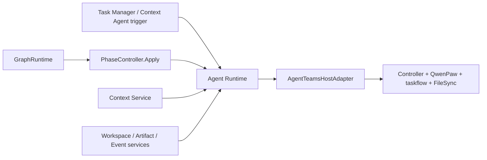

# AgentTeams Adapter 设计

> 状态：实现前设计基线
> 日期：2026-08-10
> 范围：定义 Threadmill 使用 AgentTeams 所需的最小能力、适配边界和改造项；不重复定义 Coordination Graph、Context Graph、Workspace 或 Artifact 的领域对象。

## 1. 结论

Threadmill 是控制面和领域语义的唯一 owner；AgentTeams 只是受控的 Agent 执行宿主。

`AgentTeamsHostAdapter` 位于 **Agent Runtime 内部**。Task Manager、Context Agent、Phase Agent 和 `GraphRuntime` 都不能直接调用 AgentTeams 的 Worker、taskflow、Matrix 或文件接口。

MVP 固定使用：

- `agentteams-controller` 管理 Manager / Worker 宿主；
- QwenPaw Manager 承载 Task Manager 与 Context Agent Invocation；
- QwenPaw Worker 承载 Phase Invocation；
- TeamHarness `taskflow` 承载一次有界执行；
- Higress 提供模型与 MCP 路由；
- MinIO / FileSync 运输 Workspace、结果和产物文件；
- Matrix 只承担 AgentTeams 内部任务通知和人工可见性。

WorkerFlow、其他 Agent runtime 和 AgentTeams 项目 DAG 不进入 MVP。



## 2. 最小能力全集与改造

| AgentTeams 必需能力 | 直接使用的原语 | Threadmill 基于此的改造 |
| --- | --- | --- |
| Agent 宿主与容量 | Manager / Worker CR、Pod 生命周期、`Running / Sleeping / Stopped`、heartbeat、ready worker 数 | Agent Runtime 把宿主视为可替换容量；Scheduler 只读取容量，不能让 controller 决定 Phase runnable；新增 Invocation 与宿主执行的关联及掉线处理。 |
| taskflow 运输载体 | `projectflow.resolve_project / create_project / plan_dag` | `delegate_task` 在基座中要求 task 已属于 provider project。Adapter 因此为每个 AgentTeams task 幂等创建一个不透明的单任务 carrier；该 carrier 只满足 TeamHarness 前置条件，不进入 Coordination Graph，不调用 `ready_nodes` 或 `accept_task_result`，也不暴露给 Agent。 |
| 有界执行协议 | `delegate_task / ack_task / submit_task / check_task / cancel_task` | 一次 AgentTeams task 只承载一次有界执行；Adapter 使用内部 dispatcher 身份生成只读执行说明、幂等委派并转换 observation，任何 Agent 都不获得 delegate/cancel 权限。 |
| 模型、MCP、Skill 与策略注入 | QwenPaw agent 配置、MCP server 管理、工具列表、MCP policy、`ToolWhitelist` | 按 Invocation 注入角色工具、短期 token、目录权限和预算；Phase、Task Manager、Context Agent 使用不同 capability；停止时撤销权限。 |
| 文件与对象运输 | `shared/tasks/{id}`、FileSync、MinIO、deliverable 路径校验、敏感内容拦截 | 任务目录只作载体；新增 Workspace Binding、基线、单写 lease、Observed Write Set、ArtifactRef、hash、ACL 与 Merge Queue。 |
| 结构化结果载体 | `result.md`、`submit_task.status`、deliverables、`check_task` | Adapter 只返回未信任结果；Runtime 补权威 binding，并校验输入 revision、DeliverySpec、ReportSpec、lease 和产物引用。`SUCCESS` 不等于 satisfied、done 或 merge。 |
| 健康、Trace 与原始事件 | heartbeat、WorkerStatus、task meta、task/project trace ID、Matrix task event | 新增 Event Log 投影和游标消费；统一记录 dispatch、ack、submit、stop、cancel、掉线和超时，供 Runtime 恢复与审计。 |

这些能力已经足够承载 Threadmill。Coordination Graph、Scheduler、GraphRuntime、Context Graph、Artifact Registry、Workspace lease 和 Merge Queue 全部由 Threadmill 新建，不能下沉到 AgentTeams。

## 3. Adapter 职责边界

Adapter 只负责：

1. 选择或准备符合要求的 Manager / Worker 宿主；
2. 将 Runtime 已批准的 Invocation 投影成不透明的单任务 carrier、AgentTeams task、QwenPaw 配置和执行目录；
3. 维护 Invocation 与 AgentTeams execution task 的关联；
4. 结束、取消或回收当前执行载体；
5. 读取未信任结果并输出原始 observation；
6. 将 AgentTeams 原始事实交给 Event Log 投影器。

Adapter 不负责：

- 判断 endpoint 是否 runnable、satisfied 或 invalidated；
- 修改 Coordination Graph 或解释 OrchestrationProposal；
- 选择 Context 内容、合并订阅或写 Context Graph；
- 创建 Workspace Binding、签发 phase lease 或决定允许写入的目录；
- 接受 PhaseOutput、判断 Task done 或合并 main；
- 把 Matrix 消息当作 Agent mailbox 或控制命令。

## 4. Agent 可见资源的生命周期

Agent 不拥有 Task 或全局资源。它只在一次 Invocation 中取得由 Runtime 绑定的引用和 capability；持久对象始终由 Coordination Graph、Context Service、Workspace Service、Artifact Store 等权威服务持有。

资源的**作用域**与**保留时间**必须分开。例如 PhaseOutput 属于一个 Phase，但其 ArtifactRef 和 Event Log 记录可以长期保留；ContextSliceRef 可用于结果溯源，但对应 Agent 的读取 capability 随 Invocation 结束失效。

| 生命周期 | 资源或访问权 | 真正 owner | 生命周期结束时 |
| --- | --- | --- | --- |
| Invocation | 模型 session/thread、AgentTeams task、Worker 占用、Runtime envelope、短期 token、工具白名单、预算、当前 Context Slice 使用权、SubscriptionID、临时工具状态 | Agent Runtime、Context Service、AgentTeams Adapter | 撤销 token/工具/订阅，关闭或轮换 session，释放 Worker，禁止旧 AgentTeams task 继续写入。 |
| Phase / generation | BindingRef、Generation、PhaseInputSet、InputRevision、phase lease、AllowedDirs、PhaseOutput、CheckpointRef、阶段 report/delivery/evidence | Coordination Graph、Agent Runtime、Workspace Service、Artifact Store | 释放 lease 和阶段写权限；输出、checkpoint 与 evidence 转为持久引用。 |
| Task / round | Task Contract、三个 Phase Endpoint、DeliverySpec/ReportSpec、TaskMemoryBuffer、task subgraph、Recipient binding、每轮 Workspace Binding、Declared/Observed WriteSet、Task 决策与 MergeCandidate | Coordination Graph、Context Service、Workspace Service、Merge Queue | 轮次结束时封存对应 Workspace；Merge Queue 成功后才能持久化 Task done，随后冻结候选缓冲并触发终审；图和审计记录可继续保留。 |
| 全局/项目 | Coordination Graph 整体、general Context Graph、Event Log、Artifact Store、Scheduler、Merge Queue、main、Manager/Worker 宿主、模型/MCP/Skill 注册表 | 对应平台服务 | 不随单个 Agent、Phase 或 Task 销毁；按项目、租户和保留策略治理。 |

### 4.1 各 Agent 获得的资源

| Agent | Invocation 级 | Phase 级 | Task / round 级 | 全局访问 |
| --- | --- | --- | --- | --- |
| Phase Agent（planner / executor / verifier） | session、token、工具、Context Slice、subscriptions、AgentTeams task | 当前 Binding、Inputs、lease、Workspace 权限、checkpoint、PhaseOutput | `TaskMemoryBufferRef`、当前轮次 `WorkspaceRef` | 只经受控接口读取 general Context 和注册 Artifact。 |
| Task Manager Agent | inputRef、DecisionRef 使用权、GraphSnapshot、Context Slice、subscriptions、TaskManagerGraph capability | 只读取结构化 PhaseOutput 与 stopped/failed evidence；不持有 phase lease | Task Contract / Endpoint 引用、task subgraph 投影目标与终审目标 | 无图存储、Scheduler、Workspace、Merge Queue 或原始 Event Log 权限。 |
| Context Agent | 检索/策展/审查 Invocation、工具和预算；Search 自动订阅绑定原请求方，不归 Context Agent | 无 Phase Binding、lease 或 Workspace 权限 | 只读取 Runtime 派发的冻结候选批次 | 仅经 Context Service 对 general 节点和 general 子图执行受控操作。 |

### 4.2 回收与跨层规则

1. `runtime.awaitInputs` 只释放当前物理执行载体；逻辑 Invocation 可保持 waiting，因此其订阅可继续存在。重新承载时必须重新物化 Context、Inputs 和 Workspace。
2. `stop -> resume` 会结束旧 Invocation。旧 session、token、AgentTeams task 和 SubscriptionID 全部失效；resume 使用新 Invocation、generation、lease 和 session。
3. Phase 结束只释放 phase lease，不删除 Task 的 Workspace Binding、TaskMemoryBuffer 或 Phase Endpoint。
4. 同一 Task 轮次的 plan / execute / verify 共享 Workspace Binding；验证失败后重开的是新轮次 Workspace，旧现场封存为 evidence。
5. AgentTeams Manager / Worker 是全局可复用宿主，但某次 Worker 占用和 AgentTeams task 仅属于当前 Invocation。
6. `ContextSubscription` 属于 Invocation；`WorkspaceBinding` 属于 Task 轮次；`PhaseEndpoint` 属于 Task；`PhaseOutput` 属于 Phase 但持久留档。不得仅按对象名称推断生命周期。

## 5. 核心内部记录与接口

Adapter 不新增业务对象，只保存一份执行关联：

```go
// AgentTeamsExecutionRef 是 provider 关联记录，不进入 Threadmill 领域模型。
type AgentTeamsExecutionRef struct {
    InvocationID    string // Threadmill 权威 Invocation
    AgentTeamsTaskID string
    HostRef         string // Manager 或 Worker
}
```

同一逻辑 Invocation 在 `awaitInputs` 后可关联新的 `AgentTeamsTaskID`；旧执行不得继续写入。控制面 `stop -> resume` 则必须创建新的 Invocation、generation、lease 和执行关联。

```go
// 仅 Agent Runtime 调用；不暴露给任何 Agent。
type AgentTeamsHostAdapter interface {
    Dispatch(ctx context.Context, invocationRef string) (AgentTeamsExecutionRef, error)
    Terminate(ctx context.Context, execution AgentTeamsExecutionRef, mode string) error
    Collect(ctx context.Context, execution AgentTeamsExecutionRef) (UntrustedExecutionResult, error)
    Observe(ctx context.Context, cursor string) ([]ExecutionObservation, error)
}
```

`Terminate.mode` 的最小集合为 `release_wait | recoverable_stop | cancel`：

- `release_wait`：结束当前 AgentTeams 执行，但保留 Threadmill 逻辑 Invocation 的 waiting 状态；
- `recoverable_stop`：Agent Runtime 已取得 checkpoint 后终止旧 Invocation 的执行载体；
- `cancel`：终止且不允许自动恢复。

`Dispatch` 同时承载 fresh start、等待后的重新承载和基于 checkpoint 的 resume；动作差异已经由 Agent Runtime 固定在权威 Invocation binding 中，Adapter 不自行判断。

## 6. 生命周期映射

| Threadmill 动作 | AgentTeams 行为 | 约束 |
| --- | --- | --- |
| 启动 Task Manager / Context Agent | 在 Manager 宿主创建有界 Invocation，注入对应工具集 | Manager 不拥有持久 Task 身份，也不能绕过 Runtime 使用宿主凭据。 |
| `PhaseCommand.start` | Agent Runtime 调用 `Dispatch`；Adapter 先幂等确认单任务 carrier，再执行 `delegate_task` | carrier 只是 taskflow 的运输前置，不是 Threadmill 图；一个 Endpoint + generation 只有一个幂等 Command ID，重复投递不能创建第二个有效 Invocation。 |
| Worker `ack_task` | 产生 `execution_acked` observation | 只说明执行已开始，不能写 endpoint 状态。 |
| `runtime.awaitInputs` | `Terminate(release_wait)`，释放模型线程和 Worker capacity | 保留同一逻辑 Invocation 与订阅；输入到达后重新物化 Context、Inputs 和 Workspace，再创建新 execution task。 |
| `PhaseCommand.stop` | Runtime 先调用可恢复 stop 回调、固定 Workspace 和 checkpoint，再 `Terminate(recoverable_stop)` | 没有 checkpoint 时必须显式记录 `non_resumable`；不能伪装成成功停止。 |
| `PhaseCommand.resume` | 新 Invocation、新 lease、新 session；Runtime 恢复 checkpoint 后再次 `Dispatch` | 不复活旧进程、旧 AgentTeams task 或旧 SubscriptionID。 |
| `submit_task` | Adapter `Collect` result.md、deliverables 和 task meta | 返回值全部未信任；Runtime 验证通过后才能形成 PhaseOutput。 |
| Task 取消、超时或 lease 失效 | 先撤销 MCP token 和写权限，再 `Terminate(cancel)` | AgentTeams `cancel_task` 是运输原语，不代表图状态已经更新。 |

## 7. Context 装配与移除

AgentTeams 只提供 MCP 注入和模型会话承载；Context 选择、订阅和权限由 Context Service 与 Agent Runtime 完成。

```text
TaskID + EndpointRef
  -> Context Service 匹配 task recipient 和 general seed
  -> 合并当前 ConsumerInvocationID 的全部有效 SubgraphIDs
  -> 权限、revision、recipient、预算过滤
  -> Agent Runtime 注入本次模型调用
```

适配要求：

1. 不同 Task 使用不同 task subgraph、TaskMemoryBuffer 和 Invocation；即使订阅同一 general subgraph，也使用不同 SubscriptionID。
2. 同一 Task 的 plan / execute / verify 分别创建 Invocation，按各自 EndpointRef 重建 Context Slice；三阶段只共享 TaskMemoryBuffer。
3. 初始订阅、检索自动订阅和显式订阅按当前 `ConsumerInvocationID` 取并集；Adapter 不保存第二套订阅状态。
4. `context.unsubscribe` 成功后，Runtime 在下一次模型调用前重新物化；重叠订阅仍覆盖的子图继续保留。
5. 已送入当前模型调用的内容不能追溯删除。上下文不得作为普通消息永久追加到可复用会话；若 QwenPaw session 无法裁剪旧上下文，Adapter 必须轮换 session 并从 Runtime checkpoint 重建。
6. `awaitInputs` 不结束逻辑 Invocation，订阅可继续存在；stop、resume、reopen 或进入下一 Phase 会结束旧 Invocation，旧订阅随之过期。

`spec.md` 只保存任务说明和权威引用，不保存可变的完整 Context。Context Slice、Delta 和取消订阅后的新范围由 Runtime 在调用边界装配。

## 8. 执行目录与结果转换

```text
shared/tasks/{agentteams-task-id}/
  spec.md                         # 人类可读执行说明
  threadmill/phase-envelope.json  # Runtime 生成，只读/校验签名
  workspace/                      # 受 Workspace Binding 与 lease 约束
  progress/                       # 临时过程文件，不作为跨 Phase 输入
  result.md                       # 人类可读报告
  deliverables/                   # 待注册的受控产物
```

Adapter 必须保证：

- Worker 不能通过修改 envelope 改写 TaskID、EndpointRef、generation、InputRevision 或权限；
- deliverable 必须位于受控目录，但路径合法仍不等于 Artifact 合法；
- Runtime 对文件计算 hash、注册 ArtifactRef，并绑定来源、权限和 revision；
- 上游未提交 Workspace 文件、progress 文件和会话内容不能成为下游输入；
- `UntrustedExecutionResult` 不携带可信 Threadmill binding，所有 binding 由 Runtime 根据 Invocation 补入。

## 9. 失败、安全与恢复

| 情况 | 必须行为 |
| --- | --- |
| `Dispatch` 超时但 task 可能已创建 | 使用稳定 Command ID / AgentTeamsTaskID 查询并幂等恢复，禁止盲目创建第二个 task。 |
| Worker 掉线或 heartbeat 过期 | 记录失败 observation，撤销 token 与 lease；是否重开由 Task Manager 裁决。 |
| stop 回调超时 | 硬停止，记录 `non_resumable`；GraphRuntime 不得把它降级为可恢复 resume。 |
| MCP policy 或凭据撤销失败 | 网关拒绝旧 token；无法证明围栏成功时终止宿主，不释放写 lease。 |
| 取消订阅后 session 仍含旧内容 | 轮换 session；敏感权限撤销时直接终止 Invocation。 |
| result 输入 revision、generation 或 lease 过期 | Runtime 拒绝结果并保留为 evidence，不更新 endpoint。 |
| Event Log 投影器重启 | 依靠 cursor、稳定 task ID 和幂等事件键重放，不从 Matrix 文本猜测状态。 |

QwenPaw 的配置 API 能证明“可以设置策略”，不能证明 Invocation 级目录、预算和 token 撤销已经被强制执行。MVP 上线前必须通过集成测试验证；控制器声明不能替代网关和 Workspace 层的实际围栏。

## 10. 明确不复用

- 不把 `projectflow`、`ready_nodes` 或 WorkerFlow DAG 当作 Coordination Graph；仅允许 Adapter 内部使用 `resolve_project / create_project / plan_dag` 创建单任务运输 carrier，禁止把 carrier 状态投影为 runnable、satisfied、done 或 merge；
- 不让 AgentTeams Leader 写图、接受结果或决定 Task done；
- 不把 Matrix 房间、mention 或 message 工具当作 Agent 间通信；
- 不把 `TaskMeta` / `ProjectMeta` 当作 Threadmill 状态存储；
- 不把 `SUCCESS`、`accept_task_result` 或文件发布当作 merge；
- MVP 不支持 OpenClaw、Hermes 等多 runtime，也不启用 WorkerFlow 子 agent；
- 不修改归档 AgentTeams 的领域模型，改造集中在 Threadmill Adapter、MCP 和部署配置。

## 11. 验收标准

1. 相同 dispatch 命令重复执行只产生一个有效 execution task。
2. Phase Agent、Task Manager 和 Context Agent 获得的工具集互不越权。
3. waiting 后旧 execution 无法继续调用工具或写 Workspace。
4. stop 只有在持久化 checkpoint 或 `non_resumable` 事实后才完成。
5. resume 使用新 Invocation、新 lease、新 session 和新 AgentTeams task。
6. `SUCCESS` 但缺少合规 report、deliverable 或 binding 的结果被拒绝。
7. 只有 ArtifactRef 能跨 Phase；原始路径和未提交 Workspace 内容被拒绝。
8. 取消订阅后下一次模型调用不再注入该订阅独占子图；不可裁剪 session 会被轮换。
9. Worker 掉线、Adapter 重启和重复 observation 不会产生重复图转换。
10. Task Manager 仍是 Coordination Graph 唯一写入者，Adapter 无图写能力。

## 12. 依据

- [Agent Runtime 设计](./agent-runtime.md)
- [Coordination Graph 与 GraphRuntime](./coordination-graph.md)
- [Phase Agent 接口](./phase-agent.md)
- [Task Manager Agent](./task-manager-agent.md)
- [Context Graph 接口](./context-graph.md)
- [Workspace 与 Merge](./workspace-merge.md)
- [TeamHarness taskflow](../third_party/agentteams/plugins/teamharness/mcp/server.py)
- [AgentTeams Worker 类型](../third_party/agentteams/agentteams-controller/api/v1beta1/types.go)
- [QwenPaw API](../third_party/agentteams/qwenpaw/src/qwenpaw_worker/api.py)
- [QwenPaw heartbeat](../third_party/agentteams/qwenpaw/src/qwenpaw_worker/heartbeat.py)
- [TeamHarness task trace](../third_party/agentteams/plugins/teamharness/adapters/qwenpaw/task_trace.py)

## 13. 关键决策与取舍

| 决策 | 原因 | 取舍 |
| --- | --- | --- |
| Adapter 只位于 Agent Runtime | 保持图、上下文和执行宿主解耦 | Runtime 必须承担更多校验与事件投影。 |
| MVP 只支持 QwenPaw + taskflow | 已有 MCP policy、task lifecycle 和可观测原语 | 暂不提供多 runtime 可移植性。 |
| 每次执行有独立 AgentTeams task | 便于幂等、围栏、审计和回收 | waiting / resume 会增加 task 数量。 |
| 结果一律视为未信任 | AgentTeams 状态不含 Threadmill binding 与验收语义 | Runtime 必须执行二次注册和验证。 |
| 每次模型调用重新装配动态 Context | 才能正确实现订阅并集、取消和权限变化 | 不可裁剪 provider session 需要轮换与重建。 |
