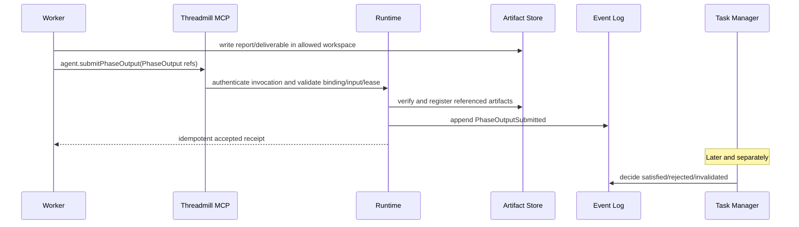
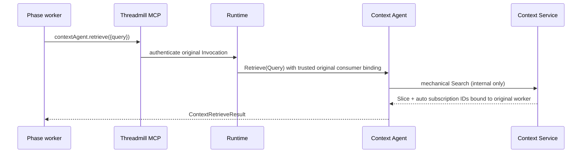
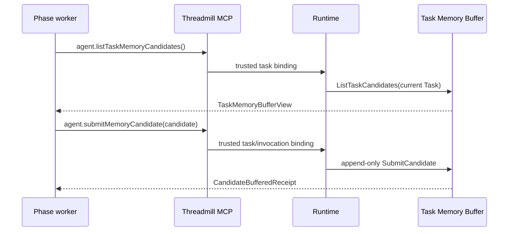
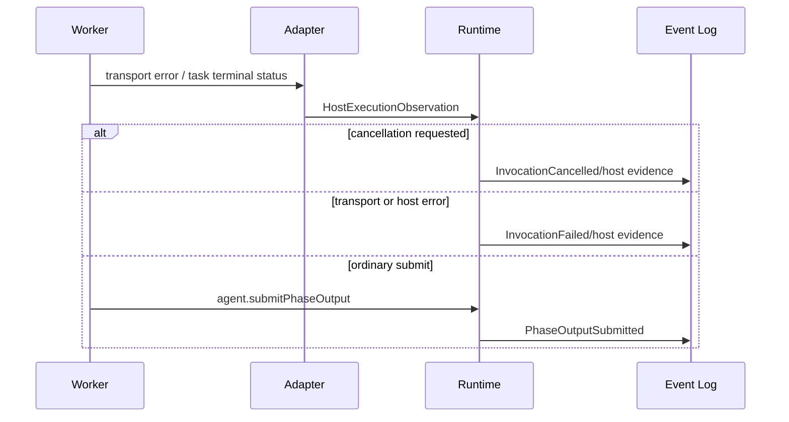

# Threadmill Phase Agent 与 AgentTeams 适配设计

> 状态：重写设计稿（不含实现）  
> 基线：Threadmill `dev` @ `d807e5dd`；AgentTeams `main`（2026-08-11 读取）  
> 语义优先级：`threadmill-unified-design.md`；Phase 生命周期与 Agent-facing interface 以 `phase-agent.md` 为准；Context DTO/reader 以 `context-graph.md` 为准。

## 0. 结论、术语和标记

Threadmill 是**控制面、领域事实和安全边界**的唯一 owner；AgentTeams 是可替换的**执行承载**。Phase Agent Core、Runner 和 Task Manager 均不得 import 或理解 TeamHarness task ID、Matrix room、WorkerFlow run 或 QwenPaw session。

本文统一使用以下标记，未证实的能力绝不归入“已存在”。

| 标记 | 含义 |
| --- | --- |
| **已存在** | 已在本次读取的 AgentTeams main 源码或技能中确认。 |
| **需要 Threadmill Adapter** | 可复用承载能力，但需转换、鉴权、关联或审计。 |
| **Threadmill 新建** | AgentTeams 没有相应的领域能力，必须由 Threadmill 实现。 |
| **暂不实现** | 不进入当前 MVP，也不能当作现有能力。 |

推荐方案为 **B 的受控变体**：Agent Runtime 内选择 `PhaseExecutor`，其中一个 provider 实现是 `AgentTeamsHostAdapter`；它再调用 TeamHarness taskflow。也就是：

```text
Runner -> PhaseExecutor (provider-neutral port)
       -> AgentTeamsHostAdapter (one provider implementation)
       -> TeamHarness taskflow / QwenPaw worker
```

这不同于 A（把 Adapter 直接塞进 Core），也不同于 C（让 Runner 认识 taskflow）。优点是 Provider 选择、凭据、Host 生命周期和故障翻译留在 Runtime 边界，Runner 仍只依赖 `PhaseExecutor.Execute(ExecutionContext)`。

## 1. 已重新核对的事实

| AgentTeams 面 | 已证实事实 | 不能推导出的能力 | 分类 |
| --- | --- | --- | --- |
| TeamHarness taskflow | Worker 技能要求读取 `shared/tasks/{task-id}/spec.md`，调用 `ack_task`，完成后以 `submit_task` 提交 `SUCCESS`、`SUCCESS_WITH_NOTES`、`REVISION_NEEDED` 或 `BLOCKED`；worker 拥有 `workspace/`、`progress/`、`result.md`。 | Task Contract、Phase Endpoint、PhaseInputSet、BindingRef、PhaseOutput、revision 或 endpoint acceptance。 | **已存在**承载；领域语义为**Threadmill 新建**。 |
| TeamHarness 沟通/项目流 | MCP 暴露 `message`、`roomflow`、`projectflow`、`taskflow` 等；源码有 `MESSAGE_TOOL_BLOCKED_ROLES={worker,remote-member}`。 | Taskflow/projectflow 不是 Coordination Graph，`accept_task_result` 不是 Threadmill 的 acceptance。 | **已存在**，普通 Phase Agent 必须**Adapter 禁用**。 |
| WorkerFlow | `worker_agentflow.workflow_run/update/finish/fail`、临时 `tmp-` agent、run 级 shared 目录与 DAG；由当前 Worker 驱动和合并。 | 持久 endpoint 调度、跨执行等待、checkpoint、PhaseOutput。 | **已存在** phase 内并行；默认编排为**暂不实现**。 |
| QwenPaw | API client 有 MCP client 的 create/update/delete、工具列举、MCP policy GET/PUT，以及 agent 配置/启停。 | 已验证的 invocation 级 token 注入、目录 ACL、工具实时重配、暂停/恢复、模型 session checkpoint 或 worker callback。 | MCP 安装为**已存在**；安全语义须**Adapter + Threadmill 新建**并测试。 |
| 文件/同步/Matrix | TeamHarness 任务文件与 deliverables、MinIO 同步和 Matrix artifact 发布存在。 | 内容寻址 Artifact Store、Event Log、ArtifactRef/权限/来源链、workspace merge。 | 文件承载**已存在**；权威事实为**Threadmill 新建**。 |

本次源码中没有发现 taskflow 或 QwenPaw 的 `suspend`、`resume`、`checkpoint` API，也没有证明运行中 worker 能可靠接收 Threadmill 的 ContextDelta/InputsChanged 回调。因此不得把它们设计成 AgentTeams 原生能力。

## 2. 分层与职责边界

| 层/组件 | 职责 | 分类 | 禁止承担 |
| --- | --- | --- | --- |
| Phase Agent Core | `StartPhaseInput`、生命周期 DTO、输入/输出、Context seams、Runtime outbound port、能力模型。 | **Threadmill 新建**（已完成核心契约）。 | provider、MCP transport、图/存储实现、AgentTeams。 |
| Runner | 由 endpoint 推导 Role/Capabilities，创建 transient `ExecutionContext`，调用一个 `PhaseExecutor`。 | **Threadmill 新建**。 | taskflow、worker 选择、GraphRuntime、Task Manager。 |
| PhaseExecutor | provider-neutral 单次执行 port；返回执行健康，不返回 `PhaseOutput`。 | **Threadmill 新建**（接口）。 | endpoint acceptance、Task done。 |
| Agent Runtime | 解析 BindingRef、装配 workspace/context/memory、取 lease、注入受信身份/权限、选择 Host、验证结构化提交、记录事件。 | **Threadmill 新建**。 | 业务编排和知识判断。 |
| AgentTeamsHostAdapter | `PhaseExecutor` 的 AgentTeams provider 实现；生成 host task、配置 QwenPaw/MCP、观察 taskflow、翻译宿主状态。 | **需要 Threadmill Adapter**。 | 写 Coordination Graph、解释 BindingRef、把 result.md 当 PhaseOutput。 |
| TeamHarness taskflow | 委派、ack、worker 任务目录、submit/cancel 等承载协议。 | **已存在**。 | Threadmill 生命周期、等待、checkpoint、验收。 |
| WorkerFlow | 当前 phase worker 内的短期辅助 fan-out。 | **已存在**。 | 默认阶段载体、跨 Invocation 持久状态。 |
| QwenPaw | 模型 worker/agent 与 MCP plugin 配置宿主。 | **已存在**。 | Task Contract、Context Graph、可靠 checkpoint。 |

Task Manager 仅写 Coordination Graph；它不调用 Adapter。GraphRuntime/PhaseController 决定 start/stop/resume，Adapter 从不绕过该路径。

## 3. 当前领域映射

### 3.1 Start 与 ExecutionContext

`StartPhaseInput` 的唯一输入形状为：

```go
{ InvocationID, Endpoint, Generation, BindingRef, Inputs }
```

`BindingRef` 由 Runtime 解析，绝不交给 AgentTeams、worker 或模型自行解释。映射如下：

| 信息 | 进入哪里 | 可见性 | 分类 |
| --- | --- | --- | --- |
| Task Contract、DeliverySpec、ReportSpec、批准计划摘要、输入投影 | `spec.md` 的只读执行说明。 | Worker 可读；不是权威副本。 | **需要 Threadmill Adapter** |
| `InvocationID`、endpoint、generation、lease ID、MCP audience/token、host task ID | private phase envelope / Adapter 持久关联。 | 模型不见 token 和内部 ID。 | **需要 Threadmill Adapter** |
| Context slice、当前有效订阅并集、Task Memory view | 由 Runtime 装配进每次模型调用/await rehydration 的 host context。 | 仅已授权内容。 | **Threadmill 新建** |
| Workspace Root、AllowedDirs、只读/写 mount | Host mount、文件系统 ACL/容器隔离。 | worker 只见允许路径。 | **需要 Threadmill Adapter** |
| `PhaseCapabilities` | MCP allow policy、宿主启动约束、文件系统策略。 | 可见的工具清单及 prompt。 | **需要 Adapter**；强制机制为**Threadmill 新建** |
| BindingRef、Graph revision、permission snapshot、原始 ContextSliceRef、TaskMemoryBufferRef | Runtime/Artifact/Event records。 | 不暴露。 | **Threadmill 新建** |

`ExecutionContext` 只在 Threadmill 进程内存在。Adapter 消费已经解析、受限后的 surface，不序列化 `Runtime`、`ContextReader` 或 `ContextAgent` 接口本身。

### 3.2 PhaseCapabilities 到 Host policy

| Phase | MCP allow policy | FS / lease | 允许的 Threadmill 工具 | 强制分类 |
| --- | --- | --- | --- |
| PLAN | 仅 Phase 工具、Context reader/retrieve、memory、await、proposal/requirement、output；不注入项目/图/消息工具。 | 源码只读；只可写 `plan/` 的结构化 artifact；无 implementation write lease。 | submit plan output、候选记忆、proposal。 | **Adapter + Threadmill 新建** |
| EXECUTE | 同上，加经审批的执行/检查工具。 | 只在 Approved Plan/Declared Write Set 的 AllowedDirs 取得唯一写 lease。 | deliverable/evidence/output。 | **Adapter + Threadmill 新建** |
| VERIFY | 仅检查/证据工具与 Phase MCP；不可见实现编辑器/写工具。 | 候选实现只读，可写 `evidence/`；无 implementation write lease。 | evidence/output/proposal。 | **Adapter + Threadmill 新建** |

所有普通 Phase Agent 都必须隐藏/拒绝 `plan_dag`、`accept_task_result`、`projectflow`、Coordination Graph write、Agent mailbox/message、Context Search 和项目级 orchestration。TeamHarness 虽已有其中若干工具，**其存在不等于授权**。

## 4. Fresh start 与正常输出

```mermaid
sequenceDiagram
  participant GR as GraphRuntime
  participant PC as PhaseController
  participant AR as Agent Runtime
  participant WS as Workspace Service
  participant CS as Context/Memory Service
  participant R as Runner
  participant A as AgentTeamsHostAdapter
  participant T as TeamHarness taskflow
  participant W as QwenPaw Worker
  participant MCP as Threadmill MCP
  participant ES as Event/Artifact Store

  GR->>PC: Apply(PhaseCommand.start)
  PC->>AR: StartPhase(StartPhaseInput)
  AR->>AR: resolve BindingRef; validate Inputs
  AR->>WS: assemble binding, AllowedDirs, phase lease
  AR->>CS: assemble Context + Task Memory view
  AR->>AR: enforce PhaseCapabilities
  AR->>R: RunStart(ExecutionContext)
  R->>A: PhaseExecutor.Execute(ctx, execution)
  A->>T: delegate_task(private envelope + spec.md)
  T->>W: TASK_ASSIGNED
  W->>T: ack_task
  W->>MCP: model/tool work; agent.submitPhaseOutput
  MCP->>AR: trusted token binds invocation/task/role
  AR->>ES: validate/register output facts
  AR-->>MCP: accepted or rejected
  W->>T: submit_task(result.md + evidence paths)
  A-->>R: host execution finished (nil)
  AR->>ES: append PhaseOutputSubmitted
```

`Execute` 创建一个 host task，选择满足 provider/model/region/能力标签的 worker，写只读 `spec.md`，安装 role prompt 与受限 Threadmill MCP，并等待宿主的 terminal observation。

`Execute` 返回 `nil` 仅表示该 host execution 已正常结束，或已由 Runtime 明确终止为 waiting/stopped；它**不表示** endpoint satisfied、Task done 或 PhaseOutput 已提交。下列情况返回 error：delegate/ack/transport/host 崩溃、无法装配/配置 host、未经 Runtime 认可的终止，或 host 最终失败且没有被 Runtime 转化为受控 waiting/stopped。Worker 的 `submit_task SUCCESS` 仅是 evidence；`agent.submitPhaseOutput` 仍是正式边界动作。



### result.md 选择

选择 **C：MCP 是权威提交，result.md 是回退证据和人类可读报告**。

| 方案 | 结论 |
| --- | --- |
| A：仅实时 MCP | 语义最清晰，但崩溃后需要从 Event Log/Artifact Store 恢复；仍应保存可读报告。 |
| B：从 result.md 解析 PhaseOutput | 拒绝。文件无受信 identity，`submit_task` 又会结束 task；解析会把非权威文本提升为领域事实。 |
| C：MCP 权威 + result.md 证据 | **推荐**。MCP 作幂等的 `agent.submitPhaseOutput`，Runtime 写 Event Log；result.md 和 deliverables 注册为 Artifact evidence。崩溃时扫描 host evidence 只可诊断/重投，不自动把文本变成 Output。 |

`PhaseOutputSubmitted` 是独立 Event/Artifact 事实，不能成为 InvocationState；随后才由 Task Manager/政策判定 endpoint satisfied/rejected/invalidated。

## 5. awaitInputs：同一逻辑 Invocation 的重新承载

AgentTeams taskflow 的 `submit_task` 会结束任务，当前代码没有 suspend/re-enter API。因此 waiting 不能映射为 taskflow resume。

```mermaid
sequenceDiagram
  participant PA as Phase Agent
  participant AR as Threadmill Runtime
  participant AT as AgentTeams Adapter
  participant TF as taskflow/QwenPaw host
  participant CG as Coordination Graph
  PA->>AR: runtime.awaitInputs(request)
  AR->>CG: verify declared completion input; mark logical Invocation waiting
  AR->>AT: stop/release current host capacity if possible
  AT->>TF: terminate or let bounded worker invocation exit; do not submit completion
  Note over AR: InvocationID and Generation are retained
  CG-->>AR: declared input arrives/invalidates; new InputRevision
  AR->>AR: reassemble binding, context, memory and latest PhaseInputSet
  AR->>AT: create fresh host task for same InvocationID/Generation
  AT-->>PA: continue execution with latest inputs
```

**需要 Threadmill Adapter** 的模拟是：保存 only explicit continuation data allowed by the phase runtime (not hidden reasoning/session), finish/reclaim current host, then create a new AgentTeams task bound to the same logical InvocationID and Generation. “重新承载”不能调用 `PhaseCommand.resume`，不能使用 CheckpointRef，不能复用 QwenPaw/model session。若 Agent 无可安全显式 continuation，则重新以最新装配的 spec/context 启动，并让 worker 从已持久的 Workspace/artifacts 继续。

M4 前不实现此能力；MVP 对 await 请求返回明确 unsupported/controlled failure，而不是伪装成 taskflow suspend。

## 6. stop / checkpoint / resume：新的 Invocation

```mermaid
sequenceDiagram
  participant PC as PhaseController
  participant AR as Agent Runtime
  participant PA as Phase Agent
  participant AS as Artifact Store
  participant AT as AgentTeams Adapter
  PC->>AR: PhaseCommand.stop
  AR->>AT: revoke MCP token/tool access; stop host
  AR->>PA: StopPhaseInput
  PA-->>AR: StopPhaseAck(ResumeStateRef)
  AR->>AS: register structured ResumeState -> CheckpointRef
  AR->>AR: terminate old Invocation; release lease
  PC->>AR: PhaseCommand.resume(new InvocationID, Generation, BindingRef, CheckpointRef)
  AR->>AS: load/validate checkpoint
  AR->>AT: new host task, new lease, current binding
  AT->>PA: RunResume with explicit ResumeState
```

`ResumeState` 只可包含 `CompletedWork`、`PendingWork`、`ConsumedInputIDs`、`NextSafeStep` 等显式、安全的进度；CheckpointRef/ResumeStateRef 都是不透明引用。**Threadmill 新建**结构化 checkpoint 注册、兼容性校验、旧 Invocation 终止和 lease 释放。AgentTeams/QwenPaw 不提供可复用 session checkpoint，故明确不复用旧模型 session、worker memory、QwenPaw session、hidden reasoning 或旧 InvocationID。

普通工具须先撤销，再请求停止；Adapter 只能执行宿主终止/清理，不能自行产生 checkpoint。该完整流为 M5，非 MVP。

## 7. Context 与 Task Memory

### 7.1 Context surface

Phase Agent 只见以下 Threadmill MCP 工具：

```text
context.listSubgraphs  context.explore  context.subscribe  context.unsubscribe
contextAgent.retrieve
```

`context.search` 仅装给 Context Agent，绝不装给普通 Phase Agent。QwenPaw 可配置 MCP client 和 policy 是**已存在**的安装基础；Threadmill MCP server、token audience、调用鉴权和 Context Service 都是**Threadmill 新建**。

每次 MCP request 的可信 token 由 Runtime 签发/传递，服务器从 token/host connection 取得 `InvocationID`、TaskID、endpoint role、Generation、permission snapshot 与 `ConsumerInvocationID`。这些字段不出现在 Agent 可填写的请求 DTO 中。`Subscribe` 返回的 subscription 绑定该 consumer invocation；Runtime 在下一 model turn、await rehydration 或 resume 装配前重算订阅并集。取消只影响该 subscription，已注入当前模型调用的内容不可追溯删除。



### 7.2 Task Memory



TaskID 不由 agent 指定。`submitMemoryCandidate` **不等于 Context Graph write**：它只入当前 Task 的 append-only buffer，Task done 后才由 Context Agent 批量审查。此 buffer 与 Context Graph、订阅和 graph revision 无关。

### 7.3 ContextDelta 与 InputsChanged

```mermaid
sequenceDiagram
  participant CS as Context subscription executor
  participant AR as Runtime
  participant AT as AgentTeams Adapter
  participant W as Worker
  CS->>AR: ContextDelta(subscription-bound)
  AR->>AT: optional active-host update
  Note over AT,W: No reliable AgentTeams callback proved
  AT-->>AR: cache for next model turn / rehydration, or restart host
  AR->>AT: InputsChanged(complete latest PhaseInputSet)
  Note over AR: InputsChanged replaces formal inputs; Delta never does
```

M6 的默认策略是 **下一 model turn 注入**；若 host 不支持安全 turn boundary，则在 await rehydration 重新装配，最后才是受控 execution restart。实时 callback 是**暂不实现**，除非 QwenPaw 实测证明其可回压、可鉴权、可排序。ContextDelta 是订阅知识更新，不能改 `PhaseInputSet`；InputsChanged 传完整最新 InputSet 和 InputRevision。

```mermaid
sequenceDiagram
  participant CG as Coordination Graph
  participant AR as Runtime
  participant AT as Adapter
  participant W as Worker
  CG-->>AR: declared input changes
  AR->>AR: construct complete latest PhaseInputSet + InputRevision
  AR->>AT: InputsChanged
  AT-->>W: inject at next safe model turn, or retain for rehydration
  Note over W: Replaces formal input view only; not a ContextDelta
```

## 8. 宿主结果、事件与错误

| AgentTeams 原始事实 | Threadmill 处理 | 分类 |
| --- | --- | --- |
| task meta、ack、submit status、heartbeat、trace、Matrix event | 注册为 execution evidence/event attributes，可用于诊断、重试和审计。 | **需要 Adapter** |
| `result.md`、deliverables | 受控路径读取、hash/权限/来源校验后注册 ArtifactRef；不解析为 PhaseOutput。 | **需要 Adapter + Threadmill 新建 Store** |
| Phase MCP 的 output/proposal/requirement/memory 调用 | Runtime 做 input/lease/role/shape/幂等验证，写相应 Event/Store。 | **Threadmill 新建** |
| AgentTeams SUCCESS / BLOCKED / REVISION_NEEDED | 只映射 host terminal evidence 或 candidate phase failure；绝不直接 endpoint satisfied/Task done。 | **需要 Adapter** |



Cancellation/error is not PhaseOutput. A worker may submit an explicit blocked/failure PhaseOutput only when the endpoint contract permits one; otherwise Adapter reports host failure and Runtime/Task Manager decides the next graph action.

## 9. MVP 与阶段计划

MVP 保持 TeamHarness taskflow 为**每个 Phase Invocation 的默认承载**，因为它已有 worker task directory、ack 和 structured submit；WorkerFlow 只做 phase 内短生命周期并行，因为其技能明确把它定义为当前 Worker 的 internal workflow，且由 parent worker 调度/合并。

| Milestone | 范围 | 分类/验收 |
| --- | --- | --- |
| M0 Adapter contracts | HostExecutionObservation、task-ID association、private envelope、错误分类；不调用 AgentTeams。 | **Threadmill 新建** |
| M1 Fresh invocation | AgentTeams `PhaseExecutor`、delegate/ack/terminal polling、workspace mount、taskflow evidence。 | **Adapter**；不判定 output。 |
| M2 Tool/MCP injection | invocation-bound Threadmill MCP、Context/Memory/Proposal/Requirement/Output tools与 allow policy。 | **Adapter + Threadmill 新建** |
| M3 Output/result mapping | MCP 幂等 PhaseOutput submit、Artifact registration、result.md evidence、Event Log。 | **Threadmill 新建** |
| M4 Await rehydration | same InvocationID/Generation 的 host teardown/recreate 和完整 InputSet 装配。 | **Threadmill 新建 + Adapter** |
| M5 Stop/checkpoint/resume | structured ResumeState、CheckpointRef、新 Invocation/new lease/new host。 | **Threadmill 新建 + Adapter** |
| M6 Context updates | next-turn/rehydration injection；实时 callback 仅经证明后试点。 | **暂不实现**实时回调 |
| M7 Permission hardening | MCP allowlist、mount/AllowedDirs、lease revocation、taskflow/projectflow blacklist、审计测试。 | **Threadmill 新建 + Adapter** |
| M8 Integration tests | fresh start → execute → MCP → PhaseOutput → finish；再覆盖 crash、idempotency、await、resume、verify write rejection。 | **Threadmill 新建** |

MVP 的最小链路是：fresh start → execute host → Threadmill MCP → `agent.submitPhaseOutput` → host finish。它不包含 await、checkpoint resume、ContextDelta realtime push、WorkerFlow、merge queue 或 Task Manager acceptance。

## 10. 建议目录

当前仓库仅有 `phaseagent/` core；不要把 AgentTeams code 放入该包。建议随 M0 起按职责建立：

```text
phaseagent/                    # 已有纯领域模型、Runner、ports
internal/
  runtime/                     # binding resolver, invocation service, validation
  agenthost/
    host.go                     # provider-neutral host registry/observation
    agentteams/
      executor.go               # PhaseExecutor implementation
      taskflow.go               # TeamHarness command/client adapter
      qwenpaw.go                # MCP/worker configuration adapter
      envelope.go                # private envelope; no domain authority
      mapper.go                  # evidence/error conversion
  mcp/
    phase/                      # Threadmill MCP transport/auth only
  workspace/
  artifacts/
  eventlog/
  context/
docs/
  threadmill-agentteams-adapter-design.md
```

`internal/agenthost/agentteams` may depend inward on `phaseagent` ports, never the reverse. `TaskManager` stays outside this subtree.

## 11. 删除/修正的旧设计与未决项

本重写删除了旧文档中把 `ContractRef`、`WorkspaceRef`、`ContextSliceRef` 直接放进 StartPhaseInput 的映射；删除“result.md 等于 PhaseOutput”、把 AgentTeams success 当 endpoint completion、把 WorkerFlow 当 Task 编排器、以及把 await 当 checkpoint resume 的表述。所有已被当前设计替代的 Task Contract/Context Graph/PhaseOutput 假设均改为 Threadmill 新建。

尚未解决、不得自行假定的问题：

1. QwenPaw MCP policy 对 per-invocation tool revoke、AllowedDirs 与 running turn 的实际强制粒度，需 M2/M7 实验验证。
2. TeamHarness taskflow 的完整取消/终止观察 API 与 ack timeout 重试语义，需在 M1 前以源码和集成环境核实。
3. Host task 重建时如何把显式 continuation 交给模型而不泄露 hidden reasoning，需在 M4 定义 artifact schema。
4. 实时 worker 回调的顺序、回压和安全性未证实；M6 前一律采用 next-turn/rehydration。
5. Workspace Service/Artifact Store/Event Log 的物理后端及 retention 尚未由本设计决定。
