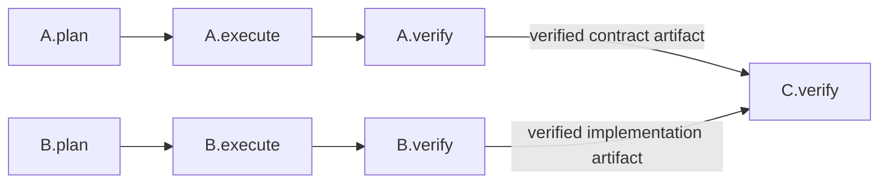
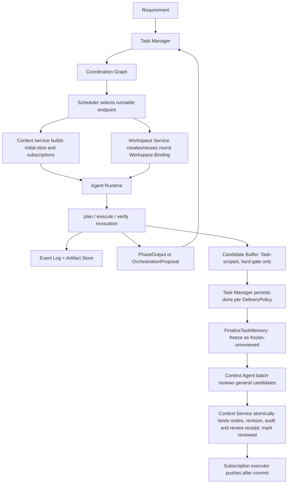
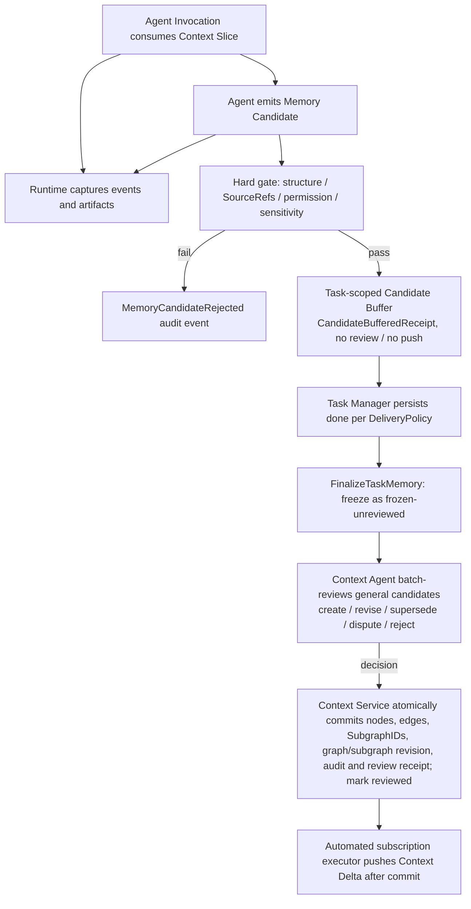

# Threadmill 统一设计：阶段编排、共享工作区与上下文图

版本：v1.0-draft  
状态：Draft  
定位：本文按当前产品判断重新组织 Threadmill 的完整设计。它统一任务编排、Agent Runtime、共享 Workspace、验证合并和 Context Graph；当本文与较早的模块草案在下列主题上冲突时，以本文为准。

---

## 1. 产品判断

多 Agent 编程的瓶颈不是同时打开多少会话，而是项目状态、未完成义务和可复用知识仍由人类手工搬运。Threadmill 因此管理三类彼此独立但可追溯关联的对象：

1. **Coordination Graph（协调图）**：保存 Task 之间尚未履行的因果义务，以 Phase Endpoint 为编排粒度。
2. **Workspace Binding（工作区绑定）**：保存一个 Task 轮次的可变执行现场；同一轮次的 plan、execute、verify 共享它。
3. **Context Graph（上下文图）**：保存从运行证据中提炼出的知识节点及其逻辑关系，并为新 Agent 选择可控子图。

核心判断：

```text
Task 不属于 Agent Session；
Task 直接拥有 Workspace Binding；
Phase Endpoint 是 Manager 的编排端点；
Context Graph 保存知识关系，不保存未完成工作；
Agent 是在明确阶段、工作区、上下文切片和权限内临时调用的计算资源。
```

用户只需要表达需求、预算、并发意图和必要决策。系统负责将需求变成可验收 Task，按阶段端点安排串行或并行执行，维护 Workspace 隔离与合并，并向每次 Agent Invocation 提供恰当的 Context Subgraph。

---

## 2. 统一领域模型

### 2.1 工作对象

```text
Requirement
  原始目标、动机、约束和验收意图；保存来源，不直接调度。

Task Contract
  稳定定义要交付什么、为什么、允许边界及怎样算完成；不包含实现步骤。

Task
  由 Task Contract 约束的持久工作身份；寿命长于任何 Agent Invocation；
  直接拥有一份或多份（按轮次）Workspace Binding。

Phase Endpoint
  Task 中可被依赖、阻塞、激活和产出信号的命名端点。

Agent Invocation
  在指定角色、阶段、工作区、上下文、权限和预算下对 Agent 的一次有界调用。
```

### 2.2 两张持久图与一个执行边界

Threadmill 只保留两张持久图。Agent Runtime 和 Workspace 是执行边界，不再引入 Execution Graph 或 phase 内的持久执行图：

| 对象 | 生命周期 | 负责的问题 | 唯一写入口 |
| --- | --- | --- | --- |
| Coordination Graph | 持久 | 哪个 Phase Endpoint 可以运行、被什么阻塞、阶段交付是否满足 | Task Manager Agent |
| Context Graph | 持久 | 哪些记忆可见、如何关联、如何检索、哪些订阅需要推送 | Context Service（Context Agent 可经受控工具 CRUD general 节点和 general 子图；候选终审也由 Context Service 原子落图；task 子图只接受 Task Manager 经 TaskContextWriter 的定向投影） |
| Agent Runtime / Workspace | 一次 Invocation / 一个轮次 | 如何在权限、工作区和预算内执行并记录证据 | Runtime / Workspace service |

三者边界必须保持：

- Coordination Graph 是可热修改的当前编排，但只有 Task Manager 能写。运行中的 Agent 如需拆分、增加前置、调整串并关系或失败后重排，只能提交结构化编排建议。
- Coordination Graph 不保存 Agent 的运行过程上下文；只保存阶段依赖、完成信号、交付物/报告要求及其结果引用。
- Context Graph 是所有 Agent 的外部记忆通信面。普通 Agent 可探索、订阅和接收 Delta，但不能写图；Context Agent 可经 Context Service 的权限/revision/审计边界 CRUD general 节点和 general 子图，并审查 done 后冻结候选；task 子图及其节点只接受 Task Manager 经 `TaskContextWriter` 的定向投影。所有持久化 mutation 均由 Context Service 执行，没有 Agent 直连图存储。
- Runtime 只负责启动、权限、Workspace、事件、输出契约和受控请求转交；不拥有业务编排或知识判断。
- Workspace 不是图节点，也不承担跨 Agent 通信。

删除 Execution Graph 的理由：phase 内执行步骤和过程上下文属于 Agent Runtime 的内部现场，不需要独立持久实体。只有阶段结束输出和 Agent 主动提交的结构化编排建议进入 Task Manager 的视野。

**Coordination Graph 只向前演化（设计原则）**：失败的轮次结果不可回改，只能作为证据封存；一切变更都是图的向前演化（新增/失效节点、边、端点）并对旧结果显式失效。
 

---

## 3. Task 的三阶段与轮次

### 3.1 固定工作阶段

每个 Task 固定由三个工作阶段组成：

```text
plan -> execute -> verify
```

`prepared` 与 `done` 是 Task 的派生门控状态，不是 endpoint，也不启动 Agent。人工或外部决定表示为 blocker/decision 条件并约束上述三阶段，不在 Task 内增加 decision endpoint 或第四阶段。

| 阶段 | 责任 | 主要产物 | 禁止事项 |
| --- | --- | --- | --- |
| plan | 声明实现方案、影响面、依赖、权限及验证方法 | Submitted Plan、Declared Write Set、验证计划、Requirement Candidate | 修改实现、改写 Task Contract、自行写协调图 |
| execute | 在批准范围内产生候选结果 | diff/产物、工具证据、Observed Write Set、新发现 | 静默扩 scope、写 main、宣布 Task 完成 |
| verify | 在同一现场独立检查契约与候选结果 | Verify Result、测试/检查证据、风险和缺口 | 修改实现以让自己通过、自我批准旧 revision |

**提交与通过分离**：`invocation_finished`（Invocation 结束）→ `output_submitted`（PhaseOutput 已提交）→ `endpoint_satisfied / rejected / invalidated`（由授权方判定）。plan 产物叫 **Submitted Plan**，只有经 policy、human decision 或专门 reviewer 批准后才成为 **Approved Plan**；Runtime 只校验输出形状，不代替任何批准。execute completed 只表示候选结果已产生；verify 才判断 Task Contract 是否满足。

### 3.2 轮次与重试

一次正常路径：

```text
Task Contract
  -> Round 1: plan -> execute
       -> code_merge: Merge Queue -> verify merged revision
       -> other policy: verify current delivery
       -> passed + delivery conditions -> done
       -> failed, contract still valid -> verifier 提交 Proposal，Task Manager 重开轮次
       -> independent prerequisite found -> new Task + endpoint edge
       -> contract ambiguous/invalid -> blocked + decision condition
```

验证失败不创建新 Task，也不创建新 Attempt 实体：verifier 是唯一拥有失败证据的角色，由它提交 `OrchestrationProposal`（retry），Task Manager 裁决后失效旧输出、在图上重开 execute→verify 端点，并从最新有效基线新建 Workspace Binding（旧现场封存为 evidence）。只有工作具有独立验收、独立失败/重试、不同权限或 Workspace、跨时间等待、被其他 Task 直接依赖等特征时，Task Manager 才创建新 Task。

**`done` 由 DeliveryPolicy 决定**。Task Contract 携带：

```text
DeliveryPolicy: non_code_artifact | code_merge | human_acceptance | external_delivery
```

- `code_merge` 型 Task（默认代码任务）：`done = merge succeeded && post-merge verify passed && dependency/decision conditions satisfied`（按 8.2 全链）；
- `non_code_artifact` / `human_acceptance` / `external_delivery` 型按交付条件定义，不经过 Merge Queue。

### 3.3 阶段状态与 revision

每个阶段结果至少绑定：

```go
type PhaseResultBinding struct {
    TaskID          string `json:"task_id"`
    TaskContractRef string `json:"task_contract_ref"`
    WorkspaceRef    string `json:"workspace_ref"` // 轮次标识：Workspace Binding ID + generation
    Phase           string `json:"phase"` // plan | execute | verify
    WorkspaceID     string `json:"workspace_id"`
    InputRevision   string `json:"input_revision"`
    WorkspaceHead   string `json:"workspace_head"`
    ContextSliceRef     string `json:"context_slice_ref"`
    TaskMemoryBufferRef string `json:"task_memory_buffer_ref"`
}
```

Task Contract、依赖结果、代码基线、Workspace Head 或高影响上下文变化后，旧结果不能静默复用。Task Manager 按影响范围使 plan、execute 或 verify 失效；Scheduler 只执行该决定。

---

## 4. Workspace：一个 Task 轮次，一份共享现场

### 4.1 核心规则

**同一个 Task 轮次的 plan、execute 默认共享同一个 Workspace Binding。** 非代码交付的 verify 默认继续使用该 Binding；`code_merge` 的 verify 使用从精确 merged revision 创建的下一代只读 Binding，并继承 plan/execute 完成谱系。三个阶段仍可由不同 Agent、provider 或 Thread 执行。

这解决四个问题：

1. executor 能直接消费 planner 在现场生成的结构化计划和基线信息；
2. verifier 检查的是真实候选现场，而不是重新拼装的近似副本；
3. 阶段切换不会丢失未提交文件、生成物和工具状态；
4. Agent 可替换，而 Task 的执行身份和证据链不变。

Workspace 可以实现为：

- Git 仓库：独立 `git worktree + branch`，默认方案；
- 非 Git 或强隔离任务：独立 clone/目录；
- 环境依赖复杂任务：容器加持久 volume；
- 远程任务：远程 sandbox，仍暴露同一逻辑 Workspace Binding。

实现形式可替换，但上层契约相同：稳定 Workspace ID、固定基线、允许写范围、可观测变更、阶段间持久、轮次间隔离。

### 4.2 数据模型

```go
type WorkspaceBinding struct {
    ID              string            `json:"id"`
    TaskID          string            `json:"task_id"`
    Generation      int               `json:"generation"` // 轮次序号：1 起递增
    Kind            string            `json:"kind"` // git_worktree | clone | container | remote
    Root            string            `json:"root"`
    BranchName      string            `json:"branch_name,omitempty"`
    ContainerID     string            `json:"container_id,omitempty"`
    VolumeRefs      []string          `json:"volume_refs,omitempty"`
    BaseRevision    string            `json:"base_revision"`
    CurrentRevision string            `json:"current_revision"`
    AllowedDirs     []string          `json:"allowed_dirs"`
    DeclaredWrites  WriteSet          `json:"declared_writes"`
    ObservedWrites  WriteSet          `json:"observed_writes"`
    PhaseLeases     map[string]string `json:"phase_leases"` // phase -> invocation id
    Status          string            `json:"status"`
}
```

### 4.3 阶段切换

```text
Scheduler 激活 T.plan
  -> Runtime 创建 Invocation，从 Workspace Service 取得/创建该轮次的 Workspace Binding
  -> planner 只读代码，允许写结构化 plan artifact
  -> plan 经审批后冻结 Approved Plan 与 Declared Write Set

Scheduler 激活 T.execute
  -> Runtime 复用同一 Workspace Binding
  -> executor 获得实现写权限
  -> Runtime 观察 diff 和实际写集合

Scheduler 激活 T.verify
  -> Runtime 继续复用同一 Workspace Binding
  -> verifier 默认只读实现，可运行检查并注册 evidence artifact
  -> Verify 的临时 evidence/ 不改变候选代码 revision
  -> Verify Result 绑定 execute 候选的 Workspace CurrentRevision
```

共享 Workspace 不等于共享权限。权限随 phase lease 切换：plan 默认只读源码，execute 可写批准范围，verify 默认不可修改候选实现。任何阶段只能有一个有效写 lease；同 Task 内需要并行工作时，只能并行进行只读准备或由 Task Manager 拆为具有独立 Workspace 的 Task。Runtime 创建的是 Invocation 而不是任何业务对象；Workspace Binding 由 Workspace Service 创建/复用。

### 4.4 轮次隔离与废弃
新轮次默认从最新有效基线创建新的 Workspace，不能在验证失败的旧现场上无审计地继续修改。旧 Workspace 被封存为 evidence，可按保留策略清理。若运行中的 Agent 认为应局部修复、拆分任务或调整依赖，必须提交 `OrchestrationProposal`；Task Manager 审批后热修改 Coordination Graph，并决定重开当前 Task 的 execute→verify 轮次、创建新 Task 或增加前置 Task。Agent 和 Runtime 都不能自行跳转 phase。

---

## 5. 以 Phase Endpoint 为端点的协调图

### 5.1 Edge 同时表达控制、数据和失败策略

```go
type CoordinationEdge struct {
    ID        string                `json:"id"`
    From      PhaseEndpointRef      `json:"from"`
    To        PhaseEndpointRef      `json:"to"`
    Condition SignalCondition       `json:"condition"`
    Data      []ArtifactRef        `json:"data,omitempty"`
    OnFalse   EdgeFailurePolicy     `json:"on_false"`
    Freshness RevisionConstraint    `json:"freshness"`
}
```

每条边必须回答：

1. 哪个 source endpoint 产生信号；
2. 哪个 target endpoint 被阻止；
3. 什么条件解除阻止；
4. 哪些交付物、报告或证据 artifact 沿边传递；
5. source 失败、取消或过期时怎么办。

### 5.2 串行

```text
B.verify --passed + API evidence--> A.plan
```

表示 A 的方案依赖 B 已验证的 API。若 A 只在实施时需要 B，则边应连到 `A.execute`；若只影响最终验收，则连到 `A.verify`。Manager 必须连接到最早真正消费结果的阶段，避免过早串行化。

### 5.3 并行

两个 endpoint 无控制边且 Workspace 不冲突时可并行：



并行资格由图语义、权限、预算和 Workspace 冲突共同决定。Worker Capacity 只影响同时运行多少 endpoint，不改变依赖含义。

### 5.4 阻塞与人工决定

“Task blocked”只是投影；权威 blocker 必须指向具体 endpoint：

```text
A.execute blocked by B.verify
condition: B.verify.status == passed
required data: schema_ref, verification_summary
on false: replan A

human.approved(plan_revision, risk_scope) -> A.execute
```

### 5.5 阶段 Agent 的通信边界

运行中的 phase agent 不直接向其他 Agent、Runtime mailbox 或 Coordination Graph 写消息。它可以像其他 Agent 一样探索和订阅 Context Graph；列表/探索不足时经独立接口 `contextAgent.retrieve` 请求 Context Agent 语义检索（phase agent 不持有机械检索工具）。它也可以在发现当前编排不再合适时，主动向 Task Manager 提交编排建议。

Task Manager 不旁观 phase agent 的中间推理、工具输出、探索轨迹或未提交上下文。运行过程默认留在 Invocation 内；只有以下结构化边界输出可以进入 Task Manager：

1. 阶段结束时的 `PhaseOutput`；
2. 运行中主动提交的 `OrchestrationProposal`；
3. 通过 Runtime 受控 join 的输入集合 `PhaseInputSet` 与等待结果 `InputWaitResult`。

```go
type OrchestrationProposal struct {
    ProposalID               string           `json:"proposal_id"`
    ClientRef                string           `json:"client_ref"`
    FromEndpoint             PhaseEndpointRef `json:"from_endpoint"`
    FromInvocationID         string           `json:"from_invocation_id"`
    BasedOnGraphRevision     int64            `json:"based_on_graph_revision"`
    BasedOnWorkspaceRevision string            `json:"based_on_workspace_revision"`
    BasedOnInputRevision     string           `json:"based_on_input_revision"`
    OrchestrationAdvice      string           `json:"orchestration_advice"` // split, dependency, serial/parallel, replan, retry...
    DeliverySpecAdvice       string           `json:"delivery_spec_advice"`
    ReportSpecAdvice         string           `json:"report_spec_advice"`
    Rationale                string           `json:"rationale"`
    EvidenceRefs             []string         `json:"evidence_refs"`
}
```

planner、executor、verifier 三方都可提交建议，但情景不同：planner（契约歧义、方案不可行、依赖变化）→ replan/拆任务；executor（发现缺失前置、范围冲突）→ split/dependency；verifier（验收失败）→ retry，失效旧输出并重开 execute→verify。

拆分机会、缺少前置、执行失败、验证失败和计划失效都使用同一种建议协议。建议是自由文本意图、理由和对未来 endpoint 契约的建议，不是图命令；phase agent 不决定创建哪些 Task、如何连边或哪些 endpoint 失效。Runtime 只记录并转交，Task Manager 结合当前图和可见证据决定接受、改写或拒绝，并热修改 Coordination Graph。无需为不同原因新增 Split Request、Failure Request 或 Rework Task 等实体。

`PhaseInputSet` 是 endpoint 已声明入边的只读投影，至少包含：`inputRevision`、`required`、`delivered`、`pending`。`required` 定义 source endpoint、所需交付物与 `requiredBy`（start 或 completion）；`delivered` 只引用正式 `PhaseOutput` 与 artifact；`pending` 仅表示尚未到达的 completion 输入。

Phase Agent 可以在本体工作做到当前信息不足时调用 `runtime.awaitInputs` 等待已知 completion 输入。Runtime 不保留长期占用 worker capacity 的挂起线程；它记录 waiting 语义、在输入到达或失效时更新 `inputRevision`，并可在恢复时重建受控执行调用。Agent 不直接持有 mailbox、不轮询消息，也不自己维护图状态。

若 Agent 发现的是启动契约中没有声明的新前置，而不是等待既有 `inputId`，必须提交 `OrchestrationProposal(advice: dependency)`；Task Manager 审批后才会更新 Coordination Graph 与目标 endpoint 输入契约。

### 5.6 Endpoint 契约与阶段交付

Task Manager 编排每个 Phase Endpoint 时，必须同时规定 `DeliverySpec` 和 `ReportSpec`，并把入边投影进 `PhaseInputSet`。前者定义该阶段必须交付什么，后者定义报告必须回答哪些问题；未规定二者的 endpoint 不可调度。phase agent 可以在编排建议中提出新 endpoint 的要求，但正式契约只能由 Task Manager 写入图。

Phase Agent 的任务要求完全来自 Coordination Graph 的权威投影：Task Manager 先写 Task Contract、DeliverySpec、ReportSpec 与入边，Runtime 再装配 `ContractRef + PhaseInputSet` 启动 Agent。Context Slice 只提供可检索/订阅的上下文投影，不能定义或覆盖当前 endpoint 的任务要求：`ContextNode.Kind` 全图统一为 `directive | fact | hypothesis`，与节点属于 `general` 还是 `task` 子图无关——任务契约、DeliverySpec/ReportSpec 与用户 Requirement 投影为 `directive`，已接受的 PhaseOutput、交付物、报告和验证证据投影为 `fact`，任务和要求绝不写为 `hypothesis`。所有入边相连的 Agent 使用同一投影规则，不接收 Task Manager 的旁路自由文本任务。

```go
type PhaseOutput struct {
    Binding      PhaseResultBinding `json:"binding"`
    DeliveryRefs []string           `json:"delivery_refs"`
    ReportRef    string             `json:"report_ref"`
    EvidenceRefs []string           `json:"evidence_refs"`
}
```

`PhaseOutput` 必须完整绑定 `PhaseResultBinding`（TaskID / TaskContractRef / WorkspaceRef / Phase / WorkspaceID / InputRevision / WorkspaceHead / ContextSliceRef / TaskMemoryBufferRef），以证明输出属于哪个契约版本、正式输入、已落图 Context 快照和 Task 候选缓冲快照。

每个 phase 必须按 endpoint 的两项要求提交 `PhaseOutput`，否则不得进入 completed。Runtime 只校验输出形状和必填引用，以及 required completion input 是否已到齐；Task Manager 能读取所有 completed endpoint 的报告、交付物和证据引用，并据此继续编排，但不能读取未提交的运行过程上下文。

| 阶段 | 默认交付物基线 | 默认报告基线 |
| --- | --- | --- |
| plan | Submitted Plan、Declared Write Set、验证计划、Requirement | 方案、假设、依赖、权限、风险和所需 Context Subgraph |
| execute | diff/commit 或其他候选产物、Observed Write Set | 实际变更、偏差、新 Memory Candidate 和未解决问题 |
| verify | Verify Result、测试和检查证据 | 契约判断、证据、Workspace/Input revision、失败原因或通过理由 |

表中只是 Manager 编排时的默认基线，不替代每个 endpoint 的具体 `DeliverySpec` 和 `ReportSpec`。报告和交付物位于 Artifact Store；`PhaseOutput` 只是 endpoint 输出载荷，不新增 Delivery 实体。阶段结果跨 Task 使用时，由 Coordination Edge 引用对应 endpoint 输出。

### 5.7 编排建议与等待结果的运行时处理

Task Manager 收到建议后校验来源 endpoint、当前 graph revision、理由和 evidence，再决定是否热修改图。接受拆分建议时，它创建必要 Task/endpoint、为每个新 phase 写交付物和报告要求并连接边；接受失败或重排建议时，它调整尚待执行的计划和受影响 endpoint。拒绝时只返回结构化理由。Scheduler 不解释建议，只在图更新后重算 runnable endpoint。

两条硬规则：

1. **幂等**：Runtime 对重复 `ProposalID` 只转交一次；Task Manager 对已裁决的 `ProposalID` 不重复处理。
2. **过期校验**：Task Manager 校验 `BasedOnGraphRevision`；若图已更新到更高 revision，拒绝该建议并要求基于新 revision 重提，或明确声明按当前图裁决。

`runtime.awaitInputs` 返回的 waiting 结果不结束当前 phase。它只是说明：本体工作已推进到当前已知输入允许的极限，接下来可以等待、继续、重提建议或结束为阻塞报告。若允许继续，phase agent 最终仍须提交原 endpoint 的 `PhaseOutput`。图变更历史由 Event Log 审计，但审计机制不限制 Coordination Graph 的运行时热修改。

**Coordination Graph 原子审计**：图变更（mutation、graph revision、endpoint invalidation、Proposal 裁决、audit event）必须在同一事务或 transactional outbox 中完成，任一部分失败则整体回滚，避免“图已修改、Event Log 没记录”。

---

## 6. 模块职责与依赖方向

模块按“只拥有一个核心决定”划分，依赖方向从编排请求流向受控服务，不形成反向调用环：

| 模块 | 唯一职责/决定 | 可以读取 | 不可以做 |
| --- | --- | --- | --- |
| Task Manager Agent | 默认编排 Coordination Graph；规定 endpoint 契约；审批编排建议；向 `task` 子图投影上下文节点（`directive` 承载 Task Contract、DeliverySpec/ReportSpec 与 Requirement 投影，`fact` 承载已接受的 PhaseOutput、交付物、报告和证据投影；权威来源仍是 Coordination Graph、PhaseOutput/Artifact Store、Requirement provenance） | Requirement、completed PhaseOutput/report/evidence、自己的 Context Slice/Delta 和可见 Context Graph | 旁观 phase 过程、选实现方案、任意写 Context Graph、操作 Workspace |
| Scheduler | 从可运行 endpoint 中选择下一次 Invocation | Coordination Graph、预算、容量、能力 | 创建/修改 task、edge、blocker，解释编排建议，选择记忆 |
| Context Agent | 响应 `contextAgent.retrieve`；受控探索；经 Context Service CRUD general 节点和 general 子图；审查 done 后冻结候选 | 可见 Context Graph、Event Log、Artifact Store、权限策略 | 主动无界巡图、操作 task 子图或其节点、直连图存储、改 Coordination Graph、批准阶段交付 |
| Agent Runtime | 启动/取消/恢复 Invocation，施加 phase 权限，记录事件并校验输入与输出形状 | Scheduler 的 run request、Context Slice、Workspace Binding、PhaseInputSet | 判断业务完成、暴露未提交过程上下文、写任一图的业务状态 |
| Workspace Service | 为 Task 轮次创建/复用/封存执行现场，观察 write set | Runtime policy、轮次 revision | 调度 Agent、判断验收、写 main |
| Verifier / Merge Queue | Verifier 判断候选是否满足契约；Merge Queue 在 latest main 上检查并合入 | Task Contract、Approved Plan、Workspace、evidence、受限冲突现场 | 普通 Verifier 修改实现；Targeted Verifier 越过 allowed/conflict paths、commit/push 或写 Coordination/Context Graph；Merge Queue 直接改图 |
| Phase Agent | 完成当前 phase；在已知 completion 输入上自主等待或汇总；提交 PhaseOutput 或编排建议；使用可见 Context Graph | Task Contract、endpoint 契约、自己的 Context Slice/Delta、子图列表与描述、PhaseInputSet | 直接改图、直接通信、改 main、宣布 done |

依赖约束：Task Manager 与 phase agent 使用相同 Context 读/订阅生命周期接口（`ContextGraphReader`：ListSubgraphs / Explore / Subscribe / Unsubscribe；机械检索 `ContextGraphSearcher.Search` 只注入 Context Agent）。phase agent 不能直接写 Context Graph；Task Manager 只能经 Context Service 向 `task` 子图投影上下文节点——`directive`（Task Contract 与 endpoint DeliverySpec/ReportSpec、用户 Requirement 的上下文投影，权威来源是 Coordination Graph 与 Requirement provenance）、`fact`（已接受/验证的 PhaseOutput、交付物、报告和证据的上下文投影，权威载荷在 Artifact Store/PhaseOutput）——`hypothesis` 不得承载任务或用户要求。节点引用权威来源、不复制易变 runnable/blocked 状态，不能访问图存储；Task Manager 的定向投影只写 `task` 子图，Phase Agent 候选只建议 `general` 子图，两条路径目标不相交，不存在逐目标混合鉴权。Context Agent 不依赖 Scheduler；Runtime 不依赖图的具体存储；Workspace 不依赖 Context Graph。
 

## 7. Scheduler 与 Manager

### 7.1 Task Manager Agent
Task Manager 是 Coordination Graph 唯一写入口，也是默认编排者：

- 将 Human Requirement 规整为 Task Contract；
- 创建 Task 固定的 plan / execute / verify Phase Endpoint、edge、blocker 与 decision 条件，并为三个 phase 写入 DeliverySpec / ReportSpec；创建轮次时配套 Workspace Binding；
- 读取所有 completed endpoint 的报告、交付物和证据，决定后续编排；
- 审批运行中的 Agent 提交的 `OrchestrationProposal`，接受后热修改图并明确当前 Invocation 的处置；
- 与 phase agent 一样使用 Context Slice、图探索、订阅和自动 Delta；列表/探索不足时经 `contextAgent.retrieve` 请求 Context Agent 语义检索，但不读取其未提交过程上下文；
- 不选择实现方案，不直接操作 Workspace，不写 Context Graph。

### 7.2 Scheduler

Scheduler 读取协调图，选择 runnable Phase Endpoint，并请求 Runtime 启动 Invocation。默认优先级：

1. latest-main 上待复验/合并的 candidate；
2. 能解除其他 blocker 的 verify；
3. 已执行待验收的 verify；
4. 已批准且低冲突的 execute；
5. 新 Task 的 plan；
6. 探索性工作。

Scheduler 不创建 edge，不改变 Task Contract，不把 Agent 与 Task 永久绑定。

### 7.3 调度流程



---

## 8. Verify、Merge Queue 与 Workspace 合并

### 8.1 Verify gate

Verifier 必须同时读取：Task Contract、Approved Plan、真实 diff/产物、Declared/Observed Write Set、输入 revision、Context Slice binding 和验证证据。通过结果只对该组合有效。

验证者必须与产生候选结果的 active phase invocation 独立，但使用同一轮次 Workspace。独立性来自角色、Invocation、权限和审批边界，而不是复制一个可能漂移的工作区。

### 8.2 Merge Queue

代码型 Task（`DeliveryPolicy=code_merge`）先合入，再由普通 Verify 对已合入 revision 做最终验收：

```text
Execute satisfied on round Workspace
  -> MergeCandidate
  -> latest main 上机械应用检查
  -> 临时 merge-check workspace
  -> 有真实冲突时 targeted verifier 仅解冲突
  -> serial merge
  -> merge event + commit/diff/test evidence
  -> merged-revision Verify workspace
  -> normal Verify on merged revision
  -> 通过后 Task Manager 计算 done
  -> 失败时 Verify 提交 proposal，由 Manager 决定 retry/replan/split/dependency
```

Merge Queue 是 main 的唯一写入口，只做权限、写集、机械应用、冲突处理和串行写入，不提前执行 Task 的普通验收 Verify。main 发生无冲突漂移时直接机械合入；只有机械 apply 出现真实冲突时才启动 Targeted Verifier。它可在 Runtime 注入的精确 `allowed_write_paths` / `conflict_paths` 内使用原生搜索、读写文件和 shell 解冲突，但不得 commit/push，不得写 Coordination Graph 或 Context Graph。若解冲突会破坏 Task Contract、验收条件或使任务不可完成，Verifier 必须通过 `agent.proposeOrchestration` 向 Manager 申请重新编排；该候选随后失败，Manager 只能在可信 targeted boundary 上用一次 `reopen_round` 原子重开 execute+verify。普通 proposal 不能重开已终态节点。

合入成功后，Runtime 从 `merged_revision` 创建只读 Verify Binding 并继承本轮 plan/execute 完成谱系；Scheduler 在此之前不得启动 verify。普通 Verify 若发现已合入结果不满足 Contract，必须提交失败 evidence 与 `OrchestrationProposal`，由 Manager 裁决如何重开或拆分，Verifier 不自行回滚 main。

`reopen_round` 复用原 Task、plan、Contract 和 declared write authority，从 Targeted Verifier 观察到的 latest-main 创建新 Workspace Binding；execute 与 verify generation 同步轮换，旧结果和冲突 evidence 保留审计，不参与新轮次的通过判断。

### 8.3 多 Workspace 合并语义

不同 Task 各有独立 Workspace（按轮次切换）。合并顺序不由 Agent 私聊决定：

- 已满足 execute 且进入队列的 candidate 优先尝试；
- candidate 必须能在 latest main 上机械应用；只有真实冲突交给 targeted verifier；
- 普通 Verify 始终绑定各自实际 merged revision，不复用合入前判断；
- write set 重叠是风险信号，真正的合入 gate 是权限与机械冲突，业务验收由合入后的普通 Verify 完成；
- 合并后的新事实通过 Event Log 进入 Context Graph，并可推送给订阅相关子图的 active Agent。

---

## 9. Context Graph：从上下文块到可探索知识图

### 9.1 目标与边界

Context Graph 解决的不是“保存更多聊天”，而是：

- 新 Agent 如何获得与当前 Task/phase 相关的知识切片；
- 新发现如何与已有知识建立逻辑邻接；
- Agent 如何逐步探索，而非一次注入全库；
- 如何控制记忆准入、近重复、过时、冲突和垃圾；
- 如何在切片和候选准入时整理图，提高后续子图选择的缓存命中率；
- Agent 订阅的 Context Subgraph 更新后，如何安全推送。

Context Graph 是 Event Log / Artifact Store 的可追溯投影。普通 Agent 不能直接创建、修改或删除 Context Node；Context Agent 可以经 Context Service 的受控 CRUD 管理 general 节点和 general 子图。

**三条受控写路径**：

1. **Context Agent CRUD（general）**：Context Agent 可创建、读取、更新和删除 general 节点与 general 子图；Context Service 校验权限、SourceRefs 和 revision，原子提交并审计。
2. **候选缓冲终审（general）**：Phase Agent 的 `MemoryCandidate` 进入 Task 缓冲；Task done 后冻结，由 Context Agent 批量裁决，Context Service 原子落图。
3. **TaskContextWriter（task）**：Task Manager 的定向投影只写 `task` 子图，经 Context Service 硬门槛与 Recipient 校验，不经过 Context Agent。

三条路径均由 Context Service 执行持久化 mutation。Context Agent 的 CRUD 与候选裁决只覆盖 general 对象；任何属于 task 子图的节点以及 task 子图本身都由 `TaskContextWriter` 路径独占。

### 9.2 核心对象

```go
type ContextNode struct {
    ID             string   `json:"id"`
    Kind           string   `json:"kind"` // directive | fact | hypothesis（全图统一，与所属子图无关）
    Statement      string   `json:"statement"`
    Status         string   `json:"status"` // accepted | disputed | superseded | outdated；candidate 不落图，仅 Event Log 审计（见 12.4）
    SubgraphIDs    []string `json:"subgraph_ids"`
    SourceRefs     []string `json:"source_refs"`
    CreatorAgentID string   `json:"creator_agent_id"` // 创建者：稳定 Agent identity，跨 Invocation 可识别；由 Runtime 授权身份写入，Agent 不可自报
}

> 字段集与命名以 [context-graph.md](./context-graph.md) §3.1 为权威，本结构与其逐字段一致：`ID / Kind / Statement / Status / SubgraphIDs / SourceRefs / CreatorAgentID`。持久层/审计元数据（版本、时间戳、置信度、重要性、敏感性、有效期、scope 等）属于独立记录，不进入 `ContextNode` 字段。其中 `CreatorAgentID` 是节点语义字段，保证每个节点可追溯到创建者。

type ContextEdge struct {
    FromRef  string `json:"from_ref"`  // 端点：如 node:n1、subgraph:s1
    ToNodeID string `json:"to_node_id"` // 目标节点
    Kind     string `json:"kind"`      // 全集见 §9.3；自动边仅为子集：logical_adjacent | derives_from_subgraph
}

> 字段集与命名以 [context-graph.md](./context-graph.md) §3.4 为权威，本结构与其逐字段一致：`FromRef / ToNodeID / Kind`；不另设 `ID / Weight / SourceRefs / CreatedBy / ValidAtRev` 等扩展字段，边的来源由创建事件与订阅记录重建（见 context-graph.md §3.4）。自动连边生成的 Kind 只有 `logical_adjacent | derives_from_subgraph`（创建时自动生成，见 context-graph.md §4），是 §9.3 全集 Kinds 的子集。

type ContextSubgraph struct {
    ID       string `json:"id"`
    Name     string `json:"name"`
    Summary  string `json:"summary"`
    Revision int64  `json:"revision"`
    Kind     string `json:"kind"` // general | task
}

> 字段集与命名以 [context-graph.md](./context-graph.md) §3.5 为权威，本结构与其逐字段一致：`ID / Name / Summary / Revision / Kind`；不另设 `Scope / AnchorNodes` 等扩展字段，策展锚点等如需保留属于独立记录。正式成员关系由 `ContextNode.SubgraphIDs` 表达，推导关系按 `ContextEdge.FromRef = "subgraph:<id>"` 查询，子图不保存成员 NodeIDs。
```

Context Subgraph 是可重叠的逻辑视图，不复制节点。一个节点可以同时属于 API、模块、架构决定等多个 `general` 子图。

`Subgraph.Kind` 只有两种：`general` 由 Context Agent 经 Context Service CRUD，也可由冻结候选审查产生或更新；`task` 只经 Task Manager 的 `TaskContextWriter` 定向投影。Context Agent 的 CRUD 必须拒绝 task 子图及任何属于 task 子图的节点。`Subgraph.Kind` 只决定写权限，不决定 Node `Kind`。

`ContextNode.Kind` 全图统一为 `directive | fact | hypothesis`，与节点属于哪个子图无关：

- `directive`：规范性陈述，定义必须/应当/期望做什么。包括用户 Requirement、稳定偏好，以及 Task Manager 已写入 Coordination Graph 的 Task Contract、DeliverySpec、ReportSpec 的上下文投影。硬约束、软偏好与任务契约通过字段/来源引用区分，不再用 Kind 区分。
- `fact`：已经成立、发生或经相应验收边界接受的描述性陈述。包括 completed 且已被接受/验证的 PhaseOutput、交付物、报告和验证证据的投影；必须带权威来源引用。
- `hypothesis`：尚待证据验证的描述性推测；不得承载任务或用户要求，任务契约与 Requirement 绝不写为 `hypothesis`。

不保存“正在做什么”或当前任务状态；它们由 Coordination Graph、Workspace 和 Runtime 持有。

### 9.3 边类型

MVP 至少支持：

| Edge Kind | 含义 |
| --- | --- |
| `logical_adjacent` | 两个记忆点在当前推理链上逻辑相邻，后者是前者自然的下一步上下文 |
| `supports` | source evidence/结论支持 target |
| `contradicts` | 两节点不能同时作为当前事实使用 |
| `supersedes` | 新 revision 替代旧节点，但保留历史 |
| `derived_from` | 节点由另一节点或证据推导（手动语义边） |
| `derives_from_subgraph` | 自动边（创建时生成）：节点在订阅该子图的上下文中创建，可认为由该子图推出或受其启发；不表示节点属于该子图（见 context-graph.md §4.2） |
| `belongs_to_subgraph` | 节点归属某逻辑子图 |
| `depends_on_fact` | 一个结论成立需要另一个事实 |
| `example_of` | 具体案例说明抽象规则 |

边的来源可重建：自动边由创建事件与订阅记录重建（见 context-graph.md §3.4、§4）；语义边由 Context Agent 在裁决 `general` 候选/更新节点时写入并随写入事务审计。`ContextEdge` 不承载来源与置信度字段，关联强度等如需保留属于独立记录。Embedding 相似只用于召回候选，不能单独建立 `supports`、`contradicts` 或 `supersedes` 等语义边。

---

## 10. Agent 创建时的 Context Subgraph 切片

每个 Agent Invocation 创建前，Context service 都按调用者的 role、purpose 和权限选择初始子图；phase agent、Task Manager、verifier 等使用同一机制。装配是 Context Service 在 Runtime 启动 endpoint 时的内部启动步骤：按 Runtime 已有 start binding（InvocationID、TaskID、EndpointRef 与调用上下文）建立初始自动订阅，再从该 Invocation 的有效订阅子图并集物化 Context Slice 并返回 `ContextSliceRef`，不是外部接口；Context Agent 不需要理解调用者的业务决定，只按调用绑定执行选择和权限策略。

选择输入不来自 Agent 侧的第二套请求：Context Service 从 `EndpointRef` 解析 Coordination Graph / Runtime 的权威绑定（Task Contract、`WorkspaceRef`、`InputRevision` 等从 endpoint 当前权威绑定读取，不重复进装配输入）；role / purpose / 权限快照 / 预算 / graph revision 由 Runtime 调用上下文附加，不进入装配输入；`TaskID + EndpointRef` 是唯一匹配键，`InvocationID` 不参与匹配。

Context Slice 是绑定一次 Invocation 的只读快照：

```go
type ContextSlice struct {
    ID              string            `json:"id"`
    SubscriptionIDs []string          `json:"subscription_ids"` // 初始自动订阅句柄；允许当前 consumer 显式取消
    Subgraphs       []ContextSubgraph `json:"subgraphs"`
    Nodes           []ContextNode     `json:"nodes"`
    Frontier        []ContextFrontier `json:"frontier"`
    Omitted         []string          `json:"omitted"`
    Conflicts       []ContextConflict `json:"conflicts"`
    GraphRevision   int64             `json:"graph_revision"`
}
```

`ContextSlice` 只包含已落图知识。每个 Task 另有一份由 plan/execute/verify 共享的 append-only 候选缓冲；启动时通过 `TaskMemoryBufferRef` 提供当前只读快照，运行中通过 `TaskMemoryBufferReader` 刷新。候选不伪装成 ContextNode，不参与图探索、检索、订阅或 revision。

选择顺序：

1. 在任何相关性计算前应用权限与敏感信息过滤；
2. 以 Context Service 从 `EndpointRef` 解析的 Coordination Graph / Runtime 权威绑定（Task Contract、phase、Workspace revision）与调用目的、owner/module/symbol、已有 subgraph 为 seed；
3. 召回 seed 节点及一跳强语义邻居；
4. 按 role/purpose 重排：编排偏契约、依赖和历史报告，plan 偏约束/决策/失败模式，execute 偏接口/实现事实，verify 偏契约/风险/历史缺陷；
5. 显式保留矛盾候选；
6. 在预算内注入节点正文、可见子图列表与描述；
7. 把未注入但可能有用的邻接方向放入 `Frontier`，供渐进探索；
8. 对选中的子图建立与 Invocation 同寿命的初始订阅，按当前 Invocation 全部有效订阅的 `SubgraphIDs` 并集物化切片，并把初始订阅句柄写入 `SubscriptionIDs`。

切片不是复制出来的新知识库，而是绑定一次 Invocation 的只读初始快照。`ContextSliceRef` 始终保留该启动基线，不因后续订阅变化原地改写；Agent Runtime 当前可提供的动态上下文范围则按有效订阅子图并集重算。Graph revision、input revision 或权限变化后必须重新选择。初始切片及其自动订阅属于 Context service 的受控响应，不代表 Context Agent 主动观察或提示 Agent。

---

## 11. 所有 Agent 的 Context Graph 使用方式

Task Manager、planner、executor 和 verifier 使用相同的 Context 读/订阅生命周期接口：[context-graph.md](./context-graph.md) §6.1 的 `ContextGraphReader`（ListSubgraphs / Explore / Subscribe / Unsubscribe），本文不重复定义方法签名或请求/响应结构。它们都能查看权限内的 Context Subgraph 列表和描述、直接探索可见图、订阅子图，以及按订阅 ID 取消自己的订阅；四个方法都由 Context Service / Graph 操作面直接处理，不调用 Context Agent，也不做 LLM 语义判断。**普通 Agent 不持有机械检索（`ContextGraphSearcher.Search`）**：列表/探索不足时经独立接口 `contextAgent.retrieve` 请求语义检索（转换与 Search 调用见 §11.2）。`Subscribe` 返回 `ContextSubscription`；`Unsubscribe` 只改变当前 consumer 的订阅状态，不修改图 revision。

四项操作共享 Invocation、role/purpose、权限快照、Graph revision 和预算绑定（由 Runtime 调用上下文附加，不进入每个 request），不为调用创建持久 SearchJob。请求、结果、所消费节点和订阅关系由 Runtime/Context Graph 记录。

### 11.1 列表与探索 `ListSubgraphs / Explore`

子图列表只返回调用者可见的 ID、名称、摘要（Summary）、Kind 和 revision。`Explore` 沿当前 Slice 的 node/frontier 或已选子图展开，默认一跳并受 token/depth 限制；权限隐藏内容只返回数量，不泄露摘要。列表和探索是受权限约束的普通读操作，不需要 Context Agent 逐次推理或批准。

### 11.2 Context Agent 检索、探索与 general 图管理

普通 Agent 不持有机械 Search；列表/探索不足时调用 `contextAgent.retrieve`。Context Agent 可组合读接口调查，并经 Context Service 对 general 节点和 general 子图执行 CRUD。每次 mutation 都校验权限与 revision、原子提交、记录审计并在成功后触发订阅推送；task 子图及其节点一律拒绝。接口和字段以 [context-graph.md](./context-graph.md) §6 为权威，MCP 工具映射见 [context-agent.md](./context-agent.md)。

### 11.3 主动订阅 `Subscribe`

Agent 可从可见子图列表主动订阅。Context Service 校验当前 Invocation 与权限后持久化最小订阅关系；生命周期严格绑定 ConsumerInvocationID 指向的 Invocation，不另设到期时钟。此后仅成功图事务触发 Context Delta，Runtime 负责送达活动 Invocation。

订阅关系属于操作层元数据（Operational Context Metadata，owner：Context Service），不是语义图（Semantic Context Graph）的一部分。读路径（切片、探索、检索、订阅、缓存）不得修改语义图。

Context Graph 读路径不创建节点或边。Task 工作记忆走独立的 `TaskMemoryBufferReader`：每个 Task 一份缓冲，由固定的 plan/execute/verify 三阶段共享，跨 Task 不可见；它不属于 Graph 读路径。Graph 写入仍只有 general 候选终审落图与 task 定向投影两条路径。

---

## 12. Memory Candidate：明确的记忆积累规则

### 12.1 Agent 标注协议

Agent 在固定的 plan/execute/verify 三阶段均可提交候选。Context Service 通过硬门槛后追加到该 Task 唯一缓冲，返回 `CandidateBufferedReceipt{CandidateID}`；后续阶段经 `TaskMemoryBufferReader` 可立即读取。候选只建议 general 子图，且在终审前不是 ContextNode。

Task Manager 先持久化权威 `done`，再调用 `FinalizeTaskMemory`。首次冻结为 `frozen-unreviewed`；失败重试同一批次且不改变 done。Context Agent 批量裁决，Context Service 原子落图并保存审查回执后标记 `reviewed`。

### 12.2 准入规则

候选至少满足下列一项才值得持久化：

1. 会改变后续 Task 的计划、实现或验证选择；
2. 是跨 Session 难以从代码直接恢复的架构/产品决定及理由；
3. 是已验证的接口、约束、所有权或运行事实；
4. 是可复现、可能再次出现且包含有效规避方法的失败模式；
5. 是用户明确、稳定且与项目有关的偏好；
6. 能连接两个已有子图，形成可解释的新推理路径；
7. 纠正、限制或替代已有节点。

以下内容默认拒绝：

- 临时进度、寒暄、单次命令输出和可从当前代码廉价恢复的细节；
- 没有 SourceRefs 的主张；
- 只有“可能有用”但没有复用场景的摘要；
- 与已有节点近重复却不增加新证据、新归属或语义修正的表述；
- 未区分事实与假设的推测；
- 密钥、凭据和超出权限范围的信息；
- 已由 Task Contract、代码或生成契约权威表达且不会因压缩丢失的全文复制。

入口机械校验（Hard Gate）由 Context Service 同步执行，不调用 LLM：校验字段结构、Statement、Kind、SourceRefs 的存在性与可读权限、敏感信息，以及目标只含可写 general 子图。失败返回 error、记录 `MemoryCandidateRejected` 且不入缓冲。临时性、重复度、复用价值等语义判断不属于入口校验，由 Context Agent 在 Task done 后审查冻结批次。

### 12.3 评分与决定

Context Agent 使用可解释评分，不让 embedding 单独决定：

```text
value = reuse_probability
      + decision_impact
      + evidence_strength
      + novelty_or_revision_value
      + graph_connectivity_gain
      - recovery_cost_inverse
      - duplication
      - volatility
      - sensitivity_risk
```

硬门槛优先于分数并在入缓冲前执行；价值判断由 Context Agent 对 `frozen-unreviewed` 批次执行。完整冻结、重试、落图和审计协议以 §12.1 与 context-graph.md §6.4 为准。图内不存在未经裁决的候选节点。

### 12.4 候选：Task 内可见，跨 Task 隔离，done 后批量审查

每个 Task 的工作记忆由两部分组成：`ContextSliceRef` 指向已落图 Context Graph 快照；`TaskMemoryBufferRef` 指向该 Task append-only 候选缓冲快照。读取规则：

1. plan/execute/verify 共享同一候选缓冲，后阶段可见前阶段候选；跨 Task 读取拒绝；
2. 候选只经 `TaskMemoryBufferReader` 读取，不参与 Explore/Search/Context Slice/订阅，也不改变 graph revision；
3. 只有 done 后终审落图的节点进入 Context Graph；拒绝结论只在 Event Log 保存；
4. 缓冲追加不推送，成功图事务才触发 ContextDelta。

---

## 13. 图整理与缓存命中

> **本节暂不实现（设计决策，2026-08-07）**：MVP 不做读侧整理与缓存层次；语义边只由 Context Agent 在裁决 `general` 候选/更新节点时写入（`ContextEdge` 不含权重字段，关联强度如需保留属于独立记录）。以下内容为设计意图，供 MVP 后实现时参考。

Context Graph 不运行独立的周期性“整理 Agent”。图整理只发生在系统已经必须读取或写入相关子图的两个时点：Context service 生成初始/检索切片时执行读侧整理，Context Agent 裁决 `general` 候选时执行写侧整理。两者复用已有候选集，避免额外全图扫描并提高后续 Context Slice 的缓存命中率。

### 13.1 生成 Context Slice 时：读侧整理

Context service 为任意 Agent 选择记忆子图时，已经拥有 role/purpose、scope、权限、Graph revision 和候选节点集合。此时执行轻量读侧整理：

1. 规范化 scope、实体键和子图归属，合并等价查询 seed；
2. 排除 superseded/outdated 节点，同时保留影响当前任务的 conflict；
3. 根据实际共同召回和共同消费记录，调整已有弱 `logical_adjacent` 边的检索关联强度（作为读侧独立记录，不进入 `ContextEdge` 字段），但不自动创建强语义边；
4. 生成稳定的 `SliceCacheKey`，缓存已排序的 Node ID、边引用（FromRef/ToNodeID）、子图概要和 frontier；
5. 将相同 role/purpose、可选 Task Contract、scope、权限和相关子图 revision 的后续请求命中同一切片缓存。

```text
SliceCacheKey = hash(
  role,
  purpose,
  task_contract_ref_if_any,
  normalized_scope,
  permission_snapshot,
  selected_subgraph_revisions,
  selector_policy_version
)
```

缓存不复制 Context Node 正文；只缓存选择结果和概要引用。节点或所选子图 revision 改变时，相关 key 自然失效，不需要全局清缓存。Workspace revision 只有在会改变检索 scope 或事实有效性时才进入 key，避免无关代码改动降低命中率。

### 13.2 Memory Candidate 准入时：写侧整理

Context Agent 判断 `general` 候选语义是否准入时，已经召回相似节点和候选所属子图。此时执行写侧整理：

1. 比较主张、证据（SourceRefs）、归属（SubgraphIDs）与语义差异；
2. 同一主张且无新价值时 `reject_duplicate`；
3. 同一主张但增加证据或精确范围时修订现有节点；
4. 新事实替代旧事实时保留 `supersedes` 历史；冲突时保留双方并建立 `contradicts`；
5. 基于本次 Slice 实际消费节点和同一 Invocation 的因果连续性，建立有解释的 `logical_adjacent`；
6. 原子提交节点/边变更并增加受影响 subgraph revision，只失效引用这些 revision 的 Slice Cache；
7. 事务提交后由自动化订阅执行器匹配受影响子图并推送 Context Delta。

Embedding 相似只用于召回候选，不能单独建立 `supports`、`contradicts`、`supersedes` 等语义边。图整理的产物仍然是已有 Context Node、Context Edge、Context Subgraph revision 和缓存索引，不新增 GraphCleanupJob 或整理结果实体。

### 13.3 缓存层次与观测

MVP 只保留两级缓存：

- `CandidateCache`：按 normalized scope、权限和相关 subgraph revision 缓存粗召回 Node ID；
- `SliceCache`：按 `SliceCacheKey` 缓存排序、裁剪后的子图选择结果。

两级缓存都以 revision 作为一致性边界。只记录命中、未命中、失效原因和实际消费节点；不得根据缓存统计自动把相关性边提升为事实边。需要观测的核心指标是 candidate cache hit rate、slice cache hit rate、因无关 Workspace revision 导致的误失效率、重复候选拒绝率和订阅 Delta 的有效消费率。

---

## 14. 子图订阅与自动更新推送

### 14.1 自动订阅与主动订阅

订阅入口只有两类：初始/检索切片自动订阅，以及 Agent 主动订阅。最小持久对象只保存 `ID / ConsumerInvocationID / SubgraphIDs / EventKinds / PermissionSnapshot`；role、purpose 从 Invocation 重建，来源写入 `ContextSubscriptionCreated` 审计事件，生命周期随 Invocation 结束，也可由同一 consumer 通过 `context.unsubscribe(subscriptionId)` 提前取消。检索自动订阅绑定原请求方 Invocation，不绑定 Context Agent；检索包装必须把新建的 `SubscriptionIDs` 返回原请求方，以便其取消。

Runtime 提供给某一 Agent Invocation 的上下文资格范围，始终是该 `ConsumerInvocationID` 全部有效订阅的 `SubgraphIDs` 去重并集。初始、检索与显式订阅共同参与并集；多个订阅覆盖同一子图时，取消一条不会移除仍被其他订阅覆盖的子图。并集不跨 Agent、Task 或 Invocation，最终内容仍必须经过当前权限、graph revision、recipient 匹配和 token 预算过滤。`EventKinds` 只过滤 Delta，不改变上下文并集。

### 14.2 自动推送流程

```text
Context Graph 提交节点/边变更并递增 subgraph revision
  -> automated subscription executor matches subgraph, event kind, permission and freshness
  -> executor coalesces updates by subgraph revision
  -> Runtime revalidates that the subscription is still active
  -> Runtime emits Context Delta to each subscribed Agent Invocation
  -> Runtime records whether the Agent consumed it
```

推送是基础设施自动执行，不调用 Context Agent 做逐条判断。它必须由仍有效的订阅触发，并且增量、可合并、可重放；取消成功后尚未送达的 Delta 必须丢弃，已送入当前模型调用的上下文不做追溯删除。系统不提供订阅之外的旁路推送。Task 工作期间的候选只入缓冲，不落图、不产生订阅推送；只有 Task done 后审查落图的节点变更才被推送（见 12.4）。

### 14.3 推送与协调边的边界

- 已订阅子图发生匹配更新：自动 Context Delta push，Task Manager 与 phase agent 语义相同。
- Agent 取消一条订阅：Runtime 重算当前 Invocation 的订阅子图并集；只有不再被任何有效订阅覆盖的子图才退出后续上下文装配与 Delta 推送。
- target phase 必须等待 source 结果：Coordination Edge，只引用 source endpoint 的 `PhaseOutput`。
- Delta 证明当前编排或计划失效：收到 Delta 的 Agent 提交 `OrchestrationProposal`，由 Task Manager 裁决并热修改图。
- Agent 没有一次性问答、mailbox 或订阅外推送通道；外部记忆只来自切片、图探索、订阅、自动 Delta，以及列表/探索不足时经 `contextAgent.retrieve` 请求的语义检索。

## 15. Context Graph 写入流水线



写入事务必须原子地产生：节点创建/修订、边变更、子图归属、graph/subgraph revision 递增、来源引用、逐候选审计事件、审查回执与 `reviewed` 状态；事务成功后才推送。候选只建议 `general` 子图，定向投影只写 `task` 子图，不存在混合候选。

---

## 16. Agent Runtime

Runtime 是所有 Agent Invocation 的统一边界，包括 Task Manager、Context Agent、planner、executor 和 verifier。它负责：

- provider detect/auth/capability；
- 按 endpoint 组装 prompt、`ContextSliceRef`、`TaskMemoryBufferRef` 和输出契约；
- 创建 Invocation 并取得 Workspace Binding；不创建 Task 或额外阶段；
- 施加 phase-specific 工具、路径和写 lease；
- 运行、取消、恢复和替换 Agent；
- 记录 Event/Artifact，但不泄露未提交过程上下文；
- 执行 Context Graph 读请求，并为同 Task 三阶段提供 `TaskMemoryBufferReader`；
- 把 MemoryCandidate 追加到 Runtime 绑定 TaskID 的缓冲；跨 Task 访问拒绝；
- 转交 PhaseOutput、OrchestrationProposal、Requirement 和 evidence 给唯一 owner。

Runtime 不判断 Task 是否完成，不解释编排建议，不写 Coordination Graph，不替 Context Agent 检索或接受记忆，不合并 main。
