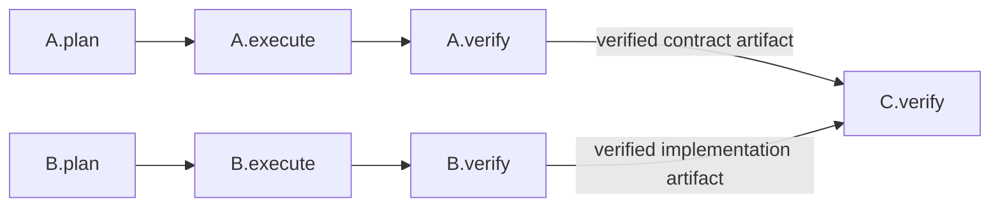
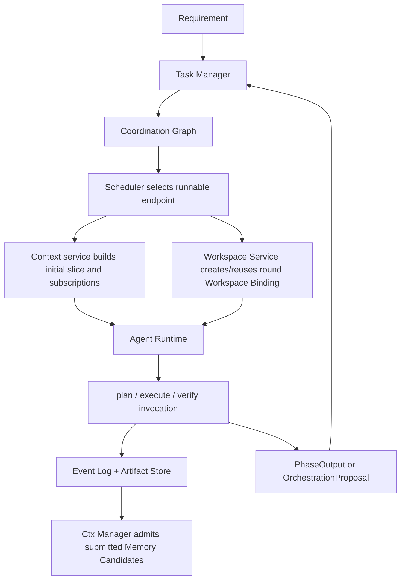
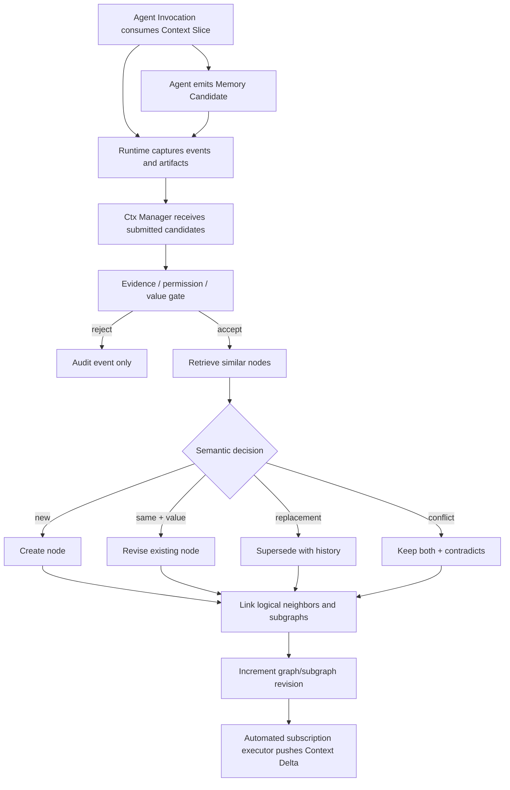

# Threadmill 统一设计：阶段编排、共享工作区与上下文图

版本：v1.0-draft  
状态：Draft  
定位：本文按当前产品判断重新组织 Threadmill 的完整设计。它统一任务编排、Agent Runtime、共享 Workspace、验证合并和 Context Graph；当本文与较早的模块草案在下列主题上冲突时，以本文为准。

---

## 1. 产品判断

多 Agent 编程的瓶颈不是同时打开多少会话，而是项目状态、未完成义务和可复用知识仍由人类手工搬运。Threadmill 因此管理三类彼此独立但可追溯关联的对象：

1. **Coordination Graph（协调图）**：保存 Task 之间尚未履行的因果义务，以 Phase Endpoint 为编排粒度。
2. **Workspace Binding（工作区绑定）**：保存一个 Task 轮次的可变执行现场；同一轮次的 plan、execute、verify 共享它。
3. **Context Graph（上下文图）**：保存从运行证据中提炼出的知识节点及其逻辑关系，并为新 Agent 选择可控子图。

核心判断：

```text
Task 不属于 Agent Session；
Task 直接拥有 Workspace Binding；
Phase Endpoint 是 Manager 的编排端点；
Context Graph 保存知识关系，不保存未完成工作；
Agent 是在明确阶段、工作区、上下文切片和权限内临时调用的计算资源。
```

用户只需要表达需求、预算、并发意图和必要决策。系统负责将需求变成可验收 Task，按阶段端点安排串行或并行执行，维护 Workspace 隔离与合并，并向每次 Agent Invocation 提供恰当的 Context Subgraph。

---

## 2. 统一领域模型

### 2.1 工作对象

```text
Requirement
  原始目标、动机、约束和验收意图；保存来源，不直接调度。

Task Contract
  稳定定义要交付什么、为什么、允许边界及怎样算完成；不包含实现步骤。

Task
  由 Task Contract 约束的持久工作身份；寿命长于任何 Agent Invocation；
  直接拥有一份或多份（按轮次）Workspace Binding。

Phase Endpoint
  Task 中可被依赖、阻塞、激活和产出信号的命名端点。

Agent Invocation
  在指定角色、阶段、工作区、上下文、权限和预算下对 Agent 的一次有界调用。
```

### 2.2 两张持久图与一个执行边界

Threadmill 只保留两张持久图。Agent Runtime 和 Workspace 是执行边界，不再引入 Execution Graph 或 phase 内的持久执行图：

| 对象 | 生命周期 | 负责的问题 | 唯一写入口 |
| --- | --- | --- | --- |
| Coordination Graph | 持久 | 哪个 Phase Endpoint 可以运行、被什么阻塞、阶段交付是否满足 | Task Manager Agent |
| Context Graph | 持久 | 哪些记忆可见、如何关联、如何检索、哪些订阅需要推送 | Ctx Manager Agent |
| Agent Runtime / Workspace | 一次 Invocation / 一个轮次 | 如何在权限、工作区和预算内执行并记录证据 | Runtime / Workspace service |

三者边界必须保持：

- Coordination Graph 是可热修改的当前编排，但只有 Task Manager 能写。运行中的 Agent 如需拆分、增加前置、调整串并关系或失败后重排，只能提交结构化编排建议。
- Coordination Graph 不保存 Agent 的运行过程上下文；只保存阶段依赖、完成信号、交付物/报告要求及其结果引用。
- Context Graph 是所有 Agent 的外部记忆通信面。Agent 可探索可见图、请求检索、订阅子图并接收自动增量推送，但不能直接写图。
- Runtime 只负责启动、权限、Workspace、事件、输出契约和受控请求转交；不拥有业务编排或知识判断。
- Workspace 不是图节点，也不承担跨 Agent 通信。

删除 Execution Graph 的理由：phase 内执行步骤和过程上下文属于 Agent Runtime 的内部现场，不需要独立持久实体。只有阶段结束输出和 Agent 主动提交的结构化编排建议进入 Task Manager 的视野。

**Coordination Graph 只向前演化（设计原则）**：失败的轮次结果不可回改，只能作为证据封存；一切变更都是图的向前演化（新增/失效节点、边、端点）并对旧结果显式失效。
 

---

## 3. Task 的三阶段与轮次

### 3.1 固定工作阶段

每个 Task 轮次只有三个工作阶段：

```text
plan -> execute -> verify
```

系统还可以维护两个非工作端点：

- `prepared`：Task Contract、输入 revision、Workspace Binding、权限和初始上下文已装配；它是运行前置条件，不创建第四个工作阶段。
- `done`：verify、依赖、人工决定和交付/合入条件全部成立后的图结论；它不启动 Agent。

| 阶段 | 责任 | 主要产物 | 禁止事项 |
| --- | --- | --- | --- |
| plan | 声明实现方案、影响面、依赖、权限及验证方法 | Submitted Plan、Declared Write Set、验证计划、Requirement Candidate | 修改实现、改写 Task Contract、自行写协调图 |
| execute | 在批准范围内产生候选结果 | diff/产物、工具证据、Observed Write Set、新发现 | 静默扩 scope、写 main、宣布 Task 完成 |
| verify | 在同一现场独立检查契约与候选结果 | Verify Result、测试/检查证据、风险和缺口 | 修改实现以让自己通过、自我批准旧 revision |

**提交与通过分离**：`invocation_finished`（Invocation 结束）→ `output_submitted`（PhaseOutput 已提交）→ `endpoint_satisfied / rejected / invalidated`（由授权方判定）。plan 产物叫 **Submitted Plan**，只有经 policy、human decision 或专门 reviewer 批准后才成为 **Approved Plan**；Runtime 只校验输出形状，不代替任何批准。execute completed 只表示候选结果已产生；verify 才判断 Task Contract 是否满足。

### 3.2 轮次与重试

一次正常路径：

```text
Task Contract
  -> Round 1: plan -> execute -> verify
       -> passed + delivery conditions -> done
       -> failed, contract still valid -> verifier 提交 Proposal，Task Manager 重开轮次
       -> independent prerequisite found -> new Task + endpoint edge
       -> contract ambiguous/invalid -> blocked + decision endpoint
```

验证失败不创建新 Task，也不创建新 Attempt 实体：verifier 是唯一拥有失败证据的角色，由它提交 `OrchestrationProposal`（retry），Task Manager 裁决后失效旧输出、在图上重开 execute→verify 端点，并从最新有效基线新建 Workspace Binding（旧现场封存为 evidence）。只有工作具有独立验收、独立失败/重试、不同权限或 Workspace、跨时间等待、被其他 Task 直接依赖等特征时，Task Manager 才创建新 Task。

**`done` 由 DeliveryPolicy 决定**。Task Contract 携带：

```text
DeliveryPolicy: non_code_artifact | code_merge | human_acceptance | external_delivery
```

- `code_merge` 型 Task（默认代码任务）：`done = verify passed && latest-main targeted verify passed && merge succeeded && dependency/decision conditions satisfied`（按 8.2 全链）；
- `non_code_artifact` / `human_acceptance` / `external_delivery` 型按交付条件定义，不经过 Merge Queue。

### 3.3 阶段状态与 revision

每个阶段结果至少绑定：

```go
type PhaseResultBinding struct {
    TaskID          string `json:"task_id"`
    TaskContractRef string `json:"task_contract_ref"`
    WorkspaceRef    string `json:"workspace_ref"` // 轮次标识：Workspace Binding ID + generation
    Phase           string `json:"phase"` // plan | execute | verify
    WorkspaceID     string `json:"workspace_id"`
    InputRevision   string `json:"input_revision"`
    WorkspaceHead   string `json:"workspace_head"`
    ContextSliceRef string `json:"context_slice_ref"`
}
```

Task Contract、依赖结果、代码基线、Workspace Head 或高影响上下文变化后，旧结果不能静默复用。Task Manager 按影响范围使 plan、execute 或 verify 失效；Scheduler 只执行该决定。

---

## 4. Workspace：一个 Task 轮次，一份共享现场

### 4.1 核心规则

**同一个 Task 轮次的 plan、execute、verify 默认共享同一个 Workspace Binding。** 三个阶段可以由不同 Agent、不同 provider 或不同 Thread 执行，但它们看到的是同一份受控执行现场。

这解决四个问题：

1. executor 能直接消费 planner 在现场生成的结构化计划和基线信息；
2. verifier 检查的是真实候选现场，而不是重新拼装的近似副本；
3. 阶段切换不会丢失未提交文件、生成物和工具状态；
4. Agent 可替换，而 Task 的执行身份和证据链不变。

Workspace 可以实现为：

- Git 仓库：独立 `git worktree + branch`，默认方案；
- 非 Git 或强隔离任务：独立 clone/目录；
- 环境依赖复杂任务：容器加持久 volume；
- 远程任务：远程 sandbox，仍暴露同一逻辑 Workspace Binding。

实现形式可替换，但上层契约相同：稳定 Workspace ID、固定基线、允许写范围、可观测变更、阶段间持久、轮次间隔离。

### 4.2 数据模型

```go
type WorkspaceBinding struct {
    ID              string            `json:"id"`
    TaskID          string            `json:"task_id"`
    Generation      int               `json:"generation"` // 轮次序号：1 起递增
    Kind            string            `json:"kind"` // git_worktree | clone | container | remote
    Root            string            `json:"root"`
    BranchName      string            `json:"branch_name,omitempty"`
    ContainerID     string            `json:"container_id,omitempty"`
    VolumeRefs      []string          `json:"volume_refs,omitempty"`
    BaseRevision    string            `json:"base_revision"`
    CurrentRevision string            `json:"current_revision"`
    AllowedDirs     []string          `json:"allowed_dirs"`
    DeclaredWrites  WriteSet          `json:"declared_writes"`
    ObservedWrites  WriteSet          `json:"observed_writes"`
    PhaseLeases     map[string]string `json:"phase_leases"` // phase -> invocation id
    Status          string            `json:"status"`
}
```

### 4.3 阶段切换

```text
Scheduler 激活 T.plan
  -> Runtime 创建 Invocation，从 Workspace Service 取得/创建该轮次的 Workspace Binding
  -> planner 只读代码，允许写结构化 plan artifact
  -> plan 经审批后冻结 Approved Plan 与 Declared Write Set

Scheduler 激活 T.execute
  -> Runtime 复用同一 Workspace Binding
  -> executor 获得实现写权限
  -> Runtime 观察 diff 和实际写集合

Scheduler 激活 T.verify
  -> Runtime 继续复用同一 Workspace Binding
  -> verifier 默认只读实现，可运行检查并写 evidence artifact
  -> Verify Result 绑定 Workspace CurrentRevision
```

共享 Workspace 不等于共享权限。权限随 phase lease 切换：plan 默认只读源码，execute 可写批准范围，verify 默认不可修改候选实现。任何阶段只能有一个有效写 lease；同 Task 内需要并行工作时，只能并行进行只读准备或由 Task Manager 拆为具有独立 Workspace 的 Task。Runtime 创建的是 Invocation 而不是任何业务对象；Workspace Binding 由 Workspace Service 创建/复用。

### 4.4 轮次隔离与废弃
新轮次默认从最新有效基线创建新的 Workspace，不能在验证失败的旧现场上无审计地继续修改。旧 Workspace 被封存为 evidence，可按保留策略清理。若运行中的 Agent 认为应局部修复、拆分任务或调整依赖，必须提交 `OrchestrationProposal`；Task Manager 审批后热修改 Coordination Graph，并决定重开当前 Task 的 execute→verify 轮次、创建新 Task 或增加前置 Task。Agent 和 Runtime 都不能自行跳转 phase。

---

## 5. 以 Phase Endpoint 为端点的协调图

### 5.1 Edge 同时表达控制、数据和失败策略

```go
type CoordinationEdge struct {
    ID        string                `json:"id"`
    From      PhaseEndpointRef      `json:"from"`
    To        PhaseEndpointRef      `json:"to"`
    Condition SignalCondition       `json:"condition"`
    Data      []ArtifactRef        `json:"data,omitempty"`
    OnFalse   EdgeFailurePolicy     `json:"on_false"`
    Freshness RevisionConstraint    `json:"freshness"`
}
```

每条边必须回答：

1. 哪个 source endpoint 产生信号；
2. 哪个 target endpoint 被阻止；
3. 什么条件解除阻止；
4. 哪些交付物、报告或证据 artifact 沿边传递；
5. source 失败、取消或过期时怎么办。

### 5.2 串行

```text
B.verify --passed + API evidence--> A.plan
```

表示 A 的方案依赖 B 已验证的 API。若 A 只在实施时需要 B，则边应连到 `A.execute`；若只影响最终验收，则连到 `A.verify`。Manager 必须连接到最早真正消费结果的阶段，避免过早串行化。

### 5.3 并行

两个 endpoint 无控制边且 Workspace 不冲突时可并行：



并行资格由图语义、权限、预算和 Workspace 冲突共同决定。Worker Capacity 只影响同时运行多少 endpoint，不改变依赖含义。

### 5.4 阻塞与人工决定

“Task blocked”只是投影；权威 blocker 必须指向具体 endpoint：

```text
A.execute blocked by B.verify
condition: B.verify.status == passed
required data: schema_ref, verification_summary
on false: replan A

human.approved(plan_revision, risk_scope) -> A.execute
```

### 5.5 阶段 Agent 的通信边界

运行中的 phase agent 不直接向其他 Agent、Runtime mailbox 或 Coordination Graph 写消息。它可以像其他 Agent 一样探索、检索和订阅 Context Graph；也可以在发现当前编排不再合适时，主动向 Task Manager 提交编排建议。

Task Manager 不旁观 phase agent 的中间推理、工具输出、探索轨迹或未提交上下文。运行过程默认留在 Invocation 内；只有以下结构化边界输出可以进入 Task Manager：

1. 阶段结束时的 `PhaseOutput`；
2. 运行中主动提交的 `OrchestrationProposal`；
3. 通过 Runtime 受控 join 的输入集合 `PhaseInputSet` 与等待结果 `InputWaitResult`。

```go
type OrchestrationProposal struct {
    ProposalID               string           `json:"proposal_id"`
    ClientRef                string           `json:"client_ref"`
    FromEndpoint             PhaseEndpointRef `json:"from_endpoint"`
    FromInvocationID         string           `json:"from_invocation_id"`
    BasedOnGraphRevision     int64            `json:"based_on_graph_revision"`
    BasedOnWorkspaceRevision string            `json:"based_on_workspace_revision"`
    BasedOnInputRevision     string           `json:"based_on_input_revision"`
    OrchestrationAdvice      string           `json:"orchestration_advice"` // split, dependency, serial/parallel, replan, retry...
    DeliverySpecAdvice       string           `json:"delivery_spec_advice"`
    ReportSpecAdvice         string           `json:"report_spec_advice"`
    Rationale                string           `json:"rationale"`
    EvidenceRefs             []string         `json:"evidence_refs"`
}
```

planner、executor、verifier 三方都可提交建议，但情景不同：planner（契约歧义、方案不可行、依赖变化）→ replan/拆任务；executor（发现缺失前置、范围冲突）→ split/dependency；verifier（验收失败）→ retry，失效旧输出并重开 execute→verify。

拆分机会、缺少前置、执行失败、验证失败和计划失效都使用同一种建议协议。建议是自由文本意图、理由和对未来 endpoint 契约的建议，不是图命令；phase agent 不决定创建哪些 Task、如何连边或哪些 endpoint 失效。Runtime 只记录并转交，Task Manager 结合当前图和可见证据决定接受、改写或拒绝，并热修改 Coordination Graph。无需为不同原因新增 Split Request、Failure Request 或 Rework Task 等实体。

`PhaseInputSet` 是 endpoint 已声明入边的只读投影，至少包含：`inputRevision`、`required`、`delivered`、`pending`。`required` 定义 source endpoint、所需交付物与 `requiredBy`（start 或 completion）；`delivered` 只引用正式 `PhaseOutput` 与 artifact；`pending` 仅表示尚未到达的 completion 输入。

Phase Agent 可以在本体工作做到当前信息不足时调用 `runtime.awaitInputs` 等待已知 completion 输入。Runtime 不保留长期占用 worker capacity 的挂起线程；它记录 waiting 语义、在输入到达或失效时更新 `inputRevision`，并可在恢复时重建受控执行调用。Agent 不直接持有 mailbox、不轮询消息，也不自己维护图状态。

若 Agent 发现的是启动契约中没有声明的新前置，而不是等待既有 `inputId`，必须提交 `OrchestrationProposal(advice: dependency)`；Task Manager 审批后才会更新 Coordination Graph 与目标 endpoint 输入契约。

### 5.6 Endpoint 契约与阶段交付

Task Manager 编排每个 Phase Endpoint 时，必须同时规定 `DeliverySpec` 和 `ReportSpec`，并把入边投影进 `PhaseInputSet`。前者定义该阶段必须交付什么，后者定义报告必须回答哪些问题；未规定二者的 endpoint 不可调度。phase agent 可以在编排建议中提出新 endpoint 的要求，但正式契约只能由 Task Manager 写入图。

```go
type PhaseOutput struct {
    Binding      PhaseResultBinding `json:"binding"`
    DeliveryRefs []string           `json:"delivery_refs"`
    ReportRef    string             `json:"report_ref"`
    EvidenceRefs []string           `json:"evidence_refs"`
}
```

`PhaseOutput` 必须完整绑定 `PhaseResultBinding`（TaskID / TaskContractRef / WorkspaceRef / Phase / WorkspaceID / InputRevision / WorkspaceHead / ContextSliceRef），以证明输出属于哪个 Task Contract 版本、基于哪个 Input Revision、使用哪份 Context Slice、属于哪个轮次。不再复制残缺的 revision 字段（Workspace 状态走 Binding，图状态走 ContextSliceRef）。

每个 phase 必须按 endpoint 的两项要求提交 `PhaseOutput`，否则不得进入 completed。Runtime 只校验输出形状和必填引用，以及 required completion input 是否已到齐；Task Manager 能读取所有 completed endpoint 的报告、交付物和证据引用，并据此继续编排，但不能读取未提交的运行过程上下文。

| 阶段 | 默认交付物基线 | 默认报告基线 |
| --- | --- | --- |
| plan | Submitted Plan、Declared Write Set、验证计划、Requirement | 方案、假设、依赖、权限、风险和所需 Context Subgraph |
| execute | diff/commit 或其他候选产物、Observed Write Set | 实际变更、偏差、新 Memory Candidate 和未解决问题 |
| verify | Verify Result、测试和检查证据 | 契约判断、证据、Workspace/Input revision、失败原因或通过理由 |

表中只是 Manager 编排时的默认基线，不替代每个 endpoint 的具体 `DeliverySpec` 和 `ReportSpec`。报告和交付物位于 Artifact Store；`PhaseOutput` 只是 endpoint 输出载荷，不新增 Delivery 实体。阶段结果跨 Task 使用时，由 Coordination Edge 引用对应 endpoint 输出。

### 5.7 编排建议与等待结果的运行时处理

Task Manager 收到建议后校验来源 endpoint、当前 graph revision、理由和 evidence，再决定是否热修改图。接受拆分建议时，它创建必要 Task/endpoint、为每个新 phase 写交付物和报告要求并连接边；接受失败或重排建议时，它调整尚待执行的计划和受影响 endpoint。拒绝时只返回结构化理由。Scheduler 不解释建议，只在图更新后重算 runnable endpoint。

两条硬规则：

1. **幂等**：Runtime 对重复 `ProposalID` 只转交一次；Task Manager 对已裁决的 `ProposalID` 不重复处理。
2. **过期校验**：Task Manager 校验 `BasedOnGraphRevision`；若图已更新到更高 revision，拒绝该建议并要求基于新 revision 重提，或明确声明按当前图裁决。

`runtime.awaitInputs` 返回的 waiting 结果不结束当前 phase。它只是说明：本体工作已推进到当前已知输入允许的极限，接下来可以等待、继续、重提建议或结束为阻塞报告。若允许继续，phase agent 最终仍须提交原 endpoint 的 `PhaseOutput`。图变更历史由 Event Log 审计，但审计机制不限制 Coordination Graph 的运行时热修改。

**Coordination Graph 原子审计**：图变更（mutation、graph revision、endpoint invalidation、Proposal 裁决、audit event）必须在同一事务或 transactional outbox 中完成，任一部分失败则整体回滚，避免“图已修改、Event Log 没记录”。

---

## 6. 模块职责与依赖方向

模块按“只拥有一个核心决定”划分，依赖方向从编排请求流向受控服务，不形成反向调用环：

| 模块 | 唯一职责/决定 | 可以读取 | 不可以做 |
| --- | --- | --- | --- |
| Task Manager Agent | 默认编排 Coordination Graph；规定每个 endpoint 的 DeliverySpec/ReportSpec；审批编排建议并热修改图；接受 endpoint 输出 | Requirement、所有 completed PhaseOutput/report/evidence、自己的 Context Slice/Delta 和可见 Context Graph | 旁观 phase 运行过程、选实现方案、写 Context Graph、操作 Workspace |
| Scheduler | 从可运行 endpoint 中选择下一次 Invocation | Coordination Graph、预算、容量、能力 | 创建/修改 task、edge、blocker，解释编排建议，选择记忆 |
| Ctx Manager Agent | 响应检索请求并准入 Memory Candidate；维护 Context Graph | Event Log、Artifact Store、权限策略 | 主动巡图或提示、决定普通探索/切片、执行订阅或推送、改 Coordination Graph、批准阶段交付 |
| Agent Runtime | 启动/取消/恢复 Invocation，施加 phase 权限，记录事件并校验输入与输出形状 | Scheduler 的 run request、Context Slice、Workspace Binding、PhaseInputSet | 判断业务完成、暴露未提交过程上下文、写任一图的业务状态 |
| Workspace Service | 为 Task 轮次创建/复用/封存执行现场，观察 write set | Runtime policy、轮次 revision | 调度 Agent、判断验收、写 main |
| Verifier / Merge Queue | Verifier 判断候选是否满足契约；Merge Queue 在 latest main 上机械检查并合入 | Task Contract、Approved Plan、Workspace、evidence | Verifier 修改实现；Merge Queue 修冲突或直接改 Coordination/Context Graph |
| Phase Agent | 完成当前 phase；在已知 completion 输入上自主等待或汇总；提交 PhaseOutput 或编排建议；使用可见 Context Graph | Task Contract、endpoint 契约、自己的 Context Slice/Delta、子图列表与描述、PhaseInputSet | 直接改图、直接通信、改 main、宣布 done |

依赖约束：Task Manager 与 phase agent 都通过相同的 Context 读接口获取外部记忆；二者都不能写 Context Graph。Ctx Manager 不依赖 Scheduler；Runtime 不依赖图的具体存储；Workspace 不依赖 Context Graph。跨模块数据只使用 Task Contract、PhaseInputSet、PhaseOutput、OrchestrationProposal、ArtifactRef、ContextSlice 和受控 service request。
 

## 7. Scheduler 与 Manager

### 7.1 Task Manager Agent
Task Manager 是 Coordination Graph 唯一写入口，也是默认编排者：

- 将 Human Requirement 规整为 Task Contract；
- 创建 Task、Phase/Decision Endpoint、edge 和 blocker，并为每个 phase 写入 DeliverySpec 与 ReportSpec；创建轮次（Round）时由 Workspace Service 配套创建 Workspace Binding；
- 读取所有 completed endpoint 的报告、交付物和证据，决定后续编排；
- 审批运行中的 Agent 提交的 `OrchestrationProposal`，接受后热修改图并明确当前 Invocation 的处置；
- 与 phase agent 一样使用 Context Slice、图探索、检索、订阅和自动 Delta，但不读取其未提交过程上下文；
- 不选择实现方案，不直接操作 Workspace，不写 Context Graph。

### 7.2 Scheduler

Scheduler 读取协调图，选择 runnable Phase Endpoint，并请求 Runtime 启动 Invocation。默认优先级：

1. latest-main 上待复验/合并的 candidate；
2. 能解除其他 blocker 的 verify；
3. 已执行待验收的 verify；
4. 已批准且低冲突的 execute；
5. 新 Task 的 plan；
6. 探索性工作。

Scheduler 不创建 edge，不改变 Task Contract，不把 Agent 与 Task 永久绑定。

### 7.3 调度流程



---

## 8. Verify、Merge Queue 与 Workspace 合并

### 8.1 Verify gate

Verifier 必须同时读取：Task Contract、Approved Plan、真实 diff/产物、Declared/Observed Write Set、输入 revision、Context Slice binding 和验证证据。通过结果只对该组合有效。

验证者必须与产生候选结果的 active phase invocation 独立，但使用同一轮次 Workspace。独立性来自角色、Invocation、权限和审批边界，而不是复制一个可能漂移的工作区。

### 8.2 Merge Queue

代码型 Task（`DeliveryPolicy=code_merge`）的 `verify passed` 只获得进入 Merge Queue 的资格，不等于 `done`：

```text
Verify passed on round Workspace
  -> MergeCandidate
  -> latest main 上机械应用检查
  -> 临时 merge-check workspace
  -> targeted verify on latest main + candidate
  -> serial merge
  -> merge event + commit/diff/test evidence
  -> Task Manager 计算 done
```

Merge Queue 是 main 的唯一写入口。它不修冲突、不重写 Task Graph、不直接写 Context Graph。冲突或复验失败会产生 evidence，并由 Task Manager 将受影响阶段编排回 plan/execute/verify 或 waiting_human。

### 8.3 多 Workspace 合并语义

不同 Task 各有独立 Workspace（按轮次切换）。合并顺序不由 Agent 私聊决定：

- 已通过 verify 并进入队列的 candidate 优先尝试；
- candidate 必须在 latest main 上仍可应用并通过 targeted verify；
- 后合入 Task 的旧验证因相关 main revision 改变而失效；
- write set 重叠是风险信号，真正 gate 由机械冲突和 targeted verify 决定；
- 合并后的新事实通过 Event Log 进入 Context Graph，并可推送给订阅相关子图的 active Agent。

---

## 9. Context Graph：从上下文块到可探索知识图

### 9.1 目标与边界

Context Graph 解决的不是“保存更多聊天”，而是：

- 新 Agent 如何获得与当前 Task/phase 相关的知识切片；
- 新发现如何与已有知识建立逻辑邻接；
- Agent 如何逐步探索，而非一次注入全库；
- 如何控制记忆准入、近重复、过时、冲突和垃圾；
- 如何在切片和候选准入时整理图，提高后续子图选择的缓存命中率；
- Agent 订阅的 Context Subgraph 更新后，如何安全推送。

Context Graph 是 Event Log / Artifact Store 的可追溯投影。普通 Agent **不能直接创建、修改或删除 Context Node**。Agent 只能在工作中提交结构化 Memory Candidate；Runtime 自动将其及证据写入 Event Log；Ctx Manager 校验、去重、连边和落图。

这既保留 Agent 对“什么值得记住”的一线判断，也保留 Ctx Manager 的唯一写入口和垃圾控制责任。

### 9.2 核心对象

```go
type ContextNode struct {
    ID             string         `json:"id"`
    Kind           string         `json:"kind"` // fact | decision | constraint | failure | pattern | preference | hypothesis
    Statement      string         `json:"statement"`
    Status         string         `json:"status"` // candidate（未验证，读取侧规则见 12.4）| accepted | disputed | superseded | outdated
    Scope          []string       `json:"scope"`
    SubgraphIDs    []string       `json:"subgraph_ids"`
    SourceRefs     []string       `json:"source_refs"`
    Revision       int64          `json:"revision"`
    ValidFrom      string         `json:"valid_from,omitempty"`
    ValidUntil     string         `json:"valid_until,omitempty"`
    Confidence     float64        `json:"confidence"`
    Importance     float64        `json:"importance"`
    Sensitivity    string         `json:"sensitivity"`
    CreatedAt      time.Time      `json:"created_at"`
    UpdatedAt      time.Time      `json:"updated_at"`
}

type ContextEdge struct {
    ID          string   `json:"id"`
    From        string   `json:"from"`
    To          string   `json:"to"`
    Kind        string   `json:"kind"`
    Weight      float64  `json:"weight"`
    SourceRefs  []string `json:"source_refs"`
    CreatedBy   string   `json:"created_by"` // rule | model | human
    ValidAtRev  string   `json:"valid_at_rev,omitempty"`
}

type ContextSubgraph struct {
    ID          string   `json:"id"`
    Name        string   `json:"name"`
    Summary     string   `json:"summary"`
    Scope       []string `json:"scope"`
    AnchorNodes []string `json:"anchor_nodes"`
    Revision    int64    `json:"revision"`
}
```

Context Subgraph 是可重叠的逻辑视图，不复制节点。一个节点可以同时属于 API、模块、架构决定、某 Task 系列等多个子图。

### 9.3 边类型

MVP 至少支持：

| Edge Kind | 含义 |
| --- | --- |
| `logical_adjacent` | 两个记忆点在当前推理链上逻辑相邻，后者是前者自然的下一步上下文 |
| `supports` | source evidence/结论支持 target |
| `contradicts` | 两节点不能同时作为当前事实使用 |
| `supersedes` | 新 revision 替代旧节点，但保留历史 |
| `derived_from` | 节点由另一节点或证据推导 |
| `belongs_to_subgraph` | 节点归属某逻辑子图 |
| `depends_on_fact` | 一个结论成立需要另一个事实 |
| `example_of` | 具体案例说明抽象规则 |

边必须有来源和置信度。Embedding 相似只用于召回候选，不能单独建立 `supports`、`contradicts` 或 `supersedes` 等语义边。

---

## 10. Agent 创建时的 Context Subgraph 切片

每个 Agent Invocation 创建前，Context service 都按调用者的 role、purpose 和权限生成初始切片；phase agent、Task Manager、verifier 等使用同一机制。Ctx Manager 不需要理解调用者的业务决定，只按请求绑定执行选择和权限策略：

```go
type ContextSliceRequest struct {
    TaskID          string   `json:"task_id,omitempty"`
    TaskContractRef string   `json:"task_contract_ref,omitempty"`
    WorkspaceRef    string   `json:"workspace_ref,omitempty"` // 轮次标识
    Phase           string   `json:"phase,omitempty"`
    Role            string   `json:"role"`
    Purpose         string   `json:"purpose"`
    InputRevision   string   `json:"input_revision"`
    WorkspaceID     string   `json:"workspace_id,omitempty"`
    PermissionScope []string `json:"permission_scope"`
    SeedSubgraphs   []string `json:"seed_subgraphs,omitempty"`
    TokenBudget     int      `json:"token_budget"`
}

type ContextSlice struct {
    ID              string            `json:"id"`
    Binding         ContextSliceRequest `json:"binding"`
    SubgraphSummary []SubgraphSummary `json:"subgraph_summary"`
    Nodes           []ContextNode     `json:"nodes"`
    Frontier        []ContextFrontier `json:"frontier"`
    Omitted         []string          `json:"omitted"`
    Conflicts       []ContextConflict `json:"conflicts"`
    GraphRevision   int64             `json:"graph_revision"`
}
```

选择顺序：

1. 在任何相关性计算前应用权限和敏感性过滤；
2. 以调用目的、Task Contract、phase、Workspace revision、owner/module/symbol 和已有 subgraph 为 seed；
3. 召回 seed 节点及一跳强语义邻居；
4. 按 role/purpose 重排：编排偏契约、依赖和历史报告，plan 偏约束/决策/失败模式，execute 偏接口/实现事实，verify 偏契约/风险/历史缺陷；
5. 显式保留矛盾候选；
6. 在预算内注入节点正文、可见子图列表与描述；
7. 把未注入但可能有用的邻接方向放入 `Frontier`，供渐进探索；
8. 对切片实际包含的子图自动建立与 Invocation 同寿命的订阅。

切片不是复制出来的新知识库，而是绑定一次 Invocation 的只读快照。Graph revision、input revision 或权限变化后必须重新选择。初始切片及其自动订阅属于 Context service 的受控响应，不代表 Ctx Manager 主动观察或提示 Agent。

---

## 11. 所有 Agent 的 Context Graph 使用方式

所有 Agent——包括 Task Manager、planner、executor 和 verifier——使用相同的 Context 接口。它们都能查看权限内的 Context Subgraph 列表和描述、直接探索可见图、请求 Ctx Manager 检索，以及订阅子图：

```go
type ContextService interface {
    ListSubgraphs(ctx context.Context, req ListSubgraphsRequest) ([]SubgraphSummary, error)
    Explore(ctx context.Context, req ExploreRequest) (ContextSliceDelta, error)
    Retrieve(ctx context.Context, req RetrieveRequest) (ContextRetrieveResult, error)
    Subscribe(ctx context.Context, req SubscribeRequest) (ContextSubscription, error)
}
```

四项操作共享 Invocation、role/purpose、权限快照、Graph revision 和预算绑定，不为调用创建持久 SearchJob。请求、结果、所消费节点和订阅关系由 Runtime/Context Graph 记录。

### 11.1 列表与探索 `ListSubgraphs / Explore`

子图列表只返回调用者可见的 ID、名称、描述、scope 和 revision。`Explore` 沿当前 Slice 的 node/frontier 或已选子图展开，默认一跳并受 token/depth 限制；权限隐藏内容只返回数量，不泄露摘要。列表和探索是受权限约束的普通读操作，不需要 Ctx Manager 逐次推理或批准。

### 11.2 检索 `Retrieve`

Agent 在现有列表和探索不足时提交 intent、scope 和当前推理锚点。此时才调用 Ctx Manager，以结构化 scope、关键词和 embedding 多路召回并返回带 path explanation 的记忆子图切片。检索结果所含子图自动订阅；检索失败不创建订阅。

### 11.3 主动订阅 `Subscribe`

Agent 可从可见子图列表中主动选择子图订阅。Context service 按权限、有效期和当前 Invocation 绑定校验后持久化订阅关系；无需 Ctx Manager 对每次订阅做语义决策。此后匹配更新由自动化订阅执行器产生 Context Delta，不建立 Agent mailbox。

订阅关系属于操作层元数据（Operational Context Metadata，owner：Context Service），不是语义图（Semantic Context Graph）的一部分；语义图的节点、强语义边、子图定义只有 Ctx Manager 能写，读路径（切片、探索、检索、订阅、缓存）不得修改语义图。

读取、探索、检索和订阅行为本身不能创建知识节点或强语义边。只有显式 `MemoryCandidate` 经 Ctx Manager 准入后才能更新 Context Graph。由此，Ctx Manager 只在需要语义判断的两个边界工作：响应检索需求，以及准入 Memory Candidate；它不主动巡图、主动提示或执行推送。

---

## 12. Memory Candidate：明确的记忆积累规则

### 12.1 Agent 标注协议

Agent 在 plan、execute、verify 工作时可以标注值得持久化的记忆，但它提交的是候选，不是最终节点：

```go
type MemoryCandidate struct {
    ClientRef       string   `json:"client_ref"`
    Statement       string   `json:"statement"`
    Kind            string   `json:"kind"`
    WhyReusable     string   `json:"why_reusable"`
    Scope           []string `json:"scope"`
    SubgraphIDs     []string `json:"subgraph_ids"`
    RelatedNodeIDs  []string `json:"related_node_ids,omitempty"`
    ProposedEdges   []string `json:"proposed_edges,omitempty"`
    SourceRefs      []string `json:"source_refs"`
    ValidityScope   string   `json:"validity_scope"`
    Confidence      float64  `json:"confidence"`
}
```

Runtime 自动记录 candidate，随后由 Context service 在入口处执行硬门槛前置过滤（见 12.2）：未通过硬门槛的候选只保留审计事件、不进图；通过者带 `status=candidate` 写入 Context Graph，并以事件驱动方式立即触发 Ctx Manager 整理。Ctx Manager 是唯一有权执行 `create / revise / supersede / dispute / reject` 的角色。

### 12.2 准入规则

候选至少满足下列一项才值得持久化：

1. 会改变后续 Task 的计划、实现或验证选择；
2. 是跨 Session 难以从代码直接恢复的架构/产品决定及理由；
3. 是已验证的接口、约束、所有权或运行事实；
4. 是可复现、可能再次出现且包含有效规避方法的失败模式；
5. 是用户明确、稳定且与项目有关的偏好；
6. 能连接两个已有子图，形成可解释的新推理路径；
7. 纠正、限制或替代已有节点。

以下内容默认拒绝：

- 临时进度、寒暄、单次命令输出和可从当前代码廉价恢复的细节；
- 没有 SourceRefs 的主张；
- 只有“可能有用”但没有复用场景的摘要；
- 与已有节点近重复却不增加新证据、适用范围或 revision 的表述；
- 未区分事实与假设的推测；
- 密钥、凭据和超出权限范围的信息；
- 已由 Task Contract、代码或生成契约权威表达且不会因压缩丢失的全文复制。

其中四项属于**硬门槛**——没有 SourceRefs 的主张、未区分事实与假设的推测、密钥/凭据/超出权限范围的信息：由 Context service 在入口处同步前置过滤（结构校验、权限集合求交、敏感模式匹配、kind 强制自标），不通过则不进入 Context Graph，无需 Ctx Manager 介入。其余各项属于**价值判断**，由 Ctx Manager 在异步整理中决定。

### 12.3 评分与决定

Ctx Manager 使用可解释评分，不让 embedding 单独决定：

```text
value = reuse_probability
      + decision_impact
      + evidence_strength
      + novelty_or_revision_value
      + graph_connectivity_gain
      - recovery_cost_inverse
      - duplication
      - volatility
      - sensitivity_risk
```

硬门槛优先于分数，且在进图前执行：缺证据、越权、秘密信息、不可区分事实/猜测由 Context service 前置过滤直接拒绝，不进入 Context Graph。通过硬门槛的候选先以 candidate 状态进图（满足订阅推送的实时性），再由 Ctx Manager 事件驱动异步整理；整理判定为低价值或不合格的候选从图中移除或保留为仅审计可见，从而减少 Memory Manager 的后续清理工作和知识库垃圾。

### 12.4 candidate 状态的读取侧规则

候选进图不等于可信。candidate 状态节点（已过硬门槛、未经 Ctx Manager 价值整理）在读取侧必须遵守：

1. 初始 Context Slice 不包含 candidate 节点；新 Agent 的第一包上下文只含 accepted 及以上状态的可信记忆；
2. Explore / Retrieve 可以返回 candidate 节点，但必须降权排序并标注"未验证"；
3. candidate 节点的新增/变化可以实时推送（满足订阅的实时联络），但 Context Delta 必须携带 `unverified` 标记；只有 accepted 及以上状态的变化才代表可信知识更新；
4. 候选整理由事件驱动（提交即触发），并辅以低频兜底对账，防止事件丢失导致候选滞留。

---

## 13. 图整理与缓存命中

> **本节暂不实现（设计决策，2026-08-07）**：MVP 不做读侧整理（切片时调整边权重）与缓存层次；语义图边权重只由 Ctx Manager 在准入/更新节点时写入。以下内容为设计意图，供 MVP 后实现时参考。

Context Graph 不运行独立的周期性“整理 Agent”。图整理只发生在系统已经必须读取或写入相关子图的两个时点：Context service 生成初始/检索切片时执行读侧整理，Ctx Manager 准入 Memory Candidate 时执行写侧整理。两者复用已有候选集，避免额外全图扫描并提高后续 Context Slice 的缓存命中率。

### 13.1 生成 Context Slice 时：读侧整理

Context service 为任意 Agent 选择记忆子图时，已经拥有 role/purpose、scope、权限、Graph revision 和候选节点集合。此时执行轻量读侧整理：

1. 规范化 scope、实体键和子图归属，合并等价查询 seed；
2. 排除 superseded/outdated 节点，同时保留影响当前任务的 conflict；
3. 根据实际共同召回和共同消费记录，调整已有弱 `logical_adjacent` 边的权重，但不自动创建强语义边；
4. 生成稳定的 `SliceCacheKey`，缓存已排序的 Node ID、Edge ID、子图概要和 frontier；
5. 将相同 role/purpose、可选 Task Contract、scope、权限和相关子图 revision 的后续请求命中同一切片缓存。

```text
SliceCacheKey = hash(
  role,
  purpose,
  task_contract_ref_if_any,
  normalized_scope,
  permission_snapshot,
  selected_subgraph_revisions,
  selector_policy_version
)
```

缓存不复制 Context Node 正文；只缓存选择结果和概要引用。节点或所选子图 revision 改变时，相关 key 自然失效，不需要全局清缓存。Workspace revision 只有在会改变检索 scope 或事实有效性时才进入 key，避免无关代码改动降低命中率。

### 13.2 Memory Candidate 准入时：写侧整理

Ctx Manager 判断候选记忆是否准入时，已经召回相似节点和候选所属子图。此时执行写侧整理：

1. 比较主张、适用范围、来源、revision 和时态；
2. 同一主张且无新价值时 `reject_duplicate`；
3. 同一主张但增加证据或精确范围时修订现有节点；
4. 新事实替代旧事实时保留 `supersedes` 历史；冲突时保留双方并建立 `contradicts`；
5. 基于候选显式 `RelatedNodeIDs`、本次 Slice 实际消费节点和同一 Invocation 的因果连续性，建立有解释的 `logical_adjacent`；
6. 原子增加受影响 node/subgraph revision，并只失效引用这些 revision 的 Slice Cache；
7. 事务提交后由自动化订阅执行器匹配受影响子图并推送 Context Delta。

Embedding 相似只用于召回候选，不能单独建立 `supports`、`contradicts`、`supersedes` 或高权重 `logical_adjacent`。图整理的产物仍然是已有 Context Node、Context Edge、Context Subgraph revision 和缓存索引，不新增 GraphCleanupJob 或整理结果实体。

### 13.3 缓存层次与观测

MVP 只保留两级缓存：

- `CandidateCache`：按 normalized scope、权限和相关 subgraph revision 缓存粗召回 Node ID；
- `SliceCache`：按 `SliceCacheKey` 缓存排序、裁剪后的子图选择结果。

两级缓存都以 revision 作为一致性边界。只记录命中、未命中、失效原因和实际消费节点；不得根据缓存统计自动把相关性边提升为事实边。需要观测的核心指标是 candidate cache hit rate、slice cache hit rate、因无关 Workspace revision 导致的误失效率、重复候选拒绝率和订阅 Delta 的有效消费率。

---

## 14. 子图订阅与自动更新推送

### 14.1 自动订阅与主动订阅

订阅只有两种来源：Context service 生成初始或检索切片时，自动订阅切片包含的子图；Agent 从权限内的子图列表和描述中主动选择订阅。两者都绑定当前 Invocation、权限快照和有效期，并作为 Context Graph 上的受控关系持久化。

```go
type ContextSubscription struct {
    ID                   string    `json:"id"`
    ConsumerInvocationID string    `json:"consumer_invocation_id"`
    Role                 string    `json:"role"`
    Purpose              string    `json:"purpose"`
    SubgraphIDs          []string  `json:"subgraph_ids"`
    Source               string    `json:"source"` // initial_slice | retrieval | explicit
    EventKinds           []string  `json:"event_kinds"`
    PermissionSnapshot   string    `json:"permission_snapshot"`
    ExpiresAt            time.Time `json:"expires_at"`
}
```

`ContextSubscription` 是订阅语义所需的唯一运行关系，不引入 Notification、SearchJob 或 Delivery。Agent 退出或 Invocation 结束后订阅过期；后续 Invocation 重新由切片自动订阅或由 Agent 主动选择，避免形成永久 Agent 身份。

### 14.2 自动推送流程

```text
Context Graph commits a node/edge/subgraph revision
  -> automated subscription executor matches subgraph, event kind, permission and freshness
  -> executor coalesces updates by subgraph revision
  -> Runtime emits Context Delta to each subscribed Agent Invocation
  -> Runtime records whether the Agent consumed it
```

推送是基础设施自动执行，不调用 Ctx Manager 做逐条判断。它必须由已存在的订阅触发，并且增量、可合并、可重放；系统不提供订阅之外的旁路推送。candidate 状态节点的更新同样实时推送，但 Delta 携带 `unverified` 标记（见 12.4），接收方不得将其当作可信知识。

### 14.3 推送与协调边的边界

- 已订阅子图发生匹配更新：自动 Context Delta push，Task Manager 与 phase agent 语义相同。
- target phase 必须等待 source 结果：Coordination Edge，只引用 source endpoint 的 `PhaseOutput`。
- Delta 证明当前编排或计划失效：收到 Delta 的 Agent 提交 `OrchestrationProposal`，由 Task Manager 裁决并热修改图。
- Agent 没有一次性问答、mailbox 或订阅外推送通道；外部记忆只来自切片、图探索、检索、订阅和自动 Delta。

## 15. Context Graph 写入流水线



写入事务必须原子地产生：节点 revision、边变更、子图 revision、来源引用和审计事件。任一部分失败不得出现“节点已更新但订阅看不到 revision”之类半状态。

---

## 16. Agent Runtime

Runtime 是所有 Agent Invocation 的统一边界，包括 Task Manager、Ctx Manager、planner、executor 和 verifier。它负责：

- provider detect/auth/capability；
- 按 role/purpose 或 endpoint 组装 prompt、Context Slice 和输出契约；
- 创建 Invocation，从 Workspace Service 取得该轮次的 Workspace Binding；不创建任何业务对象（Task、轮次、端点由 Task Manager 在图上决定）；
- 施加 phase-specific 工具、路径和写 lease；
- 运行、取消、恢复和替换 Agent；
- 归一化 Agent Event，保存 transcript、tool output、diff 和测试证据，但不向 Task Manager 暴露未提交的 phase 过程上下文；
- 观察真实 write set；
- 执行图探索等普通 Context 读请求，并传递自动订阅产生的 Context Delta；
- 将 `PhaseOutput`、`OrchestrationProposal`、Requirement、MemoryCandidate 和 evidence 交给相应唯一 owner。

Runtime 不判断 Task 是否完成，不解释编排建议，不写 Coordination Graph，不替 Ctx Manager 检索或接受记忆，不合并 main。
